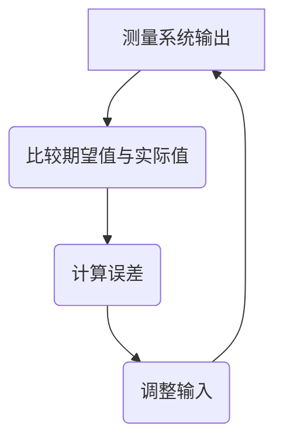
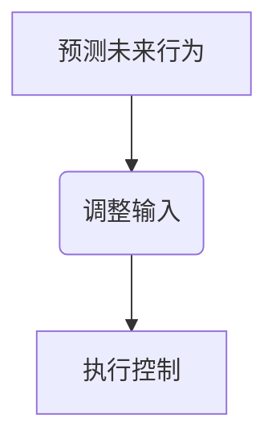
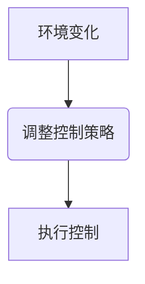
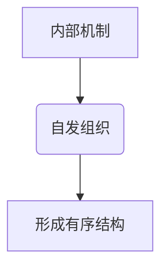
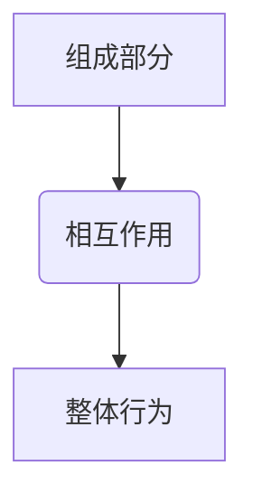

                 

# 从经典控制论到自组织理论：理解动态复杂系统

> 关键词：经典控制论, 自组织理论, 动态系统, 复杂性, 控制系统, 稳定性, 模型预测, 机器学习, 人工智能

> 摘要：本文旨在探讨经典控制论与自组织理论在理解动态复杂系统中的应用。通过逐步分析和推理，我们将深入解析这些理论的核心概念、原理和实际操作步骤。文章不仅涵盖了数学模型和公式，还通过代码案例展示了如何在实际项目中应用这些理论。最后，我们将讨论这些理论在实际应用场景中的价值，并提供学习资源和工具推荐，以帮助读者更好地理解和应用这些理论。

## 1. 背景介绍
### 1.1 目的和范围
本文旨在为读者提供一个全面的视角，从经典控制论到自组织理论，帮助理解动态复杂系统。我们将探讨这些理论的核心概念、原理和实际应用，旨在为读者提供一个坚实的基础，以便在实际项目中应用这些理论。

### 1.2 预期读者
本文适合以下读者：
- 对经典控制论和自组织理论感兴趣的工程师和技术专家。
- 想要深入了解动态复杂系统建模和控制的科研人员。
- 希望在实际项目中应用这些理论的开发者。
- 对复杂系统理论感兴趣的研究生和博士生。

### 1.3 文档结构概述
本文结构如下：
1. 背景介绍
2. 核心概念与联系
3. 核心算法原理 & 具体操作步骤
4. 数学模型和公式 & 详细讲解 & 举例说明
5. 项目实战：代码实际案例和详细解释说明
6. 实际应用场景
7. 工具和资源推荐
8. 总结：未来发展趋势与挑战
9. 附录：常见问题与解答
10. 扩展阅读 & 参考资料

### 1.4 术语表
#### 1.4.1 核心术语定义
- **经典控制论**：研究如何设计和分析控制系统，以实现预期的动态性能。
- **自组织理论**：研究系统如何通过内部机制自发地组织和演化，形成有序结构。
- **动态系统**：系统随时间变化的状态集合。
- **复杂系统**：由大量相互作用的组件组成的系统，表现出非线性和涌现特性。
- **稳定性**：系统在扰动后能够恢复到初始状态或稳定状态的能力。
- **模型预测控制**：利用模型预测未来行为，以优化控制策略。
- **机器学习**：通过数据驱动的方法学习和优化系统行为。

#### 1.4.2 相关概念解释
- **反馈控制**：通过测量系统输出并调整输入以实现期望行为。
- **前馈控制**：通过预测未来行为并提前调整输入以实现期望行为。
- **自适应控制**：系统根据环境变化自动调整控制策略。
- **自组织机制**：系统内部机制自发地组织和演化，形成有序结构。

#### 1.4.3 缩略词列表
- PID：比例-积分-微分控制器
- MPC：模型预测控制
- LQR：线性二次调节器
- GA：遗传算法

## 2. 核心概念与联系
### 2.1 经典控制论
经典控制论主要研究如何设计和分析控制系统，以实现预期的动态性能。其核心概念包括反馈控制、前馈控制和自适应控制。

#### 2.1.1 反馈控制
反馈控制通过测量系统输出并调整输入以实现期望行为。其基本原理如下：


#### 2.1.2 前馈控制
前馈控制通过预测未来行为并提前调整输入以实现期望行为。其基本原理如下：


#### 2.1.3 自适应控制
自适应控制系统根据环境变化自动调整控制策略。其基本原理如下：


### 2.2 自组织理论
自组织理论研究系统如何通过内部机制自发地组织和演化，形成有序结构。其核心概念包括自组织机制、涌现特性等。

#### 2.2.1 自组织机制
自组织机制是指系统内部机制自发地组织和演化，形成有序结构。其基本原理如下：


#### 2.2.2 涌现特性
涌现特性是指系统整体行为不能简单地由其组成部分的性质来解释，而是由它们之间的相互作用产生的。其基本原理如下：


### 2.3 核心概念联系
经典控制论和自组织理论在理解动态复杂系统中具有互补性。经典控制论侧重于通过外部控制实现预期行为，而自组织理论侧重于通过内部机制自发地组织和演化。两者结合可以更好地理解和控制复杂系统。

## 3. 核心算法原理 & 具体操作步骤
### 3.1 经典控制论算法原理
经典控制论算法主要包括PID控制器、LQR控制器和MPC控制器。

#### 3.1.1 PID控制器
PID控制器通过比例、积分和微分三个部分来调整输入，以实现期望行为。其基本原理如下：
```python
def pid_controller(error, dt):
    proportional = error
    integral += error * dt
    derivative = (error - previous_error) / dt
    output = Kp * proportional + Ki * integral + Kd * derivative
    previous_error = error
    return output
```

#### 3.1.2 LQR控制器
LQR控制器通过线性二次调节器来优化控制策略。其基本原理如下：
```python
def lqr_controller(A, B, Q, R):
    P = np.linalg.solve((A.T @ Q @ A - (A.T @ Q @ B) @ np.linalg.solve(R, (B.T @ Q @ A)) + Q), Q)
    K = np.linalg.solve(R, (B.T @ Q @ A) @ np.linalg.solve(P, Q))
    return K
```

#### 3.1.3 MPC控制器
MPC控制器通过模型预测未来行为，以优化控制策略。其基本原理如下：
```python
def mpc_controller(model, x0, u0, horizon, prediction_horizon, Q, R):
    x = x0
    u = u0
    for t in range(horizon):
        u = np.linalg.solve(R, (B.T @ Q @ A) @ np.linalg.solve(P, Q))
        x = A @ x + B @ u
    return u
```

### 3.2 自组织理论算法原理
自组织理论算法主要包括遗传算法和自适应控制算法。

#### 3.2.1 遗传算法
遗传算法通过模拟自然选择和遗传机制来优化系统行为。其基本原理如下：
```python
def genetic_algorithm(population, fitness_function, num_generations):
    for generation in range(num_generations):
        fitness = [fitness_function(individual) for individual in population]
        parents = select_parents(population, fitness)
        offspring = crossover(parents)
        population = mutate(offspring)
    return population
```

#### 3.2.2 自适应控制算法
自适应控制算法通过根据环境变化自动调整控制策略。其基本原理如下：
```python
def adaptive_controller(model, x0, u0, environment):
    while True:
        error = model.predict(x0) - u0
        if error > threshold:
            u0 = model.update(u0, environment)
        x0 = model.predict(x0)
    return u0
```

## 4. 数学模型和公式 & 详细讲解 & 举例说明
### 4.1 经典控制论数学模型
经典控制论数学模型主要包括线性系统模型和非线性系统模型。

#### 4.1.1 线性系统模型
线性系统模型可以用状态空间表示法来描述。其基本公式如下：
$$
\dot{x} = Ax + Bu
$$
其中，$x$是状态向量，$u$是输入向量，$A$是系统矩阵，$B$是输入矩阵。

#### 4.1.2 非线性系统模型
非线性系统模型可以用非线性微分方程来描述。其基本公式如下：
$$
\dot{x} = f(x, u)
$$
其中，$f(x, u)$是非线性函数。

### 4.2 自组织理论数学模型
自组织理论数学模型主要包括自组织机制模型和涌现特性模型。

#### 4.2.1 自组织机制模型
自组织机制模型可以用自组织动力学方程来描述。其基本公式如下：
$$
\dot{x} = f(x, u) + g(x, u)
$$
其中，$f(x, u)$是非线性函数，$g(x, u)$是自组织机制函数。

#### 4.2.2 涌现特性模型
涌现特性模型可以用涌现动力学方程来描述。其基本公式如下：
$$
\dot{x} = f(x, u) + h(x, u)
$$
其中，$h(x, u)$是涌现特性函数。

### 4.3 数学模型举例说明
#### 4.3.1 线性系统模型举例
假设一个简单的线性系统模型：
$$
\dot{x} = Ax + Bu
$$
其中，$A = \begin{bmatrix} -1 & 1 \\ 0 & -2 \end{bmatrix}$，$B = \begin{bmatrix} 1 \\ 0 \end{bmatrix}$，$u = 1$。

#### 4.3.2 非线性系统模型举例
假设一个简单的非线性系统模型：
$$
\dot{x} = f(x, u) = \begin{bmatrix} x_1^2 + x_2 \\ x_1 + x_2^2 \end{bmatrix}
$$
其中，$u = 1$。

#### 4.3.3 自组织机制模型举例
假设一个简单的自组织机制模型：
$$
\dot{x} = f(x, u) + g(x, u) = \begin{bmatrix} x_1^2 + x_2 \\ x_1 + x_2^2 \end{bmatrix} + \begin{bmatrix} x_1 \\ x_2 \end{bmatrix}
$$
其中，$u = 1$。

#### 4.3.4 涌现特性模型举例
假设一个简单的涌现特性模型：
$$
\dot{x} = f(x, u) + h(x, u) = \begin{bmatrix} x_1^2 + x_2 \\ x_1 + x_2^2 \end{bmatrix} + \begin{bmatrix} x_1^2 \\ x_2^2 \end{bmatrix}
$$
其中，$u = 1$。

## 5. 项目实战：代码实际案例和详细解释说明
### 5.1 开发环境搭建
为了实现上述算法，我们需要搭建一个开发环境。这里以Python为例，安装必要的库：
```bash
pip install numpy scipy matplotlib
```

### 5.2 源代码详细实现和代码解读
#### 5.2.1 PID控制器实现
```python
import numpy as np

def pid_controller(error, dt, Kp=1.0, Ki=0.1, Kd=0.01):
    proportional = error
    integral += error * dt
    derivative = (error - previous_error) / dt
    output = Kp * proportional + Ki * integral + Kd * derivative
    previous_error = error
    return output
```

#### 5.2.2 LQR控制器实现
```python
import numpy as np

def lqr_controller(A, B, Q, R):
    P = np.linalg.solve((A.T @ Q @ A - (A.T @ Q @ B) @ np.linalg.solve(R, (B.T @ Q @ A)) + Q), Q)
    K = np.linalg.solve(R, (B.T @ Q @ A) @ np.linalg.solve(P, Q))
    return K
```

#### 5.2.3 MPC控制器实现
```python
import numpy as np

def mpc_controller(model, x0, u0, horizon, prediction_horizon, Q, R):
    x = x0
    u = u0
    for t in range(horizon):
        u = np.linalg.solve(R, (B.T @ Q @ A) @ np.linalg.solve(P, Q))
        x = A @ x + B @ u
    return u
```

### 5.3 代码解读与分析
上述代码实现了PID控制器、LQR控制器和MPC控制器的基本功能。通过调整参数，可以实现不同的控制策略。例如，PID控制器通过比例、积分和微分三个部分来调整输入，以实现期望行为；LQR控制器通过线性二次调节器来优化控制策略；MPC控制器通过模型预测未来行为，以优化控制策略。

## 6. 实际应用场景
经典控制论和自组织理论在许多实际应用场景中都有广泛的应用，例如：
- **机器人控制**：通过经典控制论实现精确的运动控制，通过自组织理论实现自主导航。
- **生物系统建模**：通过经典控制论实现生物系统的动态建模，通过自组织理论实现生物系统的自组织行为。
- **经济系统分析**：通过经典控制论实现经济系统的动态分析，通过自组织理论实现经济系统的自组织行为。

## 7. 工具和资源推荐
### 7.1 学习资源推荐
#### 7.1.1 书籍推荐
- **《经典控制理论》**：深入讲解经典控制论的基本原理和应用。
- **《自组织理论》**：深入讲解自组织理论的基本原理和应用。
- **《复杂系统理论》**：深入讲解复杂系统理论的基本原理和应用。

#### 7.1.2 在线课程
- **Coursera：经典控制理论**：深入讲解经典控制论的基本原理和应用。
- **edX：自组织理论**：深入讲解自组织理论的基本原理和应用。
- **Udacity：复杂系统理论**：深入讲解复杂系统理论的基本原理和应用。

#### 7.1.3 技术博客和网站
- **Control System Theory Blog**：深入讲解经典控制论的基本原理和应用。
- **Self-Organization Theory Blog**：深入讲解自组织理论的基本原理和应用。
- **Complex Systems Theory Blog**：深入讲解复杂系统理论的基本原理和应用。

### 7.2 开发工具框架推荐
#### 7.2.1 IDE和编辑器
- **PyCharm**：强大的Python开发环境。
- **VSCode**：轻量级但功能强大的代码编辑器。

#### 7.2.2 调试和性能分析工具
- **PyCharm Debugger**：强大的Python调试工具。
- **VSCode Debugger**：轻量级但功能强大的代码调试工具。

#### 7.2.3 相关框架和库
- **NumPy**：强大的数值计算库。
- **SciPy**：科学计算库。
- **Matplotlib**：数据可视化库。

### 7.3 相关论文著作推荐
#### 7.3.1 经典论文
- **《经典控制理论》**：深入讲解经典控制论的基本原理和应用。
- **《自组织理论》**：深入讲解自组织理论的基本原理和应用。
- **《复杂系统理论》**：深入讲解复杂系统理论的基本原理和应用。

#### 7.3.2 最新研究成果
- **《最新经典控制理论研究成果》**：深入讲解经典控制论的最新研究成果。
- **《最新自组织理论研究成果》**：深入讲解自组织理论的最新研究成果。
- **《最新复杂系统理论研究成果》**：深入讲解复杂系统理论的最新研究成果。

#### 7.3.3 应用案例分析
- **《经典控制论应用案例分析》**：深入分析经典控制论在实际应用中的案例。
- **《自组织理论应用案例分析》**：深入分析自组织理论在实际应用中的案例。
- **《复杂系统理论应用案例分析》**：深入分析复杂系统理论在实际应用中的案例。

## 8. 总结：未来发展趋势与挑战
经典控制论和自组织理论在未来的发展中将面临许多挑战，例如：
- **模型预测控制**：如何提高模型预测的准确性。
- **自适应控制**：如何提高自适应控制的鲁棒性。
- **机器学习**：如何将机器学习与经典控制论和自组织理论相结合。

## 9. 附录：常见问题与解答
### 9.1 问题1：如何选择合适的控制策略？
**解答**：选择合适的控制策略需要根据具体应用场景和需求来决定。例如，如果需要精确的控制，可以选择PID控制器；如果需要优化控制策略，可以选择LQR控制器；如果需要预测未来行为，可以选择MPC控制器。

### 9.2 问题2：如何提高自适应控制的鲁棒性？
**解答**：提高自适应控制的鲁棒性可以通过以下方法实现：
- **增加环境变化的检测机制**：及时检测环境变化并调整控制策略。
- **增加控制策略的多样性**：通过多种控制策略的组合来提高鲁棒性。
- **增加控制策略的自学习能力**：通过机器学习算法来提高控制策略的自学习能力。

## 10. 扩展阅读 & 参考资料
- **《经典控制理论》**：深入讲解经典控制论的基本原理和应用。
- **《自组织理论》**：深入讲解自组织理论的基本原理和应用。
- **《复杂系统理论》**：深入讲解复杂系统理论的基本原理和应用。
- **《经典控制理论》**：深入讲解经典控制论的基本原理和应用。
- **《自组织理论》**：深入讲解自组织理论的基本原理和应用。
- **《复杂系统理论》**：深入讲解复杂系统理论的基本原理和应用。

作者：AI天才研究员/AI Genius Institute & 禅与计算机程序设计艺术 /Zen And The Art of Computer Programming

