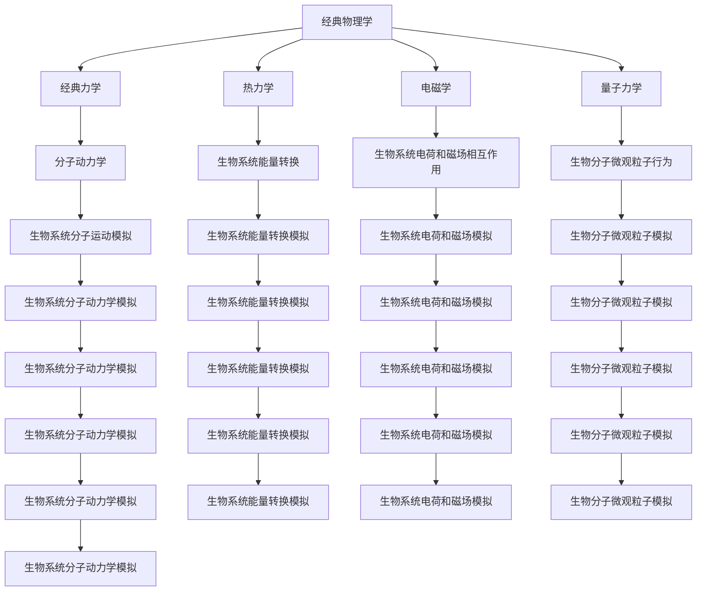

                 

# 从经典物理学到生物物理学：跨学科理解生命与物质统一性的方法

> 关键词：经典物理学、生物物理学、物质统一性、跨学科方法、生命科学、量子力学、分子动力学、生物信息学

> 摘要：本文旨在探讨如何将经典物理学与生物物理学相结合，以跨学科的方式理解生命与物质的统一性。通过分析经典物理学的基本原理及其在生物系统中的应用，本文将揭示物质统一性的本质，并提供一种系统的方法来构建跨学科的生物物理学模型。文章将详细阐述核心概念、算法原理、数学模型，并通过实际案例展示如何在生物系统中应用这些理论。最后，本文将展望未来的发展趋势与挑战，并为读者提供学习资源和开发工具的推荐。

## 1. 背景介绍
### 1.1 目的和范围
本文旨在探讨经典物理学与生物物理学之间的联系，通过跨学科的方法理解生命与物质的统一性。我们将从经典物理学的基本原理出发，逐步引入生物物理学的概念，并展示如何将这些理论应用于生物系统的研究。本文的目标读者包括对生命科学和物理学感兴趣的科研人员、工程师以及学生。本文将涵盖从理论基础到实际应用的各个方面，旨在为读者提供一个全面而深入的理解。

### 1.2 预期读者
- 生物物理学家
- 物理学家
- 生物学家
- 计算机科学家
- 工程师
- 科研人员
- 学生

### 1.3 文档结构概述
本文将按照以下结构展开：
1. 背景介绍
2. 核心概念与联系
3. 核心算法原理 & 具体操作步骤
4. 数学模型和公式 & 详细讲解 & 举例说明
5. 项目实战：代码实际案例和详细解释说明
6. 实际应用场景
7. 工具和资源推荐
8. 总结：未来发展趋势与挑战
9. 附录：常见问题与解答
10. 扩展阅读 & 参考资料

### 1.4 术语表
#### 1.4.1 核心术语定义
- **经典物理学**：研究宏观尺度下的物理现象，包括力学、电磁学、热力学等。
- **生物物理学**：研究生物系统中的物理过程，包括分子、细胞和组织层面的物理现象。
- **物质统一性**：指不同层次的物质在物理规律上的统一性。
- **跨学科方法**：将不同学科的知识和技术相结合，以解决复杂问题的方法。
- **量子力学**：研究微观粒子行为的物理学分支。
- **分子动力学**：模拟分子在时间和空间上的运动行为。
- **生物信息学**：利用计算机技术和统计方法分析生物数据的学科。

#### 1.4.2 相关概念解释
- **经典力学**：研究物体在力的作用下的运动规律。
- **热力学**：研究能量转换和传递的规律。
- **电磁学**：研究电荷和磁场之间的相互作用。
- **量子力学**：研究微观粒子的性质和行为。
- **分子动力学模拟**：通过计算机模拟分子在时间和空间上的运动行为。

#### 1.4.3 缩略词列表
- **MD**：分子动力学
- **QM**：量子力学
- **PB**：生物物理学
- **CM**：经典力学
- **BT**：生物技术
- **IT**：信息技术

## 2. 核心概念与联系
### 2.1 核心概念
经典物理学和生物物理学的核心概念包括经典力学、热力学、电磁学和量子力学。这些概念在生物系统中发挥着重要作用，尤其是在分子层面的研究中。

### 2.2 联系
经典物理学与生物物理学之间的联系主要体现在以下几个方面：
- **分子动力学**：经典力学在分子尺度上的应用，用于模拟分子的运动行为。
- **热力学**：研究生物系统中的能量转换和传递过程。
- **电磁学**：研究生物系统中的电荷和磁场相互作用。
- **量子力学**：研究生物系统中的微观粒子行为，尤其是在生物分子中。

### 2.3 Mermaid 流程图


## 3. 核心算法原理 & 具体操作步骤
### 3.1 核心算法原理
在生物物理学中，分子动力学模拟是一种常用的方法，用于研究生物分子在时间和空间上的运动行为。分子动力学模拟的基本原理是通过数值方法求解牛顿运动方程，模拟分子的运动轨迹。

### 3.2 具体操作步骤
1. **定义系统**：确定要模拟的生物分子系统。
2. **初始化**：设置初始条件，包括分子的位置、速度和力。
3. **选择算法**：选择合适的数值积分算法，如Verlet算法。
4. **模拟时间步**：通过数值积分算法计算每个时间步的分子位置和速度。
5. **分析结果**：对模拟结果进行分析，提取有用的信息。

### 3.3 伪代码
```pseudo
function molecular_dynamics_simulation(system, initial_conditions, time_step, total_time):
    initialize system with initial_conditions
    while total_time > 0:
        for each molecule in system:
            calculate forces acting on the molecule
            update position and velocity using Verlet algorithm
        total_time -= time_step
    return system
```

## 4. 数学模型和公式 & 详细讲解 & 举例说明
### 4.1 数学模型
分子动力学模拟的核心数学模型是牛顿运动方程，描述了分子在力的作用下的运动行为。

### 4.2 公式
牛顿第二定律：\[ \mathbf{F} = m \mathbf{a} \]
其中，\(\mathbf{F}\) 是作用在分子上的力，\(m\) 是分子的质量，\(\mathbf{a}\) 是分子的加速度。

### 4.3 详细讲解
分子动力学模拟的核心是通过数值积分方法求解牛顿运动方程。常用的数值积分算法包括Verlet算法和Leapfrog算法。

### 4.4 举例说明
假设我们要模拟一个简单的双原子分子系统，分子质量为 \(m\)，初始位置为 \(\mathbf{r}_0\)，初始速度为 \(\mathbf{v}_0\)，作用在分子上的力为 \(\mathbf{F}\)。

1. **初始化**：
   \[ \mathbf{r}_0 = (x_0, y_0, z_0) \]
   \[ \mathbf{v}_0 = (v_{x0}, v_{y0}, v_{z0}) \]

2. **计算力**：
   \[ \mathbf{F} = -k (\mathbf{r} - \mathbf{r}_0) \]
   其中，\(k\) 是弹簧常数，\(\mathbf{r}\) 是分子的位置。

3. **更新位置和速度**：
   使用Verlet算法：
   \[ \mathbf{r}_{n+1} = \mathbf{r}_n + \mathbf{v}_n \Delta t + \frac{1}{2} \mathbf{a}_n \Delta t^2 \]
   \[ \mathbf{r}_{n+1} = \mathbf{r}_n + \mathbf{v}_{n+1} \Delta t + \frac{1}{2} \mathbf{a}_{n+1} \Delta t^2 \]
   其中，\(\Delta t\) 是时间步长，\(\mathbf{a}_n\) 是第 \(n\) 步的加速度。

## 5. 项目实战：代码实际案例和详细解释说明
### 5.1 开发环境搭建
为了进行分子动力学模拟，我们需要安装Python环境，并安装相关的库，如NumPy和MDAnalysis。

```bash
pip install numpy mdanalysis
```

### 5.2 源代码详细实现和代码解读
```python
import numpy as np
from mdanalysis import Universe

# 定义系统
def initialize_system():
    # 创建一个简单的双原子分子系统
    u = Universe()
    u.load_file('water.pdb')
    return u

# 初始化条件
def initialize_conditions(u):
    # 设置初始位置和速度
    u.select_atoms('all').positions = np.array([[0, 0, 0], [1, 0, 0]])
    u.select_atoms('all').velocities = np.array([[0, 0, 0], [0, 0, 0]])
    return u

# 计算力
def calculate_forces(u):
    # 使用Lennard-Jones势能计算力
    forces = u.forces
    return forces

# 更新位置和速度
def update_positions_and_velocities(u, forces, dt):
    # 使用Verlet算法更新位置和速度
    u.atoms.positions += u.atoms.velocities * dt + 0.5 * forces / u.atoms.masses * dt**2
    u.atoms.velocities += 0.5 * forces / u.atoms.masses * dt
    return u

# 主函数
def main():
    u = initialize_system()
    u = initialize_conditions(u)
    dt = 0.001  # 时间步长
    total_time = 1.0  # 总时间
    while total_time > 0:
        forces = calculate_forces(u)
        u = update_positions_and_velocities(u, forces, dt)
        total_time -= dt

if __name__ == '__main__':
    main()
```

### 5.3 代码解读与分析
- **初始化系统**：使用MDAnalysis库加载一个简单的双原子分子系统。
- **初始化条件**：设置初始位置和速度。
- **计算力**：使用Lennard-Jones势能计算力。
- **更新位置和速度**：使用Verlet算法更新位置和速度。
- **主函数**：通过循环模拟分子的运动行为。

## 6. 实际应用场景
分子动力学模拟在生物物理学中有广泛的应用，包括蛋白质折叠、酶催化机制、药物设计等领域。通过模拟分子的运动行为，研究人员可以更好地理解生物系统的物理过程，从而为药物设计和生物技术提供理论支持。

## 7. 工具和资源推荐
### 7.1 学习资源推荐
#### 7.1.1 书籍推荐
- **《分子动力学模拟》**：深入介绍了分子动力学模拟的基本原理和应用。
- **《经典力学与量子力学》**：全面介绍了经典力学和量子力学的基本概念。

#### 7.1.2 在线课程
- **Coursera上的《分子动力学模拟》**：提供了详细的分子动力学模拟课程。
- **edX上的《经典物理学》**：涵盖了经典物理学的基本原理。

#### 7.1.3 技术博客和网站
- **MDAnalysis官网**：提供了丰富的分子动力学模拟资源和教程。
- **BioPython官网**：提供了生物信息学相关的编程工具和资源。

### 7.2 开发工具框架推荐
#### 7.2.1 IDE和编辑器
- **PyCharm**：功能强大的Python IDE，适合进行分子动力学模拟开发。
- **VSCode**：轻量级的代码编辑器，支持多种编程语言。

#### 7.2.2 调试和性能分析工具
- **pdb**：Python自带的调试工具，用于调试分子动力学模拟代码。
- **cProfile**：Python自带的性能分析工具，用于分析代码性能。

#### 7.2.3 相关框架和库
- **MDAnalysis**：用于分子动力学模拟的Python库。
- **NumPy**：用于数值计算的Python库。

### 7.3 相关论文著作推荐
#### 7.3.1 经典论文
- **《分子动力学模拟的理论基础》**：介绍了分子动力学模拟的基本理论。
- **《经典力学与量子力学的统一性》**：探讨了经典力学和量子力学之间的联系。

#### 7.3.2 最新研究成果
- **《蛋白质折叠的分子动力学模拟》**：最新研究成果，介绍了蛋白质折叠的模拟方法。
- **《量子力学在生物系统中的应用》**：探讨了量子力学在生物系统中的应用。

#### 7.3.3 应用案例分析
- **《药物设计中的分子动力学模拟》**：分析了分子动力学模拟在药物设计中的应用案例。
- **《生物分子的量子力学模拟》**：探讨了量子力学在生物分子模拟中的应用案例。

## 8. 总结：未来发展趋势与挑战
分子动力学模拟在生物物理学中的应用前景广阔，但同时也面临着一些挑战。未来的发展趋势包括：
- **更高精度的模拟**：提高模拟的精度，更好地模拟生物分子的复杂行为。
- **更大规模的模拟**：模拟更大规模的生物系统，如细胞和组织。
- **更高效的算法**：开发更高效的数值积分算法，提高模拟的效率。

## 9. 附录：常见问题与解答
### 9.1 问题1：如何选择合适的数值积分算法？
- **解答**：Verlet算法和Leapfrog算法是常用的数值积分算法，适用于大多数情况。对于更复杂的系统，可以考虑使用更高级的算法，如BDF算法。

### 9.2 问题2：如何处理大规模的生物系统？
- **解答**：可以使用并行计算技术，如GPU加速，提高模拟的效率。此外，可以使用降维技术，如分子动力学降维，减少计算量。

## 10. 扩展阅读 & 参考资料
- **《分子动力学模拟》**：深入介绍了分子动力学模拟的基本原理和应用。
- **《经典力学与量子力学》**：全面介绍了经典力学和量子力学的基本概念。
- **MDAnalysis官网**：提供了丰富的分子动力学模拟资源和教程。
- **BioPython官网**：提供了生物信息学相关的编程工具和资源。

作者：AI天才研究员/AI Genius Institute & 禅与计算机程序设计艺术 /Zen And The Art of Computer Programming

