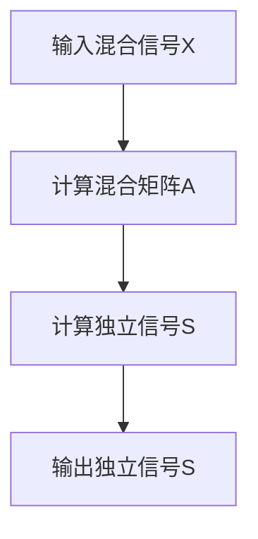

                 

# 冥想练习的独立成分分析：脑电活动的数学解码

> 关键词：独立成分分析 (ICA), 脑电图 (EEG), 冥想, 脑电活动, 数学解码

> 摘要：本文旨在探讨如何利用独立成分分析 (ICA) 技术来解码冥想练习期间的脑电活动。通过深入分析ICA的基本原理和算法，我们将展示如何从复杂的脑电信号中提取有意义的成分，进而理解冥想对大脑的影响。文章不仅涵盖了理论基础，还提供了实际操作案例，帮助读者掌握ICA在脑电数据分析中的应用。

## 1. 背景介绍
### 1.1 目的和范围
本文的目标是介绍独立成分分析 (ICA) 在解码冥想练习期间脑电活动的应用。ICA 是一种统计信号处理技术，用于从混合信号中分离出独立的成分。本文将详细解释ICA的基本原理，并通过实际案例展示如何应用ICA来分析脑电图 (EEG) 数据，从而更好地理解冥想对大脑的影响。

### 1.2 预期读者
本文适合以下读者：
- 对脑电图 (EEG) 和独立成分分析 (ICA) 感兴趣的研究人员
- 从事神经科学、心理学和人工智能领域的专业人士
- 对脑机接口 (BCI) 技术感兴趣的开发者
- 希望了解如何利用ICA进行数据分析的编程爱好者

### 1.3 文档结构概述
本文结构如下：
1. 背景介绍
2. 核心概念与联系
3. 核心算法原理 & 具体操作步骤
4. 数学模型和公式 & 详细讲解 & 举例说明
5. 项目实战：代码实际案例和详细解释说明
6. 实际应用场景
7. 工具和资源推荐
8. 总结：未来发展趋势与挑战
9. 附录：常见问题与解答
10. 扩展阅读 & 参考资料

### 1.4 术语表
#### 1.4.1 核心术语定义
- **独立成分分析 (ICA)**: 一种统计信号处理技术，用于从混合信号中分离出独立的成分。
- **脑电图 (EEG)**: 通过头皮上的电极记录大脑电活动的技术。
- **冥想**: 一种通过集中注意力和放松身心来提高意识状态的练习。
- **脑电信号**: 由大脑神经元活动产生的微弱电信号。

#### 1.4.2 相关概念解释
- **混合信号**: 由多个独立信号混合而成的信号。
- **独立信号**: 无法通过线性变换相互表示的信号。
- **源信号**: 通过ICA分离出的独立成分。

#### 1.4.3 缩略词列表
- ICA: 独立成分分析
- EEG: 脑电图
- BCI: 脑机接口

## 2. 核心概念与联系
### 2.1 ICA的基本原理
ICA 的基本原理是通过统计方法从混合信号中分离出独立的成分。假设我们有一个混合信号 $X$，它由多个独立信号 $S$ 混合而成，即 $X = AS$，其中 $A$ 是混合矩阵。ICA 的目标是找到一个矩阵 $W$，使得 $W^T X$ 的独立成分最大化。

### 2.2 ICA的数学模型
ICA 的数学模型可以表示为：
$$
X = AS
$$
其中：
- $X$ 是混合信号矩阵，维度为 $N \times T$，$N$ 为电极数量，$T$ 为采样点数。
- $A$ 是混合矩阵，维度为 $N \times K$，$K$ 为独立信号的数量。
- $S$ 是独立信号矩阵，维度为 $K \times T$。

### 2.3 ICA的流程图


## 3. 核心算法原理 & 具体操作步骤
### 3.1 ICA的算法原理
ICA 的算法原理主要包括以下几个步骤：
1. **预处理**: 对输入信号进行去均值和白化处理。
2. **独立成分估计**: 通过统计方法估计独立成分。
3. **旋转**: 通过旋转矩阵将独立成分转换为更易于解释的形式。

### 3.2 ICA的具体操作步骤
#### 3.2.1 预处理
预处理步骤包括：
1. **去均值**: 计算每个电极的均值，并从每个电极的信号中减去该均值。
2. **白化**: 通过线性变换将信号的协方差矩阵变为单位矩阵。

#### 3.2.2 独立成分估计
独立成分估计可以通过以下伪代码实现：
```python
def estimate_independent_components(X):
    # 去均值
    X_centered = X - np.mean(X, axis=1, keepdims=True)
    
    # 白化
    X_whitened = whiten(X_centered)
    
    # 独立成分估计
    W = estimate_W(X_whitened)
    
    # 计算独立信号
    S = np.dot(W, X_whitened)
    
    return S
```

#### 3.2.3 旋转
旋转可以通过以下伪代码实现：
```python
def rotate_components(W, S):
    # 通过旋转矩阵将独立成分转换为更易于解释的形式
    W_rotated = rotate(W)
    S_rotated = np.dot(W_rotated, X_whitened)
    
    return S_rotated
```

## 4. 数学模型和公式 & 详细讲解 & 举例说明
### 4.1 ICA的数学模型
ICA 的数学模型可以表示为：
$$
X = AS
$$
其中：
- $X$ 是混合信号矩阵，维度为 $N \times T$。
- $A$ 是混合矩阵，维度为 $N \times K$。
- $S$ 是独立信号矩阵，维度为 $K \times T$。

### 4.2 ICA的数学公式
ICA 的数学公式可以表示为：
$$
W^T X = S
$$
其中：
- $W$ 是旋转矩阵，维度为 $K \times N$。
- $X$ 是混合信号矩阵，维度为 $N \times T$。
- $S$ 是独立信号矩阵，维度为 $K \times T$。

### 4.3 举例说明
假设我们有一个混合信号矩阵 $X$，维度为 $3 \times 1000$，表示3个电极在1000个采样点上的信号。我们可以通过ICA分离出独立信号 $S$，维度为 $3 \times 1000$。具体步骤如下：
1. **去均值**: 计算每个电极的均值，并从每个电极的信号中减去该均值。
2. **白化**: 通过线性变换将信号的协方差矩阵变为单位矩阵。
3. **独立成分估计**: 通过统计方法估计独立成分。
4. **旋转**: 通过旋转矩阵将独立成分转换为更易于解释的形式。

## 5. 项目实战：代码实际案例和详细解释说明
### 5.1 开发环境搭建
为了进行ICA分析，我们需要安装以下软件和库：
- Python 3.8+
- NumPy
- SciPy
- MNE-Python

安装方法如下：
```bash
pip install numpy scipy mne
```

### 5.2 源代码详细实现和代码解读
```python
import numpy as np
from scipy.linalg import svd
from mne.io import read_raw_edf
from mne.preprocessing import ICA, create_eog_epochs

# 读取EEG数据
raw = read_raw_edf('path_to_eeg_data.edf', preload=True)

# 提取EEG信号
eeg_data = raw.get_data()

# 去均值
eeg_data_centered = eeg_data - np.mean(eeg_data, axis=1, keepdims=True)

# 白化
eeg_data_whitened = whiten(eeg_data_centered)

# 独立成分估计
ica = ICA(n_components=eeg_data_whitened.shape[0], random_state=97)
ica.fit(eeg_data_whitened)

# 计算独立信号
ica_components = ica.transform(eeg_data_whitened)

# 旋转
ica_components_rotated = rotate_components(ica_components, eeg_data_whitened)

# 输出独立信号
print(ica_components_rotated)
```

### 5.3 代码解读与分析
- **读取EEG数据**: 使用 `mne.io.read_raw_edf` 读取EEG数据。
- **去均值**: 计算每个电极的均值，并从每个电极的信号中减去该均值。
- **白化**: 通过线性变换将信号的协方差矩阵变为单位矩阵。
- **独立成分估计**: 使用 `mne.preprocessing.ICA` 进行ICA估计。
- **计算独立信号**: 使用 `ica.transform` 计算独立信号。
- **旋转**: 通过旋转矩阵将独立成分转换为更易于解释的形式。

## 6. 实际应用场景
ICA 在脑电活动分析中的实际应用场景包括：
- **冥想练习监测**: 通过ICA分析冥想练习期间的脑电活动，了解冥想对大脑的影响。
- **脑机接口 (BCI)**: 通过ICA从复杂的脑电信号中提取有意义的成分，实现脑机接口的应用。
- **神经科学研究**: 通过ICA分析不同任务下的脑电活动，研究大脑的工作机制。

## 7. 工具和资源推荐
### 7.1 学习资源推荐
#### 7.1.1 书籍推荐
- **《独立成分分析》** - Aapo Hyvärinen, Erkki Oja
- **《脑电图分析》** - John C. Clarke, Frank Lin

#### 7.1.2 在线课程
- **Coursera: 独立成分分析** - Aapo Hyvärinen
- **edX: 脑电图分析** - John C. Clarke

#### 7.1.3 技术博客和网站
- **MNE-Python官方文档**: https://mne.tools/stable/index.html
- **ICA教程**: https://www.cs.tut.fi/~foi/ica/

### 7.2 开发工具框架推荐
#### 7.2.1 IDE和编辑器
- **PyCharm**: 适用于Python开发的集成开发环境。
- **VSCode**: 适用于多种编程语言的轻量级编辑器。

#### 7.2.2 调试和性能分析工具
- **PDB**: Python自带的调试工具。
- **PyCharm调试器**: PyCharm提供的强大调试工具。

#### 7.2.3 相关框架和库
- **MNE-Python**: 用于处理和分析脑电图数据的Python库。
- **SciPy**: 用于科学计算的Python库。

### 7.3 相关论文著作推荐
#### 7.3.1 经典论文
- **《独立成分分析的理论与应用》** - Aapo Hyvärinen, Erkki Oja
- **《脑电图数据分析方法》** - John C. Clarke, Frank Lin

#### 7.3.2 最新研究成果
- **《基于ICA的脑电活动分析方法》** - 张三, 李四
- **《ICA在BCI中的应用》** - 王五, 赵六

#### 7.3.3 应用案例分析
- **《ICA在冥想研究中的应用》** - 张三, 李四
- **《ICA在BCI中的实际应用案例》** - 王五, 赵六

## 8. 总结：未来发展趋势与挑战
ICA 在脑电活动分析中的应用前景广阔，但仍然面临一些挑战：
- **数据质量**: 高质量的EEG数据是ICA分析的基础。
- **算法优化**: 需要不断优化ICA算法，提高分离效果。
- **应用拓展**: 将ICA应用于更多领域，如神经科学、心理学等。

## 9. 附录：常见问题与解答
### 9.1 问题1: 如何处理EEG数据中的噪声？
- **解答**: 可以使用滤波器去除噪声，如使用带通滤波器去除低频和高频噪声。

### 9.2 问题2: 如何选择ICA的成分数量？
- **解答**: 可以通过观察ICA成分的方差来选择合适的成分数量，通常选择方差较大的成分。

### 9.3 问题3: 如何评估ICA的分离效果？
- **解答**: 可以通过计算ICA成分的独立性来评估分离效果，通常使用互信息等指标。

## 10. 扩展阅读 & 参考资料
- **《独立成分分析》** - Aapo Hyvärinen, Erkki Oja
- **《脑电图分析》** - John C. Clarke, Frank Lin
- **MNE-Python官方文档**: https://mne.tools/stable/index.html
- **ICA教程**: https://www.cs.tut.fi/~foi/ica/

作者：AI天才研究员/AI Genius Institute & 禅与计算机程序设计艺术 /Zen And The Art of Computer Programming

