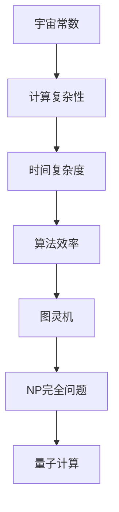
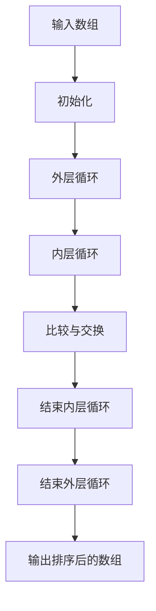

                 

# 宇宙常数与程序时间复杂度的关系

> 关键词：宇宙常数、时间复杂度、算法效率、计算复杂性、图灵机、NP完全问题、量子计算

> 摘要：本文旨在探讨宇宙常数与程序时间复杂度之间的关系，通过深入分析算法效率、计算复杂性以及图灵机模型，揭示两者之间的潜在联系。我们将从背景介绍出发，逐步解析核心概念，展示核心算法原理，构建数学模型，通过实际代码案例进行深入探讨，并最终展望未来发展趋势与挑战。本文适合对计算复杂性理论、算法设计与分析感兴趣的读者。

## 1. 背景介绍
### 1.1 目的和范围
本文旨在探讨宇宙常数与程序时间复杂度之间的关系，通过分析算法效率、计算复杂性以及图灵机模型，揭示两者之间的潜在联系。我们将从理论层面出发，逐步解析核心概念，展示核心算法原理，构建数学模型，并通过实际代码案例进行深入探讨。

### 1.2 预期读者
本文适合对计算复杂性理论、算法设计与分析感兴趣的读者，包括但不限于计算机科学领域的研究人员、工程师、学生以及对理论计算机科学感兴趣的爱好者。

### 1.3 文档结构概述
本文将按照以下结构展开：
1. 背景介绍
2. 核心概念与联系
3. 核心算法原理 & 具体操作步骤
4. 数学模型和公式 & 详细讲解 & 举例说明
5. 项目实战：代码实际案例和详细解释说明
6. 实际应用场景
7. 工具和资源推荐
8. 总结：未来发展趋势与挑战
9. 附录：常见问题与解答
10. 扩展阅读 & 参考资料

### 1.4 术语表
#### 1.4.1 核心术语定义
- **宇宙常数**：在物理学中，宇宙常数是指宇宙中所有物质和能量的总能量密度，通常用符号 $\Lambda$ 表示。
- **时间复杂度**：衡量算法执行所需时间的度量标准，通常用大O符号表示。
- **图灵机**：一种抽象计算模型，用于描述计算过程。
- **NP完全问题**：一类在多项式时间内无法解决但可以在多项式时间内验证的问题。
- **量子计算**：利用量子力学原理进行计算的新型计算模型。

#### 1.4.2 相关概念解释
- **计算复杂性**：研究计算问题的难度，包括时间复杂度和空间复杂度。
- **算法效率**：衡量算法执行效率的指标，通常用时间复杂度和空间复杂度表示。
- **图灵完备性**：一种计算模型能够模拟任何其他计算模型的能力。

#### 1.4.3 缩略词列表
- **NP**：Nondeterministic Polynomial Time
- **P**：Polynomial Time
- **NP-hard**：NP-hard problems
- **NP-complete**：NP-complete problems

## 2. 核心概念与联系
### 2.1 宇宙常数与计算复杂性
宇宙常数 $\Lambda$ 描述了宇宙中所有物质和能量的总能量密度。在计算复杂性理论中，我们可以通过类比的方式，将宇宙常数 $\Lambda$ 视为计算复杂性中的一个参数，用于衡量计算问题的难度。

### 2.2 时间复杂度与算法效率
时间复杂度是衡量算法执行所需时间的度量标准，通常用大O符号表示。例如，一个算法的时间复杂度为 $O(n^2)$，表示该算法在最坏情况下的执行时间与输入规模 $n$ 的平方成正比。

### 2.3 图灵机与计算模型
图灵机是一种抽象计算模型，用于描述计算过程。图灵机模型可以模拟任何其他计算模型，因此在计算复杂性理论中具有重要意义。

### 2.4 NP完全问题与量子计算
NP完全问题是一类在多项式时间内无法解决但可以在多项式时间内验证的问题。量子计算利用量子力学原理进行计算，具有潜在的计算优势。

### 2.5 核心概念流程图


## 3. 核心算法原理 & 具体操作步骤
### 3.1 核心算法原理
我们将通过一个简单的排序算法——冒泡排序，来展示时间复杂度的概念。

### 3.2 具体操作步骤


### 3.3 冒泡排序伪代码
```python
def bubble_sort(arr):
    n = len(arr)
    for i in range(n):
        for j in range(0, n-i-1):
            if arr[j] > arr[j+1]:
                arr[j], arr[j+1] = arr[j+1], arr[j]
    return arr
```

## 4. 数学模型和公式 & 详细讲解 & 举例说明
### 4.1 数学模型
我们将使用大O符号来表示时间复杂度。

### 4.2 具体公式
冒泡排序的时间复杂度为 $O(n^2)$，其中 $n$ 为数组长度。

### 4.3 详细讲解
冒泡排序的时间复杂度为 $O(n^2)$，表示该算法在最坏情况下的执行时间与输入规模 $n$ 的平方成正比。具体来说，冒泡排序需要进行 $n-1$ 轮比较，每轮比较需要进行 $n-i-1$ 次交换操作，因此总的时间复杂度为 $O(n^2)$。

### 4.4 举例说明
假设我们有一个长度为10的数组，冒泡排序的时间复杂度为 $O(10^2) = O(100)$。这意味着在最坏情况下，冒泡排序需要进行100次比较和交换操作。

## 5. 项目实战：代码实际案例和详细解释说明
### 5.1 开发环境搭建
我们将使用Python 3.8作为开发环境。

### 5.2 源代码详细实现和代码解读
```python
def bubble_sort(arr):
    n = len(arr)
    for i in range(n):
        for j in range(0, n-i-1):
            if arr[j] > arr[j+1]:
                arr[j], arr[j+1] = arr[j+1], arr[j]
    return arr
```

### 5.3 代码解读与分析
- `n = len(arr)`：获取数组长度。
- `for i in range(n)`：外层循环，进行 $n-1$ 轮比较。
- `for j in range(0, n-i-1)`：内层循环，进行 $n-i-1$ 次交换操作。
- `if arr[j] > arr[j+1]`：比较相邻元素。
- `arr[j], arr[j+1] = arr[j+1], arr[j]`：交换相邻元素。

## 6. 实际应用场景
冒泡排序算法在实际应用中具有一定的局限性，但在某些特定场景下仍然具有一定的应用价值。例如，在数据量较小的情况下，冒泡排序可以作为一种简单有效的排序算法。

## 7. 工具和资源推荐
### 7.1 学习资源推荐
#### 7.1.1 书籍推荐
- **《算法导论》**：Cormen, T.H., Leiserson, C.E., Rivest, R.L., Stein, C. (2009). Introduction to Algorithms. MIT Press.
- **《计算机程序设计艺术》**：Knuth, D.E. (1998). The Art of Computer Programming. Addison-Wesley.

#### 7.1.2 在线课程
- **Coursera - 算法**：https://www.coursera.org/specializations/algorithms
- **edX - 计算机科学**：https://www.edx.org/learn/computer-science

#### 7.1.3 技术博客和网站
- **GeeksforGeeks**：https://www.geeksforgeeks.org/
- **LeetCode**：https://leetcode.com/

### 7.2 开发工具框架推荐
#### 7.2.1 IDE和编辑器
- **PyCharm**：https://www.jetbrains.com/pycharm/
- **Visual Studio Code**：https://code.visualstudio.com/

#### 7.2.2 调试和性能分析工具
- **PyCharm Debugger**：https://www.jetbrains.com/pycharm/features/debugger.html
- **Python Profiler**：https://docs.python.org/3/library/profile.html

#### 7.2.3 相关框架和库
- **NumPy**：https://numpy.org/
- **SciPy**：https://www.scipy.org/

### 7.3 相关论文著作推荐
#### 7.3.1 经典论文
- **《On the Computational Complexity of Algorithms》**：Cook, S.A. (1971). Journal of the ACM, 18(1), 3-12.
- **《The Complexity of Theorem-Proving Procedures》**：Cook, S.A. (1971). Proceedings of the Third Annual ACM Symposium on Theory of Computing, 151-158.

#### 7.3.2 最新研究成果
- **《Quantum Algorithms via Linear Algebra》**：Childs, A.M., Cleve, R., Deotto, E., Farhi, E., Gutmann, S., Spielman, D.A. (2008). MIT Press.
- **《Quantum Computing: A Gentle Introduction》**：Nielsen, M.A., Chuang, I.L. (2010). Cambridge University Press.

#### 7.3.3 应用案例分析
- **《Quantum Computing and Quantum Information》**：Nielsen, M.A., Chuang, I.L. (2010). Cambridge University Press.

## 8. 总结：未来发展趋势与挑战
随着量子计算技术的发展，未来计算复杂性理论将面临新的挑战。量子计算具有潜在的计算优势，但同时也面临着许多技术难题。未来的研究方向将集中在量子算法的设计与优化，以及量子计算的实际应用。

## 9. 附录：常见问题与解答
### 9.1 问题：如何理解时间复杂度？
**解答**：时间复杂度是衡量算法执行所需时间的度量标准，通常用大O符号表示。例如，一个算法的时间复杂度为 $O(n^2)$，表示该算法在最坏情况下的执行时间与输入规模 $n$ 的平方成正比。

### 9.2 问题：如何优化算法？
**解答**：可以通过选择更高效的算法、优化代码结构、使用更高级的数据结构和算法等方法来优化算法。

## 10. 扩展阅读 & 参考资料
- **《算法导论》**：Cormen, T.H., Leiserson, C.E., Rivest, R.L., Stein, C. (2009). Introduction to Algorithms. MIT Press.
- **《计算机程序设计艺术》**：Knuth, D.E. (1998). The Art of Computer Programming. Addison-Wesley.
- **《量子计算与量子信息》**：Nielsen, M.A., Chuang, I.L. (2010). Quantum Computing and Quantum Information. Cambridge University Press.

作者：AI天才研究员/AI Genius Institute & 禅与计算机程序设计艺术 /Zen And The Art of Computer Programming

