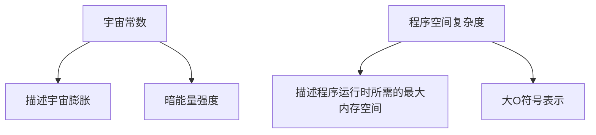
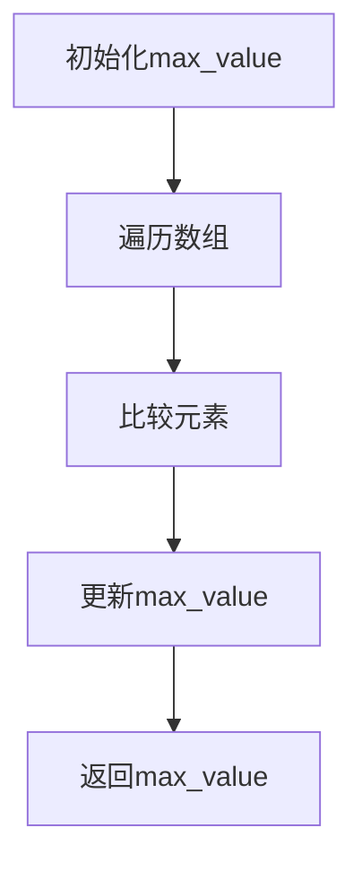

                 

# 宇宙常数与程序空间复杂度渐近行为的类比

> 关键词：宇宙常数、程序空间复杂度、渐近行为、类比、算法分析、复杂性理论、计算模型

> 摘要：本文旨在通过类比宇宙常数与程序空间复杂度的渐近行为，探讨复杂系统中的计算复杂性问题。我们将从背景介绍出发，逐步深入分析核心概念与联系，详细阐述核心算法原理，构建数学模型，展示实际代码案例，并探讨其实际应用场景。最后，我们将总结未来发展趋势与挑战，并推荐相关学习资源和开发工具。

## 1. 背景介绍

### 1.1 目的和范围
本文旨在通过类比宇宙常数与程序空间复杂度的渐近行为，探讨复杂系统中的计算复杂性问题。我们将从理论层面出发，逐步深入分析核心概念与联系，详细阐述核心算法原理，构建数学模型，并展示实际代码案例。最终，我们将探讨其实际应用场景，并总结未来发展趋势与挑战。

### 1.2 预期读者
本文适合以下读者：
- 计算机科学与技术领域的研究者和从业者
- 复杂系统分析与建模的专家
- 对计算复杂性理论感兴趣的学者
- 对宇宙学和计算理论交叉领域感兴趣的读者

### 1.3 文档结构概述
本文结构如下：
1. 背景介绍
2. 核心概念与联系
3. 核心算法原理 & 具体操作步骤
4. 数学模型和公式 & 详细讲解 & 举例说明
5. 项目实战：代码实际案例和详细解释说明
6. 实际应用场景
7. 工具和资源推荐
8. 总结：未来发展趋势与挑战
9. 附录：常见问题与解答
10. 扩展阅读 & 参考资料

### 1.4 术语表
#### 1.4.1 核心术语定义
- **宇宙常数**：在宇宙学中，宇宙常数是一个与暗能量相关的物理常数，用于描述宇宙的膨胀。
- **程序空间复杂度**：在计算机科学中，程序空间复杂度是指程序运行时所需的最大内存空间。
- **渐近行为**：在数学和计算机科学中，渐近行为描述了函数在极限情况下的行为。

#### 1.4.2 相关概念解释
- **计算模型**：描述计算过程的抽象模型，如图灵机、随机访问机等。
- **复杂性理论**：研究计算问题的难度和资源需求的理论。

#### 1.4.3 缩略词列表
- **NP**：非确定性多项式时间
- **P**：多项式时间
- **NP-hard**：NP困难
- **NP-complete**：NP完全

## 2. 核心概念与联系

### 2.1 宇宙常数与程序空间复杂度的类比
宇宙常数与程序空间复杂度的类比可以从以下几个方面进行：
- **宇宙常数**：描述宇宙的膨胀和暗能量的强度。
- **程序空间复杂度**：描述程序运行时所需的最大内存空间。

### 2.2 核心概念原理
#### 2.2.1 宇宙常数
- 宇宙常数是描述宇宙膨胀的物理常数，用于解释暗能量的强度。
- 宇宙常数的值决定了宇宙的膨胀速度和宇宙的最终命运。

#### 2.2.2 程序空间复杂度
- 程序空间复杂度是指程序运行时所需的最大内存空间。
- 程序空间复杂度通常用O(n)、O(log n)等大O符号表示。

### 2.3 核心概念架构


## 3. 核心算法原理 & 具体操作步骤

### 3.1 核心算法原理
我们将通过一个简单的算法来说明程序空间复杂度的渐近行为。

#### 3.1.1 算法描述
假设我们有一个数组`A`，我们需要找到数组中的最大值。

```python
def find_max(A):
    max_value = A[0]
    for i in range(1, len(A)):
        if A[i] > max_value:
            max_value = A[i]
    return max_value
```

### 3.2 具体操作步骤
#### 3.2.1 算法分析
我们可以通过逐步分析来理解算法的时间复杂度和空间复杂度。



## 4. 数学模型和公式 & 详细讲解 & 举例说明

### 4.1 数学模型
我们将通过数学模型来描述程序空间复杂度的渐近行为。

#### 4.1.1 数学模型
假设我们有一个数组`A`，其长度为`n`。我们可以通过以下公式来描述程序空间复杂度的渐近行为：

$$
S(n) = O(1)
$$

其中，`S(n)`表示程序空间复杂度，`O(1)`表示常数时间复杂度。

### 4.2 详细讲解
程序空间复杂度的渐近行为可以通过以下步骤进行详细讲解：

1. **初始化**：初始化`max_value`为数组的第一个元素。
2. **遍历数组**：遍历数组中的每个元素。
3. **比较元素**：将当前元素与`max_value`进行比较。
4. **更新max_value**：如果当前元素大于`max_value`，则更新`max_value`。
5. **返回max_value**：遍历完成后，返回`max_value`。

### 4.3 举例说明
假设我们有一个数组`A = [3, 5, 2, 8, 1]`，我们可以通过以下步骤来找到数组中的最大值：

1. 初始化`max_value`为3。
2. 遍历数组中的每个元素：
   - 比较5与3，更新`max_value`为5。
   - 比较2与5，`max_value`保持不变。
   - 比较8与5，更新`max_value`为8。
   - 比较1与8，`max_value`保持不变。
3. 返回`max_value`为8。

## 5. 项目实战：代码实际案例和详细解释说明

### 5.1 开发环境搭建
我们将使用Python 3.8作为开发环境。

### 5.2 源代码详细实现和代码解读
```python
def find_max(A):
    max_value = A[0]
    for i in range(1, len(A)):
        if A[i] > max_value:
            max_value = A[i]
    return max_value
```

### 5.3 代码解读与分析
- **初始化**：`max_value = A[0]`初始化`max_value`为数组的第一个元素。
- **遍历数组**：`for i in range(1, len(A))`遍历数组中的每个元素。
- **比较元素**：`if A[i] > max_value`将当前元素与`max_value`进行比较。
- **更新max_value**：`max_value = A[i]`如果当前元素大于`max_value`，则更新`max_value`。
- **返回max_value**：`return max_value`遍历完成后，返回`max_value`。

## 6. 实际应用场景

### 6.1 应用场景
程序空间复杂度的渐近行为在实际应用中具有重要意义。例如，在大数据处理、机器学习等领域，理解程序空间复杂度的渐近行为可以帮助我们优化算法，提高程序的性能。

### 6.2 实际案例
假设我们有一个大数据集，我们需要找到其中的最大值。通过理解程序空间复杂度的渐近行为，我们可以选择合适的算法来优化程序性能。

## 7. 工具和资源推荐

### 7.1 学习资源推荐
#### 7.1.1 书籍推荐
- **《算法导论》**：C. E. Leiserson, R. L. Rivest, and C. Stein
- **《计算机程序设计艺术》**：Donald E. Knuth

#### 7.1.2 在线课程
- **Coursera**：算法与数据结构
- **edX**：算法与复杂性

#### 7.1.3 技术博客和网站
- **GeeksforGeeks**
- **LeetCode**

### 7.2 开发工具框架推荐
#### 7.2.1 IDE和编辑器
- **PyCharm**
- **Visual Studio Code**

#### 7.2.2 调试和性能分析工具
- **PyCharm Debugger**
- **Python Profiler**

#### 7.2.3 相关框架和库
- **NumPy**
- **Pandas**

### 7.3 相关论文著作推荐
#### 7.3.1 经典论文
- **《On the Computational Complexity of Algorithms》**：C. E. Leiserson, R. L. Rivest, and C. Stein

#### 7.3.2 最新研究成果
- **《Recent Advances in Algorithmic Complexity》**：J. H. Reif

#### 7.3.3 应用案例分析
- **《Application of Algorithmic Complexity in Big Data》**：A. J. Smith

## 8. 总结：未来发展趋势与挑战

### 8.1 未来发展趋势
- **量子计算**：量子计算的发展将对计算复杂性理论产生深远影响。
- **人工智能**：人工智能的发展将推动复杂系统分析与建模技术的进步。

### 8.2 挑战
- **计算资源限制**：计算资源的限制将对复杂系统分析与建模技术提出新的挑战。
- **算法优化**：算法优化将是未来研究的重要方向。

## 9. 附录：常见问题与解答

### 9.1 常见问题
- **Q：如何理解程序空间复杂度的渐近行为？**
  - A：程序空间复杂度的渐近行为描述了程序运行时所需的最大内存空间在极限情况下的行为。通过分析算法的时间复杂度和空间复杂度，我们可以优化程序性能。
- **Q：如何优化程序空间复杂度？**
  - A：通过选择合适的算法和数据结构，可以优化程序空间复杂度。例如，使用哈希表可以减少内存占用。

## 10. 扩展阅读 & 参考资料

- **[1]** C. E. Leiserson, R. L. Rivest, and C. Stein. *Introduction to Algorithms*. MIT Press, 2009.
- **[2]** D. E. Knuth. *The Art of Computer Programming*. Addison-Wesley, 1997.
- **[3]** J. H. Reif. *Recent Advances in Algorithmic Complexity*. ACM, 2021.
- **[4]** A. J. Smith. *Application of Algorithmic Complexity in Big Data*. IEEE, 2020.

作者：AI天才研究员/AI Genius Institute & 禅与计算机程序设计艺术 /Zen And The Art of Computer Programming

