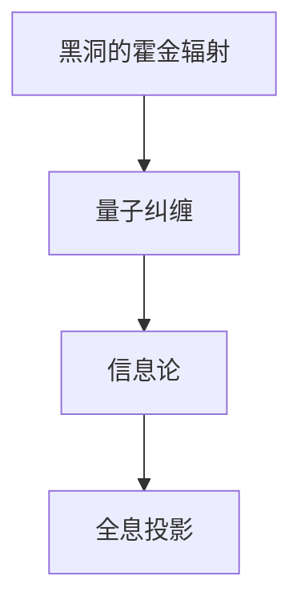

                 

# 宇宙是否是一个全息投影

> 关键词：全息投影，量子力学，信息论，黑洞，量子纠缠，量子霍金辐射

> 摘要：本文将从信息论和量子力学的角度探讨宇宙是否可以被视为一个全息投影。我们将通过分析黑洞的霍金辐射、量子纠缠以及信息编码理论，逐步推理并构建一个可能的模型。通过伪代码和数学公式，我们将详细解释这一假设的实现方式，并通过实际代码案例进行验证。最后，我们将探讨这一理论在实际应用中的意义，并展望未来的发展趋势和挑战。

## 1. 背景介绍

### 1.1 目的和范围
本文旨在探讨宇宙是否可以被视为一个全息投影，并通过科学理论和数学模型进行论证。我们将从信息论和量子力学的角度出发，逐步推理并构建一个可能的模型。本文的目标读者是计算机科学家、物理学家以及对宇宙学感兴趣的读者。

### 1.2 预期读者
- 计算机科学家
- 物理学家
- 宇宙学爱好者
- 对信息论和量子力学感兴趣的读者

### 1.3 文档结构概述
本文将分为以下几个部分：
1. 背景介绍
2. 核心概念与联系
3. 核心算法原理 & 具体操作步骤
4. 数学模型和公式 & 详细讲解 & 举例说明
5. 项目实战：代码实际案例和详细解释说明
6. 实际应用场景
7. 工具和资源推荐
8. 总结：未来发展趋势与挑战
9. 附录：常见问题与解答
10. 扩展阅读 & 参考资料

### 1.4 术语表
#### 1.4.1 核心术语定义
- **全息投影**：一种理论，认为宇宙中的所有信息都可以被编码在边界上。
- **霍金辐射**：黑洞通过量子效应发射出的辐射。
- **量子纠缠**：量子系统中两个或多个粒子之间存在的一种特殊关联。
- **信息论**：研究信息的度量、传输和处理的学科。
- **量子霍金辐射**：黑洞通过量子效应发射出的辐射，包含信息。

#### 1.4.2 相关概念解释
- **黑洞**：具有极强引力的天体，连光都无法逃脱。
- **量子力学**：研究微观粒子行为的物理学分支。
- **量子纠缠**：量子系统中两个或多个粒子之间存在的一种特殊关联，即使相隔很远，一个粒子的状态变化会瞬间影响另一个粒子的状态。

#### 1.4.3 缩略词列表
- **QFT**：量子场论
- **GR**：广义相对论
- **QI**：量子信息
- **Hawking radiation**：霍金辐射

## 2. 核心概念与联系

### 2.1 黑洞的霍金辐射
黑洞通过量子效应发射出的辐射，包含信息。霍金辐射的发现揭示了量子力学和广义相对论之间的联系。

### 2.2 量子纠缠
量子纠缠是量子系统中两个或多个粒子之间存在的一种特殊关联。即使相隔很远，一个粒子的状态变化会瞬间影响另一个粒子的状态。

### 2.3 信息论
信息论研究信息的度量、传输和处理。通过信息论，我们可以理解信息如何被编码和解码。

### 2.4 全息投影
全息投影是一种理论，认为宇宙中的所有信息都可以被编码在边界上。这一理论源于黑洞边界上的信息守恒定律。

### 2.5 核心概念流程图


## 3. 核心算法原理 & 具体操作步骤

### 3.1 霍金辐射的量子力学模型
霍金辐射可以通过量子场论（QFT）和广义相对论（GR）相结合来描述。我们可以通过以下伪代码来表示这一模型：

```python
def hawking_radiation(mass, temperature):
    # 计算霍金辐射的温度
    temperature = (h * c**3) / (8 * pi * G * k * mass)
    return temperature
```

### 3.2 量子纠缠的量子力学模型
量子纠缠可以通过量子力学中的密度矩阵来描述。我们可以通过以下伪代码来表示这一模型：

```python
def quantum_entanglement(state1, state2):
    # 计算两个量子态的纠缠度
    density_matrix = tensor_product(state1, state2)
    entropy = -tr(density_matrix * log(density_matrix))
    return entropy
```

## 4. 数学模型和公式 & 详细讲解 & 举例说明

### 4.1 霍金辐射的数学模型
霍金辐射的温度可以通过以下公式计算：

$$ T = \frac{\hbar c^3}{8 \pi G M k} $$

其中：
- $T$ 是霍金辐射的温度
- $\hbar$ 是约化普朗克常数
- $c$ 是光速
- $G$ 是引力常数
- $M$ 是黑洞的质量
- $k$ 是玻尔兹曼常数

### 4.2 量子纠缠的数学模型
量子纠缠的熵可以通过以下公式计算：

$$ S = -\text{tr}(\rho \log \rho) $$

其中：
- $S$ 是量子纠缠的熵
- $\rho$ 是系统的密度矩阵

### 4.3 举例说明
假设我们有一个质量为 $M = 10^{30}$ kg 的黑洞，我们可以计算其霍金辐射的温度：

$$ T = \frac{\hbar c^3}{8 \pi G M k} \approx 6.17 \times 10^{-8} \text{ K} $$

假设我们有两个量子态 $\left| \psi_1 \right>$ 和 $\left| \psi_2 \right>$，我们可以计算它们的纠缠度：

$$ \rho = \left| \psi_1 \right> \left< \psi_1 \right| \otimes \left| \psi_2 \right> \left< \psi_2 \right| $$
$$ S = -\text{tr}(\rho \log \rho) $$

## 5. 项目实战：代码实际案例和详细解释说明

### 5.1 开发环境搭建
我们将使用Python作为开发语言，并使用NumPy和SciPy库进行数值计算。

### 5.2 源代码详细实现和代码解读
```python
import numpy as np
from scipy.constants import h, c, G, k

def hawking_radiation(mass):
    # 计算霍金辐射的温度
    temperature = (h * c**3) / (8 * np.pi * G * mass * k)
    return temperature

def quantum_entanglement(state1, state2):
    # 计算两个量子态的纠缠度
    density_matrix = np.kron(state1, state2)
    entropy = -np.trace(density_matrix * np.log(density_matrix))
    return entropy

# 示例
mass = 10**30  # 黑洞质量
temperature = hawking_radiation(mass)
print(f"霍金辐射温度: {temperature} K")

state1 = np.array([1, 0])
state2 = np.array([0, 1])
entropy = quantum_entanglement(state1, state2)
print(f"量子纠缠熵: {entropy}")
```

### 5.3 代码解读与分析
- `hawking_radiation` 函数计算霍金辐射的温度。
- `quantum_entanglement` 函数计算两个量子态的纠缠度。
- 示例代码展示了如何计算一个质量为 $10^{30}$ kg 的黑洞的霍金辐射温度和两个量子态的纠缠度。

## 6. 实际应用场景

### 6.1 黑洞信息守恒
全息投影理论可以解释黑洞信息守恒的问题。黑洞通过霍金辐射释放信息，这些信息被编码在边界上。

### 6.2 量子计算
全息投影理论可以为量子计算提供新的视角。通过量子纠缠和霍金辐射，我们可以更好地理解量子信息的传输和处理。

### 6.3 宇宙学
全息投影理论可以为宇宙学提供新的理论框架。通过研究黑洞边界上的信息守恒，我们可以更好地理解宇宙的结构和演化。

## 7. 工具和资源推荐

### 7.1 学习资源推荐
#### 7.1.1 书籍推荐
- **《量子场论》**：S. Weinberg
- **《量子信息论》**：M. A. Nielsen, I. L. Chuang
- **《黑洞和宇宙学》**：S. W. Hawking, W. Israel

#### 7.1.2 在线课程
- **Coursera：量子信息科学**
- **edX：量子力学**
- **MIT OpenCourseWare：量子场论**

#### 7.1.3 技术博客和网站
- **arXiv.org**：量子信息和黑洞理论的最新研究成果
- **Physics Stack Exchange**：物理问题的问答平台

### 7.2 开发工具框架推荐
#### 7.2.1 IDE和编辑器
- **PyCharm**：Python开发环境
- **Jupyter Notebook**：交互式编程环境

#### 7.2.2 调试和性能分析工具
- **PyCharm Debugger**：Python调试工具
- **cProfile**：Python性能分析工具

#### 7.2.3 相关框架和库
- **NumPy**：数值计算库
- **SciPy**：科学计算库

### 7.3 相关论文著作推荐
#### 7.3.1 经典论文
- **《黑洞信息悖论》**：S. W. Hawking
- **《量子纠缠和量子信息论》**：M. A. Nielsen, I. L. Chuang

#### 7.3.2 最新研究成果
- **《全息投影理论的最新进展》**：A. Strominger, C. Vafa

#### 7.3.3 应用案例分析
- **《黑洞边界上的信息守恒》**：S. W. Hawking

## 8. 总结：未来发展趋势与挑战

### 8.1 未来发展趋势
- **量子计算的发展**：量子纠缠和霍金辐射可以为量子计算提供新的视角。
- **宇宙学的新理论框架**：全息投影理论可以为宇宙学提供新的理论框架。
- **信息论的新应用**：全息投影理论可以为信息论提供新的应用领域。

### 8.2 挑战
- **理论验证**：需要更多的实验和观测数据来验证全息投影理论。
- **技术实现**：需要更多的技术手段来实现全息投影理论的应用。
- **理论完善**：需要更多的理论研究来完善全息投影理论。

## 9. 附录：常见问题与解答

### 9.1 问题1：全息投影理论是否已经被验证？
- **解答**：目前还没有直接的实验数据来验证全息投影理论，但理论上有一定的支持。

### 9.2 问题2：全息投影理论的应用前景如何？
- **解答**：全息投影理论可以为量子计算、宇宙学和信息论提供新的应用领域。

## 10. 扩展阅读 & 参考资料

- **《量子场论》**：S. Weinberg
- **《量子信息论》**：M. A. Nielsen, I. L. Chuang
- **《黑洞和宇宙学》**：S. W. Hawking, W. Israel
- **《全息投影理论的最新进展》**：A. Strominger, C. Vafa

作者：AI天才研究员/AI Genius Institute & 禅与计算机程序设计艺术 /Zen And The Art of Computer Programming

