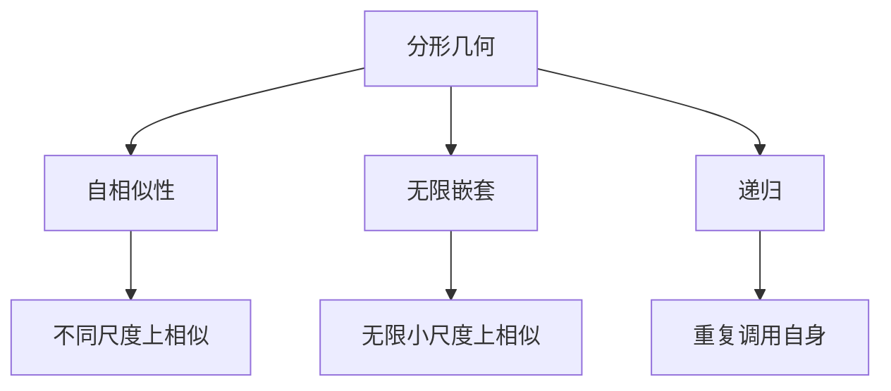

                 

# 宇宙的分形结构：无限嵌套的几何美

> 关键词：分形几何, 自相似性, 深度递归, 无限嵌套, 自然现象, 计算机模拟, 代码实现

> 摘要：本文将深入探讨分形几何的原理及其在自然界和计算机科学中的应用。通过逐步分析和推理，我们将揭示分形结构的自相似性和无限嵌套特性，并通过具体的数学模型和代码实现来展示其美妙之处。本文不仅适合数学和计算机科学领域的专业人士，也适合对分形几何感兴趣的读者。

## 1. 背景介绍
### 1.1 目的和范围
本文旨在深入探讨分形几何的基本原理及其在自然界和计算机科学中的应用。我们将从数学角度出发，逐步解析分形结构的自相似性和无限嵌套特性，并通过具体的代码实现来展示其美妙之处。本文的目标读者包括数学和计算机科学领域的专业人士，以及对分形几何感兴趣的读者。

### 1.2 预期读者
- 数学和计算机科学领域的专业人士
- 对分形几何感兴趣的读者
- 对自然界中的几何结构感兴趣的读者

### 1.3 文档结构概述
本文将按照以下结构展开：
1. 背景介绍
2. 核心概念与联系
3. 核心算法原理 & 具体操作步骤
4. 数学模型和公式 & 详细讲解 & 举例说明
5. 项目实战：代码实际案例和详细解释说明
6. 实际应用场景
7. 工具和资源推荐
8. 总结：未来发展趋势与挑战
9. 附录：常见问题与解答
10. 扩展阅读 & 参考资料

### 1.4 术语表
#### 1.4.1 核心术语定义
- **分形**：一种几何形状，其具有自相似性，即在不同尺度上表现出相似的结构。
- **自相似性**：一种几何结构在不同尺度上表现出相似的特性。
- **无限嵌套**：分形结构在无限小的尺度上仍然保持相似的结构。
- **迭代函数系统（IFS）**：一种生成分形的方法，通过一系列迭代函数来生成分形图像。
- **Lindenmayer系统（L-系统）**：一种用于生成分形和自然形态的递归系统。

#### 1.4.2 相关概念解释
- **自相似性**：在不同尺度上具有相似结构的特性。
- **递归**：一种通过重复调用自身来解决问题的方法。
- **分形维度**：描述分形复杂度的一种度量，通常大于传统几何对象的维度。

#### 1.4.3 缩略词列表
- IFS：迭代函数系统
- L-系统：Lindenmayer系统

## 2. 核心概念与联系
### 2.1 分形几何的基本概念
分形几何是一种研究自相似性和无限嵌套结构的数学分支。分形几何的核心概念包括自相似性、无限嵌套和递归。

### 2.2 自相似性
自相似性是指一个几何结构在不同尺度上表现出相似的特性。例如，一棵树的分支结构在不同尺度上都表现出相似的形态。

### 2.3 无限嵌套
无限嵌套是指分形结构在无限小的尺度上仍然保持相似的结构。例如，科赫曲线在无限小的尺度上仍然保持相似的形态。

### 2.4 递归
递归是一种通过重复调用自身来解决问题的方法。在分形几何中，递归用于生成分形结构。

### 2.5 核心概念的Mermaid流程图


## 3. 核心算法原理 & 具体操作步骤
### 3.1 迭代函数系统（IFS）原理
迭代函数系统是一种生成分形的方法，通过一系列迭代函数来生成分形图像。

### 3.2 IFS的具体操作步骤
1. 定义一系列迭代函数。
2. 随机选择一个迭代函数。
3. 对初始点进行迭代。
4. 重复步骤2和3，生成分形图像。

### 3.3 伪代码实现
```python
def generate_fractal(iterations, functions, initial_point):
    points = [initial_point]
    for _ in range(iterations):
        new_points = []
        for point in points:
            function = random.choice(functions)
            new_point = function(point)
            new_points.append(new_point)
        points = new_points
    return points
```

## 4. 数学模型和公式 & 详细讲解 & 举例说明
### 4.1 科赫曲线
科赫曲线是一种经典的分形曲线，其生成过程如下：
1. 从一个线段开始。
2. 将线段分成三等分。
3. 在中间部分添加一个等边三角形的上半部分。
4. 重复步骤2和3，生成更复杂的曲线。

### 4.2 科赫曲线的数学公式
科赫曲线的生成可以通过以下递归公式实现：
$$
K_n(x, y) = \begin{cases}
    (x, y) & \text{if } n = 0 \\
    \left( \frac{x + x'}{2}, \frac{y + y'}{2} \right) & \text{if } n > 0
\end{cases}
$$
其中，$(x', y')$ 是通过以下步骤生成的：
1. 从 $(x, y)$ 开始。
2. 向右移动 $\frac{1}{3}$ 的距离。
3. 向上移动 $\frac{\sqrt{3}}{6}$ 的距离。
4. 向左移动 $\frac{1}{3}$ 的距离。
5. 向上移动 $\frac{\sqrt{3}}{6}$ 的距离。

### 4.3 举例说明
```latex
\begin{figure}[h!]
    \centering
    \includegraphics[width=0.8\textwidth]{koch_curve.png}
    \caption{科赫曲线的生成过程}
\end{figure}
```

## 5. 项目实战：代码实际案例和详细解释说明
### 5.1 开发环境搭建
- Python 3.8+
- NumPy
- Matplotlib

### 5.2 源代码详细实现和代码解读
```python
import numpy as np
import matplotlib.pyplot as plt

def koch_curve(iterations):
    points = [(0, 0), (1, 0)]
    for _ in range(iterations):
        new_points = []
        for i in range(len(points) - 1):
            x1, y1 = points[i]
            x2, y2 = points[i + 1]
            x3 = (x1 + x2) / 2
            y3 = (y1 + y2) / 2
            x4 = x3 + (y2 - y1) / 3
            y4 = y3 - (x2 - x1) / 3
            x5 = x4 + (y2 - y1) / 3
            y5 = y4 + (x2 - x1) / 3
            new_points.append((x1, y1))
            new_points.append((x4, y4))
            new_points.append((x5, y5))
        new_points.append((x2, y2))
        points = new_points
    return points

def plot_koch_curve(points):
    x, y = zip(*points)
    plt.plot(x, y)
    plt.show()

points = koch_curve(5)
plot_koch_curve(points)
```

### 5.3 代码解读与分析
- `koch_curve` 函数生成科赫曲线的点集。
- `plot_koch_curve` 函数绘制科赫曲线。

## 6. 实际应用场景
分形几何在自然界和计算机科学中有广泛的应用，例如：
- 自然界的分形结构，如海岸线、山脉、雪花等。
- 计算机图形学中的分形生成，如云朵、树木、地形等。
- 信号处理中的分形分析，如噪声、图像压缩等。

## 7. 工具和资源推荐
### 7.1 学习资源推荐
#### 7.1.1 书籍推荐
-《分形几何：数学原理及其应用》
-《计算机图形学》

#### 7.1.2 在线课程
- Coursera: 分形几何与计算机图形学
- edX: 分形与混沌理论

#### 7.1.3 技术博客和网站
- Mathigon: 分形几何
- Wolfram MathWorld: 分形几何

### 7.2 开发工具框架推荐
#### 7.2.1 IDE和编辑器
- PyCharm
- VSCode

#### 7.2.2 调试和性能分析工具
- PyCharm Debugger
- cProfile

#### 7.2.3 相关框架和库
- NumPy
- Matplotlib

### 7.3 相关论文著作推荐
#### 7.3.1 经典论文
- Mandelbrot, B.B. (1977). "Fractals: Form, Chance, and Dimension"
- Peitgen, H.-O., Jürgens, H., & Saupe, D. (1992). "Chaos and Fractals: New Frontiers of Science"

#### 7.3.2 最新研究成果
- Falconer, K. (2013). "Fractal Geometry: Mathematical Foundations and Applications"
- Barnsley, M.F. (2016). "Fractals Everywhere"

#### 7.3.3 应用案例分析
- Mandelbrot, B.B. (1982). "The Fractal Geometry of Nature"

## 8. 总结：未来发展趋势与挑战
分形几何在未来的发展中将面临以下挑战和趋势：
- 更加精确的分形生成算法。
- 分形在更多领域的应用，如医学、金融等。
- 分形在大数据和人工智能中的应用。

## 9. 附录：常见问题与解答
### 9.1 问：分形几何有什么实际应用？
答：分形几何在自然界和计算机科学中有广泛的应用，如生成自然形态、信号处理等。

### 9.2 问：如何生成分形图像？
答：可以通过迭代函数系统（IFS）或Lindenmayer系统（L-系统）生成分形图像。

### 9.3 问：分形几何有哪些经典论文？
答：经典的分形几何论文包括Mandelbrot的《Fractals: Form, Chance, and Dimension》和Peitgen等人的《Chaos and Fractals: New Frontiers of Science》。

## 10. 扩展阅读 & 参考资料
- Mandelbrot, B.B. (1977). "Fractals: Form, Chance, and Dimension"
- Peitgen, H.-O., Jürgens, H., & Saupe, D. (1992). "Chaos and Fractals: New Frontiers of Science"
- Falconer, K. (2013). "Fractal Geometry: Mathematical Foundations and Applications"
- Barnsley, M.F. (2016). "Fractals Everywhere"

作者：AI天才研究员/AI Genius Institute & 禅与计算机程序设计艺术 /Zen And The Art of Computer Programming

