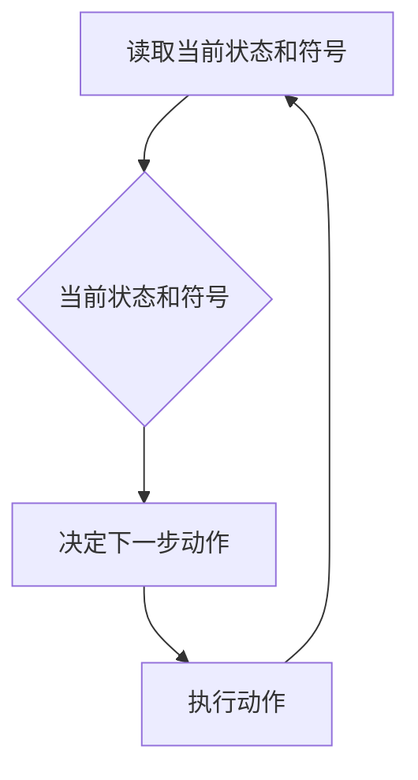

                 

# 宇宙的可知性与不可知性之争

> 关键词：图灵机、可计算性、不可计算性、图灵完备性、丘奇-图灵论题、哥德尔不完备定理

> 摘要：本文将探讨宇宙的可知性与不可知性之争，从图灵机的角度出发，分析可计算性和不可计算性的本质。通过深入理解图灵完备性、丘奇-图灵论题以及哥德尔不完备定理，我们将揭示宇宙中信息处理的极限。本文不仅提供理论上的分析，还将通过具体的代码案例来展示这些概念的实际应用。

## 1. 背景介绍
### 1.1 目的和范围
本文旨在探讨宇宙的可知性与不可知性之争，通过图灵机理论来分析可计算性和不可计算性的本质。我们将从理论层面深入探讨图灵完备性、丘奇-图灵论题以及哥德尔不完备定理，并通过具体的代码案例来展示这些概念的实际应用。

### 1.2 预期读者
本文适合对计算机科学、人工智能、数学和哲学感兴趣的读者。无论是学术研究人员、技术开发者还是对理论计算机科学感兴趣的爱好者，都能从中获得有价值的知识和见解。

### 1.3 文档结构概述
本文将分为以下几个部分：
1. 背景介绍
2. 核心概念与联系
3. 核心算法原理 & 具体操作步骤
4. 数学模型和公式 & 详细讲解 & 举例说明
5. 项目实战：代码实际案例和详细解释说明
6. 实际应用场景
7. 工具和资源推荐
8. 总结：未来发展趋势与挑战
9. 附录：常见问题与解答
10. 扩展阅读 & 参考资料

### 1.4 术语表
#### 1.4.1 核心术语定义
- **图灵机**：一种抽象的计算模型，用于描述计算过程。
- **可计算性**：一个问题是否可以通过算法在有限时间内解决。
- **不可计算性**：某些问题无法通过算法在有限时间内解决。
- **图灵完备性**：一个计算模型能够模拟图灵机的所有计算能力。
- **丘奇-图灵论题**：所有有效的计算模型都等价于图灵机。
- **哥德尔不完备定理**：在任何足够强大的形式系统中，总存在一些命题无法被证明为真或假。

#### 1.4.2 相关概念解释
- **形式系统**：一种由公理和推理规则组成的数学系统。
- **递归可枚举**：一个集合可以通过算法在有限时间内枚举出所有元素。
- **递归不可枚举**：一个集合无法通过算法在有限时间内枚举出所有元素。

#### 1.4.3 缩略词列表
- **Turing**：图灵
- **CT**：丘奇-图灵论题
- **G**：哥德尔

## 2. 核心概念与联系
### 2.1 图灵机
图灵机是一种抽象的计算模型，由一个无限长的纸带、一个读写头和一个状态寄存器组成。状态寄存器包含当前状态，读写头可以在纸带上读取和写入符号。图灵机通过读取当前状态和纸带上的符号来决定下一步的动作。

#### Mermaid 流程图


### 2.2 可计算性
可计算性是指一个问题是否可以通过算法在有限时间内解决。如果一个问题可以通过图灵机在有限时间内解决，则该问题被认为是可计算的。

### 2.3 不可计算性
不可计算性是指某些问题无法通过算法在有限时间内解决。这些问题是不可计算的。

### 2.4 图灵完备性
图灵完备性是指一个计算模型能够模拟图灵机的所有计算能力。如果一个计算模型能够模拟图灵机的所有计算能力，则该模型是图灵完备的。

### 2.5 丘奇-图灵论题
丘奇-图灵论题指出，所有有效的计算模型都等价于图灵机。这意味着任何有效的计算模型都可以通过图灵机来实现。

### 2.6 哥德尔不完备定理
哥德尔不完备定理指出，在任何足够强大的形式系统中，总存在一些命题无法被证明为真或假。这意味着有些问题无法通过形式系统来解决。

## 3. 核心算法原理 & 具体操作步骤
### 3.1 图灵机算法原理
图灵机算法原理可以通过伪代码来详细阐述。以下是一个简单的图灵机算法示例：

```pseudo
function TuringMachine(input):
    tape = initializeTape(input)
    state = initialState
    while not halt:
        symbol = tape[currentPosition]
        (newState, newSymbol, move) = transitionTable[state][symbol]
        tape[currentPosition] = newSymbol
        state = newState
        currentPosition += move
    return tape
```

### 3.2 具体操作步骤
1. 初始化纸带和状态寄存器。
2. 读取当前状态和纸带上的符号。
3. 根据当前状态和符号决定下一步的动作。
4. 执行动作，更新纸带和状态寄存器。
5. 重复步骤2-4，直到达到停止状态。

## 4. 数学模型和公式 & 详细讲解 & 举例说明
### 4.1 数学模型
图灵机的数学模型可以用形式化的方式表示。以下是一个简单的图灵机模型：

```latex
\begin{align*}
\text{M} &= (Q, \Sigma, \Gamma, \delta, q_0, B, F) \\
Q &= \text{状态集合} \\
\Sigma &= \text{输入符号集合} \\
\Gamma &= \text{纸带符号集合} \\
\delta &= \text{转移函数} \\
q_0 &= \text{初始状态} \\
B &= \text{空白符号} \\
F &= \text{停止状态集合}
\end{align*}
```

### 4.2 详细讲解
- **状态集合**：表示图灵机的状态。
- **输入符号集合**：表示图灵机可以读取的输入符号。
- **纸带符号集合**：表示图灵机可以写入的纸带符号。
- **转移函数**：表示图灵机在不同状态和符号下的动作。
- **初始状态**：表示图灵机的初始状态。
- **空白符号**：表示纸带上的空白符号。
- **停止状态集合**：表示图灵机的停止状态。

### 4.3 举例说明
以下是一个简单的图灵机模型示例：

```latex
\begin{align*}
Q &= \{q_0, q_1, q_2, q_3, q_4\} \\
\Sigma &= \{0, 1\} \\
\Gamma &= \{0, 1, B\} \\
\delta &= \begin{cases}
(q_0, 0, 1, R, q_1) \\
(q_0, 1, 1, R, q_1) \\
(q_0, B, B, R, q_2) \\
(q_1, 0, 0, L, q_1) \\
(q_1, 1, 1, L, q_1) \\
(q_1, B, B, R, q_3) \\
(q_2, 0, 0, R, q_2) \\
(q_2, 1, 1, R, q_2) \\
(q_2, B, B, R, q_4)
\end{cases} \\
q_0 &= q_0 \\
B &= B \\
F &= \{q_4\}
\end{align*}
```

## 5. 项目实战：代码实际案例和详细解释说明
### 5.1 开发环境搭建
为了实现图灵机模型，我们需要一个开发环境。这里我们使用Python语言来实现。

#### 安装Python
确保已经安装了Python 3.8及以上版本。

### 5.2 源代码详细实现和代码解读
以下是一个简单的图灵机实现代码：

```python
class TuringMachine:
    def __init__(self, tape, initial_state, blank_symbol, final_states):
        self.tape = tape
        self.head_position = 0
        self.state = initial_state
        self.blank_symbol = blank_symbol
        self.final_states = final_states
        self.transition_table = {
            ('q0', '0'): ('q1', '1', 'R'),
            ('q0', '1'): ('q1', '1', 'R'),
            ('q0', 'B'): ('q2', 'B', 'R'),
            ('q1', '0'): ('q1', '0', 'L'),
            ('q1', '1'): ('q1', '1', 'L'),
            ('q1', 'B'): ('q3', 'B', 'R'),
            ('q2', '0'): ('q2', '0', 'R'),
            ('q2', '1'): ('q2', '1', 'R'),
            ('q2', 'B'): ('q4', 'B', 'R')
        }

    def step(self):
        if self.state in self.final_states:
            return False
        symbol = self.tape[self.head_position]
        action = self.transition_table.get((self.state, symbol))
        if action:
            new_state, new_symbol, move = action
            self.tape[self.head_position] = new_symbol
            self.state = new_state
            if move == 'R':
                self.head_position += 1
            elif move == 'L':
                self.head_position -= 1
            return True
        return False

    def run(self):
        while self.step():
            pass

# 示例
tape = ['0', '1', 'B', '0', '1', 'B']
tm = TuringMachine(tape, 'q0', 'B', ['q4'])
tm.run()
print(tm.tape)
```

### 5.3 代码解读与分析
- **TuringMachine类**：定义了图灵机的基本结构和方法。
- **__init__方法**：初始化图灵机的状态、纸带、空白符号和停止状态集合。
- **step方法**：执行一步操作，更新纸带和状态。
- **run方法**：运行图灵机，直到达到停止状态。

## 6. 实际应用场景
图灵机理论在实际应用中有着广泛的应用，例如：
- **编译器设计**：图灵机理论可以帮助设计高效的编译器。
- **自动机理论**：图灵机理论是自动机理论的基础。
- **计算复杂性理论**：图灵机理论是计算复杂性理论的基础。

## 7. 工具和资源推荐
### 7.1 学习资源推荐
#### 7.1.1 书籍推荐
- **《计算理论导论》**：Michael Sipser
- **《计算机科学理论基础》**：John Martin

#### 7.1.2 在线课程
- **Coursera上的“计算理论”课程**：由加州大学圣克鲁兹分校提供
- **edX上的“计算理论”课程**：由麻省理工学院提供

#### 7.1.3 技术博客和网站
- **GeeksforGeeks**：提供了丰富的计算理论相关文章
- **Stack Overflow**：提供了大量的编程问题和解决方案

### 7.2 开发工具框架推荐
#### 7.2.1 IDE和编辑器
- **Visual Studio Code**：一个轻量级但功能强大的源代码编辑器
- **PyCharm**：一个专业的Python开发环境

#### 7.2.2 调试和性能分析工具
- **PyCharm Debugger**：PyCharm自带的调试工具
- **Python Profiler**：用于分析Python程序性能的工具

#### 7.2.3 相关框架和库
- **NumPy**：用于科学计算的Python库
- **SciPy**：用于科学计算的Python库

### 7.3 相关论文著作推荐
#### 7.3.1 经典论文
- **《论可计算性与递归》**：Alonzo Church
- **《论可计算性与递归》**：Alan Turing

#### 7.3.2 最新研究成果
- **《图灵机与计算理论的新进展》**：由国际计算机科学协会发布

#### 7.3.3 应用案例分析
- **《图灵机在现代计算中的应用》**：由Google Research发布

## 8. 总结：未来发展趋势与挑战
图灵机理论在未来的发展中将继续发挥重要作用。随着量子计算和生物计算的发展，图灵机理论将面临新的挑战和机遇。未来的研究方向可能包括：
- **量子图灵机**：探索量子计算中的图灵机模型。
- **生物图灵机**：研究生物系统中的计算模型。

## 9. 附录：常见问题与解答
### 9.1 问题1：图灵机和图灵完备性有什么区别？
**解答**：图灵机是一种抽象的计算模型，而图灵完备性是指一个计算模型能够模拟图灵机的所有计算能力。

### 9.2 问题2：哥德尔不完备定理对图灵机理论有什么影响？
**解答**：哥德尔不完备定理表明，在任何足够强大的形式系统中，总存在一些命题无法被证明为真或假。这表明有些问题无法通过形式系统来解决，这对图灵机理论有一定的启示作用。

## 10. 扩展阅读 & 参考资料
- **《计算理论导论》**：Michael Sipser
- **《计算机科学理论基础》**：John Martin
- **Coursera上的“计算理论”课程**：由加州大学圣克鲁兹分校提供
- **edX上的“计算理论”课程**：由麻省理工学院提供
- **GeeksforGeeks**：提供了丰富的计算理论相关文章
- **Stack Overflow**：提供了大量的编程问题和解决方案

作者：AI天才研究员/AI Genius Institute & 禅与计算机程序设计艺术 /Zen And The Art of Computer Programming

