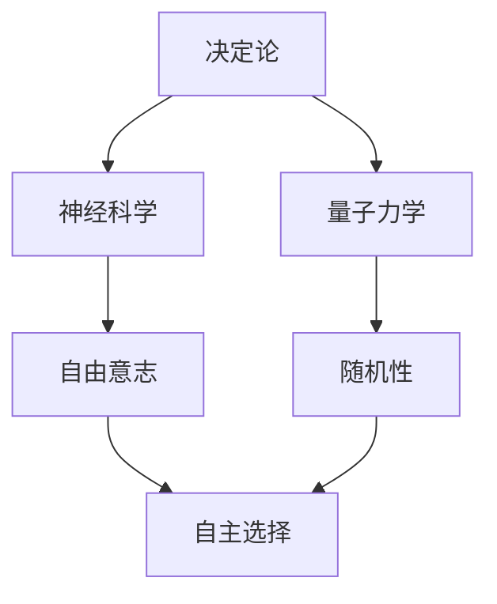

                 

# 宇宙的本质:决定论vs自由意志

> 关键词：决定论, 自由意志, 量子力学, 神经科学, 人工智能, 概率论, 信息论

> 摘要：本文将从决定论和自由意志的角度探讨宇宙的本质。我们将通过分析物理学、神经科学和人工智能领域的理论与实践，揭示决定论与自由意志之间的复杂关系。通过逐步推理和详细解释，我们将展示如何在技术层面上理解和应用这些概念，以期为读者提供深刻的见解和实用的指导。

## 1. 背景介绍
### 1.1 目的和范围
本文旨在探讨决定论与自由意志在宇宙中的地位，通过分析物理学、神经科学和人工智能领域的理论与实践，揭示两者之间的复杂关系。我们将从技术角度出发，探讨如何在编程和算法设计中应用这些概念，以期为读者提供深刻的见解和实用的指导。

### 1.2 预期读者
本文适合对决定论与自由意志感兴趣的技术人员、科学家、哲学家以及对人工智能和计算机科学有深入研究的读者。无论您是初学者还是专业人士，本文都将为您提供有价值的洞见。

### 1.3 文档结构概述
本文将分为以下几个部分：
1. **背景介绍**：介绍本文的目的、范围、预期读者和文档结构。
2. **核心概念与联系**：详细解释决定论和自由意志的概念，并通过Mermaid流程图展示它们之间的关系。
3. **核心算法原理 & 具体操作步骤**：通过伪代码详细阐述如何在编程中实现决定论和自由意志的概念。
4. **数学模型和公式 & 详细讲解 & 举例说明**：使用数学公式和例子来解释决定论和自由意志的原理。
5. **项目实战：代码实际案例和详细解释说明**：通过实际代码案例展示如何在编程中应用这些概念。
6. **实际应用场景**：探讨决定论和自由意志在实际应用中的意义。
7. **工具和资源推荐**：推荐学习资源、开发工具和相关论文著作。
8. **总结：未来发展趋势与挑战**：总结本文的主要观点，并展望未来的发展趋势和挑战。
9. **附录：常见问题与解答**：解答读者可能遇到的问题。
10. **扩展阅读 & 参考资料**：提供进一步阅读的资源。

### 1.4 术语表
#### 1.4.1 核心术语定义
- **决定论**：一种哲学观点，认为宇宙中的每一个事件都是由先前的事件所决定的，不存在随机性。
- **自由意志**：一种哲学观点，认为个体能够自主选择和行动，不受先前事件的完全决定。
- **量子力学**：研究微观粒子行为的物理学分支，揭示了宇宙中存在随机性和不确定性。
- **神经科学**：研究大脑和神经系统功能的科学，揭示了大脑如何处理信息和做出决策。
- **人工智能**：模拟人类智能的技术，包括机器学习、深度学习等。

#### 1.4.2 相关概念解释
- **概率论**：研究随机现象的数学分支，用于描述不确定性的量化方法。
- **信息论**：研究信息的量化、传输和处理的科学，揭示了信息的度量和编码原理。
- **算法**：解决问题的一系列步骤，可以是确定性的或非确定性的。

#### 1.4.3 缩略词列表
- AI：人工智能
- QM：量子力学
- NS：神经科学
- ML：机器学习
- DL：深度学习

## 2. 核心概念与联系
### 2.1 决定论
决定论认为宇宙中的每一个事件都是由先前的事件所决定的，不存在随机性。在物理学中，牛顿的经典力学和爱因斯坦的相对论都是决定论的体现。然而，量子力学的引入揭示了宇宙中存在随机性和不确定性。

### 2.2 自由意志
自由意志是一种哲学观点，认为个体能够自主选择和行动，不受先前事件的完全决定。在神经科学中，大脑的复杂性使得自由意志成为可能。然而，从决定论的角度来看，自由意志的存在仍然是一个未解之谜。

### 2.3 决定论与自由意志的关系
决定论和自由意志之间的关系是复杂且相互关联的。在量子力学中，粒子的行为表现出随机性，这与决定论的观点相矛盾。然而，从神经科学的角度来看，大脑的复杂性使得自由意志成为可能。在人工智能中，通过算法和模型的设计，我们可以模拟和实现这两种观点。

### 2.4 Mermaid流程图


## 3. 核心算法原理 & 具体操作步骤
### 3.1 决定论算法原理
决定论算法通常基于确定性的数学模型和物理定律。例如，牛顿的运动定律可以用来预测物体的运动轨迹。

```pseudo
function predictPosition(x0, v0, t, a):
    x = x0 + v0 * t + 0.5 * a * t^2
    return x
```

### 3.2 自由意志算法原理
自由意志算法通常基于概率性和随机性的模型。例如，通过随机数生成器来模拟个体的选择。

```pseudo
function simulateChoice(probability):
    if random() < probability:
        return "选择A"
    else:
        return "选择B"
```

## 4. 数学模型和公式 & 详细讲解 & 举例说明
### 4.1 决定论的数学模型
在决定论中，物理定律可以用来描述系统的演化。例如，牛顿的运动定律可以用来描述物体的运动。

$$ F = m \cdot a $$

### 4.2 自由意志的数学模型
在自由意志中，概率论可以用来描述个体的选择。例如，通过随机数生成器来模拟个体的选择。

$$ P(A) = \frac{1}{2} $$
$$ P(B) = \frac{1}{2} $$

### 4.3 举例说明
假设我们有一个简单的决策过程，其中个体需要在两个选项中做出选择。我们可以使用概率论来模拟这个过程。

```pseudo
function simulateDecision(probabilityA):
    if random() < probabilityA:
        return "选择A"
    else:
        return "选择B"
```

## 5. 项目实战：代码实际案例和详细解释说明
### 5.1 开发环境搭建
为了实现决定论和自由意志的概念，我们需要搭建一个Python开发环境。安装必要的库，如NumPy和SciPy。

```bash
pip install numpy scipy
```

### 5.2 源代码详细实现和代码解读
我们将实现一个简单的决定论和自由意志的模型。

```python
import numpy as np

def predict_position(x0, v0, t, a):
    x = x0 + v0 * t + 0.5 * a * t**2
    return x

def simulate_choice(probability):
    if np.random.rand() < probability:
        return "选择A"
    else:
        return "选择B"

# 示例
x0 = 0
v0 = 10
t = 2
a = 5
position = predict_position(x0, v0, t, a)
print(f"预测位置: {position}")

probabilityA = 0.7
choice = simulate_choice(probabilityA)
print(f"模拟选择: {choice}")
```

### 5.3 代码解读与分析
- `predict_position` 函数使用牛顿的运动定律来预测物体的运动轨迹。
- `simulate_choice` 函数使用随机数生成器来模拟个体的选择。
- 通过调整参数，我们可以模拟不同的决定论和自由意志的场景。

## 6. 实际应用场景
决定论和自由意志的概念在多个领域都有广泛的应用。例如，在金融领域，可以通过决定论模型预测股票价格的走势；在神经科学领域，可以通过自由意志模型研究大脑的决策过程。

## 7. 工具和资源推荐
### 7.1 学习资源推荐
#### 7.1.1 书籍推荐
- 《量子力学原理》
- 《神经科学导论》
- 《人工智能原理》

#### 7.1.2 在线课程
- Coursera: 量子力学课程
- edX: 神经科学课程
- Udacity: 人工智能课程

#### 7.1.3 技术博客和网站
- Medium: 量子力学和神经科学相关的技术博客
- GitHub: 人工智能和机器学习相关的开源项目

### 7.2 开发工具框架推荐
#### 7.2.1 IDE和编辑器
- PyCharm
- VSCode

#### 7.2.2 调试和性能分析工具
- PyCharm Debugger
- Python Profiler

#### 7.2.3 相关框架和库
- NumPy
- SciPy
- TensorFlow

### 7.3 相关论文著作推荐
#### 7.3.1 经典论文
- "Quantum Mechanics and Path Integrals" by Richard P. Feynman
- "Principles of Neural Science" by Eric Kandel

#### 7.3.2 最新研究成果
- "Quantum Computing and Quantum Information" by Michael A. Nielsen and Isaac L. Chuang
- "Deep Learning" by Ian Goodfellow, Yoshua Bengio, and Aaron Courville

#### 7.3.3 应用案例分析
- "Quantum Computing: A Gentle Introduction" by Eleanor Rieffel and Wolfgang Polak
- "Neural Networks and Deep Learning" by Michael Nielsen

## 8. 总结：未来发展趋势与挑战
决定论和自由意志的概念在未来将继续发展。随着量子计算和神经科学的进步，我们将更好地理解宇宙的本质。然而，如何在技术层面上实现这些概念仍然是一个挑战。未来的研究将集中在如何在编程和算法设计中更好地应用这些概念，以期实现更高级的人工智能系统。

## 9. 附录：常见问题与解答
### 9.1 问题1：决定论和自由意志是否矛盾？
答：决定论和自由意志并不一定矛盾。在量子力学中，粒子的行为表现出随机性，这与决定论的观点相矛盾。然而，从神经科学的角度来看，大脑的复杂性使得自由意志成为可能。

### 9.2 问题2：如何在编程中实现自由意志？
答：在编程中实现自由意志可以通过随机数生成器来模拟个体的选择。例如，通过 `np.random.rand()` 函数来生成随机数，从而模拟个体的选择。

## 10. 扩展阅读 & 参考资料
- Feynman, R. P. (1965). Quantum Mechanics and Path Integrals.
- Kandel, E. R. (2013). Principles of Neural Science.
- Nielsen, M. A., & Chuang, I. L. (2010). Quantum Computing and Quantum Information.
- Goodfellow, I., Bengio, Y., & Courville, A. (2016). Deep Learning.

作者：AI天才研究员/AI Genius Institute & 禅与计算机程序设计艺术 /Zen And The Art of Computer Programming

