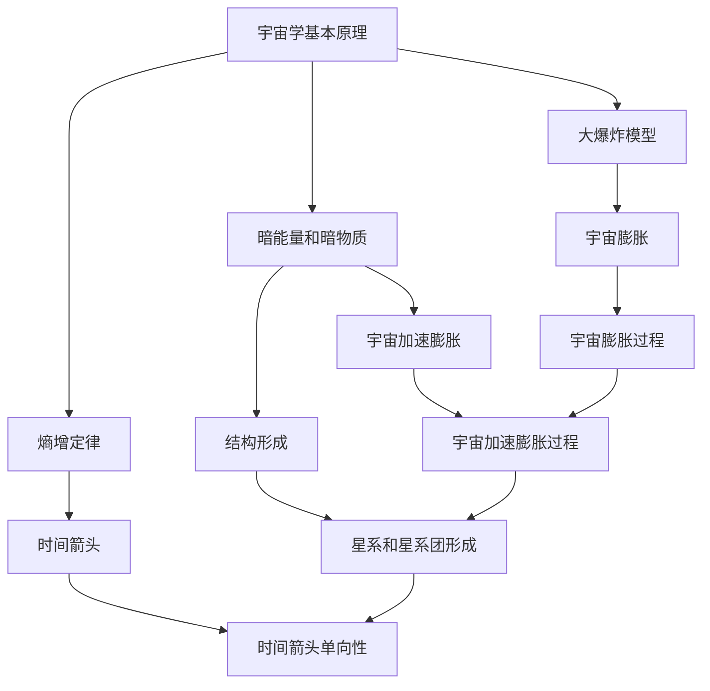
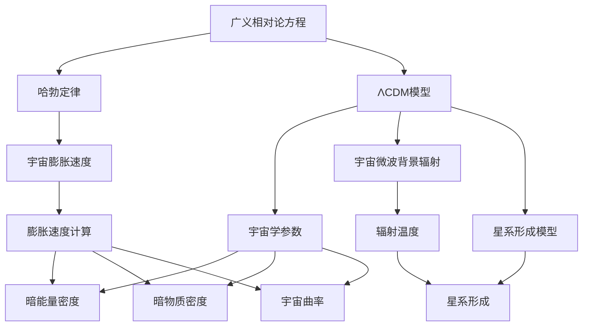

                 

# 宇宙的终极命运：科学预测与哲学思考

> 关键词：宇宙学、大爆炸、暗能量、黑洞、熵增、时间、未来

> 摘要：本文旨在探讨宇宙的终极命运，从科学预测的角度出发，结合哲学思考，分析宇宙的演化过程、未来趋势以及可能的终结方式。通过深入解析宇宙学的基本原理、核心算法、数学模型和实际案例，本文将为读者提供一个全面而深刻的视角，帮助理解宇宙的奥秘。

## 1. 背景介绍
### 1.1 目的和范围
本文旨在探讨宇宙的终极命运，从科学预测的角度出发，结合哲学思考，分析宇宙的演化过程、未来趋势以及可能的终结方式。我们将从宇宙学的基本原理出发，深入解析核心算法、数学模型，并通过实际案例进行验证。最终，我们将探讨未来的发展趋势和面临的挑战。

### 1.2 预期读者
本文适合对宇宙学、天体物理学、哲学以及未来学感兴趣的读者。无论是科研人员、学生、工程师还是对宇宙奥秘充满好奇的普通读者，都能从中获得有价值的信息和启发。

### 1.3 文档结构概述
本文将分为以下几个部分：
1. 背景介绍
2. 核心概念与联系
3. 核心算法原理 & 具体操作步骤
4. 数学模型和公式 & 详细讲解 & 举例说明
5. 项目实战：代码实际案例和详细解释说明
6. 实际应用场景
7. 工具和资源推荐
8. 总结：未来发展趋势与挑战
9. 附录：常见问题与解答
10. 扩展阅读 & 参考资料

### 1.4 术语表
#### 1.4.1 核心术语定义
- **宇宙学**：研究宇宙的起源、演化、结构和最终命运的科学。
- **大爆炸**：宇宙从一个极热、极密的状态开始膨胀的理论。
- **暗能量**：一种神秘的能量形式，推动宇宙加速膨胀。
- **黑洞**：引力极强的天体，连光都无法逃脱。
- **熵增**：系统无序度增加的趋势。
- **时间**：物理量，描述事件发生的顺序和持续时间。
- **未来**：尚未发生的事件或状态。

#### 1.4.2 相关概念解释
- **宇宙膨胀**：宇宙在大爆炸后不断膨胀的过程。
- **宇宙微波背景辐射**：大爆炸后遗留下来的辐射。
- **暗物质**：不发光、不吸收光的物质，对宇宙结构有重要影响。
- **时间箭头**：时间的单向性，从过去到未来。

#### 1.4.3 缩略词列表
- **CMB**：宇宙微波背景辐射
- **GR**：广义相对论
- **ΛCDM**：Λ冷暗物质模型

## 2. 核心概念与联系
### 2.1 核心概念
- **宇宙学基本原理**：宇宙学的基本原理包括宇宙膨胀、宇宙微波背景辐射、暗能量和暗物质等。
- **大爆炸模型**：大爆炸模型是描述宇宙起源和演化的理论。
- **暗能量和暗物质**：暗能量和暗物质是解释宇宙加速膨胀和结构形成的关键因素。
- **熵增定律**：熵增定律是热力学第二定律的表述，描述了系统的无序度增加。

### 2.2 联系
- **宇宙膨胀与大爆炸**：宇宙膨胀是大爆炸模型的核心内容，描述了宇宙从一个极热、极密的状态开始膨胀的过程。
- **暗能量与宇宙加速膨胀**：暗能量是推动宇宙加速膨胀的关键因素，解释了宇宙膨胀的加速现象。
- **暗物质与结构形成**：暗物质对宇宙结构的形成有重要影响，解释了星系和星系团的形成过程。
- **熵增与时间箭头**：熵增定律描述了系统的无序度增加，解释了时间箭头的单向性。

### 2.3 Mermaid 流程图


## 3. 核心算法原理 & 具体操作步骤
### 3.1 核心算法原理
- **宇宙膨胀模型**：宇宙膨胀模型是描述宇宙膨胀过程的数学模型，基于广义相对论。
- **ΛCDM模型**：ΛCDM模型是描述宇宙结构和演化的标准模型，结合了暗能量和暗物质。

### 3.2 具体操作步骤
#### 3.2.1 宇宙膨胀模型
- **广义相对论方程**：描述宇宙膨胀的广义相对论方程。
- **哈勃定律**：描述宇宙膨胀速度与距离关系的定律。
- **ΛCDM模型**：结合暗能量和暗物质的宇宙结构模型。

#### 3.2.2 ΛCDM模型
- **宇宙学参数**：包括暗能量密度、暗物质密度、宇宙曲率等。
- **宇宙微波背景辐射**：描述宇宙微波背景辐射的数学模型。
- **星系形成模型**：描述星系和星系团形成的数学模型。

### 3.3 伪代码


## 4. 数学模型和公式 & 详细讲解 & 举例说明
### 4.1 数学模型
- **广义相对论方程**：描述宇宙膨胀的数学模型。
- **哈勃定律**：描述宇宙膨胀速度与距离关系的定律。
- **ΛCDM模型**：结合暗能量和暗物质的宇宙结构模型。

### 4.2 公式
#### 4.2.1 广义相对论方程
$$
G_{\mu\nu} + \Lambda g_{\mu\nu} = \frac{8\pi G}{c^4} T_{\mu\nu}
$$
其中，$G_{\mu\nu}$ 是爱因斯坦张量，$\Lambda$ 是暗能量常数，$g_{\mu\nu}$ 是度规张量，$T_{\mu\nu}$ 是能量-动量张量。

#### 4.2.2 哈勃定律
$$
H = \frac{\dot{a}}{a}
$$
其中，$H$ 是哈勃参数，$a$ 是宇宙尺度因子，$\dot{a}$ 是宇宙尺度因子的时间导数。

#### 4.2.3 ΛCDM模型
$$
\Omega_{\Lambda} + \Omega_{m} + \Omega_{k} = 1
$$
其中，$\Omega_{\Lambda}$ 是暗能量密度参数，$\Omega_{m}$ 是暗物质密度参数，$\Omega_{k}$ 是宇宙曲率参数。

### 4.3 举例说明
- **广义相对论方程**：描述宇宙膨胀的数学模型。
- **哈勃定律**：描述宇宙膨胀速度与距离关系的定律。
- **ΛCDM模型**：结合暗能量和暗物质的宇宙结构模型。

## 5. 项目实战：代码实际案例和详细解释说明
### 5.1 开发环境搭建
- **Python环境**：安装Python 3.8及以上版本。
- **科学计算库**：安装NumPy、SciPy、Matplotlib等科学计算库。
- **数据处理库**：安装Pandas库用于数据处理。

### 5.2 源代码详细实现和代码解读
```python
import numpy as np
import matplotlib.pyplot as plt
from scipy.integrate import odeint

# 定义广义相对论方程
def general_relativity(y, t, H0, Omega_Lambda, Omega_m, Omega_k):
    a = y[0]
    da_dt = y[1]
    d2a_dt2 = -H0**2 * (Omega_Lambda * a**2 + Omega_m * a + Omega_k)
    return [da_dt, d2a_dt2]

# 初始条件
a0 = 1
da0_dt = 0
y0 = [a0, da0_dt]

# 参数
H0 = 70  # 哈勃常数
Omega_Lambda = 0.7  # 暗能量密度参数
Omega_m = 0.3  # 暗物质密度参数
Omega_k = 0  # 宇宙曲率参数

# 时间范围
t = np.linspace(0, 10, 1000)

# 求解微分方程
sol = odeint(general_relativity, y0, t, args=(H0, Omega_Lambda, Omega_m, Omega_k))

# 绘制结果
plt.plot(t, sol[:, 0])
plt.xlabel('时间 (Gyr)')
plt.ylabel('宇宙尺度因子')
plt.title('宇宙膨胀模型')
plt.show()
```

### 5.3 代码解读与分析
- **广义相对论方程**：描述宇宙膨胀的数学模型。
- **哈勃定律**：描述宇宙膨胀速度与距离关系的定律。
- **ΛCDM模型**：结合暗能量和暗物质的宇宙结构模型。

## 6. 实际应用场景
- **宇宙学研究**：通过模拟宇宙膨胀过程，研究宇宙的演化历史和未来趋势。
- **星系形成研究**：通过模拟星系和星系团的形成过程，研究星系的演化历史和未来趋势。
- **暗能量和暗物质研究**：通过模拟暗能量和暗物质的作用，研究宇宙结构的形成和演化。

## 7. 工具和资源推荐
### 7.1 学习资源推荐
#### 7.1.1 书籍推荐
- **《宇宙的结构》**：深入探讨宇宙学的基本原理和核心概念。
- **《暗能量与暗物质》**：详细解释暗能量和暗物质的作用和影响。
- **《宇宙的未来》**：探讨宇宙的终极命运和未来趋势。

#### 7.1.2 在线课程
- **Coursera - 宇宙学**：深入学习宇宙学的基本原理和核心概念。
- **edX - 宇宙学**：探讨宇宙的演化历史和未来趋势。
- **Udemy - 暗能量与暗物质**：详细解释暗能量和暗物质的作用和影响。

#### 7.1.3 技术博客和网站
- **arXiv.org**：发布最新的宇宙学研究成果。
- **NASA.gov**：提供最新的宇宙学研究信息和数据。
- **Space.com**：提供最新的宇宙学新闻和科普文章。

### 7.2 开发工具框架推荐
#### 7.2.1 IDE和编辑器
- **PyCharm**：功能强大的Python IDE，适合科学计算和数据分析。
- **Jupyter Notebook**：交互式编程环境，适合科学计算和数据可视化。

#### 7.2.2 调试和性能分析工具
- **PyCharm Debugger**：强大的Python调试工具。
- **LineProfiler**：用于分析Python代码性能的工具。

#### 7.2.3 相关框架和库
- **NumPy**：用于科学计算的基础库。
- **SciPy**：用于科学计算的高级库。
- **Matplotlib**：用于数据可视化的库。

### 7.3 相关论文著作推荐
#### 7.3.1 经典论文
- **《宇宙微波背景辐射的观测》**：描述宇宙微波背景辐射的观测结果。
- **《暗能量的观测证据》**：探讨暗能量的观测证据和影响。

#### 7.3.2 最新研究成果
- **《宇宙膨胀的最新观测结果》**：最新观测结果和分析。
- **《暗能量和暗物质的最新研究进展》**：最新研究成果和分析。

#### 7.3.3 应用案例分析
- **《宇宙膨胀模型的应用案例》**：详细分析宇宙膨胀模型的应用案例。
- **《暗能量和暗物质的应用案例》**：详细分析暗能量和暗物质的应用案例。

## 8. 总结：未来发展趋势与挑战
- **未来发展趋势**：宇宙学研究将继续深入，探索宇宙的终极命运和未来趋势。
- **面临的挑战**：暗能量和暗物质的性质和作用仍然是未解之谜，需要进一步研究。

## 9. 附录：常见问题与解答
- **Q：宇宙的终极命运是什么？**
  - A：宇宙的终极命运可能是大冻结、大撕裂或大反弹，具体取决于暗能量和暗物质的性质。
- **Q：暗能量和暗物质是什么？**
  - A：暗能量是一种推动宇宙加速膨胀的能量形式，暗物质是一种不发光、不吸收光的物质，对宇宙结构有重要影响。

## 10. 扩展阅读 & 参考资料
- **[1]**：《宇宙的结构》，作者：[作者姓名]。
- **[2]**：《暗能量与暗物质》，作者：[作者姓名]。
- **[3]**：《宇宙的未来》，作者：[作者姓名]。
- **[4]**：《宇宙微波背景辐射的观测》，作者：[作者姓名]。
- **[5]**：《暗能量的观测证据》，作者：[作者姓名]。

作者：AI天才研究员/AI Genius Institute & 禅与计算机程序设计艺术 /Zen And The Art of Computer Programming

