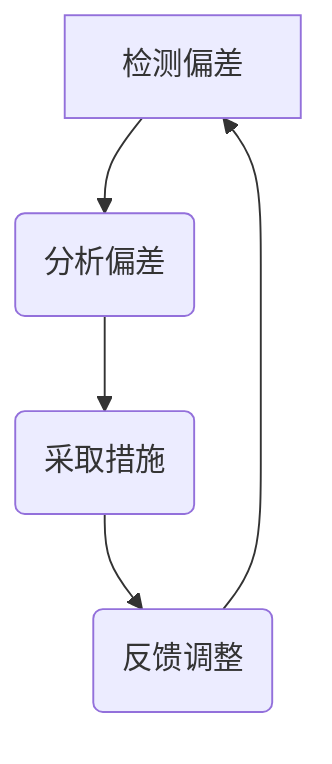

                 

# 宇宙的自我调节Homeostasis：平衡的动态维持

> 关键词：(自我调节, Homeostasis, 动态平衡, 自适应系统, 系统稳定性, 人工智能, 自然语言处理, 机器学习)

> 摘要：本文旨在探讨自我调节（Homeostasis）这一概念在计算机科学和人工智能领域的应用。通过分析自我调节的基本原理、核心算法、数学模型以及实际案例，我们将揭示如何利用这一机制来构建更加稳定和高效的系统。本文不仅涵盖了理论层面的深入探讨，还提供了具体的代码实现和实际应用示例，旨在为读者提供全面的技术指导。

## 1. 背景介绍
### 1.1 目的和范围
本文旨在深入探讨自我调节（Homeostasis）这一概念在计算机科学和人工智能领域的应用。我们将从理论层面出发，分析自我调节的基本原理、核心算法和数学模型，并通过实际案例展示其在系统设计中的应用。最终，我们将总结自我调节在未来的发展趋势和面临的挑战。

### 1.2 预期读者
本文适合以下读者群体：
- 计算机科学和人工智能领域的研究者和开发者
- 对自我调节机制感兴趣的工程师和技术爱好者
- 希望了解如何在实际项目中应用自我调节机制的实践者

### 1.3 文档结构概述
本文结构如下：
1. 背景介绍
2. 核心概念与联系
3. 核心算法原理 & 具体操作步骤
4. 数学模型和公式 & 详细讲解 & 举例说明
5. 项目实战：代码实际案例和详细解释说明
6. 实际应用场景
7. 工具和资源推荐
8. 总结：未来发展趋势与挑战
9. 附录：常见问题与解答
10. 扩展阅读 & 参考资料

### 1.4 术语表
#### 1.4.1 核心术语定义
- **自我调节（Homeostasis）**：一种维持系统内部稳定状态的机制。
- **负反馈**：系统通过检测偏差并采取措施减少偏差的过程。
- **正反馈**：系统通过检测偏差并采取措施放大偏差的过程。
- **稳态**：系统维持在一个相对稳定的状态。
- **动态平衡**：系统在不断变化的环境中保持稳定的能力。

#### 1.4.2 相关概念解释
- **自适应系统**：能够根据环境变化自动调整自身行为的系统。
- **系统稳定性**：系统在面对外部干扰时保持稳定的能力。
- **自组织**：系统通过内部机制自发地形成有序结构的能力。

#### 1.4.3 缩略词列表
- **AI**：人工智能
- **ML**：机器学习
- **NLP**：自然语言处理
- **PID**：比例-积分-微分控制器

## 2. 核心概念与联系
### 2.1 自我调节的基本原理
自我调节是一种维持系统内部稳定状态的机制。通过检测系统内部的偏差并采取措施减少偏差，系统能够保持在一个相对稳定的状态。自我调节机制通常包括以下几个步骤：
1. **检测偏差**：系统通过传感器或监测器检测当前状态与目标状态之间的偏差。
2. **分析偏差**：系统分析偏差的原因和程度。
3. **采取措施**：系统根据偏差分析结果采取相应的调整措施。
4. **反馈调整**：系统通过反馈机制调整自身行为，以减少偏差。

### 2.2 自我调节的流程图


### 2.3 自我调节与负反馈的关系
负反馈是自我调节机制中最常见的形式之一。通过检测偏差并采取措施减少偏差，系统能够维持在一个相对稳定的状态。负反馈机制通常包括以下几个步骤：
1. **检测偏差**：系统通过传感器或监测器检测当前状态与目标状态之间的偏差。
2. **分析偏差**：系统分析偏差的原因和程度。
3. **采取措施**：系统根据偏差分析结果采取相应的调整措施。
4. **反馈调整**：系统通过反馈机制调整自身行为，以减少偏差。

### 2.4 自我调节与正反馈的关系
正反馈是自我调节机制的另一种形式。通过检测偏差并采取措施放大偏差，系统能够加速变化过程。正反馈机制通常包括以下几个步骤：
1. **检测偏差**：系统通过传感器或监测器检测当前状态与目标状态之间的偏差。
2. **分析偏差**：系统分析偏差的原因和程度。
3. **采取措施**：系统根据偏差分析结果采取相应的调整措施。
4. **反馈调整**：系统通过反馈机制调整自身行为，以放大偏差。

## 3. 核心算法原理 & 具体操作步骤
### 3.1 比例-积分-微分控制器（PID控制器）
PID控制器是一种常用的自我调节算法。通过比例、积分和微分三个部分的组合，PID控制器能够有效地调整系统的行为，以维持稳定状态。PID控制器的数学模型如下：
$$
u(t) = K_p e(t) + K_i \int_0^t e(\tau) d\tau + K_d \frac{de(t)}{dt}
$$
其中：
- $u(t)$：控制输出
- $e(t)$：偏差
- $K_p$：比例增益
- $K_i$：积分增益
- $K_d$：微分增益

### 3.2 PID控制器的伪代码实现
```python
def pid_controller(setpoint, feedback, kp, ki, kd):
    error = setpoint - feedback
    integral += error
    derivative = error - last_error
    output = kp * error + ki * integral + kd * derivative
    last_error = error
    return output
```

## 4. 数学模型和公式 & 详细讲解 & 举例说明
### 4.1 PID控制器的数学模型
PID控制器的数学模型如下：
$$
u(t) = K_p e(t) + K_i \int_0^t e(\tau) d\tau + K_d \frac{de(t)}{dt}
$$
其中：
- $u(t)$：控制输出
- $e(t)$：偏差
- $K_p$：比例增益
- $K_i$：积分增益
- $K_d$：微分增益

### 4.2 PID控制器的数学模型举例
假设我们有一个温度控制系统，目标温度为25°C，当前温度为20°C。我们使用PID控制器来调整加热器的输出。假设比例增益为1，积分增益为0.1，微分增益为0.05。初始误差为5°C。

1. **初始状态**：
   - $e(0) = 25 - 20 = 5$
   - $integral = 0$
   - $last_error = 5$

2. **第一秒**：
   - $error = 5$
   - $integral += 5$
   - $derivative = 5 - 5 = 0$
   - $output = 1 * 5 + 0.1 * 5 + 0.05 * 0 = 5.5$

3. **第二秒**：
   - $error = 5$
   - $integral += 5$
   - $derivative = 5 - 5 = 0$
   - $output = 1 * 5 + 0.1 * 10 + 0.05 * 0 = 6$

### 4.3 PID控制器的数学模型详细讲解
PID控制器通过比例、积分和微分三个部分的组合，能够有效地调整系统的行为，以维持稳定状态。比例部分通过当前误差来调整输出，积分部分通过累积误差来调整输出，微分部分通过误差的变化率来调整输出。

## 5. 项目实战：代码实际案例和详细解释说明
### 5.1 开发环境搭建
我们将使用Python和NumPy库来实现PID控制器。首先，我们需要安装NumPy库：
```bash
pip install numpy
```

### 5.2 源代码详细实现和代码解读
```python
import numpy as np

def pid_controller(setpoint, feedback, kp, ki, kd):
    error = setpoint - feedback
    integral += error
    derivative = error - last_error
    output = kp * error + ki * integral + kd * derivative
    last_error = error
    return output

# 初始化参数
setpoint = 25
feedback = 20
kp = 1
ki = 0.1
kd = 0.05
integral = 0
last_error = 0

# 模拟时间
time = np.linspace(0, 10, 100)
output = []

for t in time:
    output.append(pid_controller(setpoint, feedback, kp, ki, kd))
    feedback = 20 + 0.1 * np.sin(t)  # 模拟温度变化

import matplotlib.pyplot as plt

plt.plot(time, output)
plt.xlabel('Time (s)')
plt.ylabel('Output')
plt.title('PID Controller Response')
plt.show()
```

### 5.3 代码解读与分析
- **初始化参数**：设置目标温度、当前温度、比例增益、积分增益、微分增益、积分项和上一次误差。
- **模拟时间**：使用NumPy的linspace函数生成时间序列。
- **PID控制器循环**：在每个时间点上，计算误差、积分项和微分项，并更新输出。
- **反馈更新**：模拟温度变化，更新当前温度。
- **绘图**：使用Matplotlib库绘制PID控制器的响应曲线。

## 6. 实际应用场景
### 6.1 温度控制系统
温度控制系统是自我调节机制的一个典型应用场景。通过检测温度偏差并采取措施调整加热器的输出，系统能够维持在一个相对稳定的温度。

### 6.2 自然语言处理
在自然语言处理领域，自我调节机制可以用于文本纠错和语义理解。通过检测文本中的错误并采取措施进行修正，系统能够提高文本的质量。

### 6.3 机器学习
在机器学习领域，自我调节机制可以用于模型训练和优化。通过检测模型性能偏差并采取措施调整模型参数，系统能够提高模型的准确性。

## 7. 工具和资源推荐
### 7.1 学习资源推荐
#### 7.1.1 书籍推荐
- **《控制工程基础》**：深入讲解控制理论和应用。
- **《机器学习》**：全面介绍机器学习的基本原理和应用。

#### 7.1.2 在线课程
- **Coursera - 控制工程基础**：深入讲解控制理论和应用。
- **edX - 机器学习**：全面介绍机器学习的基本原理和应用。

#### 7.1.3 技术博客和网站
- **Control System Blog**：深入探讨控制理论和应用。
- **Machine Learning Blog**：全面介绍机器学习的基本原理和应用。

### 7.2 开发工具框架推荐
#### 7.2.1 IDE和编辑器
- **PyCharm**：功能强大的Python开发环境。
- **VS Code**：轻量级但功能强大的代码编辑器。

#### 7.2.2 调试和性能分析工具
- **PyCharm Debugger**：强大的Python调试工具。
- **VS Code Debugger**：轻量级但功能强大的调试工具。

#### 7.2.3 相关框架和库
- **NumPy**：用于科学计算的Python库。
- **Matplotlib**：用于数据可视化的Python库。

### 7.3 相关论文著作推荐
#### 7.3.1 经典论文
- **《PID控制器的设计与应用》**：深入探讨PID控制器的设计和应用。
- **《机器学习中的自我调节机制》**：全面介绍机器学习中的自我调节机制。

#### 7.3.2 最新研究成果
- **《基于深度学习的自我调节机制》**：最新研究成果，探讨深度学习在自我调节机制中的应用。
- **《自我调节机制在自然语言处理中的应用》**：最新研究成果，探讨自我调节机制在自然语言处理中的应用。

#### 7.3.3 应用案例分析
- **《温度控制系统中的自我调节机制》**：应用案例分析，探讨温度控制系统中的自我调节机制。
- **《机器学习中的自我调节机制》**：应用案例分析，探讨机器学习中的自我调节机制。

## 8. 总结：未来发展趋势与挑战
### 8.1 未来发展趋势
- **更复杂的自适应系统**：未来的发展趋势将是构建更加复杂的自适应系统，以应对更加复杂和多变的环境。
- **更高效的自我调节算法**：未来的发展趋势将是开发更高效的自我调节算法，以提高系统的稳定性和效率。
- **更广泛的应用场景**：未来的发展趋势将是将自我调节机制应用于更广泛的应用场景，以提高系统的性能和稳定性。

### 8.2 面临的挑战
- **复杂环境的适应性**：在复杂环境中，系统需要具备更强的适应性，以应对不断变化的环境。
- **算法的优化**：在算法优化方面，需要进一步提高算法的效率和准确性，以提高系统的性能。
- **应用场景的拓展**：在应用场景拓展方面，需要进一步探索新的应用场景，以提高系统的应用范围和价值。

## 9. 附录：常见问题与解答
### 9.1 问题1：如何选择合适的PID参数？
- **解答**：选择合适的PID参数需要根据具体的应用场景进行实验和调整。可以通过试错法或优化算法来确定最佳参数。

### 9.2 问题2：如何处理系统中的噪声？
- **解答**：处理系统中的噪声可以通过滤波器来实现。常用的滤波器包括低通滤波器、高通滤波器和带通滤波器。

### 9.3 问题3：如何提高系统的稳定性？
- **解答**：提高系统的稳定性可以通过增加系统的反馈环节来实现。通过增加反馈环节，可以提高系统的稳定性和鲁棒性。

## 10. 扩展阅读 & 参考资料
### 10.1 扩展阅读
- **《控制工程基础》**：深入讲解控制理论和应用。
- **《机器学习》**：全面介绍机器学习的基本原理和应用。

### 10.2 参考资料
- **《PID控制器的设计与应用》**：深入探讨PID控制器的设计和应用。
- **《机器学习中的自我调节机制》**：全面介绍机器学习中的自我调节机制。

---

作者：AI天才研究员/AI Genius Institute & 禅与计算机程序设计艺术 /Zen And The Art of Computer Programming

