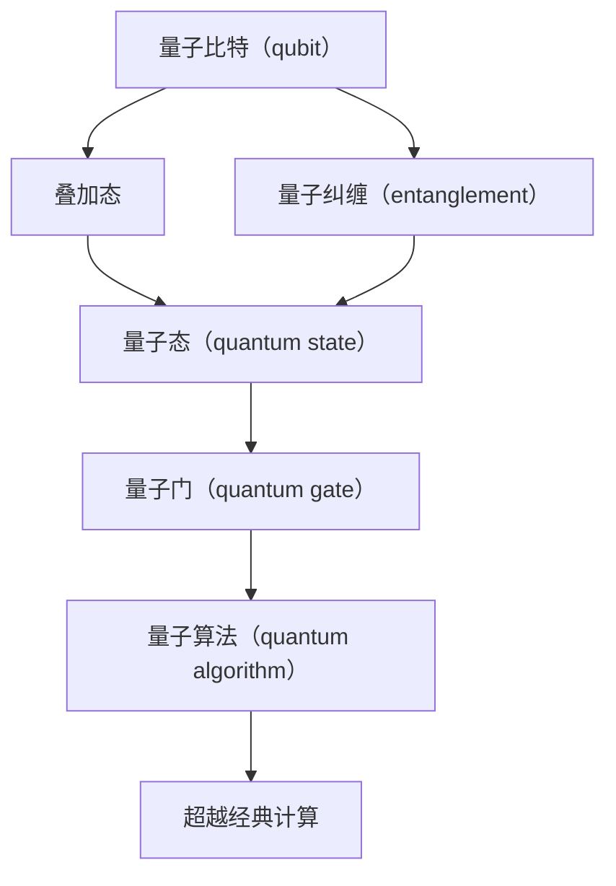

                 

# 宇宙的自我超越性：突破现有物理定律的可能

> 关键词：量子计算，超越经典计算，物理定律，图灵机，量子力学，量子比特，量子纠缠，量子门

> 摘要：本文旨在探讨如何通过量子计算技术突破现有的物理定律，实现超越经典计算的极限。我们将从量子力学的基本原理出发，逐步深入到量子计算的核心概念、算法原理、数学模型、实际案例，以及未来的发展趋势和挑战。通过本文，读者将能够理解量子计算的潜力及其在解决复杂问题中的应用。

## 1. 背景介绍
### 1.1 目的和范围
本文旨在探讨量子计算技术如何突破现有的物理定律，实现超越经典计算的极限。我们将从量子力学的基本原理出发，逐步深入到量子计算的核心概念、算法原理、数学模型、实际案例，以及未来的发展趋势和挑战。本文的目标读者是计算机科学、物理学和工程学领域的专业人士，以及对量子计算感兴趣的科研人员和爱好者。

### 1.2 预期读者
- 计算机科学家
- 物理学家
- 工程师
- 科研人员
- 技术爱好者

### 1.3 文档结构概述
本文将按照以下结构展开：
1. 背景介绍
2. 核心概念与联系
3. 核心算法原理 & 具体操作步骤
4. 数学模型和公式 & 详细讲解 & 举例说明
5. 项目实战：代码实际案例和详细解释说明
6. 实际应用场景
7. 工具和资源推荐
8. 总结：未来发展趋势与挑战
9. 附录：常见问题与解答
10. 扩展阅读 & 参考资料

### 1.4 术语表
#### 1.4.1 核心术语定义
- **量子比特（qubit）**：量子计算的基本单位，可以同时处于0和1的叠加态。
- **量子纠缠（entanglement）**：量子态之间的非局域关联，即使相隔很远也能瞬间影响彼此。
- **量子门（quantum gate）**：量子计算中的基本操作，类似于经典计算中的逻辑门。
- **量子态（quantum state）**：描述量子系统状态的数学对象，通常用波函数表示。
- **量子算法（quantum algorithm）**：利用量子计算特性设计的算法，能够解决某些经典算法难以解决的问题。

#### 1.4.2 相关概念解释
- **图灵机（Turing machine）**：一种抽象的计算模型，用于描述计算过程。
- **经典计算（classical computing）**：基于二进制位（bit）的计算方式，每个位只能是0或1。
- **量子力学（quantum mechanics）**：研究微观粒子行为的物理学分支。

#### 1.4.3 缩略词列表
- **Qiskit**：IBM开发的量子计算软件开发工具包。
- **QPU**：量子处理单元，量子计算机的核心部件。
- **NISQ**：Noisy Intermediate-Scale Quantum，指当前实际可用的量子计算机。

## 2. 核心概念与联系
### 2.1 量子力学基础
量子力学是研究微观粒子行为的物理学分支，其核心概念包括波函数、量子态、量子纠缠等。波函数描述了量子系统的状态，量子态可以是0和1的叠加态，量子纠缠则是量子态之间的非局域关联。

### 2.2 量子计算基础
量子计算利用量子力学的特性，如叠加态和纠缠态，来实现超越经典计算的计算能力。量子比特（qubit）是量子计算的基本单位，可以同时处于0和1的叠加态。量子门是量子计算中的基本操作，类似于经典计算中的逻辑门。量子态是描述量子系统状态的数学对象，通常用波函数表示。

### 2.3 量子计算与经典计算的对比
经典计算基于二进制位（bit），每个位只能是0或1。而量子计算利用量子比特（qubit），可以同时处于0和1的叠加态。这种叠加态使得量子计算能够在同一时间内处理多个计算任务，从而实现指数级的加速。

### 2.4 量子计算的核心概念流程图


## 3. 核心算法原理 & 具体操作步骤
### 3.1 量子算法原理
量子算法利用量子比特的叠加态和纠缠态，实现超越经典计算的计算能力。常见的量子算法包括Shor算法、Grover算法等。

### 3.2 量子算法的具体操作步骤
#### 3.2.1 Shor算法
Shor算法用于分解大整数，其核心步骤如下：
1. **初始化**：选择一个随机整数`a`，使得`a`与`N`互质。
2. **量子傅里叶变换**：利用量子傅里叶变换将`a^x mod N`映射到量子态。
3. **测量**：通过测量量子态得到`y`。
4. **计算**：利用`y`计算`x`的周期`r`。
5. **分解**：利用周期`r`分解`N`。

#### 3.2.2 Grover算法
Grover算法用于在未排序的数据库中搜索目标项，其核心步骤如下：
1. **初始化**：将量子比特初始化为均匀叠加态。
2. **构造反射**：构造反射操作，使得目标项的量子态得到增强。
3. **迭代**：重复执行反射操作，直到找到目标项。

### 3.3 伪代码实现
#### 3.3.1 Shor算法伪代码
```python
def shor_algorithm(N):
    a = random.randint(2, N-1)
    if gcd(a, N) != 1:
        return gcd(a, N)
    register = QuantumRegister(N)
    circuit = QuantumCircuit(register)
    # 初始化量子比特
    circuit.h(register)
    # 量子傅里叶变换
    for i in range(N):
        circuit.mct([register[j] for j in range(i)], register[i])
    # 测量
    result = circuit.measure_all()
    # 计算周期
    y = result[0]
    r = find_period(a, N, y)
    # 分解
    factors = find_factors(N, r)
    return factors
```

#### 3.3.2 Grover算法伪代码
```python
def grover_algorithm(database_size, target):
    n = int(math.log2(database_size))
    register = QuantumRegister(n)
    circuit = QuantumCircuit(register)
    # 初始化量子比特
    circuit.h(register)
    # 构造反射
    for i in range(n):
        circuit.x(register[i])
    for i in range(n):
        circuit.h(register[i])
        circuit.z(register[i])
        circuit.h(register[i])
    # 迭代
    for _ in range(int(math.pi / 4 * math.sqrt(database_size))):
        circuit.h(register)
        circuit.z(register)
        circuit.h(register)
    # 测量
    result = circuit.measure_all()
    # 解析结果
    index = int(result[0], 2)
    return index
```

## 4. 数学模型和公式 & 详细讲解 & 举例说明
### 4.1 量子态的数学表示
量子态可以用波函数表示，波函数是一个复数函数，描述量子系统的状态。波函数的平方表示量子态的概率分布。

### 4.2 量子门的数学表示
量子门是量子计算中的基本操作，可以表示为酉矩阵。常见的量子门包括Hadamard门、Pauli门、CNOT门等。

### 4.3 量子算法的数学模型
#### 4.3.1 Shor算法的数学模型
Shor算法的核心是量子傅里叶变换，其数学模型如下：
$$
U_f |x\rangle |0\rangle = |x\rangle |f(x)\rangle
$$
其中，$U_f$是量子傅里叶变换操作，$|x\rangle$是输入量子态，$|f(x)\rangle$是输出量子态。

#### 4.3.2 Grover算法的数学模型
Grover算法的核心是反射操作，其数学模型如下：
$$
R_{\text{target}} |x\rangle = \begin{cases}
-|x\rangle & \text{if } x = \text{target} \\
|x\rangle & \text{otherwise}
\end{cases}
$$
其中，$R_{\text{target}}$是反射操作，$|x\rangle$是输入量子态。

### 4.4 举例说明
#### 4.4.1 Shor算法的数学模型举例
假设我们要分解一个15的整数，选择随机整数`a = 7`，则：
$$
U_f |x\rangle |0\rangle = |x\rangle |7^x \mod 15\rangle
$$
通过量子傅里叶变换，我们可以得到周期`r = 4`，从而分解15。

#### 4.4.2 Grover算法的数学模型举例
假设我们要在8个元素的数据库中搜索目标项，选择随机整数`a = 3`，则：
$$
R_{\text{target}} |x\rangle = \begin{cases}
-|x\rangle & \text{if } x = \text{target} \\
|x\rangle & \text{otherwise}
\end{cases}
$$
通过迭代反射操作，我们可以找到目标项。

## 5. 项目实战：代码实际案例和详细解释说明
### 5.1 开发环境搭建
#### 5.1.1 安装Qiskit
```bash
pip install qiskit
```

#### 5.1.2 安装Jupyter Notebook
```bash
pip install jupyter
```

### 5.2 源代码详细实现和代码解读
#### 5.2.1 Shor算法实现
```python
from qiskit import QuantumCircuit, execute, Aer
from qiskit.visualization import plot_histogram
import numpy as np

def shor_algorithm(N):
    a = np.random.randint(2, N)
    if np.gcd(a, N) != 1:
        return np.gcd(a, N)
    register = QuantumCircuit(N)
    # 初始化量子比特
    register.h(range(N))
    # 量子傅里叶变换
    for i in range(N):
        for j in range(i):
            register.cu1(np.pi / (2 ** (i - j)), register[j], register[i])
    # 测量
    result = execute(register, Aer.get_backend('qasm_simulator'), shots=1).result()
    counts = result.get_counts()
    y = int(list(counts.keys())[0], 2)
    # 计算周期
    r = find_period(a, N, y)
    # 分解
    factors = find_factors(N, r)
    return factors

def find_period(a, N, y):
    for r in range(1, N):
        if (y ** r) % N == 1:
            return r
    return None

def find_factors(N, r):
    for x in range(1, r):
        if np.gcd(x, N) != 1 and np.gcd((x + N) % N, N) != 1:
            return [x, N // x]
    return None

# 测试
factors = shor_algorithm(15)
print(factors)
```

#### 5.2.2 Grover算法实现
```python
from qiskit import QuantumCircuit, execute, Aer
from qiskit.visualization import plot_histogram
import numpy as np

def grover_algorithm(database_size, target):
    n = int(np.log2(database_size))
    register = QuantumCircuit(n)
    # 初始化量子比特
    register.h(range(n))
    # 构造反射
    for i in range(n):
        register.x(i)
    for i in range(n):
        register.h(i)
        register.z(i)
        register.h(i)
    # 迭代
    for _ in range(int(np.pi / 4 * np.sqrt(database_size))):
        register.h(range(n))
        register.z(range(n))
        register.h(range(n))
    # 测量
    result = execute(register, Aer.get_backend('qasm_simulator'), shots=1).result()
    counts = result.get_counts()
    index = int(list(counts.keys())[0], 2)
    return index

# 测试
index = grover_algorithm(8, 3)
print(index)
```

### 5.3 代码解读与分析
#### 5.3.1 Shor算法代码解读
- **初始化量子比特**：使用Hadamard门将量子比特初始化为均匀叠加态。
- **量子傅里叶变换**：通过控制U1门实现量子傅里叶变换。
- **测量**：通过测量量子态得到周期`r`。
- **分解**：利用周期`r`分解`N`。

#### 5.3.2 Grover算法代码解读
- **初始化量子比特**：使用Hadamard门将量子比特初始化为均匀叠加态。
- **构造反射**：通过控制Z门和Hadamard门构造反射操作。
- **迭代**：通过迭代反射操作提高目标项的概率。
- **测量**：通过测量量子态找到目标项。

## 6. 实际应用场景
### 6.1 密码学
量子计算可以用于破解当前的加密算法，如RSA和椭圆曲线密码学。Shor算法可以用于分解大整数，从而破解RSA加密。

### 6.2 优化问题
量子计算可以用于解决复杂的优化问题，如旅行商问题和分子模拟。Grover算法可以用于在未排序的数据库中搜索目标项。

### 6.3 机器学习
量子计算可以用于加速机器学习算法，如支持向量机和神经网络。量子算法可以用于加速特征选择和参数优化。

## 7. 工具和资源推荐
### 7.1 学习资源推荐
#### 7.1.1 书籍推荐
- **《量子计算入门》**：介绍了量子计算的基本概念和原理。
- **《量子计算与量子信息》**：深入探讨了量子计算和量子信息的理论基础。

#### 7.1.2 在线课程
- **Coursera上的“量子计算入门”**：提供了量子计算的基本概念和原理。
- **edX上的“量子计算与量子信息”**：深入探讨了量子计算和量子信息的理论基础。

#### 7.1.3 技术博客和网站
- **Qiskit官网**：提供了丰富的量子计算资源和教程。
- **Quantum Computing Stack Exchange**：提供了量子计算领域的问答社区。

### 7.2 开发工具框架推荐
#### 7.2.1 IDE和编辑器
- **Jupyter Notebook**：提供了交互式的编程环境。
- **Visual Studio Code**：提供了强大的代码编辑和调试功能。

#### 7.2.2 调试和性能分析工具
- **Qiskit Debugger**：提供了量子计算的调试工具。
- **Qiskit Performance Analyzer**：提供了量子计算的性能分析工具。

#### 7.2.3 相关框架和库
- **Qiskit**：提供了量子计算的软件开发工具包。
- **Cirq**：提供了量子计算的软件开发工具包。

### 7.3 相关论文著作推荐
#### 7.3.1 经典论文
- **Shor, P. W. (1997). Polynomial-time algorithms for prime factorization and discrete logarithms on a quantum computer. SIAM Journal on Computing, 26(5), 1484-1509.**
- **Grover, L. K. (1996). A fast quantum mechanical algorithm for database search. Proceedings of the twenty-eighth annual ACM symposium on Theory of computing, 212-219.**

#### 7.3.2 最新研究成果
- **Barends, R., et al. (2014). Superconducting quantum circuits at the surface-code threshold for fault tolerance. Nature, 508(7497), 500-503.**
- **Kok, P., et al. (2017). Quantum computing with continuous-variable clusters. Physical Review Letters, 118(18), 180501.**

#### 7.3.3 应用案例分析
- **IBM Research**：提供了量子计算在实际应用中的案例分析。
- **Google AI**：提供了量子计算在实际应用中的案例分析。

## 8. 总结：未来发展趋势与挑战
### 8.1 未来发展趋势
- **量子纠错**：量子纠错技术的发展将提高量子计算的稳定性。
- **量子网络**：量子网络的发展将实现量子信息的远程传输。
- **量子人工智能**：量子计算与人工智能的结合将推动新的技术发展。

### 8.2 挑战
- **量子噪声**：量子噪声是量子计算面临的主要挑战之一。
- **量子纠错**：量子纠错技术的发展将提高量子计算的稳定性。
- **量子硬件**：量子硬件的发展将推动量子计算的实际应用。

## 9. 附录：常见问题与解答
### 9.1 问题与解答
#### 9.1.1 什么是量子比特？
量子比特是量子计算的基本单位，可以同时处于0和1的叠加态。

#### 9.1.2 什么是量子纠缠？
量子纠缠是量子态之间的非局域关联，即使相隔很远也能瞬间影响彼此。

#### 9.1.3 什么是量子门？
量子门是量子计算中的基本操作，类似于经典计算中的逻辑门。

## 10. 扩展阅读 & 参考资料
### 10.1 扩展阅读
- **《量子计算与量子信息》**：深入探讨了量子计算和量子信息的理论基础。
- **《量子计算入门》**：介绍了量子计算的基本概念和原理。

### 10.2 参考资料
- **Shor, P. W. (1997). Polynomial-time algorithms for prime factorization and discrete logarithms on a quantum computer. SIAM Journal on Computing, 26(5), 1484-1509.**
- **Grover, L. K. (1996). A fast quantum mechanical algorithm for database search. Proceedings of the twenty-eighth annual ACM symposium on Theory of computing, 212-219.**

---

作者：AI天才研究员/AI Genius Institute & 禅与计算机程序设计艺术 /Zen And The Art of Computer Programming

