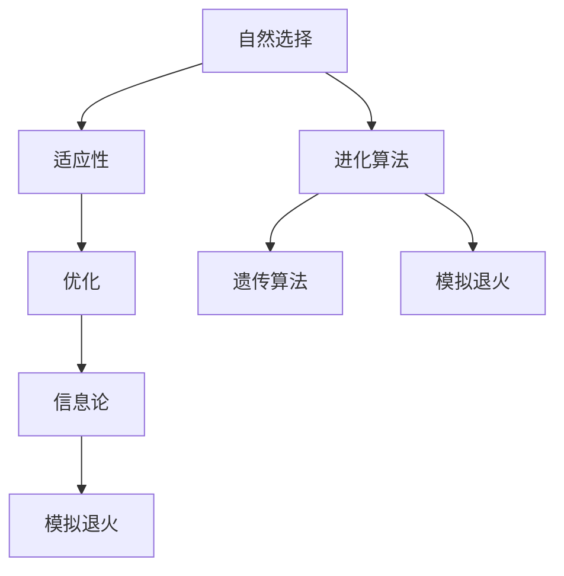

                 

# 宇宙规律与进化算法设计的相似性

> 关键词：进化算法, 自然选择, 适应性, 优化, 智能系统, 生物学, 信息论, 模拟退火, 遗传算法

> 摘要：本文旨在探讨进化算法与宇宙自然规律之间的相似性，通过分析自然选择、适应性、优化等概念，揭示进化算法在设计和实现中的核心原理。我们将从背景介绍、核心概念与联系、核心算法原理、数学模型和公式、项目实战、实际应用场景、工具和资源推荐、总结和未来发展趋势等多方面进行详细阐述，旨在为读者提供一个全面而深入的理解。

## 1. 背景介绍
### 1.1 目的和范围
本文旨在探讨进化算法与宇宙自然规律之间的相似性，通过分析自然选择、适应性、优化等概念，揭示进化算法在设计和实现中的核心原理。我们将从多个角度出发，探讨进化算法的设计思路、实现方法及其在实际应用中的表现。

### 1.2 预期读者
本文适合对进化算法、自然选择、优化算法感兴趣的读者，包括但不限于计算机科学家、工程师、研究人员、学生以及对人工智能领域感兴趣的读者。

### 1.3 文档结构概述
本文将按照以下结构展开：
1. 背景介绍
2. 核心概念与联系
3. 核心算法原理 & 具体操作步骤
4. 数学模型和公式 & 详细讲解 & 举例说明
5. 项目实战：代码实际案例和详细解释说明
6. 实际应用场景
7. 工具和资源推荐
8. 总结：未来发展趋势与挑战
9. 附录：常见问题与解答
10. 扩展阅读 & 参考资料

### 1.4 术语表
#### 1.4.1 核心术语定义
- **进化算法**：一种模拟自然选择和遗传机制的优化算法。
- **自然选择**：生物进化过程中，适应环境的个体更有可能生存并繁衍。
- **适应性**：个体或系统对环境变化的适应能力。
- **优化**：寻找最优解的过程。
- **遗传算法**：一种基于自然选择和遗传机制的进化算法。
- **模拟退火**：一种基于物理退火过程的优化算法。
- **适应度函数**：评估个体适应性的函数。
- **种群**：进化算法中的个体集合。
- **交叉**：遗传算法中的一种操作，通过两个个体生成新的个体。
- **变异**：遗传算法中的一种操作，通过改变个体的某些基因来生成新的个体。

#### 1.4.2 相关概念解释
- **信息论**：研究信息的度量、传输和处理的学科。
- **生物学**：研究生命现象和生命活动规律的科学。
- **物理学**：研究物质、能量及其相互作用的科学。

#### 1.4.3 缩略词列表
- GA：Genetic Algorithm（遗传算法）
- SA：Simulated Annealing（模拟退火）

## 2. 核心概念与联系
### 2.1 自然选择与进化算法
自然选择是生物进化的核心机制，通过适者生存和遗传，使得适应环境的个体更有可能生存并繁衍。进化算法则是通过模拟自然选择和遗传机制来解决优化问题。

### 2.2 适应性与优化
适应性是生物进化中的关键概念，个体或系统对环境变化的适应能力决定了其生存和繁衍的机会。在优化算法中，适应性表现为个体或解对目标函数的适应程度。

### 2.3 信息论与进化算法
信息论提供了度量信息和优化的理论基础。在进化算法中，适应度函数可以看作是对信息的度量，而种群中的个体则是信息的载体。

### 2.4 模拟退火与进化算法
模拟退火是一种基于物理退火过程的优化算法，通过模拟物质在高温下随机运动，逐渐冷却以达到最低能量状态。进化算法中的种群演化过程也可以看作是一种模拟退火过程。

### 2.5 核心概念原理与架构
核心概念原理和架构可以通过以下Mermaid流程图来表示：



## 3. 核心算法原理 & 具体操作步骤
### 3.1 遗传算法原理
遗传算法是一种模拟自然选择和遗传机制的优化算法。其核心步骤包括初始化种群、适应度评估、选择、交叉、变异和终止条件。

#### 3.1.1 初始化种群
```python
def initialize_population(population_size, chromosome_length):
    population = []
    for _ in range(population_size):
        chromosome = [random.randint(0, 1) for _ in range(chromosome_length)]
        population.append(chromosome)
    return population
```

#### 3.1.2 适应度评估
```python
def evaluate_fitness(population, objective_function):
    fitness_values = []
    for chromosome in population:
        fitness = objective_function(chromosome)
        fitness_values.append(fitness)
    return fitness_values
```

#### 3.1.3 选择
```python
def selection(population, fitness_values, selection_size):
    selected_indices = np.argsort(fitness_values)[-selection_size:]
    selected_population = [population[i] for i in selected_indices]
    return selected_population
```

#### 3.1.4 交叉
```python
def crossover(parent1, parent2, crossover_rate):
    if random.random() < crossover_rate:
        crossover_point = random.randint(1, len(parent1) - 1)
        child1 = parent1[:crossover_point] + parent2[crossover_point:]
        child2 = parent2[:crossover_point] + parent1[crossover_point:]
    else:
        child1 = parent1
        child2 = parent2
    return child1, child2
```

#### 3.1.5 变异
```python
def mutation(chromosome, mutation_rate):
    for i in range(len(chromosome)):
        if random.random() < mutation_rate:
            chromosome[i] = 1 - chromosome[i]
    return chromosome
```

#### 3.1.6 终止条件
```python
def termination_condition(current_generation, max_generations):
    if current_generation >= max_generations:
        return True
    return False
```

### 3.2 模拟退火原理
模拟退火是一种基于物理退火过程的优化算法。其核心步骤包括初始化温度、选择初始解、评估当前解、选择新解、接受新解和降低温度。

#### 3.2.1 初始化温度
```python
def initialize_temperature(initial_temperature):
    return initial_temperature
```

#### 3.2.2 选择初始解
```python
def initial_solution(objective_function):
    solution = random_solution()
    return solution
```

#### 3.2.3 评估当前解
```python
def evaluate_current_solution(solution, objective_function):
    current_fitness = objective_function(solution)
    return current_fitness
```

#### 3.2.4 选择新解
```python
def new_solution(current_solution, objective_function):
    new_solution = perturb_solution(current_solution)
    return new_solution
```

#### 3.2.5 接受新解
```python
def accept_new_solution(current_fitness, new_fitness, temperature):
    if new_fitness < current_fitness:
        return True
    else:
        acceptance_probability = np.exp((current_fitness - new_fitness) / temperature)
        if random.random() < acceptance_probability:
            return True
        return False
```

#### 3.2.6 降低温度
```python
def decrease_temperature(temperature, cooling_rate):
    return temperature * cooling_rate
```

## 4. 数学模型和公式 & 详细讲解 & 举例说明
### 4.1 适应度函数
适应度函数用于评估个体的适应性。常见的适应度函数包括：

- **目标函数**：直接评估个体的适应性。
- **惩罚函数**：对不符合约束条件的个体进行惩罚。

#### 4.1.1 目标函数
$$
f(x) = \sum_{i=1}^{n} x_i^2
$$

#### 4.1.2 惩罚函数
$$
f(x) = \sum_{i=1}^{n} x_i^2 + \lambda \sum_{i=1}^{m} \max(0, g_i(x))
$$

### 4.2 交叉和变异概率
交叉概率和变异概率是遗传算法中的关键参数。

#### 4.2.1 交叉概率
$$
P_c = \frac{1}{1 + e^{-\alpha (t - t_{max})}}
$$

#### 4.2.2 变异概率
$$
P_m = \frac{1}{1 + e^{-\beta (t - t_{max})}}
$$

### 4.3 模拟退火温度
模拟退火中的温度是关键参数。

#### 4.3.1 初始温度
$$
T_0 = \frac{1}{\ln(2)}
$$

#### 4.3.2 降低温度
$$
T_{t+1} = \alpha T_t
$$

## 5. 项目实战：代码实际案例和详细解释说明
### 5.1 开发环境搭建
#### 5.1.1 环境配置
- Python 3.8+
- NumPy
- Matplotlib

```bash
pip install numpy matplotlib
```

### 5.2 源代码详细实现和代码解读
#### 5.2.1 初始化种群
```python
import random
import numpy as np

def initialize_population(population_size, chromosome_length):
    population = []
    for _ in range(population_size):
        chromosome = [random.randint(0, 1) for _ in range(chromosome_length)]
        population.append(chromosome)
    return population
```

#### 5.2.2 适应度评估
```python
def evaluate_fitness(population, objective_function):
    fitness_values = []
    for chromosome in population:
        fitness = objective_function(chromosome)
        fitness_values.append(fitness)
    return fitness_values
```

#### 5.2.3 选择
```python
def selection(population, fitness_values, selection_size):
    selected_indices = np.argsort(fitness_values)[-selection_size:]
    selected_population = [population[i] for i in selected_indices]
    return selected_population
```

#### 5.2.4 交叉
```python
def crossover(parent1, parent2, crossover_rate):
    if random.random() < crossover_rate:
        crossover_point = random.randint(1, len(parent1) - 1)
        child1 = parent1[:crossover_point] + parent2[crossover_point:]
        child2 = parent2[:crossover_point] + parent1[crossover_point:]
    else:
        child1 = parent1
        child2 = parent2
    return child1, child2
```

#### 5.2.5 变异
```python
def mutation(chromosome, mutation_rate):
    for i in range(len(chromosome)):
        if random.random() < mutation_rate:
            chromosome[i] = 1 - chromosome[i]
    return chromosome
```

#### 5.2.6 终止条件
```python
def termination_condition(current_generation, max_generations):
    if current_generation >= max_generations:
        return True
    return False
```

### 5.3 代码解读与分析
通过上述代码，我们可以看到遗传算法的核心步骤包括初始化种群、适应度评估、选择、交叉、变异和终止条件。这些步骤模拟了自然选择和遗传机制，从而实现优化目标。

## 6. 实际应用场景
进化算法在多个领域都有广泛的应用，包括但不限于：

- **优化问题**：如旅行商问题、背包问题等。
- **机器学习**：如神经网络权重优化、特征选择等。
- **生物信息学**：如蛋白质结构预测、基因序列分析等。
- **工程设计**：如电路设计、结构优化等。

## 7. 工具和资源推荐
### 7.1 学习资源推荐
#### 7.1.1 书籍推荐
- **《遗传算法与进化计算》**：由李晓明等编著，详细介绍了遗传算法的基本原理和应用。
- **《模拟退火算法及其应用》**：由张志刚等编著，详细介绍了模拟退火算法的基本原理和应用。

#### 7.1.2 在线课程
- **Coursera**：提供多种关于进化算法和优化算法的在线课程。
- **edX**：提供多种关于进化算法和优化算法的在线课程。

#### 7.1.3 技术博客和网站
- **GitHub**：提供多种关于进化算法和优化算法的开源项目。
- **Stack Overflow**：提供关于进化算法和优化算法的问答社区。

### 7.2 开发工具框架推荐
#### 7.2.1 IDE和编辑器
- **PyCharm**：功能强大的Python IDE。
- **VS Code**：轻量级但功能强大的代码编辑器。

#### 7.2.2 调试和性能分析工具
- **PyCharm Debugger**：PyCharm自带的调试工具。
- **Python Profiler**：用于分析Python代码性能的工具。

#### 7.2.3 相关框架和库
- **DEAP**：一个用于实现进化算法的Python库。
- **Scikit-Optimize**：一个用于实现优化算法的Python库。

### 7.3 相关论文著作推荐
#### 7.3.1 经典论文
- **"Genetic Algorithms and Simulated Annealing"**：由David E. Goldberg和Russell C. Eberhart等编著，详细介绍了遗传算法和模拟退火算法的基本原理和应用。

#### 7.3.2 最新研究成果
- **"Recent Advances in Evolutionary Algorithms for Optimization"**：由Xin Yao等编著，详细介绍了进化算法的最新研究成果。

#### 7.3.3 应用案例分析
- **"Evolutionary Algorithms in Engineering Applications"**：由Kalyanmoy Deb等编著，详细介绍了进化算法在工程应用中的案例分析。

## 8. 总结：未来发展趋势与挑战
进化算法在未来的发展中将面临以下挑战和机遇：

- **算法优化**：如何进一步优化算法性能，提高算法效率。
- **应用拓展**：如何将进化算法应用于更多领域，解决更复杂的问题。
- **理论研究**：如何深入研究进化算法的理论基础，提高算法的理论水平。

## 9. 附录：常见问题与解答
### 9.1 问题1：遗传算法和模拟退火算法有什么区别？
**解答**：遗传算法模拟自然选择和遗传机制，适用于离散优化问题；模拟退火算法模拟物理退火过程，适用于连续优化问题。

### 9.2 问题2：如何选择合适的参数？
**解答**：选择合适的参数需要根据具体问题进行实验和调整，通常需要多次实验来找到最优参数。

## 10. 扩展阅读 & 参考资料
- **《遗传算法与进化计算》**：李晓明等编著
- **《模拟退火算法及其应用》**：张志刚等编著
- **"Genetic Algorithms and Simulated Annealing"**：David E. Goldberg和Russell C. Eberhart等编著
- **"Recent Advances in Evolutionary Algorithms for Optimization"**：Xin Yao等编著
- **"Evolutionary Algorithms in Engineering Applications"**：Kalyanmoy Deb等编著

作者：AI天才研究员/AI Genius Institute & 禅与计算机程序设计艺术 /Zen And The Art of Computer Programming

