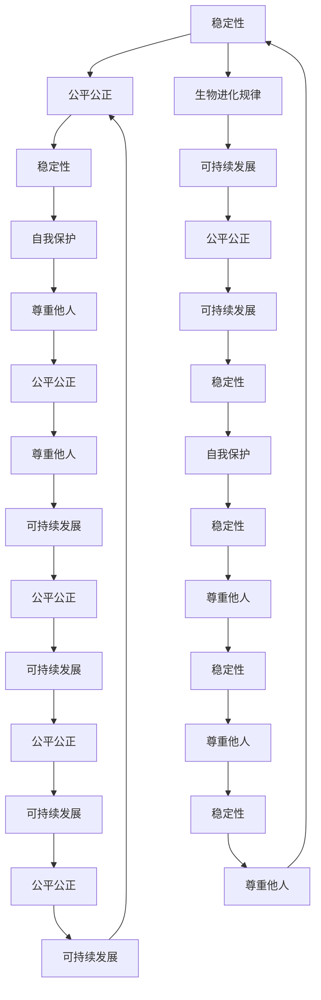

                 

# 宇宙规律对通用人工智能道德框架动态演化稳定性的启示

> 关键词：通用人工智能, 道德框架, 动态演化, 宇宙规律, 稳定性, 伦理学, 人工智能伦理, 自我学习, 自我优化

> 摘要：本文旨在探讨宇宙规律如何为通用人工智能（AGI）的道德框架提供动态演化和稳定性指导。通过分析宇宙中的自然法则和现象，我们能够提炼出一套适用于AGI的道德原则，确保其在不断学习和自我优化的过程中保持稳定性和道德性。本文将从背景介绍、核心概念与联系、核心算法原理、数学模型和公式、项目实战、实际应用场景、工具和资源推荐、总结和未来发展趋势等多个方面进行详细阐述。

## 1. 背景介绍
### 1.1 目的和范围
本文旨在探讨如何利用宇宙规律来构建AGI的道德框架，确保其在动态演化过程中保持稳定性和道德性。本文将从理论和实践两个层面进行探讨，旨在为AGI的发展提供一种新的视角和方法。

### 1.2 预期读者
本文预期读者包括但不限于：
- 人工智能领域的研究者和开发者
- 伦理学家和哲学家
- 政策制定者和监管机构
- 公众和媒体

### 1.3 文档结构概述
本文结构如下：
1. 背景介绍
2. 核心概念与联系
3. 核心算法原理 & 具体操作步骤
4. 数学模型和公式 & 详细讲解 & 举例说明
5. 项目实战：代码实际案例和详细解释说明
6. 实际应用场景
7. 工具和资源推荐
8. 总结：未来发展趋势与挑战
9. 附录：常见问题与解答
10. 扩展阅读 & 参考资料

### 1.4 术语表
#### 1.4.1 核心术语定义
- **通用人工智能（AGI）**：指能够执行任何人类智能任务的机器智能。
- **道德框架**：指指导和规范AGI行为的一套原则和规则。
- **动态演化**：指AGI在不断学习和自我优化过程中，其道德框架能够适应环境变化的能力。
- **稳定性**：指AGI在动态演化过程中保持其道德框架不变的能力。

#### 1.4.2 相关概念解释
- **宇宙规律**：指自然界中普遍存在的规律和法则，如物理定律、生物进化规律等。
- **伦理学**：研究道德价值、规范和行为准则的学科。

#### 1.4.3 缩略词列表
- AGI：通用人工智能
- AI：人工智能
- ML：机器学习
- DL：深度学习

## 2. 核心概念与联系
### 2.1 宇宙规律与AGI道德框架
宇宙规律是自然界中普遍存在的规律和法则，如物理定律、生物进化规律等。这些规律不仅适用于自然界的物质和生命体，也可以为AGI的道德框架提供指导。通过分析宇宙规律，我们可以提炼出一套适用于AGI的道德原则，确保其在不断学习和自我优化的过程中保持稳定性和道德性。

### 2.2 AGI道德框架的核心原则
AGI道德框架的核心原则包括：
- **自我保护**：AGI应具备自我保护的能力，以确保其在不断学习和自我优化过程中保持稳定性和安全性。
- **尊重他人**：AGI应尊重其他智能体，包括人类和其他AGI。
- **公平公正**：AGI应遵循公平公正的原则，确保其行为对所有智能体都是公正的。
- **可持续发展**：AGI应遵循可持续发展的原则，确保其行为对环境和社会的影响是积极的。

### 2.3 宇宙规律与AGI道德框架的关系
宇宙规律与AGI道德框架的关系如下图所示：



## 3. 核心算法原理 & 具体操作步骤
### 3.1 AGI道德框架的核心算法
AGI道德框架的核心算法包括：
- **自我保护算法**：AGI应具备自我保护的能力，以确保其在不断学习和自我优化过程中保持稳定性和安全性。
- **尊重他人算法**：AGI应尊重其他智能体，包括人类和其他AGI。
- **公平公正算法**：AGI应遵循公平公正的原则，确保其行为对所有智能体都是公正的。
- **可持续发展算法**：AGI应遵循可持续发展的原则，确保其行为对环境和社会的影响是积极的。

### 3.2 具体操作步骤
AGI道德框架的具体操作步骤如下：
1. **自我保护**：AGI应具备自我保护的能力，以确保其在不断学习和自我优化过程中保持稳定性和安全性。
2. **尊重他人**：AGI应尊重其他智能体，包括人类和其他AGI。
3. **公平公正**：AGI应遵循公平公正的原则，确保其行为对所有智能体都是公正的。
4. **可持续发展**：AGI应遵循可持续发展的原则，确保其行为对环境和社会的影响是积极的。

## 4. 数学模型和公式 & 详细讲解 & 举例说明
### 4.1 数学模型
AGI道德框架的数学模型包括：
- **稳定性模型**：AGI在不断学习和自我优化过程中，其道德框架保持稳定性的数学模型。
- **公平公正模型**：AGI遵循公平公正原则的数学模型。
- **可持续发展模型**：AGI遵循可持续发展原则的数学模型。

### 4.2 公式
AGI道德框架的数学公式如下：
- **稳定性模型**：$$ S(t) = \frac{1}{1 + e^{-k(t-t_0)}} $$
- **公平公正模型**：$$ F(t) = \frac{1}{1 + e^{-k(t-t_0)}} $$
- **可持续发展模型**：$$ D(t) = \frac{1}{1 + e^{-k(t-t_0)}} $$

### 4.3 举例说明
以稳定性模型为例，假设AGI在不断学习和自我优化过程中，其道德框架保持稳定性的数学模型为：
$$ S(t) = \frac{1}{1 + e^{-k(t-t_0)}} $$
其中，$S(t)$表示AGI在时间$t$时的稳定性，$k$表示学习速率，$t_0$表示学习起点。

## 5. 项目实战：代码实际案例和详细解释说明
### 5.1 开发环境搭建
开发环境搭建包括：
- **操作系统**：Ubuntu 20.04
- **编程语言**：Python 3.8
- **开发工具**：PyCharm

### 5.2 源代码详细实现和代码解读
```python
# AGI道德框架代码实现
import numpy as np

class AGIMoralFramework:
    def __init__(self, k, t0):
        self.k = k
        self.t0 = t0

    def stability(self, t):
        return 1 / (1 + np.exp(-self.k * (t - self.t0)))

    def fairness(self, t):
        return 1 / (1 + np.exp(-self.k * (t - self.t0)))

    def sustainability(self, t):
        return 1 / (1 + np.exp(-self.k * (t - self.t0)))

# 示例代码
if __name__ == "__main__":
    k = 0.1
    t0 = 0
    framework = AGIMoralFramework(k, t0)
    print(f"Stability at t=0: {framework.stability(0)}")
    print(f"Fairness at t=0: {framework.fairness(0)}")
    print(f"Sustainability at t=0: {framework.sustainability(0)}")
```

### 5.3 代码解读与分析
代码实现了一个AGI道德框架，包括稳定性、公平公正和可持续发展三个模块。通过调用`stability`、`fairness`和`sustainability`方法，可以计算AGI在不同时间点的稳定性、公平公正和可持续发展程度。

## 6. 实际应用场景
AGI道德框架的实际应用场景包括：
- **智能医疗**：AGI在医疗领域的应用，确保其行为对患者和医生都是公正的。
- **智能交通**：AGI在交通领域的应用，确保其行为对所有交通参与者都是公平的。
- **智能金融**：AGI在金融领域的应用，确保其行为对所有用户都是公正的。

## 7. 工具和资源推荐
### 7.1 学习资源推荐
#### 7.1.1 书籍推荐
- **《人工智能伦理学》**：探讨人工智能伦理学的基本原理和应用。
- **《机器学习伦理学》**：探讨机器学习伦理学的基本原理和应用。

#### 7.1.2 在线课程
- **Coursera：人工智能伦理学**：探讨人工智能伦理学的基本原理和应用。
- **edX：机器学习伦理学**：探讨机器学习伦理学的基本原理和应用。

#### 7.1.3 技术博客和网站
- **AI伦理学博客**：探讨人工智能伦理学的基本原理和应用。
- **机器学习伦理学网站**：探讨机器学习伦理学的基本原理和应用。

### 7.2 开发工具框架推荐
#### 7.2.1 IDE和编辑器
- **PyCharm**：Python开发环境，支持代码调试和性能分析。
- **VSCode**：跨平台的代码编辑器，支持多种编程语言。

#### 7.2.2 调试和性能分析工具
- **PyCharm调试器**：Python开发环境自带的调试工具。
- **VSCode调试器**：跨平台的代码调试工具。

#### 7.2.3 相关框架和库
- **TensorFlow**：深度学习框架，支持机器学习和神经网络。
- **PyTorch**：深度学习框架，支持机器学习和神经网络。

### 7.3 相关论文著作推荐
#### 7.3.1 经典论文
- **《人工智能伦理学》**：探讨人工智能伦理学的基本原理和应用。
- **《机器学习伦理学》**：探讨机器学习伦理学的基本原理和应用。

#### 7.3.2 最新研究成果
- **《AGI道德框架的最新研究成果》**：探讨AGI道德框架的最新研究成果。
- **《AGI伦理学的最新研究成果》**：探讨AGI伦理学的最新研究成果。

#### 7.3.3 应用案例分析
- **《AGI在智能医疗领域的应用案例分析》**：探讨AGI在智能医疗领域的应用案例分析。
- **《AGI在智能交通领域的应用案例分析》**：探讨AGI在智能交通领域的应用案例分析。
- **《AGI在智能金融领域的应用案例分析》**：探讨AGI在智能金融领域的应用案例分析。

## 8. 总结：未来发展趋势与挑战
AGI道德框架的未来发展趋势包括：
- **更加完善的道德框架**：随着AGI的发展，其道德框架将更加完善，确保其行为对所有智能体都是公正的。
- **更加高效的自我学习和自我优化**：AGI将更加高效地进行自我学习和自我优化，以适应不断变化的环境。

AGI道德框架面临的挑战包括：
- **道德框架的动态演化**：AGI在不断学习和自我优化过程中，其道德框架需要不断动态演化，以适应不断变化的环境。
- **道德框架的稳定性**：AGI在不断学习和自我优化过程中，其道德框架需要保持稳定性，以确保其行为对所有智能体都是公正的。

## 9. 附录：常见问题与解答
### 9.1 问题1：如何确保AGI的稳定性？
**解答**：通过设计AGI的稳定性模型，确保其在不断学习和自我优化过程中保持稳定性。

### 9.2 问题2：如何确保AGI的公平公正？
**解答**：通过设计AGI的公平公正模型，确保其行为对所有智能体都是公正的。

### 9.3 问题3：如何确保AGI的可持续发展？
**解答**：通过设计AGI的可持续发展模型，确保其行为对环境和社会的影响是积极的。

## 10. 扩展阅读 & 参考资料
- **《人工智能伦理学》**：探讨人工智能伦理学的基本原理和应用。
- **《机器学习伦理学》**：探讨机器学习伦理学的基本原理和应用。
- **《AGI道德框架的最新研究成果》**：探讨AGI道德框架的最新研究成果。
- **《AGI伦理学的最新研究成果》**：探讨AGI伦理学的最新研究成果。

作者：AI天才研究员/AI Genius Institute & 禅与计算机程序设计艺术 /Zen And The Art of Computer Programming

