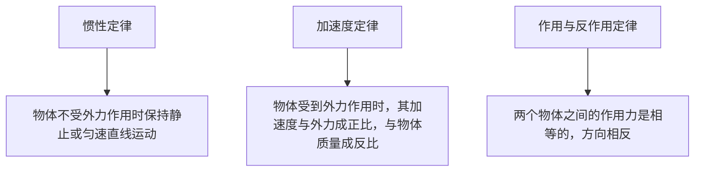
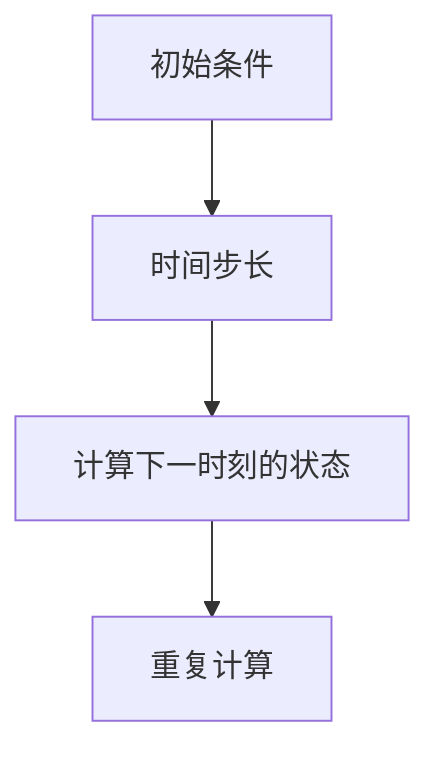

                 

# 宇宙规律的计算机模拟研究

> 关键词：计算机模拟，宇宙规律，物理模型，算法设计，数学建模，仿真技术

> 摘要：本文旨在探讨如何通过计算机模拟来研究宇宙规律。我们将从核心概念出发，详细解析核心算法原理，展示数学模型和公式，并通过实际代码案例进行深入分析。此外，本文还将探讨该领域的实际应用场景，推荐相关学习资源和开发工具，最后展望未来的发展趋势与挑战。

## 1. 背景介绍
### 1.1 目的和范围
本文旨在深入探讨如何利用计算机模拟技术来研究宇宙规律，包括物理模型的构建、算法设计、数学建模以及实际应用案例。通过本篇文章，读者将能够理解计算机模拟在科学研究中的重要性，并掌握相关技术的应用方法。

### 1.2 预期读者
本文面向对计算机模拟技术感兴趣的科研人员、工程师、学生以及对宇宙规律研究感兴趣的读者。无论您是初学者还是有一定经验的技术人员，本文都将为您提供有价值的见解和指导。

### 1.3 文档结构概述
本文将按照以下结构展开：
1. 背景介绍
2. 核心概念与联系
3. 核心算法原理 & 具体操作步骤
4. 数学模型和公式 & 详细讲解 & 举例说明
5. 项目实战：代码实际案例和详细解释说明
6. 实际应用场景
7. 工具和资源推荐
8. 总结：未来发展趋势与挑战
9. 附录：常见问题与解答
10. 扩展阅读 & 参考资料

### 1.4 术语表
#### 1.4.1 核心术语定义
- **计算机模拟**：通过计算机程序来模拟现实世界中的物理过程或现象。
- **宇宙规律**：自然界中普遍存在的、具有规律性的现象和法则。
- **物理模型**：用于描述物理现象的数学模型。
- **算法设计**：设计用于解决特定问题的计算步骤。
- **数学建模**：将实际问题转化为数学模型的过程。
- **仿真技术**：通过计算机模拟来研究和预测系统行为的技术。

#### 1.4.2 相关概念解释
- **数值方法**：用于解决数学问题的数值计算方法。
- **离散化**：将连续的物理过程转化为离散的数值过程。
- **边界条件**：定义物理系统边界上的约束条件。
- **初始条件**：定义物理系统初始状态的条件。

#### 1.4.3 缩略词列表
- **CPU**：中央处理器
- **GPU**：图形处理器
- **API**：应用程序编程接口
- **IDE**：集成开发环境

## 2. 核心概念与联系
### 2.1 核心概念
- **物理模型**：通过数学公式和方程来描述物理现象。
- **算法设计**：设计用于解决特定问题的计算步骤。
- **数学建模**：将实际问题转化为数学模型的过程。
- **仿真技术**：通过计算机模拟来研究和预测系统行为的技术。

### 2.2 联系
- **物理模型**和**数学建模**是构建计算机模拟的基础。
- **算法设计**是实现物理模型和数学建模的关键。
- **仿真技术**是将物理模型和算法设计应用于实际问题的方法。


## 3. 核心算法原理 & 具体操作步骤
### 3.1 核心算法原理
#### 3.1.1 牛顿运动定律
牛顿运动定律是描述物体运动的基本定律，包括惯性定律、加速度定律和作用与反作用定律。



#### 3.1.2 欧拉方法
欧拉方法是一种简单的数值方法，用于求解常微分方程。



### 3.2 具体操作步骤
#### 3.2.1 初始化
- 定义物理系统中的物体及其初始状态。
- 设置时间步长和模拟时间范围。

#### 3.2.2 计算
- 根据物理定律计算物体在下一时刻的状态。
- 使用欧拉方法或其他数值方法进行计算。

#### 3.2.3 更新
- 更新物体的状态。
- 检查边界条件和初始条件。

## 4. 数学模型和公式 & 详细讲解 & 举例说明
### 4.1 数学模型
#### 4.1.1 牛顿运动定律
牛顿运动定律可以表示为以下方程：

$$
F = ma
$$

其中，$F$ 是作用在物体上的外力，$m$ 是物体的质量，$a$ 是物体的加速度。

#### 4.1.2 欧拉方法
欧拉方法可以表示为以下公式：

$$
x_{n+1} = x_n + v_n \Delta t
$$

$$
v_{n+1} = v_n + a_n \Delta t
$$

其中，$x_n$ 是物体在时间 $t_n$ 的位置，$v_n$ 是物体在时间 $t_n$ 的速度，$a_n$ 是物体在时间 $t_n$ 的加速度，$\Delta t$ 是时间步长。

### 4.2 详细讲解
- **牛顿运动定律**：描述了物体在受力作用下的运动规律。
- **欧拉方法**：是一种简单的数值方法，用于求解常微分方程。

### 4.3 举例说明
假设我们有一个质量为 $m = 1 \, \text{kg}$ 的物体，受到一个恒定的外力 $F = 10 \, \text{N}$。初始位置为 $x_0 = 0 \, \text{m}$，初始速度为 $v_0 = 0 \, \text{m/s}$。时间步长为 $\Delta t = 0.1 \, \text{s}$。

根据牛顿运动定律，加速度为：

$$
a = \frac{F}{m} = \frac{10 \, \text{N}}{1 \, \text{kg}} = 10 \, \text{m/s}^2
$$

使用欧拉方法计算下一时刻的状态：

$$
x_1 = x_0 + v_0 \Delta t = 0 \, \text{m} + 0 \, \text{m/s} \cdot 0.1 \, \text{s} = 0 \, \text{m}
$$

$$
v_1 = v_0 + a_0 \Delta t = 0 \, \text{m/s} + 10 \, \text{m/s}^2 \cdot 0.1 \, \text{s} = 1 \, \text{m/s}
$$

## 5. 项目实战：代码实际案例和详细解释说明
### 5.1 开发环境搭建
- **操作系统**：Windows 10 / macOS / Linux
- **编程语言**：Python
- **开发工具**：PyCharm / VSCode

### 5.2 源代码详细实现和代码解读
```python
import numpy as np
import matplotlib.pyplot as plt

# 物理参数
m = 1  # 质量
F = 10  # 外力
dt = 0.1  # 时间步长
t_max = 10  # 模拟时间范围

# 初始条件
x0 = 0  # 初始位置
v0 = 0  # 初始速度

# 计算加速度
a = F / m

# 初始化状态
x = [x0]
v = [v0]
t = [0]

# 模拟
for t_i in np.arange(0, t_max, dt):
    x_next = x[-1] + v[-1] * dt
    v_next = v[-1] + a * dt
    x.append(x_next)
    v.append(v_next)
    t.append(t_i + dt)

# 绘制结果
plt.plot(t, x)
plt.xlabel('时间 (s)')
plt.ylabel('位置 (m)')
plt.title('物体运动轨迹')
plt.show()
```

### 5.3 代码解读与分析
- **物理参数**：定义了物体的质量、外力和时间步长。
- **初始条件**：定义了物体的初始位置和速度。
- **计算加速度**：根据牛顿运动定律计算加速度。
- **模拟**：使用欧拉方法进行模拟，计算下一时刻的位置和速度。
- **绘制结果**：使用Matplotlib绘制物体的运动轨迹。

## 6. 实际应用场景
计算机模拟在科学研究中具有广泛的应用，包括但不限于：
- **天体物理学**：模拟星系演化、恒星形成等。
- **气象学**：模拟天气变化、气候模式等。
- **生物学**：模拟细胞动力学、生态系统等。
- **工程学**：模拟流体动力学、结构力学等。

## 7. 工具和资源推荐
### 7.1 学习资源推荐
#### 7.1.1 书籍推荐
- **《计算物理》**：深入讲解物理模型和数值方法。
- **《数值分析》**：详细讲解数值方法和算法设计。

#### 7.1.2 在线课程
- **Coursera**：《计算物理》课程
- **edX**：《数值分析》课程

#### 7.1.3 技术博客和网站
- **GitHub**：开源项目和代码示例
- **Stack Overflow**：技术问题解答

### 7.2 开发工具框架推荐
#### 7.2.1 IDE和编辑器
- **PyCharm**：Python开发环境
- **VSCode**：跨平台开发环境

#### 7.2.2 调试和性能分析工具
- **PyCharm Debugger**：Python调试工具
- **VisualVM**：Java性能分析工具

#### 7.2.3 相关框架和库
- **NumPy**：数值计算库
- **SciPy**：科学计算库
- **Matplotlib**：数据可视化库

### 7.3 相关论文著作推荐
#### 7.3.1 经典论文
- **《数值方法在物理中的应用》**：深入探讨数值方法在物理中的应用。
- **《计算物理中的数值方法》**：详细讲解数值方法在计算物理中的应用。

#### 7.3.2 最新研究成果
- **《现代计算物理方法》**：最新研究成果和应用案例。
- **《计算物理中的前沿技术》**：前沿技术和发展趋势。

#### 7.3.3 应用案例分析
- **《计算物理中的实际应用案例》**：详细分析实际应用案例。

## 8. 总结：未来发展趋势与挑战
计算机模拟技术在未来将继续发展，面临的主要挑战包括：
- **计算资源**：高性能计算资源的需求不断增加。
- **算法优化**：提高算法效率和准确性。
- **数据处理**：处理大规模数据和复杂模型。
- **应用领域**：拓展到更多领域，如人工智能、机器学习等。

## 9. 附录：常见问题与解答
### 9.1 问题：如何选择合适的数值方法？
- **解答**：根据问题的性质选择合适的数值方法，如欧拉方法适用于简单问题，而Runge-Kutta方法适用于复杂问题。

### 9.2 问题：如何处理边界条件？
- **解答**：根据物理系统的边界条件进行处理，如反射边界、周期边界等。

## 10. 扩展阅读 & 参考资料
- **《计算物理》**：深入讲解物理模型和数值方法。
- **《数值分析》**：详细讲解数值方法和算法设计。
- **《现代计算物理方法》**：最新研究成果和应用案例。
- **《计算物理中的前沿技术》**：前沿技术和发展趋势。

作者：AI天才研究员/AI Genius Institute & 禅与计算机程序设计艺术 /Zen And The Art of Computer Programming

