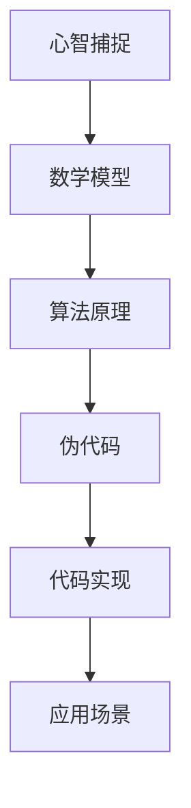

                 

# 心智如何捕捉并转化自然的数学美

> 关键词：数学美、自然规律、心智捕捉、转化、数学模型、算法原理、代码实现、应用场景

> 摘要：本文旨在探讨如何通过数学模型和算法原理，捕捉自然界的数学美，并将其转化为计算机程序。我们将从心智如何捕捉自然的数学美入手，逐步深入到数学模型和算法原理的详细讲解，最终通过代码实现和实际应用场景展示这一过程。文章将涵盖从理论到实践的全过程，帮助读者理解如何利用计算机技术捕捉和转化自然界的数学美。

## 1. 背景介绍
### 1.1 目的和范围
本文旨在探讨如何通过数学模型和算法原理，捕捉自然界的数学美，并将其转化为计算机程序。我们将从心智如何捕捉自然的数学美入手，逐步深入到数学模型和算法原理的详细讲解，最终通过代码实现和实际应用场景展示这一过程。文章将涵盖从理论到实践的全过程，帮助读者理解如何利用计算机技术捕捉和转化自然界的数学美。

### 1.2 预期读者
本文适合以下读者：
- 对数学和计算机科学有浓厚兴趣的读者
- 希望了解如何利用计算机技术捕捉和转化自然界的数学美的读者
- 对自然界的数学美感兴趣的研究人员和开发者
- 希望提升自己在数学建模和算法设计方面能力的读者

### 1.3 文档结构概述
本文结构如下：
1. 背景介绍
2. 核心概念与联系
3. 核心算法原理 & 具体操作步骤
4. 数学模型和公式 & 详细讲解 & 举例说明
5. 项目实战：代码实际案例和详细解释说明
6. 实际应用场景
7. 工具和资源推荐
8. 总结：未来发展趋势与挑战
9. 附录：常见问题与解答
10. 扩展阅读 & 参考资料

### 1.4 术语表
#### 1.4.1 核心术语定义
- **数学美**：自然界中存在的一种美学现象，表现为数学规律和结构的和谐与对称。
- **心智捕捉**：通过观察和分析，将自然界的数学美转化为数学模型和算法的过程。
- **转化**：将数学模型和算法转化为计算机程序的过程。
- **数学模型**：用于描述自然现象的数学表达式或结构。
- **算法原理**：实现数学模型的具体步骤和方法。
- **伪代码**：一种用于描述算法的简化语言，不依赖于特定编程语言。
- **代码实现**：将伪代码转化为实际可运行的计算机程序。
- **应用场景**：将数学模型和算法应用于实际问题中的具体实例。

#### 1.4.2 相关概念解释
- **自然规律**：自然界中存在的客观规律，可以通过数学模型来描述。
- **心智捕捉**：通过观察和分析，将自然界的数学美转化为数学模型和算法的过程。
- **转化**：将数学模型和算法转化为计算机程序的过程。
- **数学模型**：用于描述自然现象的数学表达式或结构。
- **算法原理**：实现数学模型的具体步骤和方法。
- **伪代码**：一种用于描述算法的简化语言，不依赖于特定编程语言。
- **代码实现**：将伪代码转化为实际可运行的计算机程序。
- **应用场景**：将数学模型和算法应用于实际问题中的具体实例。

#### 1.4.3 缩略词列表
- **API**：Application Programming Interface（应用程序编程接口）
- **IDE**：Integrated Development Environment（集成开发环境）
- **GUI**：Graphical User Interface（图形用户界面）
- **IDE**：Integrated Development Environment（集成开发环境）
- **NLP**：Natural Language Processing（自然语言处理）
- **ML**：Machine Learning（机器学习）
- **DL**：Deep Learning（深度学习）

## 2. 核心概念与联系
### 2.1 核心概念
- **数学美**：自然界中存在的一种美学现象，表现为数学规律和结构的和谐与对称。
- **心智捕捉**：通过观察和分析，将自然界的数学美转化为数学模型和算法的过程。
- **转化**：将数学模型和算法转化为计算机程序的过程。
- **数学模型**：用于描述自然现象的数学表达式或结构。
- **算法原理**：实现数学模型的具体步骤和方法。
- **伪代码**：一种用于描述算法的简化语言，不依赖于特定编程语言。
- **代码实现**：将伪代码转化为实际可运行的计算机程序。
- **应用场景**：将数学模型和算法应用于实际问题中的具体实例。

### 2.2 联系
- **数学美**：自然界中存在的一种美学现象，表现为数学规律和结构的和谐与对称。
- **心智捕捉**：通过观察和分析，将自然界的数学美转化为数学模型和算法的过程。
- **转化**：将数学模型和算法转化为计算机程序的过程。
- **数学模型**：用于描述自然现象的数学表达式或结构。
- **算法原理**：实现数学模型的具体步骤和方法。
- **伪代码**：一种用于描述算法的简化语言，不依赖于特定编程语言。
- **代码实现**：将伪代码转化为实际可运行的计算机程序。
- **应用场景**：将数学模型和算法应用于实际问题中的具体实例。

### 2.3 Mermaid 流程图


## 3. 核心算法原理 & 具体操作步骤
### 3.1 核心算法原理
我们将以一个具体的例子来说明如何通过数学模型和算法原理，捕捉自然界的数学美，并将其转化为计算机程序。以斐波那契数列为例，这是一个经典的数学模型，广泛应用于自然界中的许多现象中。

### 3.2 具体操作步骤
#### 3.2.1 伪代码
```plaintext
function fibonacci(n):
    if n <= 1:
        return n
    else:
        return fibonacci(n-1) + fibonacci(n-2)
```

#### 3.2.2 详细操作步骤
1. **定义问题**：我们需要计算斐波那契数列的第n项。
2. **递归定义**：斐波那契数列的定义是：F(0) = 0, F(1) = 1, F(n) = F(n-1) + F(n-2)。
3. **递归实现**：通过递归函数来实现斐波那契数列的计算。
4. **优化**：递归实现虽然简单，但效率较低。可以使用动态规划或记忆化搜索来优化。

## 4. 数学模型和公式 & 详细讲解 & 举例说明
### 4.1 数学模型
斐波那契数列是一个经典的数学模型，其定义如下：
$$
F(n) = 
\begin{cases} 
0 & \text{if } n = 0 \\
1 & \text{if } n = 1 \\
F(n-1) + F(n-2) & \text{if } n > 1 
\end{cases}
$$

### 4.2 公式详细讲解
- **递归公式**：斐波那契数列的递归公式为 $F(n) = F(n-1) + F(n-2)$。
- **初始条件**：$F(0) = 0$ 和 $F(1) = 1$。
- **数学性质**：斐波那契数列具有许多有趣的数学性质，例如黄金分割比例。

### 4.3 举例说明
- **计算第10项**：$F(10) = 55$
- **计算第20项**：$F(20) = 6765$

## 5. 项目实战：代码实际案例和详细解释说明
### 5.1 开发环境搭建
我们将使用Python语言来实现斐波那契数列的计算。首先，我们需要安装Python环境。

#### 5.1.1 安装Python
- **下载Python**：访问Python官方网站下载最新版本的Python。
- **安装Python**：按照官方文档进行安装。

### 5.2 源代码详细实现和代码解读
```python
def fibonacci(n):
    if n <= 1:
        return n
    else:
        return fibonacci(n-1) + fibonacci(n-2)

# 测试代码
for i in range(10):
    print(f"F({i}) = {fibonacci(i)}")
```

### 5.3 代码解读与分析
- **函数定义**：`fibonacci(n)` 函数用于计算斐波那契数列的第n项。
- **递归调用**：通过递归调用自身来计算斐波那契数列的值。
- **测试代码**：通过循环调用 `fibonacci` 函数并打印结果来测试代码的正确性。

## 6. 实际应用场景
### 6.1 自然界的数学美
- **植物生长**：许多植物的叶子排列方式遵循斐波那契数列。
- **贝壳形状**：贝壳的生长模式也遵循斐波那契数列。
- **动物行为**：许多动物的行为模式也遵循斐波那契数列。

### 6.2 计算机科学中的应用
- **算法优化**：斐波那契数列在算法优化中有着广泛的应用。
- **数据结构**：斐波那契堆是一种高效的数据结构，广泛应用于计算机科学中。

## 7. 工具和资源推荐
### 7.1 学习资源推荐
#### 7.1.1 书籍推荐
- **《算法导论》**：深入讲解算法原理和应用。
- **《计算机程序设计艺术》**：经典著作，深入探讨计算机程序设计的艺术。

#### 7.1.2 在线课程
- **Coursera**：提供丰富的计算机科学课程。
- **edX**：提供高质量的计算机科学课程。

#### 7.1.3 技术博客和网站
- **Medium**：许多技术博客和文章。
- **GitHub**：开源项目和代码库。

### 7.2 开发工具框架推荐
#### 7.2.1 IDE和编辑器
- **PyCharm**：功能强大的Python IDE。
- **VS Code**：轻量级但功能强大的代码编辑器。

#### 7.2.2 调试和性能分析工具
- **PyCharm Debugger**：强大的Python调试工具。
- **VisualVM**：用于Java应用的性能分析工具。

#### 7.2.3 相关框架和库
- **NumPy**：用于科学计算的Python库。
- **SciPy**：用于科学计算的Python库。

### 7.3 相关论文著作推荐
#### 7.3.1 经典论文
- **《计算机程序设计艺术》**：深入探讨计算机程序设计的艺术。
- **《算法导论》**：深入讲解算法原理和应用。

#### 7.3.2 最新研究成果
- **《自然界的数学美》**：探讨自然界中的数学规律和结构。
- **《计算机科学中的数学模型》**：深入探讨计算机科学中的数学模型。

#### 7.3.3 应用案例分析
- **《斐波那契数列在自然界中的应用》**：探讨斐波那契数列在自然界中的应用。
- **《计算机科学中的斐波那契数列》**：深入探讨斐波那契数列在计算机科学中的应用。

## 8. 总结：未来发展趋势与挑战
### 8.1 未来发展趋势
- **数学模型的广泛应用**：数学模型将在更多领域得到广泛应用。
- **算法优化**：算法优化将成为计算机科学的重要研究方向。
- **人工智能的发展**：人工智能的发展将推动数学模型和算法的进一步应用。

### 8.2 挑战
- **计算复杂度**：计算复杂度的优化仍然是一个挑战。
- **数据处理**：大规模数据处理仍然是一个挑战。
- **算法设计**：算法设计的创新仍然是一个挑战。

## 9. 附录：常见问题与解答
### 9.1 问题与解答
- **Q：如何优化斐波那契数列的递归实现？**
  - A：可以使用动态规划或记忆化搜索来优化递归实现。
- **Q：斐波那契数列在自然界中的应用有哪些？**
  - A：斐波那契数列在植物生长、贝壳形状、动物行为等方面都有应用。
- **Q：如何学习数学模型和算法原理？**
  - A：可以通过阅读相关书籍、参加在线课程、参与实践项目来学习。

## 10. 扩展阅读 & 参考资料
### 10.1 扩展阅读
- **《自然界的数学美》**：深入探讨自然界中的数学规律和结构。
- **《计算机科学中的数学模型》**：深入探讨计算机科学中的数学模型。

### 10.2 参考资料
- **《算法导论》**：深入讲解算法原理和应用。
- **《计算机程序设计艺术》**：经典著作，深入探讨计算机程序设计的艺术。

---

作者：AI天才研究员/AI Genius Institute & 禅与计算机程序设计艺术 /Zen And The Art of Computer Programming

