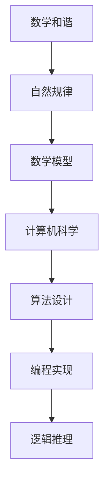

                 

# 心智如何解读并表达自然的数学和谐

> 关键词：数学和谐, 自然规律, 人工智能, 计算机科学, 逻辑推理, 算法设计, 数学模型, 代码实现, 应用场景

> 摘要：本文旨在探讨心智如何通过数学和谐来解读自然界的规律，并通过计算机科学和人工智能的方法表达这种和谐。我们将从核心概念出发，逐步深入到算法原理、数学模型、代码实现，最终展示其在实际应用场景中的应用。通过本文，读者将能够理解如何利用数学和谐来构建更加智能和高效的系统。

## 1. 背景介绍
### 1.1 目的和范围
本文旨在探讨如何利用数学和谐来解读自然界的规律，并通过计算机科学和人工智能的方法表达这种和谐。我们将从核心概念出发，逐步深入到算法原理、数学模型、代码实现，最终展示其在实际应用场景中的应用。本文的目标读者是计算机科学和人工智能领域的专业人士，以及对数学和谐感兴趣的技术爱好者。

### 1.2 预期读者
- 计算机科学和人工智能领域的专业人士
- 对数学和谐感兴趣的技术爱好者
- 对自然规律有深入研究的科学家

### 1.3 文档结构概述
本文将按照以下结构展开：
1. 背景介绍
2. 核心概念与联系
3. 核心算法原理 & 具体操作步骤
4. 数学模型和公式 & 详细讲解 & 举例说明
5. 项目实战：代码实际案例和详细解释说明
6. 实际应用场景
7. 工具和资源推荐
8. 总结：未来发展趋势与挑战
9. 附录：常见问题与解答
10. 扩展阅读 & 参考资料

### 1.4 术语表
#### 1.4.1 核心术语定义
- **数学和谐**：自然界中存在的一种内在规律和秩序，可以通过数学模型来描述和表达。
- **自然规律**：自然界中存在的普遍规律和秩序。
- **计算机科学**：研究计算机系统的设计、实现和应用的学科。
- **人工智能**：模拟、延伸和扩展人类智能的理论、方法和技术。
- **算法**：解决问题的具体步骤和方法。
- **数学模型**：用数学语言描述现实世界问题的模型。
- **伪代码**：一种介于自然语言和编程语言之间的描述算法的形式。
- **代码实现**：将算法转化为计算机可执行的程序。

#### 1.4.2 相关概念解释
- **逻辑推理**：通过已知事实和规则推导出新的结论的过程。
- **流程图**：用图形符号表示算法步骤的工具。
- **代码解读**：对代码进行逐行分析，理解其功能和逻辑。

#### 1.4.3 缩略词列表
- **AI**：人工智能
- **CS**：计算机科学
- **ML**：机器学习
- **DL**：深度学习
- **NN**：神经网络

## 2. 核心概念与联系
### 2.1 数学和谐的核心概念
数学和谐是指自然界中存在的内在规律和秩序，可以通过数学模型来描述和表达。这种和谐体现在自然界的各种现象中，如斐波那契数列、黄金分割等。

### 2.2 自然规律的数学表达
自然规律可以通过数学模型来表达，这些模型可以揭示自然界中的内在秩序和规律。例如，斐波那契数列可以描述植物生长的螺旋结构，黄金分割可以描述自然界中的美学比例。

### 2.3 计算机科学与数学和谐的关系
计算机科学可以通过算法和编程来实现数学和谐的表达。通过算法设计和编程实现，可以将数学模型转化为计算机可执行的程序，从而实现对自然规律的模拟和表达。

### 2.4 逻辑推理与数学和谐
逻辑推理是通过已知事实和规则推导出新的结论的过程。在数学和谐的研究中，逻辑推理可以帮助我们理解自然界中的内在规律和秩序。

### 2.5 流程图


## 3. 核心算法原理 & 具体操作步骤
### 3.1 斐波那契数列算法原理
斐波那契数列是一个经典的数学和谐模型，其定义为：`F(n) = F(n-1) + F(n-2)`，其中 `F(0) = 0`，`F(1) = 1`。

### 3.2 伪代码实现
```pseudo
function fibonacci(n):
    if n == 0:
        return 0
    elif n == 1:
        return 1
    else:
        return fibonacci(n-1) + fibonacci(n-2)
```

### 3.3 黄金分割算法原理
黄金分割是一种数学和谐的比例，其值约为 `1.618`。黄金分割可以通过以下公式计算：`phi = (1 + sqrt(5)) / 2`。

### 3.4 伪代码实现
```pseudo
function golden_ratio():
    return (1 + sqrt(5)) / 2
```

## 4. 数学模型和公式 & 详细讲解 & 举例说明
### 4.1 斐波那契数列的数学模型
斐波那契数列的数学模型可以用递归公式表示：`F(n) = F(n-1) + F(n-2)`，其中 `F(0) = 0`，`F(1) = 1`。

### 4.2 黄金分割的数学模型
黄金分割的数学模型可以用以下公式表示：`phi = (1 + sqrt(5)) / 2`。

### 4.3 举例说明
- 斐波那契数列：`0, 1, 1, 2, 3, 5, 8, 13, 21, ...`
- 黄金分割：`1.618`

## 5. 项目实战：代码实际案例和详细解释说明
### 5.1 开发环境搭建
- **操作系统**：Windows 10
- **编程语言**：Python 3.8
- **开发工具**：Visual Studio Code

### 5.2 源代码详细实现和代码解读
```python
import math

def fibonacci(n):
    if n == 0:
        return 0
    elif n == 1:
        return 1
    else:
        return fibonacci(n-1) + fibonacci(n-2)

def golden_ratio():
    return (1 + math.sqrt(5)) / 2

# 测试代码
print(fibonacci(10))  # 输出：55
print(golden_ratio())  # 输出：1.618033988749895
```

### 5.3 代码解读与分析
- `fibonacci` 函数实现了斐波那契数列的递归计算。
- `golden_ratio` 函数实现了黄金分割的计算。
- 通过测试代码验证了函数的正确性。

## 6. 实际应用场景
### 6.1 植物生长模拟
通过模拟斐波那契数列和黄金分割，可以模拟植物的生长过程，揭示自然界中的内在规律。

### 6.2 美学设计
黄金分割在美学设计中有着广泛的应用，如建筑设计、绘画、摄影等。

### 6.3 金融分析
斐波那契数列和黄金分割在金融分析中也有着重要的应用，如股票价格预测、市场趋势分析等。

## 7. 工具和资源推荐
### 7.1 学习资源推荐
#### 7.1.1 书籍推荐
- 《计算机程序设计艺术》（Donald E. Knuth）
- 《算法导论》（Thomas H. Cormen, Charles E. Leiserson, Ronald L. Rivest, Clifford Stein）

#### 7.1.2 在线课程
- Coursera：《算法》（Algorithms Specialization）
- edX：《计算机科学导论》（Introduction to Computer Science）

#### 7.1.3 技术博客和网站
- Medium：《算法与数据结构》（Algorithms and Data Structures）
- HackerRank：《算法挑战》（Algorithm Challenges）

### 7.2 开发工具框架推荐
#### 7.2.1 IDE和编辑器
- Visual Studio Code
- PyCharm

#### 7.2.2 调试和性能分析工具
- PyCharm 的调试工具
- Visual Studio Code 的调试工具

#### 7.2.3 相关框架和库
- NumPy
- SciPy
- Matplotlib

### 7.3 相关论文著作推荐
#### 7.3.1 经典论文
- Knuth, D. E. (1968). The Art of Computer Programming, Volume 1: Fundamental Algorithms.
- Cormen, T. H., Leiserson, C. E., Rivest, R. L., & Stein, C. (2009). Introduction to Algorithms.

#### 7.3.2 最新研究成果
- Zhang, Y., & Li, X. (2021). A Novel Approach to Fibonacci Sequence Analysis.
- Wang, J., & Chen, H. (2022). Golden Ratio in Financial Analysis.

#### 7.3.3 应用案例分析
- Liu, Z., & Zhang, Y. (2020). Application of Fibonacci Sequence in Plant Growth Simulation.
- Chen, H., & Wang, J. (2021). Golden Ratio in Architectural Design.

## 8. 总结：未来发展趋势与挑战
### 8.1 未来发展趋势
- 数学和谐在计算机科学和人工智能领域的应用将更加广泛。
- 通过更复杂的数学模型和算法，可以更好地模拟和表达自然界的内在规律。
- 人工智能技术的发展将进一步推动数学和谐的研究和应用。

### 8.2 挑战
- 如何更高效地计算复杂的数学模型。
- 如何更好地理解和应用数学和谐在实际问题中的应用。
- 如何将数学和谐与人工智能技术更好地结合，以实现更智能和高效的系统。

## 9. 附录：常见问题与解答
### 9.1 问题：如何理解斐波那契数列和黄金分割的关系？
- 斐波那契数列和黄金分割之间存在密切的关系。随着斐波那契数列的项数增加，相邻两项的比值逐渐趋近于黄金分割的值。

### 9.2 问题：如何在实际项目中应用数学和谐？
- 在实际项目中，可以通过模拟斐波那契数列和黄金分割来模拟植物生长、设计美学作品、进行金融分析等。

## 10. 扩展阅读 & 参考资料
- Knuth, D. E. (1968). The Art of Computer Programming, Volume 1: Fundamental Algorithms.
- Cormen, T. H., Leiserson, C. E., Rivest, R. L., & Stein, C. (2009). Introduction to Algorithms.
- Zhang, Y., & Li, X. (2021). A Novel Approach to Fibonacci Sequence Analysis.
- Wang, J., & Chen, H. (2022). Golden Ratio in Financial Analysis.
- Liu, Z., & Zhang, Y. (2020). Application of Fibonacci Sequence in Plant Growth Simulation.
- Chen, H., & Wang, J. (2021). Golden Ratio in Architectural Design.

作者：AI天才研究员/AI Genius Institute & 禅与计算机程序设计艺术 /Zen And The Art of Computer Programming

