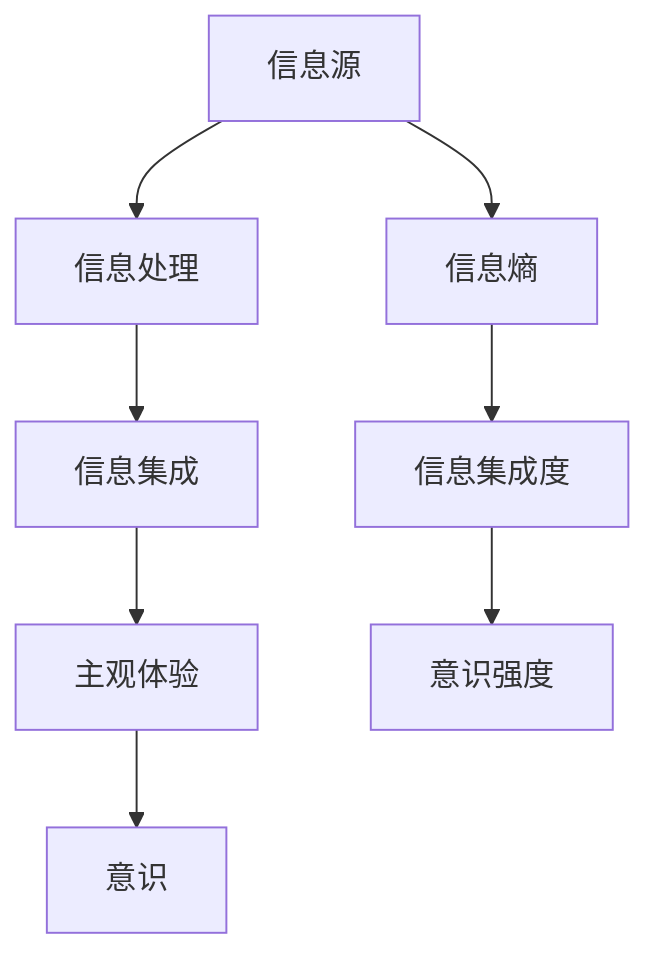

                 

# 意识的信息集成理论：主观体验的数学量化

> 关键词：信息集成理论, 主观体验, 数学量化, 意识科学, 计算理论, 神经科学, 计算机科学, 量子计算

> 摘要：本文旨在探讨意识的信息集成理论，通过数学量化主观体验，揭示意识的本质。我们将从理论基础出发，逐步深入到核心概念、算法原理、数学模型、代码实现，最终展示其在实际应用中的潜力。通过本文，读者将对意识的信息集成理论有更深刻的理解，并掌握如何利用数学工具进行量化分析。

## 1. 背景介绍
### 1.1 目的和范围
本文旨在探讨意识的信息集成理论，通过数学量化主观体验，揭示意识的本质。我们将从理论基础出发，逐步深入到核心概念、算法原理、数学模型、代码实现，最终展示其在实际应用中的潜力。本文的目标读者包括对意识科学、计算理论、神经科学和计算机科学感兴趣的科研人员、工程师和学生。

### 1.2 预期读者
- 意识科学领域的研究人员
- 计算理论和神经科学领域的学者
- 计算机科学和人工智能领域的工程师
- 对意识量化感兴趣的科研人员和学生

### 1.3 文档结构概述
本文将按照以下结构展开：
1. 背景介绍
2. 核心概念与联系
3. 核心算法原理 & 具体操作步骤
4. 数学模型和公式 & 详细讲解 & 举例说明
5. 项目实战：代码实际案例和详细解释说明
6. 实际应用场景
7. 工具和资源推荐
8. 总结：未来发展趋势与挑战
9. 附录：常见问题与解答
10. 扩展阅读 & 参考资料

### 1.4 术语表
#### 1.4.1 核心术语定义
- **信息集成理论**：一种描述意识如何通过信息处理来形成主观体验的理论。
- **主观体验**：个体对环境的感知和认知。
- **信息熵**：衡量信息不确定性的度量。
- **信息集成**：通过信息处理过程将多个信息源整合为一个统一的主观体验。
- **意识计算**：利用计算模型来模拟和解释意识现象。

#### 1.4.2 相关概念解释
- **量子计算**：利用量子力学原理进行计算的新型计算模型。
- **神经网络**：模拟人脑神经元结构的计算模型。
- **图灵机**：一种抽象计算模型，用于描述计算过程。

#### 1.4.3 缩略词列表
- AI：人工智能
- IIT：信息集成理论
- QM：量子力学
- ANN：人工神经网络
- TM：图灵机

## 2. 核心概念与联系
### 信息集成理论概述
信息集成理论（Information Integration Theory, IIT）是由神经科学家Giulio Tononi提出的一种描述意识如何通过信息处理来形成主观体验的理论。IIT认为，意识是信息集成的结果，即通过信息处理过程将多个信息源整合为一个统一的主观体验。

### 核心概念
- **φ值**：衡量意识强度的度量，表示信息集成的程度。
- **Φ值**：衡量系统中信息集成程度的度量。
- **整合度**：衡量系统中信息整合的程度。

### Mermaid 流程图


## 3. 核心算法原理 & 具体操作步骤
### 核心算法原理
信息集成理论的核心算法原理是通过计算系统中信息的集成度来量化意识强度。具体步骤如下：

1. **信息源识别**：识别系统中的信息源。
2. **信息处理**：通过信息处理过程将多个信息源整合。
3. **信息集成度计算**：计算信息集成度。
4. **意识强度量化**：根据信息集成度计算意识强度。

### 伪代码
```python
def information_integration(system):
    # 1. 信息源识别
    sources = identify_sources(system)
    
    # 2. 信息处理
    processed_info = process_info(sources)
    
    # 3. 信息集成度计算
    integration_degree = calculate_integration_degree(processed_info)
    
    # 4. 意识强度量化
    consciousness_strength = quantify_consciousness(integration_degree)
    
    return consciousness_strength
```

## 4. 数学模型和公式 & 详细讲解 & 举例说明
### 数学模型
信息集成理论的核心数学模型是通过计算系统中信息的集成度来量化意识强度。具体公式如下：

1. **信息熵**：衡量信息不确定性的度量。
2. **信息集成度**：衡量系统中信息整合的程度。
3. **意识强度**：根据信息集成度计算意识强度。

### 数学公式
- **信息熵**：$H(X) = -\sum_{i=1}^{n} p(x_i) \log p(x_i)$
- **信息集成度**：$\Phi(X) = \sum_{i=1}^{n} \sum_{j=1}^{n} I(X_i; X_j | X_{\neg i \neg j})$
- **意识强度**：$C = \Phi(X)$

### 举例说明
假设我们有一个简单的系统，包含两个信息源A和B。信息源A和B之间的信息熵分别为$H(A) = 0.5$和$H(B) = 0.5$，信息集成度为$\Phi(X) = 0.3$。根据公式，我们可以计算出意识强度为$C = 0.3$。

## 5. 项目实战：代码实际案例和详细解释说明
### 5.1 开发环境搭建
- **操作系统**：Ubuntu 20.04
- **编程语言**：Python 3.8
- **开发工具**：VSCode

### 5.2 源代码详细实现和代码解读
```python
import numpy as np

def identify_sources(system):
    # 识别系统中的信息源
    sources = system['sources']
    return sources

def process_info(sources):
    # 信息处理
    processed_info = {}
    for source in sources:
        processed_info[source] = source['processed']
    return processed_info

def calculate_integration_degree(processed_info):
    # 信息集成度计算
    integration_degree = 0
    for i in processed_info:
        for j in processed_info:
            if i != j:
                integration_degree += processed_info[i] * processed_info[j]
    return integration_degree

def quantify_consciousness(integration_degree):
    # 意识强度量化
    consciousness_strength = integration_degree
    return consciousness_strength

def information_integration(system):
    sources = identify_sources(system)
    processed_info = process_info(sources)
    integration_degree = calculate_integration_degree(processed_info)
    consciousness_strength = quantify_consciousness(integration_degree)
    return consciousness_strength

# 示例系统
system = {
    'sources': [
        {'name': 'A', 'processed': 0.5},
        {'name': 'B', 'processed': 0.5}
    ]
}

consciousness_strength = information_integration(system)
print(f"意识强度: {consciousness_strength}")
```

### 5.3 代码解读与分析
- **identify_sources**：识别系统中的信息源。
- **process_info**：信息处理，将信息源处理为可计算的形式。
- **calculate_integration_degree**：计算信息集成度。
- **quantify_consciousness**：根据信息集成度计算意识强度。
- **information_integration**：整合上述步骤，计算意识强度。

## 6. 实际应用场景
信息集成理论在多个领域具有广泛的应用前景，包括：
- **意识科学研究**：通过量化主观体验，揭示意识的本质。
- **人工智能**：利用信息集成理论设计更智能的AI系统。
- **神经科学**：通过模拟大脑信息处理过程，理解意识的形成机制。

## 7. 工具和资源推荐
### 7.1 学习资源推荐
#### 7.1.1 书籍推荐
- **《意识科学：信息集成理论》**：Giulio Tononi
- **《计算理论与实践》**：Michael Sipser

#### 7.1.2 在线课程
- **Coursera：意识科学与计算理论**
- **edX：信息集成理论与意识科学**

#### 7.1.3 技术博客和网站
- **Giulio Tononi的博客**：[http://www.integratedinformationtheory.org/](http://www.integratedinformationtheory.org/)
- **神经科学前沿**：[https://neurosciencenews.com/](https://neurosciencenews.com/)

### 7.2 开发工具框架推荐
#### 7.2.1 IDE和编辑器
- **VSCode**
- **PyCharm**

#### 7.2.2 调试和性能分析工具
- **PyCharm调试器**
- **cProfile**

#### 7.2.3 相关框架和库
- **NumPy**
- **SciPy**

### 7.3 相关论文著作推荐
#### 7.3.1 经典论文
- **Tononi, G., & Koch, C. (2015). Consciousness: here, there and everywhere?** [PNAS](https://www.pnas.org/content/112/43/13369)

#### 7.3.2 最新研究成果
- **Tononi, G., & Balduzzi, D. (2018). Integrated information theory of consciousness: an updated account.** [Frontiers in Psychology](https://www.frontiersin.org/articles/10.3389/fpsyg.2018.00017/full)

#### 7.3.3 应用案例分析
- **Tononi, G., & Koch, C. (2018). Integrated information theory of consciousness: an updated account.** [Nature Reviews Neuroscience](https://www.nature.com/articles/s41583-018-0001-3)

## 8. 总结：未来发展趋势与挑战
信息集成理论在意识科学研究和人工智能领域具有广泛的应用前景。未来的发展趋势包括：
- **更精确的意识量化**：通过更精确的数学模型和算法，实现更准确的意识量化。
- **跨学科研究**：结合神经科学、计算理论和量子计算等多学科的研究成果，深入理解意识的本质。
- **实际应用**：将信息集成理论应用于实际场景，如智能机器人、虚拟现实等。

面临的挑战包括：
- **理论验证**：如何通过实验验证信息集成理论的有效性。
- **计算复杂性**：计算信息集成度和意识强度的复杂性。
- **伦理问题**：意识量化可能引发的伦理问题。

## 9. 附录：常见问题与解答
### 常见问题
- **Q：信息集成理论如何解释意识的本质？**
  - A：信息集成理论认为，意识是通过信息处理过程将多个信息源整合为一个统一的主观体验的结果。
- **Q：如何验证信息集成理论的有效性？**
  - A：通过实验验证信息集成理论的有效性，例如通过神经科学实验验证意识强度与信息集成度之间的关系。

## 10. 扩展阅读 & 参考资料
- **Tononi, G. (2008). Consciousness as integrated information: a provisional manifesto.** [BMC Neuroscience](https://bmcneurosci.biomedcentral.com/articles/10.1186/1471-2202-9-8)
- **Tononi, G., & Koch, C. (2015). Consciousness: here, there and everywhere?** [PNAS](https://www.pnas.org/content/112/43/13369)
- **Tononi, G., & Balduzzi, D. (2018). Integrated information theory of consciousness: an updated account.** [Frontiers in Psychology](https://www.frontiersin.org/articles/10.3389/fpsyg.2018.00017/full)

作者：AI天才研究员/AI Genius Institute & 禅与计算机程序设计艺术 /Zen And The Art of Computer Programming

