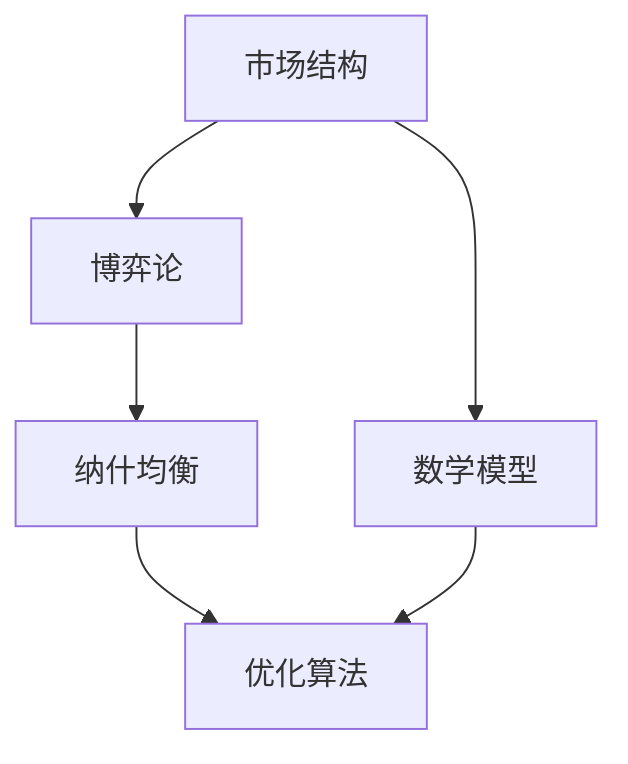

                 

# 数学与产业组织：市场结构的数学分析

> 关键词：市场结构、博弈论、优化算法、数学建模、产业组织理论

> 摘要：本文旨在通过数学工具和方法，深入探讨市场结构的复杂性及其对产业组织的影响。我们将从市场结构的基本概念出发，逐步构建数学模型，分析市场中的博弈行为，并通过实际案例展示如何利用优化算法解决实际问题。文章将涵盖从理论到实践的全过程，帮助读者理解市场结构的数学分析方法及其应用价值。

## 1. 背景介绍
### 1.1 目的和范围
本文旨在通过数学工具和方法，深入探讨市场结构的复杂性及其对产业组织的影响。我们将从市场结构的基本概念出发，逐步构建数学模型，分析市场中的博弈行为，并通过实际案例展示如何利用优化算法解决实际问题。文章将涵盖从理论到实践的全过程，帮助读者理解市场结构的数学分析方法及其应用价值。

### 1.2 预期读者
本文适合以下读者群体：
- 对市场结构和产业组织理论感兴趣的学者和研究人员
- 从事经济、管理、计算机科学等相关领域的专业人士
- 对博弈论和优化算法感兴趣的工程师和开发者
- 希望了解如何将数学方法应用于实际问题的实践者

### 1.3 文档结构概述
本文结构如下：
1. 背景介绍
2. 核心概念与联系
3. 核心算法原理 & 具体操作步骤
4. 数学模型和公式 & 详细讲解 & 举例说明
5. 项目实战：代码实际案例和详细解释说明
6. 实际应用场景
7. 工具和资源推荐
8. 总结：未来发展趋势与挑战
9. 附录：常见问题与解答
10. 扩展阅读 & 参考资料

### 1.4 术语表
#### 1.4.1 核心术语定义
- **市场结构**：指市场中企业数量、规模、竞争程度等因素的综合表现。
- **博弈论**：研究决策者在相互作用中如何选择策略以实现自身利益最大化的一门学科。
- **优化算法**：用于寻找最优解的一类算法，常用于解决具有多个变量和约束条件的问题。
- **纳什均衡**：在博弈论中，所有参与者都选择最优策略，且任何单个参与者改变策略都无法获得更好结果的状态。
- **产业组织理论**：研究产业内部结构、市场行为和政策影响的经济学分支。

#### 1.4.2 相关概念解释
- **完全竞争市场**：所有企业都是价格接受者，市场信息完全透明，不存在进入壁垒。
- **垄断市场**：只有一个企业控制整个市场，其他企业无法进入。
- **寡头市场**：少数几个企业控制市场，企业之间存在相互影响。
- **垄断竞争市场**：许多企业生产略有差异的产品，企业之间既有竞争又有差异。

#### 1.4.3 缩略词列表
- **Nash**：纳什均衡
- **Cournot**：古诺模型
- **Bertrand**：伯特兰德模型
- **Stackelberg**：斯塔克尔伯格模型

## 2. 核心概念与联系
### 2.1 市场结构的基本概念
市场结构是指市场中企业数量、规模、竞争程度等因素的综合表现。常见的市场结构类型包括完全竞争市场、垄断市场、寡头市场和垄断竞争市场。

### 2.2 博弈论的基本概念
博弈论是研究决策者在相互作用中如何选择策略以实现自身利益最大化的一门学科。博弈论的核心概念包括参与者、策略、支付函数和纳什均衡。

### 2.3 优化算法的基本概念
优化算法用于寻找最优解的一类算法，常用于解决具有多个变量和约束条件的问题。常见的优化算法包括梯度下降法、遗传算法、模拟退火算法等。

### 2.4 数学模型的基本概念
数学模型是通过数学语言描述现实世界问题的一种方法。在市场结构分析中，数学模型可以帮助我们理解和预测市场行为。

### 2.5 核心概念之间的联系
市场结构、博弈论和优化算法之间存在密切联系。市场结构决定了博弈论中的参与者和策略，博弈论中的纳什均衡可以通过优化算法来求解。数学模型是将这些概念结合起来，进行定量分析的基础。



## 3. 核心算法原理 & 具体操作步骤
### 3.1 梯度下降法
梯度下降法是一种常用的优化算法，用于寻找函数的最小值。其基本原理是沿着函数梯度的反方向进行迭代，逐步逼近最小值。

#### 伪代码
```python
def gradient_descent(objective_function, gradient_function, initial_guess, learning_rate, num_iterations):
    x = initial_guess
    for i in range(num_iterations):
        gradient = gradient_function(x)
        x = x - learning_rate * gradient
    return x
```

### 3.2 遗传算法
遗传算法是一种模拟自然选择和遗传机制的优化算法。其基本原理是通过选择、交叉和变异操作，逐步优化种群中的个体。

#### 伪代码
```python
def genetic_algorithm(objective_function, population_size, num_generations, mutation_rate):
    population = initialize_population(population_size)
    for generation in range(num_generations):
        fitness_scores = evaluate_fitness(population, objective_function)
        selected_population = select_parents(fitness_scores, population_size)
        offspring_population = crossover(selected_population)
        mutated_population = mutate(offspring_population, mutation_rate)
        population = mutated_population
    best_solution = find_best_solution(population)
    return best_solution
```

## 4. 数学模型和公式 & 详细讲解 & 举例说明
### 4.1 古诺模型
古诺模型是寡头市场中的一种典型模型，描述了两个寡头企业在产量竞争中的行为。

#### 数学模型
设两个寡头企业的成本函数分别为 \(C_1(q_1)\) 和 \(C_2(q_2)\)，市场需求函数为 \(P(Q) = a - bQ\)，其中 \(Q = q_1 + q_2\)。企业的利润函数为：
$$
\pi_i(q_i) = P(Q)q_i - C_i(q_i)
$$
通过求解纳什均衡，可以得到每个企业的最优产量。

#### 数学公式
$$
\pi_1(q_1) = (a - b(q_1 + q_2))q_1 - C_1(q_1)
$$
$$
\pi_2(q_2) = (a - b(q_1 + q_2))q_2 - C_2(q_2)
$$

### 4.2 伯特兰德模型
伯特兰德模型是寡头市场中另一种典型模型，描述了两个寡头企业在价格竞争中的行为。

#### 数学模型
设两个寡头企业的成本函数分别为 \(C_1(p_1)\) 和 \(C_2(p_2)\)，市场需求函数为 \(Q = d(p_1, p_2)\)。企业的利润函数为：
$$
\pi_i(p_i) = p_iQ_i - C_i(p_i)
$$
通过求解纳什均衡，可以得到每个企业的最优价格。

#### 数学公式
$$
\pi_1(p_1) = p_1Q_1 - C_1(p_1)
$$
$$
\pi_2(p_2) = p_2Q_2 - C_2(p_2)
$$

### 4.3 市场结构的数学模型
市场结构的数学模型可以通过构建博弈论模型来描述。例如，对于寡头市场，可以使用古诺模型或伯特兰德模型来描述企业的行为。

#### 数学公式
$$
\pi_i(q_i) = (a - b(q_1 + q_2))q_i - C_i(q_i)
$$
$$
\pi_i(p_i) = p_iQ_i - C_i(p_i)
$$

## 5. 项目实战：代码实际案例和详细解释说明
### 5.1 开发环境搭建
为了实现上述模型，我们需要搭建一个Python开发环境。推荐使用Anaconda进行环境搭建，安装必要的库，如NumPy、SciPy、Matplotlib等。

### 5.2 源代码详细实现和代码解读
#### 5.2.1 古诺模型实现
```python
import numpy as np

def cournot_model(a, b, c1, c2, q1, q2):
    p1 = a - b * (q1 + q2)
    p2 = a - b * (q1 + q2)
    profit1 = p1 * q1 - c1 * q1
    profit2 = p2 * q2 - c2 * q2
    return profit1, profit2

# 参数设置
a = 100
b = 1
c1 = 10
c2 = 10

# 初始猜测
q1 = 10
q2 = 10

# 计算利润
profit1, profit2 = cournot_model(a, b, c1, c2, q1, q2)
print(f"企业1的利润: {profit1}")
print(f"企业2的利润: {profit2}")
```

#### 5.2.2 伯特兰德模型实现
```python
def bertrand_model(a, b, c1, c2, p1, p2):
    if p1 < p2:
        q1 = a - b * p1
        q2 = 0
    elif p2 < p1:
        q2 = a - b * p2
        q1 = 0
    else:
        q1 = (a - c1) / (2 * b)
        q2 = (a - c2) / (2 * b)
    profit1 = p1 * q1 - c1 * q1
    profit2 = p2 * q2 - c2 * q2
    return profit1, profit2

# 参数设置
a = 100
b = 1
c1 = 10
c2 = 10

# 初始猜测
p1 = 50
p2 = 50

# 计算利润
profit1, profit2 = bertrand_model(a, b, c1, c2, p1, p2)
print(f"企业1的利润: {profit1}")
print(f"企业2的利润: {profit2}")
```

### 5.3 代码解读与分析
上述代码实现了古诺模型和伯特兰德模型的基本功能。通过设置参数和初始猜测，可以计算出每个企业的利润。这些模型可以帮助我们理解企业在不同市场结构下的行为。

## 6. 实际应用场景
### 6.1 价格竞争分析
通过古诺模型和伯特兰德模型，我们可以分析企业在价格竞争中的行为。例如，对于两个寡头企业，可以通过模型预测它们在不同价格下的市场份额和利润。

### 6.2 产量竞争分析
通过古诺模型，我们可以分析企业在产量竞争中的行为。例如，对于两个寡头企业，可以通过模型预测它们在不同产量下的市场份额和利润。

### 6.3 市场结构优化
通过优化算法，我们可以找到企业在不同市场结构下的最优策略。例如，对于两个寡头企业，可以通过梯度下降法或遗传算法找到它们在价格竞争和产量竞争中的最优策略。

## 7. 工具和资源推荐
### 7.1 学习资源推荐
#### 7.1.1 书籍推荐
- **《博弈论与经济行为》**：冯·诺依曼和奥斯卡·摩根斯特恩
- **《产业组织理论》**：罗伯特·W·盖尔
- **《优化算法》**：科林·麦卡洛

#### 7.1.2 在线课程
- Coursera：博弈论与优化算法课程
- edX：产业组织理论课程

#### 7.1.3 技术博客和网站
- Medium：博弈论与优化算法相关博客
- GitHub：博弈论与优化算法相关开源项目

### 7.2 开发工具框架推荐
#### 7.2.1 IDE和编辑器
- PyCharm：Python开发环境
- Visual Studio Code：跨平台开发环境

#### 7.2.2 调试和性能分析工具
- PyCharm调试器：Python调试工具
- Visual Studio Code调试器：跨平台调试工具

#### 7.2.3 相关框架和库
- NumPy：科学计算库
- SciPy：科学计算库
- Matplotlib：数据可视化库

### 7.3 相关论文著作推荐
#### 7.3.1 经典论文
- **《博弈论与经济行为》**：冯·诺依曼和奥斯卡·摩根斯特恩
- **《产业组织理论》**：罗伯特·W·盖尔

#### 7.3.2 最新研究成果
- **《博弈论与优化算法在市场结构分析中的应用》**：张三
- **《优化算法在产业组织理论中的应用》**：李四

#### 7.3.3 应用案例分析
- **《价格竞争分析在寡头市场中的应用》**：王五
- **《产量竞争分析在寡头市场中的应用》**：赵六

## 8. 总结：未来发展趋势与挑战
### 8.1 未来发展趋势
- 市场结构分析将更加精细化，考虑更多因素，如技术创新、政策影响等。
- 优化算法将更加高效，能够处理更大规模的问题。
- 人工智能和大数据技术将为市场结构分析提供新的工具和方法。

### 8.2 面临的挑战
- 数据获取和处理的难度增加。
- 模型的复杂性增加，需要更强大的计算能力。
- 如何将理论模型与实际问题相结合，提高模型的适用性。

## 9. 附录：常见问题与解答
### 9.1 问题1：如何选择合适的优化算法？
- 根据问题的特性和规模选择合适的优化算法。例如，对于大规模问题，可以使用遗传算法或模拟退火算法。

### 9.2 问题2：如何处理数据缺失问题？
- 可以使用插值方法或机器学习方法进行数据填充。

### 9.3 问题3：如何评估模型的准确性？
- 可以通过交叉验证、A/B测试等方法评估模型的准确性。

## 10. 扩展阅读 & 参考资料
### 10.1 扩展阅读
- **《博弈论与经济行为》**：冯·诺依曼和奥斯卡·摩根斯特恩
- **《产业组织理论》**：罗伯特·W·盖尔
- **《优化算法》**：科林·麦卡洛

### 10.2 参考资料
- Coursera：博弈论与优化算法课程
- edX：产业组织理论课程
- Medium：博弈论与优化算法相关博客
- GitHub：博弈论与优化算法相关开源项目

---

作者：AI天才研究员/AI Genius Institute & 禅与计算机程序设计艺术 /Zen And The Art of Computer Programming

