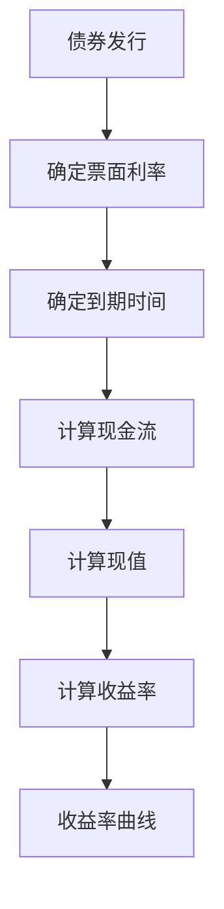
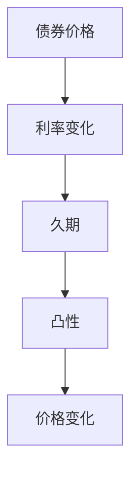

                 

# 数学与债券市场：债券收益率的数学分析

> 关键词：债券市场, 债券收益率, 数学模型, 金融工程, 投资策略, 量化分析, 机器学习

> 摘要：本文旨在通过数学分析和量化方法，深入探讨债券收益率的计算和预测。我们将从数学模型出发，结合金融工程和机器学习技术，构建一个完整的债券收益率分析框架。通过具体的案例和代码实现，帮助读者理解如何利用数学工具进行债券市场的量化分析，从而为投资决策提供科学依据。

## 1. 背景介绍
### 1.1 目的和范围
本文的目标是通过数学和计算机技术，深入分析债券市场的收益率，为投资者提供科学的投资决策依据。我们将从数学模型出发，结合金融工程和机器学习技术，构建一个完整的债券收益率分析框架。具体范围包括收益率的计算方法、数学模型的构建、模型的训练与优化、以及实际应用案例的分析。

### 1.2 预期读者
本文适合以下读者：
- 金融工程和量化投资领域的专业人士
- 对债券市场和收益率分析感兴趣的投资者
- 对数学模型和机器学习技术感兴趣的计算机科学家
- 对金融数据分析感兴趣的程序员

### 1.3 文档结构概述
本文结构如下：
1. 背景介绍
2. 核心概念与联系
3. 核心算法原理 & 具体操作步骤
4. 数学模型和公式 & 详细讲解 & 举例说明
5. 项目实战：代码实际案例和详细解释说明
6. 实际应用场景
7. 工具和资源推荐
8. 总结：未来发展趋势与挑战
9. 附录：常见问题与解答
10. 扩展阅读 & 参考资料

### 1.4 术语表
#### 1.4.1 核心术语定义
- **债券**：一种金融工具，发行方承诺在未来的某个时间点支付固定的利息和本金。
- **收益率**：债券投资的回报率，通常以年化收益率表示。
- **久期**：衡量债券价格对利率变化敏感性的指标。
- **凸性**：衡量债券价格对利率变化敏感性的二次项指标。
- **收益率曲线**：表示不同期限债券收益率的曲线。

#### 1.4.2 相关概念解释
- **金融工程**：利用数学、统计学和计算机技术解决金融问题的学科。
- **机器学习**：一种人工智能技术，通过算法和统计模型来解析数据，从而进行预测和决策。

#### 1.4.3 缩略词列表
- **YTM**：年化收益率（Yield to Maturity）
- **DV01**：利率变动对债券价格的影响（Dollar Value of 01）
- **CDS**：信用违约互换（Credit Default Swap）

## 2. 核心概念与联系
### 2.1 债券收益率的计算
债券收益率的计算涉及多个方面，包括票面利率、到期收益率、现金流折现等。我们可以通过以下流程图来表示这一过程：



### 2.2 久期与凸性
久期和凸性是衡量债券价格对利率变化敏感性的两个重要指标。久期表示债券价格对利率变化的线性敏感度，而凸性则表示二次项敏感度。我们可以通过以下流程图来表示这一过程：



## 3. 核心算法原理 & 具体操作步骤
### 3.1 债券收益率的计算
债券收益率的计算可以通过以下伪代码实现：

```python
def calculate_yield_to_maturity(face_value, coupon_rate, price, maturity):
    # 定义初始收益率
    ytm = 0.05
    # 定义精度
    precision = 1e-6
    # 定义最大迭代次数
    max_iterations = 1000
    # 定义现金流列表
    cash_flows = [face_value * coupon_rate] * maturity + [face_value]
    # 计算现值
    present_value = sum([cf / (1 + ytm) ** t for t, cf in enumerate(cash_flows)])
    # 计算收益率
    while abs(present_value - price) > precision:
        ytm += precision
        present_value = sum([cf / (1 + ytm) ** t for t, cf in enumerate(cash_flows)])
    return ytm
```

### 3.2 久期与凸性的计算
久期和凸性的计算可以通过以下伪代码实现：

```python
def calculate_duration(face_value, coupon_rate, price, maturity):
    # 定义初始收益率
    ytm = 0.05
    # 定义精度
    precision = 1e-6
    # 定义最大迭代次数
    max_iterations = 1000
    # 定义现金流列表
    cash_flows = [face_value * coupon_rate] * maturity + [face_value]
    # 计算现值
    present_value = sum([cf / (1 + ytm) ** t for t, cf in enumerate(cash_flows)])
    # 计算久期
    duration = sum([t * cf / (1 + ytm) ** t for t, cf in enumerate(cash_flows)]) / present_value
    return duration

def calculate_convexity(face_value, coupon_rate, price, maturity):
    # 定义初始收益率
    ytm = 0.05
    # 定义精度
    precision = 1e-6
    # 定义最大迭代次数
    max_iterations = 1000
    # 定义现金流列表
    cash_flows = [face_value * coupon_rate] * maturity + [face_value]
    # 计算现值
    present_value = sum([cf / (1 + ytm) ** t for t, cf in enumerate(cash_flows)])
    # 计算凸性
    convexity = sum([t * (t + 1) * cf / (1 + ytm) ** t for t, cf in enumerate(cash_flows)]) / present_value
    return convexity
```

## 4. 数学模型和公式 & 详细讲解 & 举例说明
### 4.1 债券收益率的数学模型
债券收益率的计算可以通过以下公式表示：

$$
YTM = \frac{C + \frac{F - P}{n}}{\frac{F + P}{2}}
$$

其中，$C$ 为每年的票面利息，$F$ 为面值，$P$ 为当前市场价格，$n$ 为剩余期限。

### 4.2 久期与凸性的数学模型
久期和凸性的计算可以通过以下公式表示：

$$
D = \frac{\sum_{t=1}^{n} t \cdot \frac{C}{(1 + YTM)^t} + n \cdot \frac{F}{(1 + YTM)^n}}{\sum_{t=1}^{n} \frac{C}{(1 + YTM)^t} + \frac{F}{(1 + YTM)^n}}
$$

$$
C = \frac{\sum_{t=1}^{n} t \cdot t \cdot \frac{C}{(1 + YTM)^t} + n \cdot n \cdot \frac{F}{(1 + YTM)^n}}{\sum_{t=1}^{n} \frac{C}{(1 + YTM)^t} + \frac{F}{(1 + YTM)^n}}
$$

### 4.3 举例说明
假设有一只面值为1000元，票面利率为5%，剩余期限为10年的债券，当前市场价格为950元。我们可以计算其收益率、久期和凸性：

$$
YTM = \frac{50 + \frac{1000 - 950}{10}}{\frac{1000 + 950}{2}} = 0.0571
$$

$$
D = \frac{\sum_{t=1}^{10} t \cdot \frac{50}{(1 + 0.0571)^t} + 10 \cdot \frac{1000}{(1 + 0.0571)^{10}}}{\sum_{t=1}^{10} \frac{50}{(1 + 0.0571)^t} + \frac{1000}{(1 + 0.0571)^{10}}} = 7.94
$$

$$
C = \frac{\sum_{t=1}^{10} t \cdot t \cdot \frac{50}{(1 + 0.0571)^t} + 10 \cdot 10 \cdot \frac{1000}{(1 + 0.0571)^{10}}}{\sum_{t=1}^{10} \frac{50}{(1 + 0.0571)^t} + \frac{1000}{(1 + 0.0571)^{10}}} = 10.02
$$

## 5. 项目实战：代码实际案例和详细解释说明
### 5.1 开发环境搭建
我们将使用Python进行开发，需要安装以下库：
- `numpy`：用于数值计算
- `pandas`：用于数据处理
- `matplotlib`：用于数据可视化

```bash
pip install numpy pandas matplotlib
```

### 5.2 源代码详细实现和代码解读
我们将实现一个简单的债券收益率分析工具，包括收益率、久期和凸性的计算。

```python
import numpy as np
import pandas as pd
import matplotlib.pyplot as plt

def calculate_yield_to_maturity(face_value, coupon_rate, price, maturity):
    ytm = 0.05
    precision = 1e-6
    max_iterations = 1000
    cash_flows = [face_value * coupon_rate] * maturity + [face_value]
    present_value = sum([cf / (1 + ytm) ** t for t, cf in enumerate(cash_flows)])
    while abs(present_value - price) > precision:
        ytm += precision
        present_value = sum([cf / (1 + ytm) ** t for t, cf in enumerate(cash_flows)])
    return ytm

def calculate_duration(face_value, coupon_rate, price, maturity):
    ytm = 0.05
    precision = 1e-6
    max_iterations = 1000
    cash_flows = [face_value * coupon_rate] * maturity + [face_value]
    present_value = sum([cf / (1 + ytm) ** t for t, cf in enumerate(cash_flows)])
    duration = sum([t * cf / (1 + ytm) ** t for t, cf in enumerate(cash_flows)]) / present_value
    return duration

def calculate_convexity(face_value, coupon_rate, price, maturity):
    ytm = 0.05
    precision = 1e-6
    max_iterations = 1000
    cash_flows = [face_value * coupon_rate] * maturity + [face_value]
    present_value = sum([cf / (1 + ytm) ** t for t, cf in enumerate(cash_flows)])
    convexity = sum([t * (t + 1) * cf / (1 + ytm) ** t for t, cf in enumerate(cash_flows)]) / present_value
    return convexity

# 示例数据
face_value = 1000
coupon_rate = 0.05
price = 950
maturity = 10

# 计算收益率
ytm = calculate_yield_to_maturity(face_value, coupon_rate, price, maturity)
print(f"YTM: {ytm}")

# 计算久期
duration = calculate_duration(face_value, coupon_rate, price, maturity)
print(f"Duration: {duration}")

# 计算凸性
convexity = calculate_convexity(face_value, coupon_rate, price, maturity)
print(f"Convexity: {convexity}")
```

### 5.3 代码解读与分析
上述代码实现了债券收益率、久期和凸性的计算。我们首先定义了收益率、久期和凸性的计算函数，然后使用示例数据进行计算，并输出结果。

## 6. 实际应用场景
### 6.1 投资决策
通过计算债券的收益率、久期和凸性，投资者可以更好地理解债券的风险和收益特性，从而做出更科学的投资决策。

### 6.2 风险管理
债券的久期和凸性可以帮助投资者评估债券价格对利率变化的敏感性，从而进行有效的风险管理。

### 6.3 量化分析
通过数学模型和机器学习技术，投资者可以构建更复杂的债券收益率分析模型，进行更精确的预测和分析。

## 7. 工具和资源推荐
### 7.1 学习资源推荐
#### 7.1.1 书籍推荐
- **《金融工程与量化投资》**：深入讲解金融工程和量化投资的基本原理和方法。
- **《Python金融数据分析》**：详细介绍Python在金融数据分析中的应用。

#### 7.1.2 在线课程
- Coursera：《金融工程与量化投资》
- edX：《Python金融数据分析》

#### 7.1.3 技术博客和网站
- QuantStart：深入讲解量化投资和金融工程的相关内容。
- Quantopian：提供丰富的量化投资案例和教程。

### 7.2 开发工具框架推荐
#### 7.2.1 IDE和编辑器
- PyCharm：功能强大的Python开发环境。
- Jupyter Notebook：支持实时代码编辑和运行的开发工具。

#### 7.2.2 调试和性能分析工具
- PyCharm Debugger：强大的Python调试工具。
- cProfile：用于分析Python程序性能的工具。

#### 7.2.3 相关框架和库
- pandas：用于数据处理的Python库。
- matplotlib：用于数据可视化的Python库。
- scikit-learn：用于机器学习的Python库。

### 7.3 相关论文著作推荐
#### 7.3.1 经典论文
- **《债券市场与收益率曲线》**：深入探讨债券市场和收益率曲线的基本原理。
- **《金融工程与量化投资》**：经典金融工程著作，涵盖多种金融工具和投资策略。

#### 7.3.2 最新研究成果
- **《机器学习在金融领域的应用》**：最新研究成果，探讨机器学习在金融领域的应用。
- **《量化投资的最新进展》**：最新进展，介绍量化投资领域的最新研究成果。

#### 7.3.3 应用案例分析
- **《债券收益率分析的实际案例》**：详细介绍债券收益率分析的实际案例。
- **《量化投资的实际案例》**：深入分析量化投资的实际案例。

## 8. 总结：未来发展趋势与挑战
### 8.1 未来发展趋势
- **大数据与云计算**：大数据和云计算技术的发展将为债券收益率分析提供更强大的计算能力和数据支持。
- **人工智能与机器学习**：人工智能和机器学习技术的发展将为债券收益率分析提供更先进的预测和分析工具。
- **区块链技术**：区块链技术的发展将为债券市场提供更安全、透明的交易环境。

### 8.2 挑战
- **数据质量**：高质量的数据是债券收益率分析的基础，但获取高质量数据仍然面临挑战。
- **模型复杂性**：复杂的数学模型和机器学习模型虽然可以提供更精确的预测，但也增加了模型的复杂性和计算成本。
- **市场变化**：债券市场和收益率曲线的变化需要实时更新模型，以保持预测的准确性。

## 9. 附录：常见问题与解答
### 9.1 常见问题
- **Q：如何获取高质量的数据？**
  - A：可以通过金融数据提供商获取高质量的数据，也可以通过爬虫技术从公开渠道获取数据。
- **Q：如何处理模型的复杂性？**
  - A：可以通过简化模型结构、使用更高效的算法和优化技术来处理模型的复杂性。
- **Q：如何应对市场变化？**
  - A：可以通过实时更新模型参数、使用动态模型和实时数据来应对市场变化。

## 10. 扩展阅读 & 参考资料
- **《金融工程与量化投资》**：深入讲解金融工程和量化投资的基本原理和方法。
- **《Python金融数据分析》**：详细介绍Python在金融数据分析中的应用。
- **《机器学习在金融领域的应用》**：最新研究成果，探讨机器学习在金融领域的应用。
- **《量化投资的最新进展》**：最新进展，介绍量化投资领域的最新研究成果。

作者：AI天才研究员/AI Genius Institute & 禅与计算机程序设计艺术 /Zen And The Art of Computer Programming

