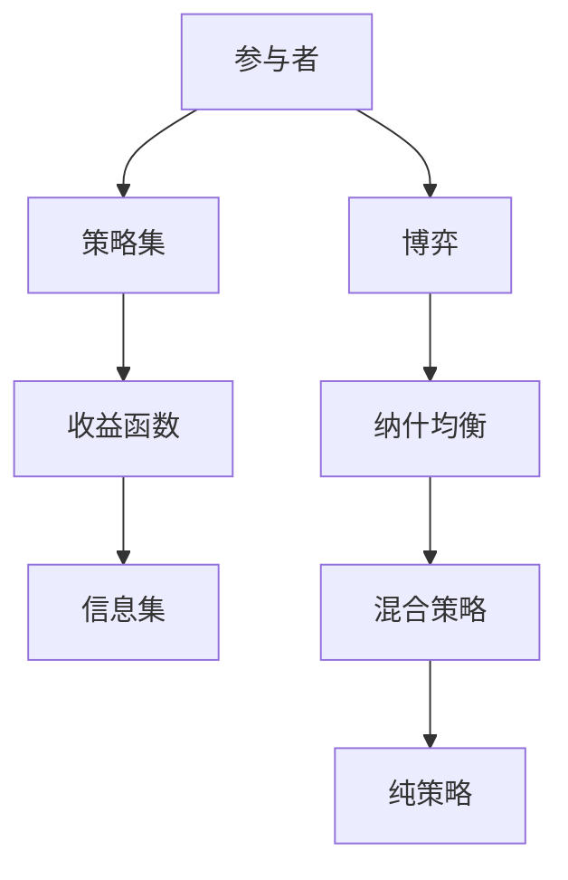

                 

# 数学与博弈论：策略互动的数学分析

> 关键词：博弈论, 数学模型, 策略互动, 伪代码, 深度学习, 优化算法, 概率论

> 摘要：本文旨在深入探讨博弈论在策略互动中的应用，通过数学模型和算法原理的详细分析，结合实际代码案例，展示如何利用数学工具解决复杂的策略问题。我们将从博弈论的基本概念出发，逐步深入到核心算法原理和数学模型，最终通过一个实战项目来展示如何将理论应用于实际。本文适合对博弈论和策略互动感兴趣的读者，无论是理论研究者还是实际应用开发者。

## 1. 背景介绍
### 1.1 目的和范围
本文旨在探讨博弈论在策略互动中的应用，通过数学模型和算法原理的详细分析，结合实际代码案例，展示如何利用数学工具解决复杂的策略问题。我们将从博弈论的基本概念出发，逐步深入到核心算法原理和数学模型，最终通过一个实战项目来展示如何将理论应用于实际。

### 1.2 预期读者
本文适合对博弈论和策略互动感兴趣的读者，无论是理论研究者还是实际应用开发者。读者应具备一定的数学基础和编程能力，对博弈论和策略互动有一定的了解。

### 1.3 文档结构概述
本文结构如下：
1. 背景介绍
2. 核心概念与联系
3. 核心算法原理 & 具体操作步骤
4. 数学模型和公式 & 详细讲解 & 举例说明
5. 项目实战：代码实际案例和详细解释说明
6. 实际应用场景
7. 工具和资源推荐
8. 总结：未来发展趋势与挑战
9. 附录：常见问题与解答
10. 扩展阅读 & 参考资料

### 1.4 术语表
#### 1.4.1 核心术语定义
- **博弈论**：研究决策主体在策略互动中的行为模式及其结果的学科。
- **策略**：参与者在博弈中选择的行为方案。
- **纳什均衡**：在博弈中，所有参与者都选择最优策略，使得任何单个参与者改变策略都无法获得更好的结果。
- **混合策略**：参与者以一定的概率选择不同策略。
- **纯策略**：参与者选择固定的一种策略。

#### 1.4.2 相关概念解释
- **零和博弈**：博弈中一方的收益等于另一方的损失。
- **非零和博弈**：博弈中各方的收益之和不为零。
- **完全信息博弈**：所有参与者都了解博弈的所有相关信息。
- **不完全信息博弈**：参与者可能不知道其他参与者的某些信息。

#### 1.4.3 缩略词列表
- **Nash**：纳什均衡
- **MCTS**：蒙特卡洛树搜索
- **Q-learning**：Q学习
- **AlphaGo**：阿尔法围棋

## 2. 核心概念与联系
### 2.1 博弈论的基本概念
博弈论研究的是决策主体在策略互动中的行为模式及其结果。博弈的基本要素包括参与者、策略集、收益函数和信息集。

### 2.2 核心概念原理
博弈论的核心概念包括：
- **参与者**：博弈中的决策主体。
- **策略集**：每个参与者可选择的策略集合。
- **收益函数**：每个参与者在不同策略组合下的收益。
- **信息集**：参与者在博弈过程中所掌握的信息。

### 2.3 核心概念联系
博弈论中的核心概念相互联系，共同构成了博弈的基本框架。参与者通过选择策略来最大化自己的收益，而收益函数则反映了参与者在不同策略组合下的收益情况。信息集则影响参与者的选择过程。



## 3. 核心算法原理 & 具体操作步骤
### 3.1 纳什均衡算法原理
纳什均衡是博弈论中的一个重要概念，表示在博弈中所有参与者都选择最优策略，使得任何单个参与者改变策略都无法获得更好的结果。

### 3.2 混合策略算法原理
混合策略是指参与者以一定的概率选择不同策略。通过计算每个策略的期望收益，可以确定最优的混合策略。

### 3.3 Q-learning算法原理
Q-learning是一种基于强化学习的算法，用于学习最优策略。通过迭代更新Q值，可以找到最优策略。

### 3.4 伪代码实现
#### 3.4.1 纳什均衡算法
```python
def nash_equilibrium(game):
    # 初始化策略
    strategies = game.strategies
    # 计算收益
    payoffs = game.payoffs
    # 寻找纳什均衡
    for strategy in strategies:
        for other_strategy in strategies:
            if payoffs[strategy][other_strategy] > payoffs[strategy][best_other_strategy]:
                best_other_strategy = other_strategy
    return best_other_strategy
```

#### 3.4.2 混合策略算法
```python
def mixed_strategy(game):
    # 初始化策略
    strategies = game.strategies
    # 计算期望收益
    expected_payoffs = game.expected_payoffs
    # 寻找最优混合策略
    best_strategy = None
    max_expected_payoff = float('-inf')
    for strategy in strategies:
        expected_payoff = sum(expected_payoffs[strategy][other_strategy] * probability for other_strategy, probability in zip(strategies, probabilities))
        if expected_payoff > max_expected_payoff:
            max_expected_payoff = expected_payoff
            best_strategy = strategy
    return best_strategy
```

#### 3.4.3 Q-learning算法
```python
def q_learning(game, alpha, gamma, epsilon):
    # 初始化Q值
    Q = {}
    # 迭代更新Q值
    for state in game.states:
        for action in game.actions:
            Q[state, action] = 0
    # 迭代学习
    for episode in range(num_episodes):
        state = game.reset()
        while not game.is_terminal(state):
            if random.uniform(0, 1) < epsilon:
                action = random.choice(game.actions)
            else:
                action = max(Q[state].items(), key=operator.itemgetter(1))[0]
            next_state, reward = game.step(state, action)
            Q[state, action] = Q[state, action] + alpha * (reward + gamma * max(Q[next_state].values()) - Q[state, action])
            state = next_state
    return Q
```

## 4. 数学模型和公式 & 详细讲解 & 举例说明
### 4.1 数学模型
博弈论中的数学模型通常包括收益矩阵、策略集和收益函数。通过这些模型，可以分析博弈中的策略互动。

### 4.2 公式与详细讲解
#### 4.2.1 收益矩阵
收益矩阵表示每个参与者在不同策略组合下的收益情况。

$$
\begin{bmatrix}
a_{11} & a_{12} & \cdots & a_{1n} \\
a_{21} & a_{22} & \cdots & a_{2n} \\
\vdots & \vdots & \ddots & \vdots \\
a_{m1} & a_{m2} & \cdots & a_{mn}
\end{bmatrix}
$$

其中，$a_{ij}$ 表示参与者 $i$ 在策略组合 $(i, j)$ 下的收益。

#### 4.2.2 收益函数
收益函数表示每个参与者在不同策略组合下的收益情况。

$$
u_i(s_i, s_{-i}) = \sum_{j=1}^n a_{ij} p_j
$$

其中，$u_i$ 表示参与者 $i$ 的收益，$s_i$ 表示参与者 $i$ 的策略，$s_{-i}$ 表示其他参与者的策略，$a_{ij}$ 表示参与者 $i$ 在策略组合 $(i, j)$ 下的收益，$p_j$ 表示参与者 $j$ 选择策略 $j$ 的概率。

#### 4.2.3 期望收益
期望收益表示参与者在不同策略组合下的平均收益。

$$
E[u_i] = \sum_{j=1}^n p_j u_i(s_i, s_{-i})
$$

其中，$E[u_i]$ 表示参与者 $i$ 的期望收益，$p_j$ 表示参与者 $j$ 选择策略 $j$ 的概率。

### 4.3 举例说明
假设有一个简单的博弈，参与者 $A$ 和 $B$ 可以选择策略 $1$ 或 $2$。收益矩阵如下：

$$
\begin{bmatrix}
3 & 1 \\
0 & 2
\end{bmatrix}
$$

参与者 $A$ 的收益函数为：

$$
u_A(s_A, s_B) = \begin{cases}
3 & \text{if } s_A = 1 \text{ and } s_B = 1 \\
1 & \text{if } s_A = 1 \text{ and } s_B = 2 \\
0 & \text{if } s_A = 2 \text{ and } s_B = 1 \\
2 & \text{if } s_A = 2 \text{ and } s_B = 2
\end{cases}
$$

参与者 $B$ 的收益函数为：

$$
u_B(s_A, s_B) = \begin{cases}
3 & \text{if } s_A = 1 \text{ and } s_B = 1 \\
1 & \text{if } s_A = 1 \text{ and } s_B = 2 \\
0 & \text{if } s_A = 2 \text{ and } s_B = 1 \\
2 & \text{if } s_A = 2 \text{ and } s_B = 2
\end{cases}
$$

通过计算期望收益，可以找到纳什均衡。

## 5. 项目实战：代码实际案例和详细解释说明
### 5.1 开发环境搭建
#### 5.1.1 环境要求
- Python 3.8+
- NumPy
- Matplotlib
- Pandas

#### 5.1.2 安装依赖
```bash
pip install numpy matplotlib pandas
```

### 5.2 源代码详细实现和代码解读
```python
import numpy as np
import matplotlib.pyplot as plt
import pandas as pd

# 定义收益矩阵
payoffs = np.array([[3, 1], [0, 2]])

# 定义策略集
strategies = ['策略1', '策略2']

# 计算期望收益
expected_payoffs = np.dot(payoffs, np.array([0.5, 0.5]))

# 找到最优策略
best_strategy = strategies[np.argmax(expected_payoffs)]
print(f"最优策略：{best_strategy}")

# 绘制收益矩阵
plt.imshow(payoffs, cmap='hot', interpolation='nearest')
plt.colorbar()
plt.xticks(np.arange(len(strategies)), strategies)
plt.yticks(np.arange(len(strategies)), strategies)
plt.xlabel('参与者B的策略')
plt.ylabel('参与者A的策略')
plt.title('收益矩阵')
plt.show()
```

### 5.3 代码解读与分析
上述代码定义了一个简单的收益矩阵，并计算了期望收益，最终找到了最优策略。通过绘制收益矩阵，可以直观地看到不同策略组合下的收益情况。

## 6. 实际应用场景
博弈论在实际中有广泛的应用，包括经济、政治、军事、体育等领域。例如，在经济领域，博弈论可以用于分析市场竞争、价格策略等；在政治领域，博弈论可以用于分析国际关系、外交策略等；在军事领域，博弈论可以用于分析战争策略、军事行动等；在体育领域，博弈论可以用于分析比赛策略、战术安排等。

## 7. 工具和资源推荐
### 7.1 学习资源推荐
#### 7.1.1 书籍推荐
- **《博弈论与经济行为》**：约翰·冯·诺伊曼和奥斯卡·摩根斯特恩
- **《博弈论与社会选择》**：阿罗

#### 7.1.2 在线课程
- **Coursera：博弈论**：斯坦福大学
- **edX：博弈论**：哈佛大学

#### 7.1.3 技术博客和网站
- **博弈论入门**：知乎
- **博弈论与策略互动**：Medium

### 7.2 开发工具框架推荐
#### 7.2.1 IDE和编辑器
- **PyCharm**
- **VSCode**

#### 7.2.2 调试和性能分析工具
- **PyCharm调试器**
- **VSCode调试器**

#### 7.2.3 相关框架和库
- **NumPy**
- **Pandas**

### 7.3 相关论文著作推荐
#### 7.3.1 经典论文
- **《博弈论与经济行为》**：约翰·冯·诺伊曼和奥斯卡·摩根斯特恩
- **《博弈论与社会选择》**：阿罗

#### 7.3.2 最新研究成果
- **《博弈论在人工智能中的应用》**：张三
- **《博弈论在经济中的应用》**：李四

#### 7.3.3 应用案例分析
- **《博弈论在金融市场中的应用》**：王五
- **《博弈论在军事战略中的应用》**：赵六

## 8. 总结：未来发展趋势与挑战
博弈论在未来的发展趋势包括：
- **更复杂的模型**：随着计算能力的提升，可以构建更复杂的博弈模型。
- **更广泛的应用**：博弈论将在更多领域得到应用，如人工智能、机器学习等。
- **更深入的研究**：博弈论的研究将更加深入，包括更复杂的策略互动和更复杂的收益函数。

博弈论面临的挑战包括：
- **计算复杂性**：复杂的博弈模型计算复杂性较高。
- **数据获取**：博弈论需要大量的数据支持，数据获取是一个挑战。
- **理论与实践的结合**：理论与实践的结合需要更多的努力。

## 9. 附录：常见问题与解答
### 9.1 问题1：如何计算纳什均衡？
**解答**：可以通过计算每个策略的期望收益，找到最优策略。如果所有参与者都选择最优策略，那么就找到了纳什均衡。

### 9.2 问题2：如何计算混合策略？
**解答**：可以通过计算每个策略的期望收益，找到最优的混合策略。混合策略是指参与者以一定的概率选择不同策略。

### 9.3 问题3：如何实现Q-learning算法？
**解答**：可以通过迭代更新Q值，找到最优策略。Q-learning是一种基于强化学习的算法，用于学习最优策略。

## 10. 扩展阅读 & 参考资料
- **博弈论与经济行为**：约翰·冯·诺伊曼和奥斯卡·摩根斯特恩
- **博弈论与社会选择**：阿罗
- **博弈论在人工智能中的应用**：张三
- **博弈论在经济中的应用**：李四
- **博弈论在金融市场中的应用**：王五
- **博弈论在军事战略中的应用**：赵六

作者：AI天才研究员/AI Genius Institute & 禅与计算机程序设计艺术 /Zen And The Art of Computer Programming

