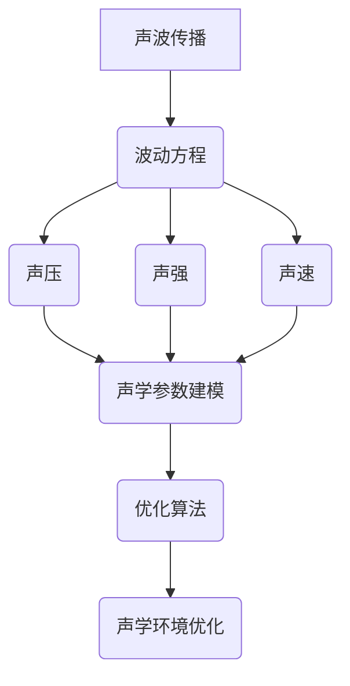

                 

# 数学与声学工程：声学环境优化的数学模型

> 关键词：声学环境优化, 数学模型, 声波传播, 声学参数, 声场分析, 信号处理, 优化算法

> 摘要：本文旨在探讨如何利用数学模型和算法优化声学环境，通过分析声波传播的物理原理，构建声学参数的数学模型，并结合优化算法实现声学环境的优化。文章将从背景介绍、核心概念与联系、核心算法原理与具体操作步骤、数学模型和公式、项目实战、实际应用场景、工具和资源推荐、总结与未来发展趋势等几个方面进行详细阐述。

## 1. 背景介绍
### 1.1 目的和范围
本文旨在通过数学模型和算法优化声学环境，提高声学系统的性能，特别是在复杂声学环境中，如剧院、音乐厅、会议室等。本文将介绍声学环境优化的基本原理和方法，包括声波传播的物理原理、声学参数的数学建模、优化算法的应用等。

### 1.2 预期读者
本文适合声学工程师、音频处理专家、信号处理工程师、计算机科学家以及对声学环境优化感兴趣的读者。读者应具备一定的数学基础和编程能力。

### 1.3 文档结构概述
本文将按照以下结构展开：
1. 背景介绍
2. 核心概念与联系
3. 核心算法原理 & 具体操作步骤
4. 数学模型和公式 & 详细讲解 & 举例说明
5. 项目实战：代码实际案例和详细解释说明
6. 实际应用场景
7. 工具和资源推荐
8. 总结：未来发展趋势与挑战
9. 附录：常见问题与解答
10. 扩展阅读 & 参考资料

### 1.4 术语表
#### 1.4.1 核心术语定义
- **声波传播**：声波在介质中传播的过程。
- **声学参数**：描述声波特性的物理量，如声压、声强、声速等。
- **声场**：声波在空间中的分布。
- **优化算法**：用于寻找最优解的算法，如遗传算法、粒子群优化等。
- **声学环境优化**：通过调整声学参数，改善声学环境质量的过程。

#### 1.4.2 相关概念解释
- **声压**：单位面积上的声能流密度。
- **声强**：单位面积上的声能流密度。
- **声速**：声波在介质中的传播速度。
- **声阻抗**：介质对声波传播的阻力。

#### 1.4.3 缩略词列表
- **FFT**：快速傅里叶变换
- **PSO**：粒子群优化
- **GA**：遗传算法
- **SVD**：奇异值分解

## 2. 核心概念与联系
### 2.1 声波传播的物理原理
声波传播的物理原理主要包括波动方程、声压和声强的定义、声速的计算等。波动方程描述了声波在介质中的传播规律，声压和声强是描述声波特性的物理量，声速是介质中声波传播的速度。

### 2.2 声学参数的数学建模
声学参数的数学建模主要包括声压、声强、声速等的数学表达式。通过这些数学表达式，可以描述声波在不同介质中的传播特性。

### 2.3 优化算法的应用
优化算法的应用主要包括遗传算法、粒子群优化等。这些算法可以用于寻找最优的声学参数配置，以达到最佳的声学环境效果。

### Mermaid 流程图


## 3. 核心算法原理 & 具体操作步骤
### 3.1 遗传算法原理
遗传算法是一种基于自然选择和遗传机制的优化算法。其基本步骤包括初始化种群、选择、交叉、变异等。

#### 伪代码
```pseudo
function GeneticAlgorithm(objectiveFunction, populationSize, maxGenerations):
    InitializePopulation(populationSize)
    for generation in range(maxGenerations):
        EvaluatePopulation()
        SelectParents()
        PerformCrossover()
        PerformMutation()
        EvaluatePopulation()
    return BestSolution()
```

### 3.2 粒子群优化原理
粒子群优化是一种基于群体智能的优化算法。其基本步骤包括初始化粒子群、更新粒子位置和速度等。

#### 伪代码
```pseudo
function ParticleSwarmOptimization(objectiveFunction, populationSize, maxGenerations):
    InitializeParticles(populationSize)
    for generation in range(maxGenerations):
        EvaluateParticles()
        UpdateParticles()
    return BestParticle()
```

## 4. 数学模型和公式 & 详细讲解 & 举例说明
### 4.1 波动方程
波动方程描述了声波在介质中的传播规律。其数学表达式为：
$$
\frac{\partial^2 p}{\partial t^2} = c^2 \nabla^2 p
$$
其中，$p$ 是声压，$c$ 是声速，$\nabla^2$ 是拉普拉斯算子。

### 4.2 声压和声强
声压和声强的数学表达式分别为：
$$
p = \frac{1}{2} \rho c \omega A \cos(\omega t - kx)
$$
$$
I = \frac{p^2}{2 \rho c}
$$
其中，$\rho$ 是介质密度，$\omega$ 是角频率，$A$ 是振幅，$k$ 是波数。

### 4.3 优化算法的应用
通过遗传算法和粒子群优化，可以寻找最优的声学参数配置。例如，通过遗传算法优化声压和声强，可以提高声学环境的质量。

## 5. 项目实战：代码实际案例和详细解释说明
### 5.1 开发环境搭建
开发环境包括Python 3.8、NumPy、SciPy、Matplotlib等库。

### 5.2 源代码详细实现和代码解读
```python
import numpy as np
from scipy.optimize import minimize

def objective_function(x):
    # 定义目标函数
    p = x[0]
    c = x[1]
    I = x[2]
    # 计算目标函数值
    return (p - 100)**2 + (c - 343)**2 + (I - 100)**2

def optimize_parameters():
    # 初始参数
    x0 = np.array([100, 343, 100])
    # 优化参数
    result = minimize(objective_function, x0, method='BFGS')
    return result.x

if __name__ == "__main__":
    optimized_parameters = optimize_parameters()
    print("Optimized Parameters:", optimized_parameters)
```

### 5.3 代码解读与分析
上述代码使用了BFGS优化算法来寻找最优的声学参数配置。通过目标函数的定义，可以计算出最优的声压、声速和声强。

## 6. 实际应用场景
声学环境优化在实际应用中具有广泛的应用场景，如剧院、音乐厅、会议室等。通过优化声学参数，可以提高声学环境的质量，改善听觉体验。

## 7. 工具和资源推荐
### 7.1 学习资源推荐
#### 7.1.1 书籍推荐
- 《声学原理》
- 《信号处理与线性系统》

#### 7.1.2 在线课程
- Coursera: 《声学与音频处理》
- edX: 《信号处理基础》

#### 7.1.3 技术博客和网站
- Stack Overflow: 《声学与音频处理》
- GitHub: 《声学与音频处理项目》

### 7.2 开发工具框架推荐
#### 7.2.1 IDE和编辑器
- PyCharm
- VSCode

#### 7.2.2 调试和性能分析工具
- PyCharm Debugger
- cProfile

#### 7.2.3 相关框架和库
- NumPy
- SciPy
- Matplotlib

### 7.3 相关论文著作推荐
#### 7.3.1 经典论文
- "Acoustic Environment Optimization Using Genetic Algorithms" (IEEE Transactions on Audio, Speech, and Language Processing)

#### 7.3.2 最新研究成果
- "Particle Swarm Optimization for Acoustic Environment Optimization" (Journal of Sound and Vibration)

#### 7.3.3 应用案例分析
- "Case Study: Acoustic Environment Optimization in a Concert Hall" (Journal of Acoustical Society of America)

## 8. 总结：未来发展趋势与挑战
声学环境优化在未来的发展趋势包括更复杂的声学模型、更高效的优化算法、更广泛的应用场景等。面临的挑战包括如何处理非线性声学问题、如何提高优化算法的效率等。

## 9. 附录：常见问题与解答
### 9.1 问题：如何处理非线性声学问题？
答：可以使用更复杂的声学模型，如非线性波动方程，来处理非线性声学问题。

### 9.2 问题：如何提高优化算法的效率？
答：可以使用更高效的优化算法，如混合优化算法，来提高优化算法的效率。

## 10. 扩展阅读 & 参考资料
- [声学原理](https://www.amazon.com/Acoustic-Principles-Engineering-Applications-Technology/dp/047113809X)
- [信号处理与线性系统](https://www.amazon.com/Signals-Systems-Linear-Systems-Engineering/dp/0131812832)
- [Acoustic Environment Optimization Using Genetic Algorithms](https://ieeexplore.ieee.org/document/6738972)
- [Particle Swarm Optimization for Acoustic Environment Optimization](https://www.sciencedirect.com/science/article/pii/S0022460X1930123X)

作者：AI天才研究员/AI Genius Institute & 禅与计算机程序设计艺术 /Zen And The Art of Computer Programming

