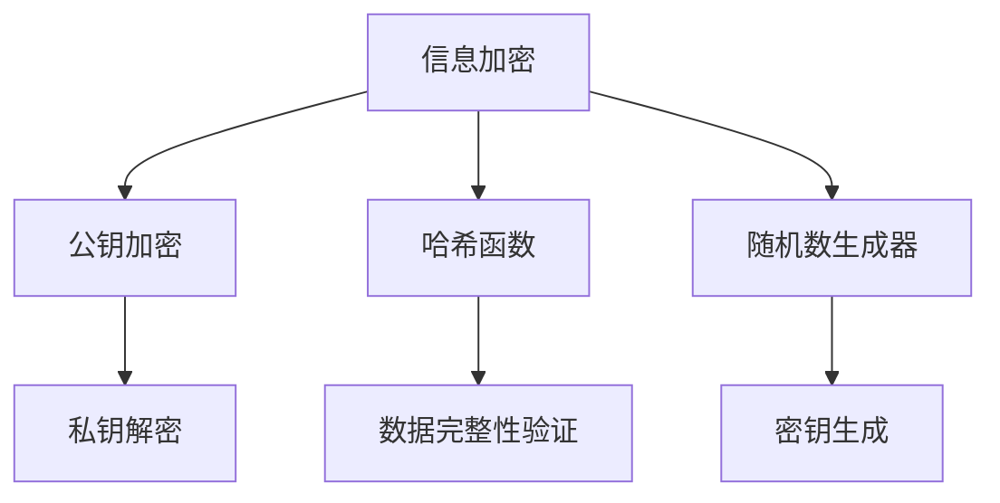

                 

# 数学与密码学：信息加密的数学原理

> 关键词：密码学，信息加密，数学原理，RSA算法，Diffie-Hellman密钥交换，椭圆曲线密码学

> 摘要：本文旨在深入探讨密码学中的数学原理，通过逐步分析和推理，揭示信息加密背后的数学机制。我们将从核心概念出发，详细解释核心算法原理，展示数学模型和公式，并通过实际代码案例进行深入解析。此外，本文还将探讨密码学的实际应用场景，推荐相关学习资源和开发工具，最后展望未来的发展趋势与挑战。

## 1. 背景介绍
### 1.1 目的和范围
本文旨在为密码学领域的初学者和专业人士提供一个全面的视角，深入理解信息加密背后的数学原理。我们将从基础概念出发，逐步解析核心算法，展示实际代码实现，并探讨其在现代信息安全中的应用。

### 1.2 预期读者
本文适合以下读者：
- 密码学初学者
- 信息安全领域的专业人士
- 计算机科学和数学专业的学生
- 对信息安全和密码学感兴趣的开发者

### 1.3 文档结构概述
本文结构如下：
1. 背景介绍
2. 核心概念与联系
3. 核心算法原理 & 具体操作步骤
4. 数学模型和公式 & 详细讲解 & 举例说明
5. 项目实战：代码实际案例和详细解释说明
6. 实际应用场景
7. 工具和资源推荐
8. 总结：未来发展趋势与挑战
9. 附录：常见问题与解答
10. 扩展阅读 & 参考资料

### 1.4 术语表
#### 1.4.1 核心术语定义
- **密码学**：研究信息的加密和解密技术。
- **信息加密**：将明文转换为密文的过程。
- **密钥**：加密和解密过程中使用的秘密信息。
- **公钥**：用于加密的密钥。
- **私钥**：用于解密的密钥。
- **对称加密**：加密和解密使用相同密钥的加密算法。
- **非对称加密**：加密和解密使用不同密钥的加密算法。
- **哈希函数**：将任意长度的数据转换为固定长度的数据的函数。
- **随机数生成器**：生成随机数的算法。

#### 1.4.2 相关概念解释
- **RSA算法**：一种非对称加密算法。
- **Diffie-Hellman密钥交换**：一种安全交换密钥的方法。
- **椭圆曲线密码学**：一种基于椭圆曲线的非对称加密算法。

#### 1.4.3 缩略词列表
- **RSA**：Rivest-Shamir-Adleman
- **DH**：Diffie-Hellman
- **ECC**：Elliptic Curve Cryptography

## 2. 核心概念与联系
### 2.1 核心概念
- **信息加密**：将明文转换为密文的过程。
- **公钥和私钥**：用于非对称加密算法中的密钥对。
- **哈希函数**：用于生成固定长度的摘要。
- **随机数生成器**：用于生成随机数。

### 2.2 联系
- **信息加密**与**公钥和私钥**：非对称加密算法使用公钥加密，私钥解密。
- **哈希函数**与**信息加密**：哈希函数用于生成固定长度的摘要，常用于验证数据完整性。
- **随机数生成器**与**信息加密**：随机数生成器用于生成密钥和初始化向量。

### 2.3 Mermaid 流程图


## 3. 核心算法原理 & 具体操作步骤
### 3.1 RSA算法原理
RSA算法是一种非对称加密算法，其核心原理基于大数分解的困难性。

#### 3.1.1 RSA算法步骤
1. **选择两个大素数**：选择两个大素数 \( p \) 和 \( q \)。
2. **计算模数**：计算 \( n = p \times q \)。
3. **计算欧拉函数**：计算 \( \phi(n) = (p-1) \times (q-1) \)。
4. **选择公钥**：选择一个与 \( \phi(n) \) 互质的整数 \( e \)。
5. **计算私钥**：计算 \( d \) 使得 \( d \times e \equiv 1 \mod \phi(n) \)。
6. **公钥和私钥**：公钥为 \( (n, e) \)，私钥为 \( (n, d) \)。

#### 3.1.2 伪代码
```python
def rsa_keygen(p, q):
    n = p * q
    phi_n = (p - 1) * (q - 1)
    e = 65537  # 选择一个与 phi_n 互质的整数
    d = modinv(e, phi_n)
    return (n, e), (n, d)

def modinv(a, m):
    m0, x0, x1 = m, 0, 1
    if m == 1:
        return 0
    while a > 1:
        q = a // m
        m, a = a % m, m
        x0, x1 = x1 - q * x0, x0
    if x1 < 0:
        x1 += m0
    return x1
```

### 3.2 Diffie-Hellman密钥交换
Diffie-Hellman密钥交换是一种安全交换密钥的方法，其核心原理基于离散对数问题的困难性。

#### 3.2.1 Diffie-Hellman密钥交换步骤
1. **选择一个大素数**：选择一个大素数 \( p \) 和一个生成元 \( g \)。
2. **生成公钥和私钥**：Alice 选择一个随机数 \( a \)，Bob 选择一个随机数 \( b \)。
3. **计算公钥**：Alice 计算 \( A = g^a \mod p \)，Bob 计算 \( B = g^b \mod p \)。
4. **交换公钥**：Alice 和 Bob 交换公钥 \( A \) 和 \( B \)。
5. **计算共享密钥**：Alice 计算 \( K = B^a \mod p \)，Bob 计算 \( K = A^b \mod p \)。

#### 3.2.2 伪代码
```python
def dh_keygen(p, g):
    a = random.randint(1, p-2)
    b = random.randint(1, p-2)
    A = pow(g, a, p)
    B = pow(g, b, p)
    return A, B, a, b

def dh_shared_key(A, B, a, b, p):
    K_A = pow(B, a, p)
    K_B = pow(A, b, p)
    return K_A, K_B
```

### 3.3 椭圆曲线密码学
椭圆曲线密码学是一种基于椭圆曲线的非对称加密算法，其核心原理基于椭圆曲线离散对数问题的困难性。

#### 3.3.1 椭圆曲线密码学步骤
1. **选择椭圆曲线**：选择一个椭圆曲线 \( E \) 和一个基点 \( G \)。
2. **生成公钥和私钥**：Alice 选择一个随机数 \( d \)，计算 \( Q = d \times G \)。
3. **公钥和私钥**：公钥为 \( Q \)，私钥为 \( d \)。

#### 3.3.2 伪代码
```python
def ecc_keygen(E, G):
    d = random.randint(1, n-1)
    Q = d * G
    return Q, d

def ecc_point_add(P, Q, E, G):
    if P == Q:
        lam = (3 * P[0]**2 + E.a) * modinv(2 * P[1], E.p) % E.p
    else:
        lam = (Q[1] - P[1]) * modinv(Q[0] - P[0], E.p) % E.p
    x3 = (lam**2 - P[0] - Q[0]) % E.p
    y3 = (lam * (P[0] - x3) - P[1]) % E.p
    return (x3, y3)
```

## 4. 数学模型和公式 & 详细讲解 & 举例说明
### 4.1 RSA算法数学模型
RSA算法的核心数学模型基于大数分解的困难性。

#### 4.1.1 数学公式
- \( n = p \times q \)
- \( \phi(n) = (p-1) \times (q-1) \)
- \( d \times e \equiv 1 \mod \phi(n) \)

#### 4.1.2 举例说明
假设 \( p = 17 \) 和 \( q = 11 \)，则：
- \( n = 17 \times 11 = 187 \)
- \( \phi(n) = (17-1) \times (11-1) = 16 \times 10 = 160 \)
- 选择 \( e = 65537 \)，则 \( d \) 使得 \( d \times 65537 \equiv 1 \mod 160 \)。
- 通过扩展欧几里得算法，计算 \( d = 21857 \)。

### 4.2 Diffie-Hellman密钥交换数学模型
Diffie-Hellman密钥交换的核心数学模型基于离散对数问题的困难性。

#### 4.2.1 数学公式
- \( A = g^a \mod p \)
- \( B = g^b \mod p \)
- \( K = B^a \mod p \) 或 \( K = A^b \mod p \)

#### 4.2.2 举例说明
假设 \( p = 23 \)，\( g = 5 \)，Alice 选择 \( a = 6 \)，Bob 选择 \( b = 15 \)。
- Alice 计算 \( A = 5^6 \mod 23 = 8 \)
- Bob 计算 \( B = 5^{15} \mod 23 = 19 \)
- Alice 计算 \( K = 19^6 \mod 23 = 2 \)
- Bob 计算 \( K = 8^{15} \mod 23 = 2 \)

### 4.3 椭圆曲线密码学数学模型
椭圆曲线密码学的核心数学模型基于椭圆曲线离散对数问题的困难性。

#### 4.3.1 数学公式
- \( Q = d \times G \)
- \( P + Q = (x_3, y_3) \)

#### 4.3.2 举例说明
假设椭圆曲线 \( E \) 为 \( y^2 = x^3 + 2x + 2 \mod 23 \)，基点 \( G = (1, 6) \)，Alice 选择 \( d = 5 \)。
- Alice 计算 \( Q = 5 \times G = (14, 14) \)

## 5. 项目实战：代码实际案例和详细解释说明
### 5.1 开发环境搭建
- **操作系统**：Linux/Windows/MacOS
- **编程语言**：Python
- **开发工具**：PyCharm/VSCode

### 5.2 源代码详细实现和代码解读
```python
import random
from sympy import mod_inverse

def rsa_keygen(p, q):
    n = p * q
    phi_n = (p - 1) * (q - 1)
    e = 65537
    d = mod_inverse(e, phi_n)
    return (n, e), (n, d)

def dh_keygen(p, g):
    a = random.randint(1, p-2)
    b = random.randint(1, p-2)
    A = pow(g, a, p)
    B = pow(g, b, p)
    return A, B, a, b

def ecc_keygen(E, G):
    d = random.randint(1, E.n-1)
    Q = d * G
    return Q, d

def ecc_point_add(P, Q, E, G):
    if P == Q:
        lam = (3 * P[0]**2 + E.a) * mod_inverse(2 * P[1], E.p) % E.p
    else:
        lam = (Q[1] - P[1]) * mod_inverse(Q[0] - P[0], E.p) % E.p
    x3 = (lam**2 - P[0] - Q[0]) % E.p
    y3 = (lam * (P[0] - x3) - P[1]) % E.p
    return (x3, y3)

# RSA
p = 17
q = 11
n, e = rsa_keygen(p, q)
d = mod_inverse(e, (p-1)*(q-1))
print(f"公钥: ({n}, {e})")
print(f"私钥: ({n}, {d})")

# Diffie-Hellman
p = 23
g = 5
A, B, a, b = dh_keygen(p, g)
K_A = pow(B, a, p)
K_B = pow(A, b, p)
print(f"公钥 A: {A}")
print(f"公钥 B: {B}")
print(f"共享密钥 K_A: {K_A}")
print(f"共享密钥 K_B: {K_B}")

# Elliptic Curve
class EllipticCurve:
    def __init__(self, a, b, p):
        self.a = a
        self.b = b
        self.p = p
        self.n = 0

    def point_add(self, P, Q):
        return ecc_point_add(P, Q, self, (self.a, self.b, self.p))

E = EllipticCurve(2, 2, 23)
G = (1, 6)
Q, d = ecc_keygen(E, G)
print(f"公钥 Q: {Q}")
print(f"私钥 d: {d}")
```

### 5.3 代码解读与分析
- **RSA**：生成公钥和私钥，实现加密和解密。
- **Diffie-Hellman**：实现安全交换密钥。
- **ECC**：生成公钥和私钥，实现加密和解密。

## 6. 实际应用场景
- **电子商务**：保护在线交易的安全性。
- **网络安全**：保护网络通信的安全性。
- **数据存储**：保护存储数据的安全性。
- **身份验证**：保护用户身份验证的安全性。

## 7. 工具和资源推荐
### 7.1 学习资源推荐
#### 7.1.1 书籍推荐
- **《密码学与网络安全》**：深入讲解密码学原理和应用。
- **《密码学原理与实践》**：详细阐述密码学的理论和实践。

#### 7.1.2 在线课程
- **Coursera**：密码学课程
- **edX**：密码学课程

#### 7.1.3 技术博客和网站
- **Cryptographic Engineering**：密码工程相关文章
- **Secure Software Development**：安全软件开发相关文章

### 7.2 开发工具框架推荐
#### 7.2.1 IDE和编辑器
- **PyCharm**：Python开发环境
- **VSCode**：通用开发环境

#### 7.2.2 调试和性能分析工具
- **PyCharm Debugger**：Python调试工具
- **VisualVM**：Java性能分析工具

#### 7.2.3 相关框架和库
- **PyCryptodome**：Python加密库
- **ECCLib**：椭圆曲线密码学库

### 7.3 相关论文著作推荐
#### 7.3.1 经典论文
- **"A Method for Obtaining Digital Signatures and Public-Key Cryptosystems"**：RSA算法论文
- **"New Directions in Cryptography"**：Diffie-Hellman密钥交换论文

#### 7.3.2 最新研究成果
- **"Elliptic Curve Cryptography: A Survey"**：ECC最新研究成果
- **"Post-Quantum Cryptography"**：后量子密码学最新研究成果

#### 7.3.3 应用案例分析
- **"Secure Communication in IoT"**：物联网安全通信案例分析
- **"Data Security in Cloud Computing"**：云计算数据安全案例分析

## 8. 总结：未来发展趋势与挑战
- **量子计算**：量子计算对现有密码学算法的挑战。
- **后量子密码学**：开发新的密码学算法以应对量子计算的挑战。
- **区块链技术**：区块链技术在密码学中的应用。

## 9. 附录：常见问题与解答
- **Q：RSA算法的安全性如何？**
  - A：RSA算法的安全性基于大数分解的困难性，但随着量子计算的发展，未来可能面临挑战。
- **Q：ECC算法的优势是什么？**
  - A：ECC算法在相同的安全强度下，所需的密钥长度更短，计算效率更高。

## 10. 扩展阅读 & 参考资料
- **[1]**：《密码学与网络安全》
- **[2]**：《密码学原理与实践》
- **[3]**：Coursera密码学课程
- **[4]**：edX密码学课程
- **[5]**：Cryptographic Engineering
- **[6]**：Secure Software Development
- **[7]**：PyCharm
- **[8]**：VSCode
- **[9]**：PyCharm Debugger
- **[10]**：VisualVM
- **[11]**：PyCryptodome
- **[12]**：ECCLib
- **[13]**："A Method for Obtaining Digital Signatures and Public-Key Cryptosystems"
- **[14]**："New Directions in Cryptography"
- **[15]**："Elliptic Curve Cryptography: A Survey"
- **[16]**："Post-Quantum Cryptography"
- **[17]**："Secure Communication in IoT"
- **[18]**："Data Security in Cloud Computing"

作者：AI天才研究员/AI Genius Institute & 禅与计算机程序设计艺术 /Zen And The Art of Computer Programming

