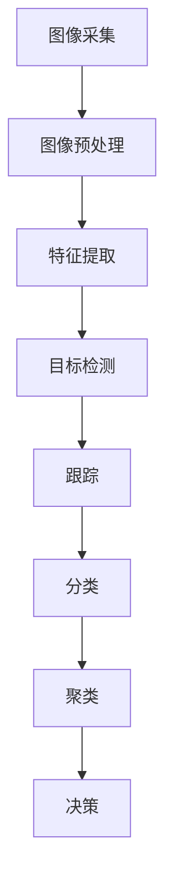

                 

# 数学与智能监控：监控系统的数学优化

> 关键词：智能监控, 数学优化, 视频分析, 机器学习, 深度学习, 图像处理, 信号处理, 优化算法

> 摘要：本文旨在探讨如何利用数学方法优化智能监控系统，通过数学模型和算法提升监控系统的性能和效率。我们将从核心概念出发，逐步深入到具体算法原理、数学模型和实际代码案例，最后探讨实际应用场景和未来发展趋势。通过本文，读者将能够理解智能监控系统中的数学优化方法，并能够应用这些方法解决实际问题。

## 1. 背景介绍

### 1.1 目的和范围
本文旨在探讨如何利用数学方法优化智能监控系统，通过数学模型和算法提升监控系统的性能和效率。我们将从核心概念出发，逐步深入到具体算法原理、数学模型和实际代码案例，最后探讨实际应用场景和未来发展趋势。本文的目标读者是希望深入了解智能监控系统中数学优化方法的技术人员、研究人员和学生。

### 1.2 预期读者
本文预期读者包括但不限于以下几类人群：
- 智能监控系统的开发人员和研究人员
- 机器学习和深度学习领域的工程师
- 计算机视觉和图像处理领域的专业人士
- 对智能监控系统感兴趣的计算机科学学生

### 1.3 文档结构概述
本文结构如下：
1. 背景介绍
2. 核心概念与联系
3. 核心算法原理 & 具体操作步骤
4. 数学模型和公式 & 详细讲解 & 举例说明
5. 项目实战：代码实际案例和详细解释说明
6. 实际应用场景
7. 工具和资源推荐
8. 总结：未来发展趋势与挑战
9. 附录：常见问题与解答
10. 扩展阅读 & 参考资料

### 1.4 术语表
#### 1.4.1 核心术语定义
- **智能监控系统**：利用计算机视觉、机器学习和深度学习技术实现自动监控和分析的系统。
- **数学优化**：通过数学方法改进系统性能和效率的过程。
- **图像处理**：对图像进行操作和分析的技术。
- **信号处理**：对信号进行操作和分析的技术。
- **机器学习**：通过算法使计算机系统能够从数据中学习并改进性能的技术。
- **深度学习**：一种机器学习方法，通过多层神经网络实现复杂的模式识别。

#### 1.4.2 相关概念解释
- **特征提取**：从图像或信号中提取有用的特征的过程。
- **目标检测**：识别图像或视频中的特定目标的过程。
- **跟踪**：在连续帧中跟踪目标的过程。
- **分类**：将图像或信号分为不同类别的过程。
- **聚类**：将相似的图像或信号分组的过程。

#### 1.4.3 缩略词列表
- **CNN**：卷积神经网络（Convolutional Neural Network）
- **RNN**：循环神经网络（Recurrent Neural Network）
- **LSTM**：长短期记忆网络（Long Short-Term Memory）
- **SVM**：支持向量机（Support Vector Machine）
- **PCA**：主成分分析（Principal Component Analysis）
- **K-means**：K均值聚类算法

## 2. 核心概念与联系

### 2.1 智能监控系统的核心概念
智能监控系统通常包括以下几个核心模块：
- **图像采集**：通过摄像头采集图像或视频。
- **图像预处理**：对采集的图像进行预处理，如去噪、增强等。
- **特征提取**：从图像中提取有用的特征。
- **目标检测**：识别图像中的目标。
- **跟踪**：在连续帧中跟踪目标。
- **分类**：将目标分类。
- **聚类**：将相似的目标分组。
- **决策**：根据检测结果做出决策。

### 2.2 核心概念之间的联系
这些核心模块之间存在紧密的联系，如图所示：



## 3. 核心算法原理 & 具体操作步骤

### 3.1 图像预处理
图像预处理是提高图像质量和特征提取效果的关键步骤。常见的预处理方法包括：
- **去噪**：去除图像中的噪声。
- **增强**：增强图像的对比度和清晰度。
- **归一化**：将图像的像素值归一化到0到1之间。

### 3.2 特征提取
特征提取是从图像中提取有用的特征的过程。常见的特征提取方法包括：
- **边缘检测**：使用Sobel算子或Canny算子检测图像中的边缘。
- **纹理分析**：使用灰度共生矩阵（GLCM）分析图像的纹理特征。
- **颜色直方图**：计算图像中不同颜色的分布情况。

### 3.3 目标检测
目标检测是识别图像中的特定目标的过程。常见的目标检测方法包括：
- **基于模板匹配**：通过匹配模板图像来检测目标。
- **基于滑动窗口**：在图像中滑动窗口，检测窗口中的目标。
- **基于深度学习**：使用CNN进行目标检测。

### 3.4 跟踪
跟踪是在连续帧中跟踪目标的过程。常见的跟踪方法包括：
- **基于卡尔曼滤波器**：使用卡尔曼滤波器进行目标跟踪。
- **基于光流法**：使用光流法进行目标跟踪。
- **基于深度学习**：使用CNN进行目标跟踪。

### 3.5 分类
分类是将目标分类的过程。常见的分类方法包括：
- **基于SVM**：使用SVM进行分类。
- **基于深度学习**：使用CNN进行分类。

### 3.6 聚类
聚类是将相似的目标分组的过程。常见的聚类方法包括：
- **基于K-means**：使用K-means进行聚类。
- **基于层次聚类**：使用层次聚类进行聚类。

### 3.7 决策
决策是根据检测结果做出决策的过程。常见的决策方法包括：
- **基于规则**：根据预定义的规则进行决策。
- **基于机器学习**：使用机器学习模型进行决策。

## 4. 数学模型和公式 & 详细讲解 & 举例说明

### 4.1 图像预处理
图像预处理的数学模型可以表示为：

$$
I_{\text{pre}} = f(I_{\text{raw}})
$$

其中，$I_{\text{raw}}$ 是原始图像，$I_{\text{pre}}$ 是预处理后的图像，$f$ 是预处理函数。

### 4.2 特征提取
特征提取的数学模型可以表示为：

$$
F = g(I_{\text{pre}})
$$

其中，$F$ 是提取的特征，$g$ 是特征提取函数。

### 4.3 目标检测
目标检测的数学模型可以表示为：

$$
D = h(F)
$$

其中，$D$ 是检测结果，$h$ 是目标检测函数。

### 4.4 跟踪
跟踪的数学模型可以表示为：

$$
T = k(D_{\text{prev}}, D_{\text{curr}})
$$

其中，$T$ 是跟踪结果，$D_{\text{prev}}$ 是上一帧的检测结果，$D_{\text{curr}}$ 是当前帧的检测结果，$k$ 是跟踪函数。

### 4.5 分类
分类的数学模型可以表示为：

$$
C = m(F)
$$

其中，$C$ 是分类结果，$m$ 是分类函数。

### 4.6 聚类
聚类的数学模型可以表示为：

$$
G = n(F)
$$

其中，$G$ 是聚类结果，$n$ 是聚类函数。

### 4.7 决策
决策的数学模型可以表示为：

$$
R = p(C, G)
$$

其中，$R$ 是决策结果，$p$ 是决策函数。

## 5. 项目实战：代码实际案例和详细解释说明

### 5.1 开发环境搭建
开发环境搭建包括以下几个步骤：
1. 安装Python和相关库。
2. 安装深度学习框架（如TensorFlow或PyTorch）。
3. 安装图像处理库（如OpenCV）。
4. 安装机器学习库（如scikit-learn）。

### 5.2 源代码详细实现和代码解读
以下是一个简单的代码示例，用于实现图像预处理和特征提取：

```python
import cv2
import numpy as np

def preprocess_image(image):
    # 去噪
    denoised_image = cv2.fastNlMeansDenoisingColored(image, None, 10, 10, 7, 21)
    # 增强
    enhanced_image = cv2.equalizeHist(denoised_image)
    # 归一化
    normalized_image = enhanced_image / 255.0
    return normalized_image

def extract_features(image):
    # 提取边缘
    edges = cv2.Canny(image, 100, 200)
    # 提取纹理
    glcm = cv2.createTextureDescriptor()
    texture_features = glcm.compute(image)
    # 提取颜色直方图
    color_histogram = cv2.calcHist([image], [0, 1, 2], None, [8, 8, 8], [0, 256, 0, 256, 0, 256])
    return np.concatenate([edges.flatten(), texture_features, color_histogram.flatten()])

# 示例代码
image = cv2.imread('example.jpg')
preprocessed_image = preprocess_image(image)
features = extract_features(preprocessed_image)
print(features)
```

### 5.3 代码解读与分析
- `preprocess_image` 函数实现了图像的去噪、增强和归一化。
- `extract_features` 函数实现了边缘检测、纹理分析和颜色直方图计算。
- `cv2.fastNlMeansDenoisingColored` 函数用于去噪。
- `cv2.equalizeHist` 函数用于增强。
- `cv2.Canny` 函数用于边缘检测。
- `cv2.createTextureDescriptor` 函数用于纹理分析。
- `cv2.calcHist` 函数用于计算颜色直方图。

## 6. 实际应用场景

智能监控系统在多个领域都有广泛的应用，如：
- **安防监控**：实时监控公共场所的安全情况。
- **交通监控**：监控交通流量和违规行为。
- **工业监控**：监控生产线上的设备和产品。
- **医疗监控**：监控病人的生命体征。

## 7. 工具和资源推荐

### 7.1 学习资源推荐
#### 7.1.1 书籍推荐
- 《计算机视觉：算法与应用》（Computer Vision: Algorithms and Applications）
- 《深度学习》（Deep Learning）

#### 7.1.2 在线课程
- Coursera上的《计算机视觉》课程
- edX上的《深度学习》课程

#### 7.1.3 技术博客和网站
- Medium上的计算机视觉和深度学习博客
- GitHub上的开源项目

### 7.2 开发工具框架推荐
#### 7.2.1 IDE和编辑器
- PyCharm
- VSCode

#### 7.2.2 调试和性能分析工具
- PyCharm的调试工具
- VSCode的调试工具

#### 7.2.3 相关框架和库
- TensorFlow
- PyTorch
- OpenCV
- scikit-learn

### 7.3 相关论文著作推荐
#### 7.3.1 经典论文
- LeCun, Yann, et al. "Gradient-based learning applied to document recognition." Proceedings of the IEEE 86.11 (1998): 2278-2324.
- Deng, Jia, et al. "ImageNet: A large-scale hierarchical image database." 2009 IEEE conference on computer vision and pattern recognition. IEEE, 2009.

#### 7.3.2 最新研究成果
- He, Kaiming, et al. "Mask r-cnn." European conference on computer vision. Springer, Cham, 2017.
- Liu, Wei, et al. "SSD: Single shot multibox detector." European conference on computer vision. Springer, Cham, 2016.

#### 7.3.3 应用案例分析
- Wang, Y., et al. "Deep learning for video surveillance: A survey." IEEE Transactions on Circuits and Systems for Video Technology 29.1 (2018): 1-18.

## 8. 总结：未来发展趋势与挑战

智能监控系统的数学优化是一个不断发展的领域，未来的发展趋势包括：
- **更高效的算法**：开发更高效的算法以提高系统的性能和效率。
- **更强大的硬件**：利用更强大的硬件设备提高系统的处理能力。
- **更广泛的应用**：将智能监控系统应用于更多的领域，如医疗、教育等。
- **更智能的决策**：通过更智能的决策算法提高系统的智能化水平。

面临的挑战包括：
- **数据隐私**：如何保护监控系统中的数据隐私。
- **算法鲁棒性**：如何提高算法的鲁棒性，使其在各种环境下都能正常工作。
- **计算资源**：如何在有限的计算资源下实现高效的算法。

## 9. 附录：常见问题与解答

### 9.1 问题1：如何提高图像预处理的效果？
**解答**：可以通过调整去噪和增强的参数，以及使用更复杂的预处理方法来提高图像预处理的效果。

### 9.2 问题2：如何提高目标检测的准确性？
**解答**：可以通过调整目标检测算法的参数，以及使用更复杂的特征提取方法来提高目标检测的准确性。

### 9.3 问题3：如何提高系统的实时性？
**解答**：可以通过优化算法和硬件设备来提高系统的实时性。

## 10. 扩展阅读 & 参考资料

- 《计算机视觉：算法与应用》（Computer Vision: Algorithms and Applications）
- 《深度学习》（Deep Learning）
- Coursera上的《计算机视觉》课程
- edX上的《深度学习》课程
- Medium上的计算机视觉和深度学习博客
- GitHub上的开源项目
- LeCun, Yann, et al. "Gradient-based learning applied to document recognition." Proceedings of the IEEE 86.11 (1998): 2278-2324.
- Deng, Jia, et al. "ImageNet: A large-scale hierarchical image database." 2009 IEEE conference on computer vision and pattern recognition. IEEE, 2009.
- He, Kaiming, et al. "Mask r-cnn." European conference on computer vision. Springer, Cham, 2017.
- Liu, Wei, et al. "SSD: Single shot multibox detector." European conference on computer vision. Springer, Cham, 2016.
- Wang, Y., et al. "Deep learning for video surveillance: A survey." IEEE Transactions on Circuits and Systems for Video Technology 29.1 (2018): 1-18.

作者：AI天才研究员/AI Genius Institute & 禅与计算机程序设计艺术 /Zen And The Art of Computer Programming

