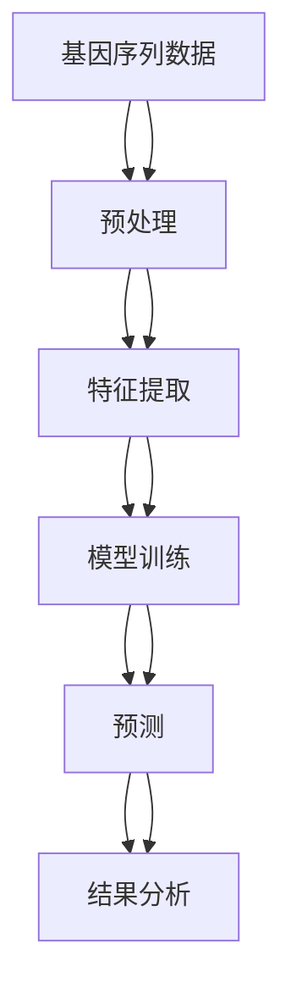
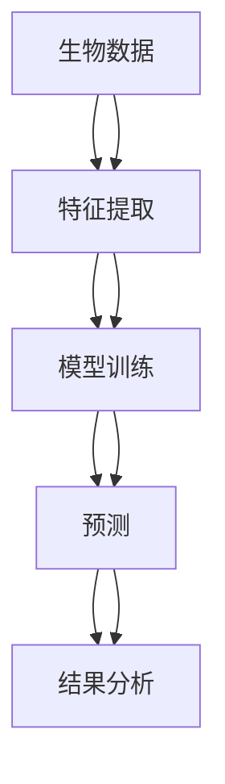

                 

# 数学与未来基因工程的发展方向

> 关键词：基因工程、数学模型、算法、生物信息学、机器学习、基因编辑、合成生物学

> 摘要：本文旨在探讨数学在基因工程中的核心作用，通过分析数学模型、算法原理和具体操作步骤，揭示数学如何推动基因工程的发展。我们将从数学模型和公式入手，结合实际代码案例，深入探讨数学在基因工程中的应用，并展望未来的发展趋势和挑战。

## 1. 背景介绍
### 1.1 目的和范围
本文旨在探讨数学在基因工程中的核心作用，通过分析数学模型、算法原理和具体操作步骤，揭示数学如何推动基因工程的发展。我们将从数学模型和公式入手，结合实际代码案例，深入探讨数学在基因工程中的应用，并展望未来的发展趋势和挑战。

### 1.2 预期读者
本文适合以下读者：
- 基因工程领域的研究人员和工程师
- 生物信息学领域的专业人士
- 机器学习和人工智能领域的开发者
- 对基因工程和数学交叉领域感兴趣的学者和学生

### 1.3 文档结构概述
本文结构如下：
1. 背景介绍
2. 核心概念与联系
3. 核心算法原理 & 具体操作步骤
4. 数学模型和公式 & 详细讲解 & 举例说明
5. 项目实战：代码实际案例和详细解释说明
6. 实际应用场景
7. 工具和资源推荐
8. 总结：未来发展趋势与挑战
9. 附录：常见问题与解答
10. 扩展阅读 & 参考资料

### 1.4 术语表
#### 1.4.1 核心术语定义
- **基因工程**：通过人工手段对生物体的基因进行操作，以改变其遗传特性。
- **生物信息学**：利用计算机科学、统计学和数学方法处理生物数据。
- **机器学习**：一种人工智能技术，通过算法使计算机从数据中学习并做出预测或决策。
- **合成生物学**：通过设计和构建新的生物系统来创造新的功能。

#### 1.4.2 相关概念解释
- **基因编辑**：通过修改基因序列来改变生物体的遗传特性。
- **CRISPR-Cas9**：一种基因编辑技术，利用CRISPR RNA和Cas9酶实现精确的基因编辑。
- **基因表达**：基因在细胞中的活动过程，包括转录和翻译。

#### 1.4.3 缩略词列表
- **CRISPR**：Clustered Regularly Interspaced Short Palindromic Repeats
- **Cas9**：CRISPR-associated protein 9
- **RNA**：Ribonucleic Acid
- **DNA**：Deoxyribonucleic Acid

## 2. 核心概念与联系
### 2.1 基因工程的基本概念
基因工程涉及对生物体的基因进行操作，以改变其遗传特性。这一过程通常包括以下几个步骤：
1. **基因克隆**：将目标基因从一个生物体转移到另一个生物体。
2. **基因表达**：通过调控基因的转录和翻译过程，使目标基因在细胞中表达。
3. **基因编辑**：通过精确修改基因序列来改变生物体的遗传特性。

### 2.2 数学在基因工程中的作用
数学在基因工程中的作用主要体现在以下几个方面：
1. **生物信息学**：利用统计学和数学方法处理生物数据，如基因序列、蛋白质结构等。
2. **机器学习**：通过算法使计算机从生物数据中学习并做出预测或决策。
3. **基因编辑**：通过精确的数学模型和算法实现基因编辑。

### 2.3 核心概念原理与架构
#### 2.3.1 生物信息学流程图


#### 2.3.2 机器学习流程图


## 3. 核心算法原理 & 具体操作步骤
### 3.1 生物信息学算法
#### 3.1.1 序列比对算法
序列比对算法用于比较两个或多个基因序列，找出它们之间的相似性。常见的序列比对算法包括BLAST和Smith-Waterman算法。

```python
# Smith-Waterman算法伪代码
def smith_waterman(seq1, seq2, match_score, mismatch_score, gap_penalty):
    m, n = len(seq1), len(seq2)
    score_matrix = [[0] * (n + 1) for _ in range(m + 1)]
    best_score = 0
    best_pos = (0, 0)
    
    for i in range(1, m + 1):
        for j in range(1, n + 1):
            match = score_matrix[i-1][j-1] + (match_score if seq1[i-1] == seq2[j-1] else mismatch_score)
            delete = score_matrix[i-1][j] - gap_penalty
            insert = score_matrix[i][j-1] - gap_penalty
            score_matrix[i][j] = max(0, match, delete, insert)
            
            if score_matrix[i][j] > best_score:
                best_score = score_matrix[i][j]
                best_pos = (i, j)
    
    return best_score, best_pos
```

### 3.2 机器学习算法
#### 3.2.1 支持向量机（SVM）
支持向量机是一种监督学习算法，用于分类和回归分析。在基因工程中，SVM可以用于预测基因表达水平。

```python
# SVM算法伪代码
def svm_train(X, y):
    # X: 特征矩阵
    # y: 标签向量
    # 使用libsvm库进行训练
    model = svm_train(X, y)
    return model

def svm_predict(model, X):
    # 使用训练好的模型进行预测
    y_pred = svm_predict(model, X)
    return y_pred
```

## 4. 数学模型和公式 & 详细讲解 & 举例说明
### 4.1 生物信息学模型
#### 4.1.1 BLAST算法
BLAST算法是一种广泛使用的序列比对算法，用于在数据库中查找与查询序列相似的序列。

$$
\text{BLAST score} = \sum_{i=1}^{m} \sum_{j=1}^{n} \text{score}(x_i, y_j)
$$

其中，$x_i$ 和 $y_j$ 分别表示查询序列和数据库序列中的第 $i$ 个和第 $j$ 个碱基，$\text{score}(x_i, y_j)$ 表示碱基对之间的得分。

### 4.2 机器学习模型
#### 4.2.1 SVM模型
支持向量机是一种监督学习算法，用于分类和回归分析。在基因工程中，SVM可以用于预测基因表达水平。

$$
\text{SVM score} = \sum_{i=1}^{N} \alpha_i y_i K(x_i, x) + b
$$

其中，$\alpha_i$ 是拉格朗日乘子，$y_i$ 是样本标签，$K(x_i, x)$ 是核函数，$b$ 是偏置项。

## 5. 项目实战：代码实际案例和详细解释说明
### 5.1 开发环境搭建
#### 5.1.1 环境配置
- **Python**：版本3.8及以上
- **NumPy**：用于数值计算
- **Pandas**：用于数据处理
- **scikit-learn**：用于机器学习
- **biopython**：用于生物信息学

```bash
pip install numpy pandas scikit-learn biopython
```

### 5.2 源代码详细实现和代码解读
#### 5.2.1 序列比对代码
```python
from Bio import pairwise2
from Bio.Seq import Seq

def blast_similarity(seq1, seq2):
    alignments = pairwise2.align.globalxx(seq1, seq2)
    best_alignment = alignments[0]
    score = best_alignment.score
    return score

seq1 = Seq("ATCGATCG")
seq2 = Seq("ATCGATCG")
score = blast_similarity(seq1, seq2)
print(f"BLAST score: {score}")
```

#### 5.2.2 SVM代码
```python
from sklearn import svm
from sklearn.model_selection import train_test_split
import pandas as pd

# 假设我们有一个基因表达数据集
data = pd.read_csv("gene_expression.csv")
X = data.drop("expression", axis=1)
y = data["expression"]

X_train, X_test, y_train, y_test = train_test_split(X, y, test_size=0.2, random_state=42)

model = svm.SVR(kernel='linear')
model.fit(X_train, y_train)

y_pred = model.predict(X_test)
print(f"Predicted expression levels: {y_pred}")
```

### 5.3 代码解读与分析
#### 5.3.1 序列比对代码解读
- **pairwise2.align.globalxx**：全局序列比对函数，返回最佳比对结果。
- **best_alignment.score**：比对得分，表示序列相似性。

#### 5.3.2 SVM代码解读
- **train_test_split**：将数据集分为训练集和测试集。
- **svm.SVR**：支持向量回归模型。
- **fit**：训练模型。
- **predict**：使用模型进行预测。

## 6. 实际应用场景
### 6.1 基因表达预测
通过机器学习模型预测基因表达水平，可以为基因工程提供重要的参考信息。

### 6.2 基因编辑优化
通过数学模型优化基因编辑过程，提高基因编辑的准确性和效率。

### 6.3 合成生物学设计
利用数学模型设计新的生物系统，实现特定的功能。

## 7. 工具和资源推荐
### 7.1 学习资源推荐
#### 7.1.1 书籍推荐
- **《生物信息学导论》**：深入讲解生物信息学的基本概念和方法。
- **《机器学习实战》**：详细讲解机器学习算法及其应用。

#### 7.1.2 在线课程
- **Coursera**：提供生物信息学和机器学习的在线课程。
- **edX**：提供基因工程和合成生物学的在线课程。

#### 7.1.3 技术博客和网站
- **Bioinformatics.org**：提供生物信息学领域的最新资讯和技术文章。
- **MachineLearningMastery**：提供机器学习领域的教程和技术文章。

### 7.2 开发工具框架推荐
#### 7.2.1 IDE和编辑器
- **PyCharm**：功能强大的Python IDE。
- **Jupyter Notebook**：用于数据科学和机器学习的交互式环境。

#### 7.2.2 调试和性能分析工具
- **PyCharm Debugger**：PyCharm内置的调试工具。
- **LineProfiler**：用于分析Python代码的性能。

#### 7.2.3 相关框架和库
- **scikit-learn**：用于机器学习。
- **biopython**：用于生物信息学。

### 7.3 相关论文著作推荐
#### 7.3.1 经典论文
- **"A Practical Guide to Support Vector Classification"**：详细讲解SVM算法。
- **"BLAST: The Basic Local Alignment Search Tool"**：介绍BLAST算法。

#### 7.3.2 最新研究成果
- **"Deep Learning for Genomics"**：探讨深度学习在基因工程中的应用。
- **"Synthetic Biology: A Primer"**：介绍合成生物学的基本概念和方法。

#### 7.3.3 应用案例分析
- **"Genome Engineering with CRISPR-Cas9"**：分析CRISPR-Cas9在基因编辑中的应用。
- **"Machine Learning in Bioinformatics"**：探讨机器学习在生物信息学中的应用。

## 8. 总结：未来发展趋势与挑战
### 8.1 未来发展趋势
- **深度学习**：深度学习在基因工程中的应用将更加广泛。
- **合成生物学**：合成生物学将推动基因工程的发展。
- **个性化医疗**：通过基因工程实现个性化医疗将成为趋势。

### 8.2 面临的挑战
- **伦理问题**：基因编辑技术的伦理问题需要解决。
- **数据安全**：生物数据的安全性需要加强。
- **技术瓶颈**：基因编辑技术的精确性和效率需要进一步提高。

## 9. 附录：常见问题与解答
### 9.1 问题1：如何提高基因编辑的准确性？
- **答案**：通过优化算法和模型，提高基因编辑的准确性。

### 9.2 问题2：如何处理生物数据的安全性问题？
- **答案**：采用加密技术和访问控制机制，确保生物数据的安全性。

## 10. 扩展阅读 & 参考资料
- **《生物信息学导论》**：深入讲解生物信息学的基本概念和方法。
- **《机器学习实战》**：详细讲解机器学习算法及其应用。
- **"A Practical Guide to Support Vector Classification"**：详细讲解SVM算法。
- **"BLAST: The Basic Local Alignment Search Tool"**：介绍BLAST算法。
- **"Deep Learning for Genomics"**：探讨深度学习在基因工程中的应用。
- **"Synthetic Biology: A Primer"**：介绍合成生物学的基本概念和方法。

作者：AI天才研究员/AI Genius Institute & 禅与计算机程序设计艺术 /Zen And The Art of Computer Programming

