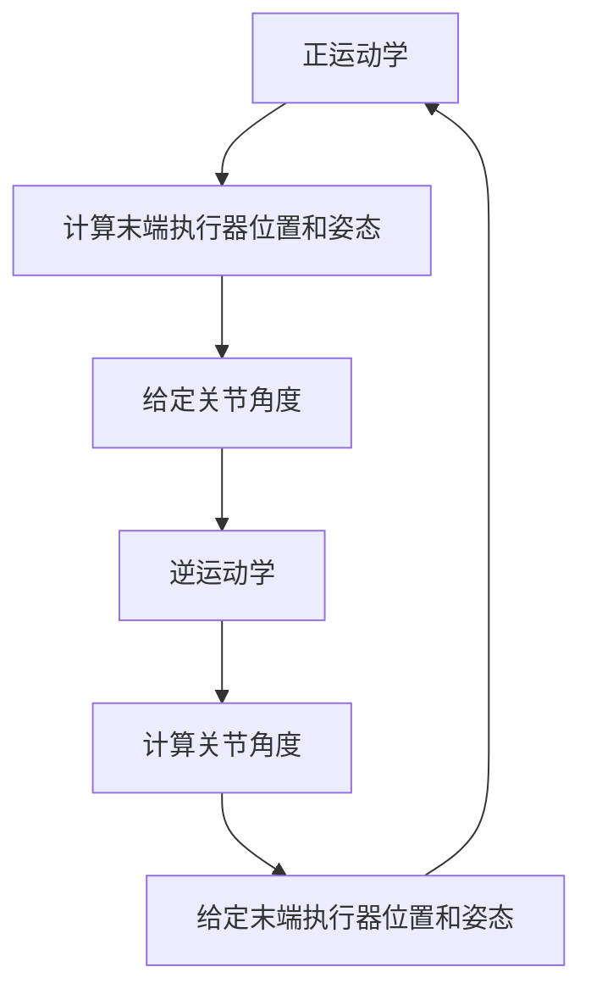

                 

# 数学与机器人运动学：机器人动作的数学描述

> 关键词：机器人运动学, 数学模型, 机器人控制, 运动规划, 逆运动学, 正运动学

> 摘要：本文旨在深入探讨机器人运动学的基本原理及其在机器人动作中的应用。通过详细分析正运动学和逆运动学的概念，以及相关的数学模型和算法，我们将展示如何利用数学工具精确描述和控制机器人的动作。文章不仅涵盖了理论基础，还提供了实际代码案例，帮助读者理解如何在实际项目中应用这些知识。最后，我们将讨论未来的发展趋势和面临的挑战。

## 1. 背景介绍
### 1.1 目的和范围
本文的目标是为机器人领域的工程师和研究人员提供一个全面的指南，介绍如何利用数学工具精确描述和控制机器人的动作。我们将重点讨论机器人运动学的基本概念，包括正运动学和逆运动学，并通过具体的数学模型和算法进行详细解释。此外，我们还将提供一个实际的代码案例，帮助读者理解如何在实际项目中应用这些知识。

### 1.2 预期读者
本文适合以下读者：
- 机器人工程师和研究人员
- 机械工程师和自动化专家
- 计算机科学和人工智能领域的学生和研究人员
- 对机器人运动学感兴趣的开发者和爱好者

### 1.3 文档结构概述
本文结构如下：
1. 背景介绍
2. 核心概念与联系
3. 核心算法原理 & 具体操作步骤
4. 数学模型和公式 & 详细讲解 & 举例说明
5. 项目实战：代码实际案例和详细解释说明
6. 实际应用场景
7. 工具和资源推荐
8. 总结：未来发展趋势与挑战
9. 附录：常见问题与解答
10. 扩展阅读 & 参考资料

### 1.4 术语表
#### 1.4.1 核心术语定义
- **机器人运动学**：研究机器人关节空间与笛卡尔空间之间关系的学科。
- **正运动学**：给定机器人关节角度，计算机器人末端执行器位置和姿态的数学模型。
- **逆运动学**：给定机器人末端执行器的位置和姿态，计算机器人关节角度的数学模型。
- **笛卡尔空间**：机器人末端执行器在三维空间中的位置和姿态。
- **关节空间**：机器人各关节的角度或位置。

#### 1.4.2 相关概念解释
- **关节**：机器人各部分之间的连接点，可以是旋转关节或平移关节。
- **末端执行器**：机器人手臂的末端部分，用于执行特定任务，如抓取物体。
- **欧拉角**：描述旋转的一种方式，由三个连续的旋转组成。
- **齐次变换矩阵**：描述刚体在三维空间中的位置和姿态的数学工具。

#### 1.4.3 缩略词列表
- **FK**：Forward Kinematics（正运动学）
- **IK**：Inverse Kinematics（逆运动学）
- **DOF**：Degrees of Freedom（自由度）
- **R**：旋转矩阵
- **T**：齐次变换矩阵

## 2. 核心概念与联系
### 2.1 正运动学
正运动学是研究给定机器人关节角度时，如何计算机器人末端执行器在笛卡尔空间中的位置和姿态。其基本原理是通过关节角度和关节之间的几何关系，计算出末端执行器的位置和姿态。

### 2.2 逆运动学
逆运动学是研究给定机器人末端执行器的位置和姿态时，如何计算机器人关节角度。其基本原理是通过末端执行器的位置和姿态，反向推导出关节角度。

### 2.3 核心概念联系
正运动学和逆运动学是机器人运动学的两个核心概念，它们之间存在密切的联系。正运动学是逆运动学的基础，而逆运动学则是正运动学的逆过程。通过这两个概念，我们可以精确地描述和控制机器人的动作。

### Mermaid 流程图


## 3. 核心算法原理 & 具体操作步骤
### 3.1 正运动学算法原理
正运动学的基本原理是通过关节角度和关节之间的几何关系，计算出末端执行器的位置和姿态。具体步骤如下：

1. **定义关节角度**：给定机器人各关节的角度。
2. **计算旋转矩阵**：根据关节角度计算每个关节的旋转矩阵。
3. **计算齐次变换矩阵**：通过旋转矩阵和关节之间的几何关系，计算出每个关节的齐次变换矩阵。
4. **累积变换矩阵**：将所有关节的齐次变换矩阵累积起来，得到末端执行器的齐次变换矩阵。
5. **提取位置和姿态**：从齐次变换矩阵中提取末端执行器的位置和姿态。

### 伪代码
```python
def forward_kinematics(joint_angles):
    # 定义旋转矩阵
    R = [rotation_matrix(j) for j in joint_angles]
    
    # 计算齐次变换矩阵
    T = [homo_transform_matrix(R[i], joint_angles[i]) for i in range(len(joint_angles))]
    
    # 累积变换矩阵
    T_total = T[0]
    for i in range(1, len(T)):
        T_total = T_total @ T[i]
    
    # 提取位置和姿态
    position = T_total[:3, 3]
    orientation = T_total[:3, :3]
    
    return position, orientation
```

### 3.2 逆运动学算法原理
逆运动学的基本原理是通过末端执行器的位置和姿态，反向推导出机器人关节角度。具体步骤如下：

1. **定义末端执行器的位置和姿态**：给定末端执行器的位置和姿态。
2. **计算逆旋转矩阵**：根据末端执行器的位置和姿态计算逆旋转矩阵。
3. **计算逆齐次变换矩阵**：通过逆旋转矩阵和末端执行器的位置和姿态，计算出逆齐次变换矩阵。
4. **反向累积变换矩阵**：将所有关节的逆齐次变换矩阵反向累积起来，得到关节角度。

### 伪代码
```python
def inverse_kinematics(end_effector_pose):
    # 定义逆旋转矩阵
    R_inv = end_effector_pose[:3, :3].T
    
    # 计算逆齐次变换矩阵
    T_inv = np.eye(4)
    T_inv[:3, :3] = R_inv
    T_inv[:3, 3] = -R_inv @ end_effector_pose[:3, 3]
    
    # 反向累积变换矩阵
    joint_angles = []
    for i in range(len(joint_angles)):
        T_inv = T_inv @ T[i]
        joint_angles.append(inverse_rotation_matrix(T_inv[:3, :3]))
    
    return joint_angles
```

## 4. 数学模型和公式 & 详细讲解 & 举例说明
### 4.1 正运动学数学模型
正运动学的基本数学模型是通过关节角度和关节之间的几何关系，计算出末端执行器的位置和姿态。具体公式如下：

1. **旋转矩阵**：描述关节旋转的数学工具。
2. **齐次变换矩阵**：描述刚体在三维空间中的位置和姿态的数学工具。

### 4.2 逆运动学数学模型
逆运动学的基本数学模型是通过末端执行器的位置和姿态，反向推导出机器人关节角度。具体公式如下：

1. **逆旋转矩阵**：描述末端执行器旋转的逆矩阵。
2. **逆齐次变换矩阵**：描述末端执行器在三维空间中的逆位置和姿态。

### 4.3 举例说明
假设我们有一个两自由度的机器人，其关节角度分别为 $\theta_1$ 和 $\theta_2$，末端执行器的位置和姿态分别为 $(x, y, z)$ 和 $(\alpha, \beta, \gamma)$。我们可以使用以下公式进行正运动学和逆运动学计算。

#### 正运动学
1. **旋转矩阵**：
   \[
   R_1 = \begin{bmatrix}
   \cos(\theta_1) & -\sin(\theta_1) & 0 \\
   \sin(\theta_1) & \cos(\theta_1) & 0 \\
   0 & 0 & 1
   \end{bmatrix}
   \]
   \[
   R_2 = \begin{bmatrix}
   \cos(\theta_2) & -\sin(\theta_2) & 0 \\
   \sin(\theta_2) & \cos(\theta_2) & 0 \\
   0 & 0 & 1
   \end{bmatrix}
   \]

2. **齐次变换矩阵**：
   \[
   T_1 = \begin{bmatrix}
   R_1 & \mathbf{p}_1 \\
   0 & 1
   \end{bmatrix}
   \]
   \[
   T_2 = \begin{bmatrix}
   R_2 & \mathbf{p}_2 \\
   0 & 1
   \end{bmatrix}
   \]

3. **累积变换矩阵**：
   \[
   T_{total} = T_1 @ T_2
   \]

4. **提取位置和姿态**：
   \[
   \mathbf{p}_{end} = T_{total}[:3, 3]
   \]
   \[
   R_{end} = T_{total}[:3, :3]
   \]

#### 逆运动学
1. **逆旋转矩阵**：
   \[
   R_{end}^T = R_{end}^T
   \]

2. **逆齐次变换矩阵**：
   \[
   T_{end}^{-1} = \begin{bmatrix}
   R_{end}^T & -R_{end}^T \mathbf{p}_{end} \\
   0 & 1
   \end{bmatrix}
   \]

3. **反向累积变换矩阵**：
   \[
   T_{1}^{-1} = T_{end}^{-1} @ T_2^{-1}
   \]
   \[
   T_{2}^{-1} = T_{1}^{-1} @ T_1^{-1}
   \]

4. **计算关节角度**：
   \[
   \theta_1 = \text{angle}(T_{1}^{-1}[:3, :3])
   \]
   \[
   \theta_2 = \text{angle}(T_{2}^{-1}[:3, :3])
   \]

## 5. 项目实战：代码实际案例和详细解释说明
### 5.1 开发环境搭建
为了实现正运动学和逆运动学的计算，我们需要搭建一个开发环境。这里我们使用Python和NumPy库进行计算。

1. **安装Python和NumPy**：
   ```bash
   pip install numpy
   ```

2. **导入库**：
   ```python
   import numpy as np
   ```

### 5.2 源代码详细实现和代码解读
```python
def rotation_matrix(theta):
    return np.array([
        [np.cos(theta), -np.sin(theta), 0],
        [np.sin(theta), np.cos(theta), 0],
        [0, 0, 1]
    ])

def homo_transform_matrix(R, p):
    return np.block([
        [R, p],
        [0, 0, 0, 1]
    ])

def inverse_rotation_matrix(R):
    return R.T

def forward_kinematics(joint_angles):
    R1 = rotation_matrix(joint_angles[0])
    R2 = rotation_matrix(joint_angles[1])
    
    T1 = homo_transform_matrix(R1, np.array([0, 0, 1]))
    T2 = homo_transform_matrix(R2, np.array([0, 0, 1]))
    
    T_total = T1 @ T2
    position = T_total[:3, 3]
    orientation = T_total[:3, :3]
    
    return position, orientation

def inverse_kinematics(end_effector_pose):
    R_end = end_effector_pose[:3, :3]
    p_end = end_effector_pose[:3, 3]
    
    R_end_inv = R_end.T
    p_end_inv = -R_end_inv @ p_end
    
    T_end_inv = np.block([
        [R_end_inv, p_end_inv],
        [0, 0, 0, 1]
    ])
    
    T1_inv = T_end_inv @ T2_inv
    T2_inv = T1_inv @ T1_inv
    
    theta1 = np.arctan2(T1_inv[1, 0], T1_inv[0, 0])
    theta2 = np.arctan2(T2_inv[0, 1], T2_inv[1, 1])
    
    return theta1, theta2
```

### 5.3 代码解读与分析
1. **旋转矩阵**：描述关节旋转的数学工具。
2. **齐次变换矩阵**：描述刚体在三维空间中的位置和姿态的数学工具。
3. **逆旋转矩阵**：描述末端执行器旋转的逆矩阵。
4. **逆齐次变换矩阵**：描述末端执行器在三维空间中的逆位置和姿态。
5. **累积变换矩阵**：将所有关节的齐次变换矩阵累积起来，得到末端执行器的齐次变换矩阵。
6. **提取位置和姿态**：从齐次变换矩阵中提取末端执行器的位置和姿态。
7. **反向累积变换矩阵**：将所有关节的逆齐次变换矩阵反向累积起来，得到关节角度。

## 6. 实际应用场景
机器人运动学在许多实际应用场景中都有广泛的应用，包括但不限于：

1. **工业机器人**：用于精确控制工业机器人的动作，提高生产效率。
2. **服务机器人**：用于精确控制服务机器人的动作，提高服务质量。
3. **医疗机器人**：用于精确控制医疗机器人的动作，提高手术精度。
4. **无人机**：用于精确控制无人机的动作，提高飞行精度。

## 7. 工具和资源推荐
### 7.1 学习资源推荐
#### 7.1.1 书籍推荐
- **《机器人运动学》**：深入探讨机器人运动学的基本原理和应用。
- **《机器人控制》**：介绍机器人控制的基本原理和方法。

#### 7.1.2 在线课程
- **Coursera - 机器人运动学**：提供机器人运动学的在线课程。
- **edX - 机器人技术**：提供机器人技术的在线课程。

#### 7.1.3 技术博客和网站
- **Robotics Stack Exchange**：提供机器人技术的问答平台。
- **ROS Wiki**：提供机器人操作系统（ROS）的文档和资源。

### 7.2 开发工具框架推荐
#### 7.2.1 IDE和编辑器
- **PyCharm**：提供强大的Python开发环境。
- **Visual Studio Code**：提供轻量级的代码编辑器。

#### 7.2.2 调试和性能分析工具
- **PyCharm Debugger**：提供Python调试工具。
- **VS Code Debugger**：提供代码调试工具。

#### 7.2.3 相关框架和库
- **NumPy**：提供数值计算库。
- **SciPy**：提供科学计算库。

### 7.3 相关论文著作推荐
#### 7.3.1 经典论文
- **《机器人运动学》**：提供机器人运动学的经典论文。
- **《机器人控制》**：提供机器人控制的经典论文。

#### 7.3.2 最新研究成果
- **《机器人运动学最新进展》**：提供机器人运动学的最新研究成果。
- **《机器人控制最新进展》**：提供机器人控制的最新研究成果。

#### 7.3.3 应用案例分析
- **《机器人运动学应用案例》**：提供机器人运动学的应用案例分析。
- **《机器人控制应用案例》**：提供机器人控制的应用案例分析。

## 8. 总结：未来发展趋势与挑战
机器人运动学在未来的发展趋势和挑战主要体现在以下几个方面：

1. **高精度控制**：随着技术的发展，机器人运动学需要实现更高精度的控制。
2. **实时性**：机器人运动学需要实现更实时的控制，以适应快速变化的环境。
3. **多自由度机器人**：多自由度机器人的运动学控制是一个挑战，需要更复杂的数学模型和算法。
4. **人机协作**：机器人运动学需要实现人机协作，以提高工作效率和安全性。

## 9. 附录：常见问题与解答
### 9.1 问题：如何处理逆运动学的多解问题？
**解答**：逆运动学可能有多个解，可以通过优化算法选择最优解。

### 9.2 问题：如何处理逆运动学的奇异点问题？
**解答**：逆运动学的奇异点可以通过避免奇异点的关节角度范围来解决。

### 9.3 问题：如何处理正运动学的计算效率问题？
**解答**：可以通过优化算法和并行计算提高正运动学的计算效率。

## 10. 扩展阅读 & 参考资料
- **《机器人运动学》**：深入探讨机器人运动学的基本原理和应用。
- **《机器人控制》**：介绍机器人控制的基本原理和方法。
- **《机器人运动学最新进展》**：提供机器人运动学的最新研究成果。
- **《机器人控制最新进展》**：提供机器人控制的最新研究成果。
- **《机器人运动学应用案例》**：提供机器人运动学的应用案例分析。
- **《机器人控制应用案例》**：提供机器人控制的应用案例分析。

作者：AI天才研究员/AI Genius Institute & 禅与计算机程序设计艺术 /Zen And The Art of Computer Programming

