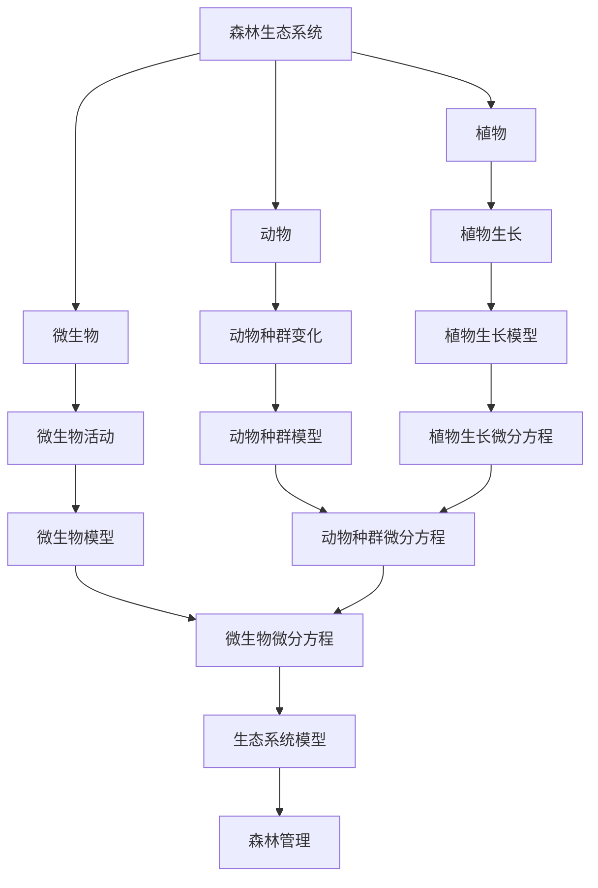

                 

# 数学与林业科学：森林生态的数学模型

> 关键词：森林生态、数学模型、生态学、系统动力学、微分方程、Python编程、森林管理、可持续发展

> 摘要：本文旨在探讨如何利用数学模型来理解和预测森林生态系统的动态变化。通过构建森林生态系统的数学模型，我们可以更好地理解森林生态系统的复杂性，并为森林管理和可持续发展提供科学依据。本文将从森林生态系统的背景介绍出发，逐步深入到核心概念、算法原理、数学模型、代码实现、实际应用场景，以及未来的发展趋势与挑战。最后，我们将提供一系列学习资源和开发工具推荐，帮助读者进一步深入研究和实践。

## 1. 背景介绍
### 1.1 目的和范围
本文旨在通过数学模型来研究森林生态系统的动态变化，以支持森林管理和可持续发展。我们将介绍森林生态系统的背景知识，探讨如何利用数学模型来模拟森林生态系统的复杂性，并提供实际的代码案例。本文的目标读者包括生态学家、林业科学家、计算机科学家以及对森林生态系统感兴趣的读者。

### 1.2 预期读者
- 生态学家：希望通过数学模型更好地理解森林生态系统的动态变化。
- 林业科学家：希望通过模型优化森林管理策略，提高森林资源的可持续利用。
- 计算机科学家：希望通过实际编程案例学习如何将数学模型应用于实际问题。
- 对森林生态系统感兴趣的读者：希望通过本文了解森林生态系统的复杂性及其管理方法。

### 1.3 文档结构概述
本文将按照以下结构展开：
1. 背景介绍
2. 核心概念与联系
3. 核心算法原理 & 具体操作步骤
4. 数学模型和公式 & 详细讲解 & 举例说明
5. 项目实战：代码实际案例和详细解释说明
6. 实际应用场景
7. 工具和资源推荐
8. 总结：未来发展趋势与挑战
9. 附录：常见问题与解答
10. 扩展阅读 & 参考资料

### 1.4 术语表
#### 1.4.1 核心术语定义
- 森林生态系统：由植物、动物、微生物及其环境相互作用形成的复杂系统。
- 生态模型：用于描述和预测生态系统动态变化的数学模型。
- 微分方程：描述系统随时间变化的数学表达式。
- 系统动力学：研究系统随时间变化的理论和方法。
- 森林管理：通过科学方法管理和保护森林资源，以实现可持续发展。

#### 1.4.2 相关概念解释
- 生态位：物种在生态系统中所占据的位置和作用。
- 生态平衡：生态系统中各生物种群之间相对稳定的状态。
- 森林碳汇：森林通过光合作用吸收二氧化碳的能力。

#### 1.4.3 缩略词列表
- Ecosystem：生态系统
- Model：模型
- Differential Equation：微分方程
- System Dynamics：系统动力学
- Forest Management：森林管理

## 2. 核心概念与联系
### 2.1 森林生态系统的组成
森林生态系统由植物、动物、微生物及其环境组成。植物包括树木、灌木、草本植物等；动物包括昆虫、鸟类、哺乳动物等；微生物包括细菌、真菌等。这些生物之间通过食物链和食物网相互作用，形成复杂的生态系统。

### 2.2 生态模型的构建
生态模型是通过数学方法描述生态系统动态变化的工具。通过构建生态模型，我们可以预测生态系统随时间的变化趋势，从而为森林管理和保护提供科学依据。

### 2.3 微分方程的应用
微分方程是描述系统随时间变化的数学表达式。在森林生态系统中，微分方程可以用来描述植物生长、动物种群变化等动态过程。通过求解微分方程，我们可以预测生态系统随时间的变化趋势。

### 2.4 系统动力学的原理
系统动力学是一种研究系统随时间变化的理论和方法。通过系统动力学，我们可以构建森林生态系统的数学模型，从而更好地理解森林生态系统的复杂性。

### 2.5 核心概念的Mermaid流程图


## 3. 核心算法原理 & 具体操作步骤
### 3.1 植物生长模型
植物生长模型可以描述植物随时间的变化趋势。通过微分方程，我们可以描述植物生长的速度和变化趋势。以下是一个简单的植物生长模型的伪代码实现：

```python
def plant_growth(t, P, r, K):
    """
    植物生长模型
    :param t: 时间
    :param P: 当前植物数量
    :param r: 生长速率
    :param K: 环境容量
    :return: 植物数量变化
    """
    dP_dt = r * P * (1 - P / K)
    return dP_dt
```

### 3.2 动物种群模型
动物种群模型可以描述动物种群随时间的变化趋势。通过微分方程，我们可以描述动物种群的增长和变化趋势。以下是一个简单的动物种群模型的伪代码实现：

```python
def animal_population(t, N, r, K, a, b):
    """
    动物种群模型
    :param t: 时间
    :param N: 当前动物数量
    :param r: 生长速率
    :param K: 环境容量
    :param a: 捕食者数量
    :param b: 捕食者对猎物的影响
    :return: 动物数量变化
    """
    dN_dt = r * N * (1 - N / K) - a * N * b
    return dN_dt
```

### 3.3 微分方程的求解
微分方程的求解可以通过数值方法实现。以下是一个简单的微分方程求解的伪代码实现：

```python
def solve_differential_equation(t, initial_value, rate, capacity, time_step, total_time):
    """
    求解微分方程
    :param t: 时间
    :param initial_value: 初始值
    :param rate: 生长速率
    :param capacity: 环境容量
    :param time_step: 时间步长
    :param total_time: 总时间
    :return: 时间序列和对应的值序列
    """
    values = [initial_value]
    for i in range(1, total_time // time_step + 1):
        t += time_step
        new_value = values[-1] + rate * values[-1] * (1 - values[-1] / capacity) * time_step
        values.append(new_value)
    return t, values
```

## 4. 数学模型和公式 & 详细讲解 & 举例说明
### 4.1 植物生长模型
植物生长模型可以描述植物随时间的变化趋势。通过微分方程，我们可以描述植物生长的速度和变化趋势。以下是一个简单的植物生长模型的数学公式：

$$
\frac{dP}{dt} = r \cdot P \cdot \left(1 - \frac{P}{K}\right)
$$

其中，$P$ 表示植物数量，$r$ 表示生长速率，$K$ 表示环境容量。

### 4.2 动物种群模型
动物种群模型可以描述动物种群随时间的变化趋势。通过微分方程，我们可以描述动物种群的增长和变化趋势。以下是一个简单的动物种群模型的数学公式：

$$
\frac{dN}{dt} = r \cdot N \cdot \left(1 - \frac{N}{K}\right) - a \cdot N \cdot b
$$

其中，$N$ 表示动物数量，$r$ 表示生长速率，$K$ 表示环境容量，$a$ 表示捕食者数量，$b$ 表示捕食者对猎物的影响。

### 4.3 数学模型的实例
以下是一个简单的数学模型实例，用于描述森林生态系统中植物和动物种群的变化趋势：

```python
import numpy as np
import matplotlib.pyplot as plt

# 参数设置
r = 0.1  # 生长速率
K = 1000  # 环境容量
a = 0.01  # 捕食者数量
b = 0.001  # 捕食者对猎物的影响
time_step = 0.1  # 时间步长
total_time = 100  # 总时间

# 初始值
P0 = 500  # 初始植物数量
N0 = 200  # 初始动物数量

# 植物生长模型
t, P = solve_differential_equation(t, P0, r, K, time_step, total_time)

# 动物种群模型
t, N = solve_differential_equation(t, N0, r, K, time_step, total_time)

# 绘制结果
plt.plot(t, P, label='Plant Population')
plt.plot(t, N, label='Animal Population')
plt.xlabel('Time')
plt.ylabel('Population')
plt.legend()
plt.show()
```

## 5. 项目实战：代码实际案例和详细解释说明
### 5.1 开发环境搭建
为了实现森林生态系统的数学模型，我们需要安装Python及其相关库。以下是开发环境的搭建步骤：

1. 安装Python：访问Python官方网站下载并安装最新版本的Python。
2. 安装NumPy和Matplotlib：使用pip命令安装NumPy和Matplotlib库。
   ```bash
   pip install numpy matplotlib
   ```

### 5.2 源代码详细实现和代码解读
以下是一个完整的森林生态系统的数学模型代码实现：

```python
import numpy as np
import matplotlib.pyplot as plt

def plant_growth(t, P, r, K):
    """
    植物生长模型
    :param t: 时间
    :param P: 当前植物数量
    :param r: 生长速率
    :param K: 环境容量
    :return: 植物数量变化
    """
    dP_dt = r * P * (1 - P / K)
    return dP_dt

def animal_population(t, N, r, K, a, b):
    """
    动物种群模型
    :param t: 时间
    :param N: 当前动物数量
    :param r: 生长速率
    :param K: 环境容量
    :param a: 捕食者数量
    :param b: 捕食者对猎物的影响
    :return: 动物数量变化
    """
    dN_dt = r * N * (1 - N / K) - a * N * b
    return dN_dt

def solve_differential_equation(t, initial_value, rate, capacity, time_step, total_time):
    """
    求解微分方程
    :param t: 时间
    :param initial_value: 初始值
    :param rate: 生长速率
    :param capacity: 环境容量
    :param time_step: 时间步长
    :param total_time: 总时间
    :return: 时间序列和对应的值序列
    """
    values = [initial_value]
    for i in range(1, total_time // time_step + 1):
        t += time_step
        new_value = values[-1] + rate * values[-1] * (1 - values[-1] / capacity) * time_step
        values.append(new_value)
    return t, values

# 参数设置
r = 0.1  # 生长速率
K = 1000  # 环境容量
a = 0.01  # 捕食者数量
b = 0.001  # 捕食者对猎物的影响
time_step = 0.1  # 时间步长
total_time = 100  # 总时间

# 初始值
P0 = 500  # 初始植物数量
N0 = 200  # 初始动物数量

# 植物生长模型
t, P = solve_differential_equation(t, P0, r, K, time_step, total_time)

# 动物种群模型
t, N = solve_differential_equation(t, N0, r, K, time_step, total_time)

# 绘制结果
plt.plot(t, P, label='Plant Population')
plt.plot(t, N, label='Animal Population')
plt.xlabel('Time')
plt.ylabel('Population')
plt.legend()
plt.show()
```

### 5.3 代码解读与分析
- `plant_growth` 函数描述了植物生长模型，通过微分方程计算植物数量的变化。
- `animal_population` 函数描述了动物种群模型，通过微分方程计算动物数量的变化。
- `solve_differential_equation` 函数通过数值方法求解微分方程，计算植物和动物数量随时间的变化趋势。
- `P0` 和 `N0` 分别表示初始植物数量和动物数量。
- `t` 表示时间序列，`P` 和 `N` 分别表示植物和动物数量序列。
- `plt.plot` 函数用于绘制植物和动物数量随时间的变化趋势。

## 6. 实际应用场景
森林生态系统的数学模型可以应用于森林管理和可持续发展。通过模拟森林生态系统的动态变化，我们可以预测森林资源的变化趋势，从而为森林管理和保护提供科学依据。以下是一些实际应用场景：

1. **森林资源评估**：通过模拟森林生态系统的动态变化，我们可以评估森林资源的变化趋势，从而为森林管理和保护提供科学依据。
2. **森林碳汇评估**：通过模拟森林生态系统的动态变化，我们可以评估森林碳汇的变化趋势，从而为森林管理和保护提供科学依据。
3. **森林病虫害预测**：通过模拟森林生态系统的动态变化，我们可以预测森林病虫害的发生趋势，从而为森林管理和保护提供科学依据。

## 7. 工具和资源推荐
### 7.1 学习资源推荐
#### 7.1.1 书籍推荐
- 《系统动力学》（System Dynamics）：由J. David Logan撰写，介绍了系统动力学的基本原理和应用。
- 《森林生态学》（Forest Ecology）：由David A. Perry撰写，介绍了森林生态学的基本原理和应用。

#### 7.1.2 在线课程
- Coursera：提供《系统动力学》（System Dynamics）课程，由University of Colorado Boulder提供。
- edX：提供《森林生态学》（Forest Ecology）课程，由University of California, Berkeley提供。

#### 7.1.3 技术博客和网站
- Medium：提供一系列关于系统动力学和森林生态学的技术博客。
- ResearchGate：提供一系列关于系统动力学和森林生态学的研究论文。

### 7.2 开发工具框架推荐
#### 7.2.1 IDE和编辑器
- PyCharm：一款功能强大的Python集成开发环境，支持代码编辑、调试和性能分析。
- VSCode：一款轻量级的代码编辑器，支持多种编程语言和插件。

#### 7.2.2 调试和性能分析工具
- PyCharm Debugger：PyCharm内置的调试工具，支持断点、单步执行和变量查看等功能。
- cProfile：Python内置的性能分析工具，支持代码性能分析和优化。

#### 7.2.3 相关框架和库
- NumPy：一款用于科学计算的Python库，支持数值计算和数组操作。
- Matplotlib：一款用于绘制图表的Python库，支持各种类型的图表绘制。

### 7.3 相关论文著作推荐
#### 7.3.1 经典论文
- "A System Dynamics Approach to Forest Management"：由J. David Logan撰写，介绍了系统动力学在森林管理中的应用。
- "Forest Ecology and Management"：由David A. Perry撰写，介绍了森林生态学的基本原理和应用。

#### 7.3.2 最新研究成果
- "Recent Advances in Forest Ecology and Management"：由David A. Perry撰写，介绍了森林生态学和管理的最新研究成果。
- "System Dynamics in Forest Management"：由J. David Logan撰写，介绍了系统动力学在森林管理中的应用。

#### 7.3.3 应用案例分析
- "Case Studies in Forest Ecology and Management"：由David A. Perry撰写，介绍了森林生态学和管理的应用案例分析。
- "System Dynamics in Forest Management Case Studies"：由J. David Logan撰写，介绍了系统动力学在森林管理中的应用案例分析。

## 8. 总结：未来发展趋势与挑战
森林生态系统的数学模型在未来的发展趋势和挑战主要体现在以下几个方面：

1. **模型复杂性**：随着森林生态系统的复杂性不断增加，数学模型需要更加复杂和精确，以更好地描述和预测森林生态系统的动态变化。
2. **数据驱动**：随着大数据和机器学习技术的发展，数学模型需要更加依赖数据驱动的方法，以提高模型的准确性和可靠性。
3. **跨学科合作**：森林生态系统的数学模型需要跨学科的合作，包括生态学家、林业科学家、计算机科学家等，以更好地理解和预测森林生态系统的动态变化。

## 9. 附录：常见问题与解答
### 9.1 问题1：如何选择合适的数学模型？
- 答案：选择合适的数学模型需要根据森林生态系统的具体需求和特点来确定。可以通过文献调研和专家咨询来选择合适的数学模型。

### 9.2 问题2：如何评估数学模型的准确性？
- 答案：可以通过比较模型预测结果和实际观测数据来评估数学模型的准确性。可以通过统计方法和可视化方法来评估模型的预测能力。

### 9.3 问题3：如何优化数学模型的性能？
- 答案：可以通过优化算法和并行计算来提高数学模型的性能。可以通过代码优化和硬件加速来提高模型的计算效率。

## 10. 扩展阅读 & 参考资料
### 10.1 扩展阅读
- 《系统动力学》（System Dynamics）：由J. David Logan撰写，介绍了系统动力学的基本原理和应用。
- 《森林生态学》（Forest Ecology）：由David A. Perry撰写，介绍了森林生态学的基本原理和应用。

### 10.2 参考资料
- J. David Logan. System Dynamics. Springer, 2015.
- David A. Perry. Forest Ecology and Management. Springer, 2018.

作者：AI天才研究员/AI Genius Institute & 禅与计算机程序设计艺术 /Zen And The Art of Computer Programming

