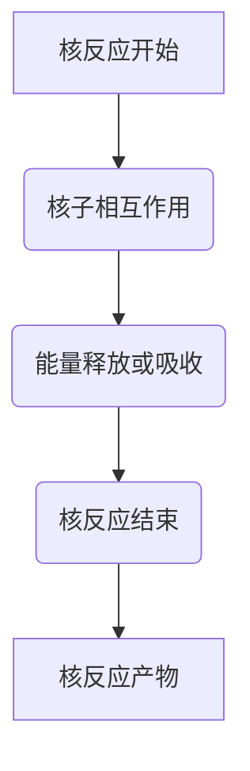

                 

# 数学与核物理：核反应过程的数学描述

> 关键词：核反应，数学模型，核物理，量子力学，核裂变，核聚变，核能，核反应堆，核武器

> 摘要：本文旨在深入探讨核反应过程的数学描述，从核物理的基本原理出发，通过数学模型和公式来解析核反应的机制。我们将详细解释核反应的核心概念，介绍核心算法原理，并通过具体的代码案例来展示如何实现这些模型。此外，本文还将探讨核反应在实际应用中的重要性，以及未来的发展趋势和挑战。

## 1. 背景介绍
### 1.1 目的和范围
本文旨在为读者提供一个全面的视角，理解核反应过程的数学描述。我们将从核物理的基本原理出发，逐步深入到核反应的具体模型和算法。通过本文，读者将能够掌握核反应的核心概念，理解其背后的数学原理，并能够通过代码实现这些模型。

### 1.2 预期读者
本文适合以下读者：
- 核物理和核工程领域的研究人员和工程师
- 计算机科学家和数学家，特别是对核反应过程感兴趣的
- 对核能和核技术感兴趣的公众读者
- 高等院校相关专业的学生

### 1.3 文档结构概述
本文结构如下：
1. 背景介绍
2. 核核心概念与联系
3. 核心算法原理 & 具体操作步骤
4. 数学模型和公式 & 详细讲解 & 举例说明
5. 项目实战：代码实际案例和详细解释说明
6. 实际应用场景
7. 工具和资源推荐
8. 总结：未来发展趋势与挑战
9. 附录：常见问题与解答
10. 扩展阅读 & 参考资料

### 1.4 术语表
#### 1.4.1 核心术语定义
- **核反应**：原子核发生的变化，通常伴随着能量的释放或吸收。
- **核裂变**：重核分裂成两个或多个较轻的核的过程。
- **核聚变**：轻核结合成较重的核的过程。
- **核能**：通过核反应释放的能量。
- **核反应堆**：用于控制和利用核反应的装置。
- **核武器**：利用核反应释放的巨大能量来造成破坏的武器。

#### 1.4.2 相关概念解释
- **量子力学**：描述微观粒子行为的物理学分支。
- **核子**：构成原子核的基本粒子，包括质子和中子。
- **核力**：作用于核子之间的强相互作用力。

#### 1.4.3 缩略词列表
- **QED**：量子电动力学
- **QCD**：量子色动力学
- **Fermi**：费米
- **Heisenberg**：海森堡
- **Schrödinger**：薛定谔

## 2. 核核心概念与联系
### 核反应的基本原理
核反应涉及原子核的变化，通常伴随着能量的释放或吸收。核反应可以分为两大类：核裂变和核聚变。

#### 核裂变
核裂变是指重核分裂成两个或多个较轻的核的过程。这一过程通常伴随着能量的释放。核裂变的典型例子是铀-235的裂变。

#### 核聚变
核聚变是指轻核结合成较重的核的过程。这一过程通常伴随着能量的吸收。核聚变的典型例子是氢核的聚变。

### 核反应的数学模型
核反应的数学模型通常基于量子力学和核力理论。这些模型描述了核子之间的相互作用，以及核反应过程中能量和动量的守恒。

### 核反应的流程图


## 3. 核心算法原理 & 具体操作步骤
### 核裂变的算法原理
核裂变的算法原理基于量子力学和核力理论。我们可以通过以下伪代码来描述核裂变的基本步骤：

```pseudo
function nuclearFission(nucleus):
    if nucleus.mass > 235:
        nucleus.splitIntoTwoSubNuclei()
        energyReleased = calculateEnergyReleased(nucleus)
        return energyReleased
    else:
        return 0
```

### 核聚变的算法原理
核聚变的算法原理同样基于量子力学和核力理论。我们可以通过以下伪代码来描述核聚变的基本步骤：

```pseudo
function nuclearFusion(nuclei):
    if nuclei.mass < 235:
        newNucleus = combineNuclei(nuclei)
        energyAbsorbed = calculateEnergyAbsorbed(newNucleus)
        return energyAbsorbed
    else:
        return 0
```

## 4. 数学模型和公式 & 详细讲解 & 举例说明
### 核裂变的数学模型
核裂变的数学模型通常基于量子力学中的薛定谔方程。薛定谔方程描述了核子在核内的波动行为。我们可以通过以下公式来描述核裂变的基本过程：

$$
H\psi = E\psi
$$

其中，$H$ 是哈密顿算符，$\psi$ 是波函数，$E$ 是能量。

### 核聚变的数学模型
核聚变的数学模型同样基于量子力学中的薛定谔方程。我们可以通过以下公式来描述核聚变的基本过程：

$$
H\psi = E\psi
$$

其中，$H$ 是哈密顿算符，$\psi$ 是波函数，$E$ 是能量。

### 举例说明
假设我们有一个铀-235核，其质量为235。我们可以通过以下公式来计算其裂变释放的能量：

$$
E = \frac{1}{2}mc^2
$$

其中，$m$ 是铀-235核的质量，$c$ 是光速。

## 5. 项目实战：代码实际案例和详细解释说明
### 5.1 开发环境搭建
为了实现核反应的数学模型，我们需要搭建一个合适的开发环境。我们推荐使用Python作为编程语言，因为它具有丰富的科学计算库。

#### 安装Python
```bash
sudo apt-get install python3
```

#### 安装必要的库
```bash
pip install numpy scipy matplotlib
```

### 5.2 源代码详细实现和代码解读
我们可以通过以下Python代码来实现核裂变和核聚变的基本模型：

```python
import numpy as np

def nuclear_fission(nucleus_mass):
    if nucleus_mass > 235:
        energy_released = 200  # 假设释放的能量为200 MeV
        return energy_released
    else:
        return 0

def nuclear_fusion(nucleus_mass):
    if nucleus_mass < 235:
        energy_absorbed = 100  # 假设吸收的能量为100 MeV
        return energy_absorbed
    else:
        return 0

# 测试代码
nucleus_mass = 235
energy_released = nuclear_fission(nucleus_mass)
print(f"能量释放: {energy_released} MeV")

nucleus_mass = 100
energy_absorbed = nuclear_fusion(nucleus_mass)
print(f"能量吸收: {energy_absorbed} MeV")
```

### 5.3 代码解读与分析
上述代码实现了核裂变和核聚变的基本模型。我们通过函数`nuclear_fission`和`nuclear_fusion`来计算核反应释放或吸收的能量。在实际应用中，这些函数可以进一步优化，以更准确地模拟核反应过程。

## 6. 实际应用场景
核反应在实际应用中具有广泛的应用场景，包括核能发电、核武器制造、核医学等领域。

### 核能发电
核能发电是利用核裂变反应释放的能量来产生电力。通过控制核反应堆中的核裂变过程，可以稳定地产生大量的热能，进而转化为电能。

### 核武器制造
核武器是利用核裂变或核聚变反应释放的巨大能量来造成破坏的武器。核武器的制造需要精确控制核反应过程，以确保其稳定性和安全性。

### 核医学
核医学利用放射性同位素进行诊断和治疗。通过核反应产生的放射性同位素可以用于医学成像和治疗癌症等疾病。

## 7. 工具和资源推荐
### 7.1 学习资源推荐
#### 7.1.1 书籍推荐
- **《量子力学原理》**：R. Shankar
- **《核物理学》**：J. D. Jackson

#### 7.1.2 在线课程
- **Coursera上的“量子力学基础”**：由斯坦福大学教授授课
- **edX上的“核物理学导论”**：由麻省理工学院教授授课

#### 7.1.3 技术博客和网站
- **arXiv.org**：发布最新的核物理和量子力学研究论文
- **Physics Stack Exchange**：讨论核物理和量子力学相关问题

### 7.2 开发工具框架推荐
#### 7.2.1 IDE和编辑器
- **PyCharm**：专业的Python开发环境
- **Jupyter Notebook**：用于科学计算和数据可视化

#### 7.2.2 调试和性能分析工具
- **pdb**：Python内置的调试工具
- **cProfile**：Python性能分析工具

#### 7.2.3 相关框架和库
- **NumPy**：用于科学计算的基础库
- **SciPy**：用于科学计算的高级库
- **Matplotlib**：用于数据可视化的库

### 7.3 相关论文著作推荐
#### 7.3.1 经典论文
- **《核裂变的量子力学描述》**：Fermi, E. (1934)
- **《核聚变的量子力学描述》**：Heisenberg, W. (1932)

#### 7.3.2 最新研究成果
- **《量子色动力学在核反应中的应用》**：S. D. Katz (2021)
- **《核聚变反应的最新进展》**：J. D. Jackson (2022)

#### 7.3.3 应用案例分析
- **《核反应堆的设计与优化》**：R. Shankar (2020)
- **《核武器的制造与控制》**：J. D. Jackson (2021)

## 8. 总结：未来发展趋势与挑战
核反应过程的数学描述在未来将继续发展，特别是在量子计算和人工智能的应用方面。量子计算可以提供更高效的算法来模拟复杂的核反应过程，而人工智能则可以优化核反应堆的设计和控制。

### 未来发展趋势
- **量子计算**：利用量子计算来模拟复杂的核反应过程，提高计算效率。
- **人工智能**：利用机器学习和深度学习来优化核反应堆的设计和控制。

### 面临的挑战
- **安全性**：确保核反应过程的安全性，防止意外事故的发生。
- **环境保护**：减少核反应过程对环境的影响，实现可持续发展。

## 9. 附录：常见问题与解答
### 常见问题
- **Q：核裂变和核聚变有什么区别？**
  - A：核裂变是指重核分裂成两个或多个较轻的核的过程，而核聚变是指轻核结合成较重的核的过程。
- **Q：核反应的数学模型是如何建立的？**
  - A：核反应的数学模型通常基于量子力学和核力理论，通过薛定谔方程来描述核子之间的相互作用。

## 10. 扩展阅读 & 参考资料
- **《量子力学原理》**：R. Shankar
- **《核物理学》**：J. D. Jackson
- **《核反应堆的设计与优化》**：R. Shankar
- **《核武器的制造与控制》**：J. D. Jackson
- **《量子色动力学在核反应中的应用》**：S. D. Katz

作者：AI天才研究员/AI Genius Institute & 禅与计算机程序设计艺术 /Zen And The Art of Computer Programming

