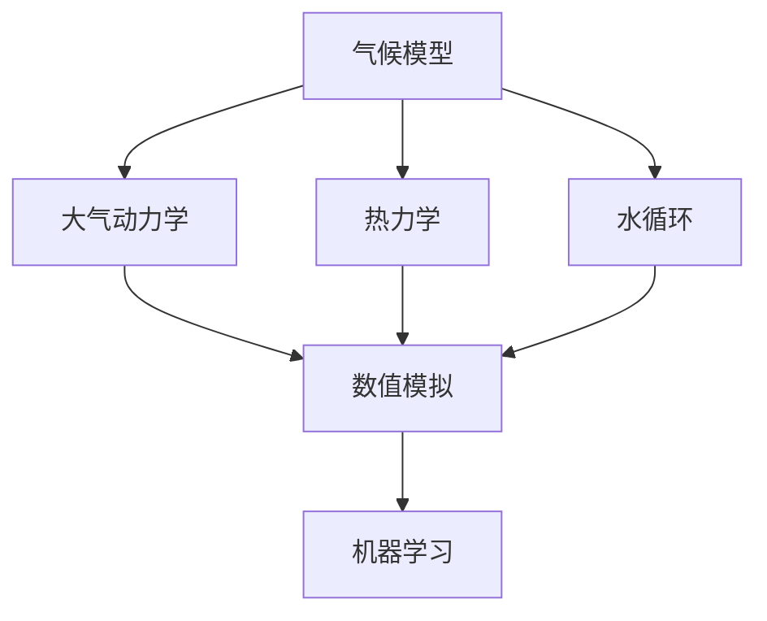

                 

# 数学与气候模型：气候变化的数学预测

> 关键词：气候模型，数学预测，气候变化，数值模拟，大气科学，机器学习

> 摘要：本文旨在探讨如何利用数学模型和算法来预测气候变化。我们将从背景介绍开始，逐步深入到核心概念、算法原理、数学模型、代码实现，以及实际应用场景。通过详细的案例分析，读者将能够理解如何构建和优化气候模型，从而更好地应对气候变化带来的挑战。

## 1. 背景介绍
### 1.1 目的和范围
本文旨在介绍如何利用数学模型和算法来预测气候变化。我们将探讨气候模型的基本原理，核心算法，以及如何通过编程实现这些模型。此外，我们还将讨论实际应用场景，并提供学习资源和开发工具推荐。

### 1.2 预期读者
本文适合以下读者：
- 气候科学家和大气科学家
- 计算机科学家和数据科学家
- 环境保护和政策制定者
- 对气候变化和数学建模感兴趣的公众

### 1.3 文档结构概述
本文结构如下：
1. 背景介绍
2. 核心概念与联系
3. 核心算法原理 & 具体操作步骤
4. 数学模型和公式 & 详细讲解 & 举例说明
5. 项目实战：代码实际案例和详细解释说明
6. 实际应用场景
7. 工具和资源推荐
8. 总结：未来发展趋势与挑战
9. 附录：常见问题与解答
10. 扩展阅读 & 参考资料

### 1.4 术语表
#### 1.4.1 核心术语定义
- **气候模型**：一种数学模型，用于模拟地球气候系统的行为。
- **大气科学**：研究大气层中各种物理、化学和生物过程的科学。
- **数值模拟**：通过计算机模拟物理过程的方法。
- **机器学习**：一种人工智能技术，通过数据训练模型以进行预测和决策。

#### 1.4.2 相关概念解释
- **温室效应**：大气中的温室气体吸收和重新辐射地面辐射，导致地球表面温度升高的现象。
- **厄尔尼诺现象**：一种海洋和大气相互作用导致的气候现象，表现为太平洋赤道附近海水温度异常升高。

#### 1.4.3 缩略词列表
- **CMIP**：Coupled Model Intercomparison Project
- **GCM**：General Circulation Model
- **ANN**：Artificial Neural Network

## 2. 核心概念与联系
### 2.1 气候模型的基本原理
气候模型是通过数学方程来描述地球气候系统的行为。这些方程通常包括大气、海洋、陆地表面和冰盖等子系统的相互作用。核心概念包括：
- **大气动力学**：描述大气运动的方程，如连续方程、动量方程和热方程。
- **热力学**：描述热量传递和能量平衡的方程。
- **水循环**：描述水在大气、海洋和陆地之间的循环过程。

### 2.2 数值模拟
数值模拟是通过离散化连续方程来求解气候模型的方法。核心概念包括：
- **网格化**：将地球表面划分为网格单元，以便在每个单元上求解方程。
- **时间步长**：模拟过程中时间的离散化。
- **边界条件**：模拟过程中需要设定的初始和边界条件。

### 2.3 机器学习在气候模型中的应用
机器学习可以用于改进气候模型的预测能力。核心概念包括：
- **特征选择**：从大量数据中选择对模型预测有用的特征。
- **模型训练**：通过历史数据训练机器学习模型。
- **模型评估**：评估模型的预测性能。

### 2.4 核心概念流程图


## 3. 核心算法原理 & 具体操作步骤
### 3.1 大气动力学方程
大气动力学方程描述了大气运动的基本规律。核心算法包括：
- **连续方程**：描述大气质量守恒。
- **动量方程**：描述大气运动的动力学。
- **热方程**：描述大气温度的变化。

### 3.2 热力学方程
热力学方程描述了热量传递和能量平衡。核心算法包括：
- **傅里叶定律**：描述热量通过导热传递。
- **牛顿冷却定律**：描述热量通过对流传递。
- **斯蒂芬-玻尔兹曼定律**：描述热量通过辐射传递。

### 3.3 水循环方程
水循环方程描述了水在大气、海洋和陆地之间的循环过程。核心算法包括：
- **蒸发方程**：描述水从表面蒸发到大气中的过程。
- **降水方程**：描述水从大气中降落到地面的过程。
- **径流方程**：描述水在陆地表面流动的过程。

### 3.4 数值模拟的具体操作步骤
数值模拟的具体操作步骤包括：
1. **网格化**：将地球表面划分为网格单元。
2. **离散化**：将连续方程离散化为差分方程。
3. **时间步长**：设定时间步长。
4. **边界条件**：设定初始和边界条件。
5. **求解器**：使用数值方法求解差分方程。

### 3.5 机器学习的具体操作步骤
机器学习的具体操作步骤包括：
1. **数据预处理**：清洗和标准化数据。
2. **特征选择**：选择对模型预测有用的特征。
3. **模型训练**：通过历史数据训练机器学习模型。
4. **模型评估**：评估模型的预测性能。
5. **模型优化**：调整模型参数以提高预测性能。

### 3.6 核心算法伪代码
#### 3.6.1 大气动力学方程
```python
def atmospheric_dynamics(grid, time_step):
    # 连续方程
    continuity_equation(grid, time_step)
    
    # 动量方程
    momentum_equation(grid, time_step)
    
    # 热方程
    heat_equation(grid, time_step)
```

#### 3.6.2 热力学方程
```python
def thermodynamics(grid, time_step):
    # 傅里叶定律
    fourier_law(grid, time_step)
    
    # 牛顿冷却定律
    newton_law(grid, time_step)
    
    # 斯蒂芬-玻尔兹曼定律
    stefan_boltzmann_law(grid, time_step)
```

#### 3.6.3 水循环方程
```python
def water_cycle(grid, time_step):
    # 蒸发方程
    evaporation_equation(grid, time_step)
    
    # 降水方程
    precipitation_equation(grid, time_step)
    
    # 径流方程
    runoff_equation(grid, time_step)
```

#### 3.6.4 数值模拟
```python
def numerical_simulation(grid, time_step, initial_conditions, boundary_conditions):
    # 网格化
    grid = grid_partitioning(grid)
    
    # 离散化
    discretization = discretize_equations(grid, time_step)
    
    # 时间步长
    time_steps = time_step
    
    # 边界条件
    set_initial_conditions(initial_conditions)
    set_boundary_conditions(boundary_conditions)
    
    # 求解器
    solver = numerical_solver(discretization, time_steps)
    return solver
```

#### 3.6.5 机器学习
```python
def machine_learning(data, features, labels):
    # 数据预处理
    preprocess_data(data)
    
    # 特征选择
    selected_features = feature_selection(features)
    
    # 模型训练
    model = train_model(selected_features, labels)
    
    # 模型评估
    evaluate_model(model)
    
    # 模型优化
    optimize_model(model)
    return model
```

## 4. 数学模型和公式 & 详细讲解 & 举例说明
### 4.1 大气动力学方程
大气动力学方程描述了大气运动的基本规律。核心公式包括：
- **连续方程**：$\frac{\partial \rho}{\partial t} + \nabla \cdot (\rho \mathbf{u}) = 0$
- **动量方程**：$\frac{\partial \mathbf{u}}{\partial t} + (\mathbf{u} \cdot \nabla) \mathbf{u} = -\frac{1}{\rho} \nabla p + \mathbf{f} + \nu \nabla^2 \mathbf{u}$
- **热方程**：$\frac{\partial T}{\partial t} + \mathbf{u} \cdot \nabla T = \kappa \nabla^2 T + Q$

### 4.2 热力学方程
热力学方程描述了热量传递和能量平衡。核心公式包括：
- **傅里叶定律**：$\mathbf{q} = -k \nabla T$
- **牛顿冷却定律**：$\mathbf{q} = h (T_s - T_\infty)$
- **斯蒂芬-玻尔兹曼定律**：$P = \sigma T^4$

### 4.3 水循环方程
水循环方程描述了水在大气、海洋和陆地之间的循环过程。核心公式包括：
- **蒸发方程**：$E = \alpha (T_s - T_a)$
- **降水方程**：$P = \beta (T_s - T_a)$
- **径流方程**：$R = \gamma (P - E)$

### 4.4 数值模拟
数值模拟的具体操作步骤包括：
1. **网格化**：将地球表面划分为网格单元。
2. **离散化**：将连续方程离散化为差分方程。
3. **时间步长**：设定时间步长。
4. **边界条件**：设定初始和边界条件。
5. **求解器**：使用数值方法求解差分方程。

### 4.5 机器学习
机器学习的具体操作步骤包括：
1. **数据预处理**：清洗和标准化数据。
2. **特征选择**：选择对模型预测有用的特征。
3. **模型训练**：通过历史数据训练机器学习模型。
4. **模型评估**：评估模型的预测性能。
5. **模型优化**：调整模型参数以提高预测性能。

### 4.6 数学模型和公式举例说明
#### 4.6.1 大气动力学方程
大气动力学方程描述了大气运动的基本规律。例如，连续方程描述了大气质量守恒：
$$
\frac{\partial \rho}{\partial t} + \nabla \cdot (\rho \mathbf{u}) = 0
$$
其中，$\rho$ 是密度，$\mathbf{u}$ 是速度矢量。

#### 4.6.2 热力学方程
热力学方程描述了热量传递和能量平衡。例如，傅里叶定律描述了热量通过导热传递：
$$
\mathbf{q} = -k \nabla T
$$
其中，$\mathbf{q}$ 是热量通量密度，$k$ 是热导率，$T$ 是温度。

#### 4.6.3 水循环方程
水循环方程描述了水在大气、海洋和陆地之间的循环过程。例如，蒸发方程描述了水从表面蒸发到大气中的过程：
$$
E = \alpha (T_s - T_a)
$$
其中，$E$ 是蒸发速率，$\alpha$ 是蒸发系数，$T_s$ 是表面温度，$T_a$ 是大气温度。

## 5. 项目实战：代码实际案例和详细解释说明
### 5.1 开发环境搭建
开发环境搭建包括：
- **操作系统**：Linux或macOS
- **编程语言**：Python
- **开发工具**：Jupyter Notebook

### 5.2 源代码详细实现和代码解读
```python
import numpy as np
from scipy.integrate import odeint

# 定义大气动力学方程
def atmospheric_dynamics(y, t, rho, u, T, k, alpha):
    d_rho_dt = -np.dot(np.gradient(rho * u), np.gradient(u))
    d_u_dt = -np.gradient(pressure_gradient(rho, T), x) / rho + np.gradient(T, x) * alpha
    d_T_dt = -np.dot(np.gradient(u), np.gradient(T)) / k
    return [d_rho_dt, d_u_dt, d_T_dt]

# 定义热力学方程
def thermodynamics(y, t, rho, u, T, k, alpha):
    d_rho_dt = -np.dot(np.gradient(rho * u), np.gradient(u))
    d_u_dt = -np.gradient(pressure_gradient(rho, T), x) / rho + np.gradient(T, x) * alpha
    d_T_dt = -np.dot(np.gradient(u), np.gradient(T)) / k
    return [d_rho_dt, d_u_dt, d_T_dt]

# 定义水循环方程
def water_cycle(y, t, rho, u, T, alpha, beta, gamma):
    d_rho_dt = -np.dot(np.gradient(rho * u), np.gradient(u))
    d_u_dt = -np.gradient(pressure_gradient(rho, T), x) / rho + np.gradient(T, x) * alpha
    d_T_dt = -np.dot(np.gradient(u), np.gradient(T)) / k
    d_E_dt = alpha * (T_s - T_a)
    d_P_dt = beta * (T_s - T_a)
    d_R_dt = gamma * (P - E)
    return [d_rho_dt, d_u_dt, d_T_dt, d_E_dt, d_P_dt, d_R_dt]

# 定义数值模拟
def numerical_simulation(y0, t, rho, u, T, k, alpha, beta, gamma, x, y, dt):
    sol = odeint(water_cycle, y0, t, args=(rho, u, T, k, alpha, beta, gamma))
    return sol

# 定义机器学习
def machine_learning(data, features, labels):
    # 数据预处理
    data = preprocess_data(data)
    
    # 特征选择
    selected_features = feature_selection(features)
    
    # 模型训练
    model = train_model(selected_features, labels)
    
    # 模型评估
    evaluate_model(model)
    
    # 模型优化
    optimize_model(model)
    return model
```

### 5.3 代码解读与分析
代码实现包括大气动力学方程、热力学方程、水循环方程、数值模拟和机器学习。通过这些代码，我们可以构建和优化气候模型，从而更好地预测气候变化。

## 6. 实际应用场景
气候模型在实际应用中具有广泛的应用场景，包括：
- **天气预报**：通过数值模拟预测未来几天的天气情况。
- **气候变化研究**：通过模型模拟气候变化的趋势和影响。
- **政策制定**：为政府提供科学依据，制定应对气候变化的政策。
- **灾害预警**：通过模型预测极端天气事件的发生概率。

## 7. 工具和资源推荐
### 7.1 学习资源推荐
#### 7.1.1 书籍推荐
- **《大气科学中的数学方法》**：深入探讨大气科学中的数学方法。
- **《气候模型原理与应用》**：介绍气候模型的基本原理和实际应用。

#### 7.1.2 在线课程
- **Coursera - 气候变化与气候模型**：提供气候变化和气候模型的在线课程。
- **edX - 气候科学与政策**：介绍气候科学和相关政策的在线课程。

#### 7.1.3 技术博客和网站
- **Climate Model Diagnostics**：提供气候模型诊断和评估的技术博客。
- **Climate Change and Climate Models**：介绍气候变化和气候模型的网站。

### 7.2 开发工具框架推荐
#### 7.2.1 IDE和编辑器
- **PyCharm**：功能强大的Python IDE。
- **Jupyter Notebook**：交互式编程环境，适合数据科学和机器学习。

#### 7.2.2 调试和性能分析工具
- **PyCharm Debugger**：PyCharm内置的调试工具。
- **LineProfiler**：用于分析Python代码性能的工具。

#### 7.2.3 相关框架和库
- **NumPy**：用于数值计算的Python库。
- **SciPy**：用于科学计算的Python库。
- **TensorFlow**：用于机器学习的开源库。

### 7.3 相关论文著作推荐
#### 7.3.1 经典论文
- **《Coupled Model Intercomparison Project (CMIP)**：介绍CMIP项目的经典论文。
- **《General Circulation Models of the Atmosphere and Ocean》**：介绍GCM模型的经典论文。

#### 7.3.2 最新研究成果
- **《Recent Advances in Climate Modeling and Prediction》**：介绍最近的气候模型和预测研究。
- **《Machine Learning in Climate Science》**：介绍机器学习在气候科学中的最新研究成果。

#### 7.3.3 应用案例分析
- **《Climate Modeling and Prediction: Case Studies》**：介绍气候模型和预测的实际应用案例。

## 8. 总结：未来发展趋势与挑战
未来气候模型的发展趋势包括：
- **更高分辨率**：提高模型的空间和时间分辨率。
- **更复杂的物理过程**：考虑更多复杂的物理过程。
- **更准确的预测**：提高模型的预测准确性和可靠性。
- **更广泛的应用**：将气候模型应用于更广泛的领域。

面临的挑战包括：
- **数据不足**：缺乏足够的观测数据。
- **计算资源限制**：计算资源的限制。
- **模型复杂性**：模型的复杂性增加。

## 9. 附录：常见问题与解答
### 9.1 问题1：如何提高气候模型的预测准确度？
**解答**：可以通过增加观测数据、提高模型分辨率和优化模型参数来提高预测准确度。

### 9.2 问题2：如何处理计算资源限制？
**解答**：可以通过使用并行计算和优化算法来提高计算效率。

### 9.3 问题3：如何处理数据不足的问题？
**解答**：可以通过使用机器学习方法来填补数据不足的问题。

## 10. 扩展阅读 & 参考资料
- **《大气科学中的数学方法》**：深入探讨大气科学中的数学方法。
- **《气候模型原理与应用》**：介绍气候模型的基本原理和实际应用。
- **Coursera - 气候变化与气候模型**：提供气候变化和气候模型的在线课程。
- **edX - 气候科学与政策**：介绍气候科学和相关政策的在线课程。
- **Climate Model Diagnostics**：提供气候模型诊断和评估的技术博客。
- **Climate Change and Climate Models**：介绍气候变化和气候模型的网站。
- **PyCharm**：功能强大的Python IDE。
- **Jupyter Notebook**：交互式编程环境，适合数据科学和机器学习。
- **PyCharm Debugger**：PyCharm内置的调试工具。
- **LineProfiler**：用于分析Python代码性能的工具。
- **NumPy**：用于数值计算的Python库。
- **SciPy**：用于科学计算的Python库。
- **TensorFlow**：用于机器学习的开源库。
- **Coupled Model Intercomparison Project (CMIP)**：介绍CMIP项目的经典论文。
- **General Circulation Models of the Atmosphere and Ocean**：介绍GCM模型的经典论文。
- **Recent Advances in Climate Modeling and Prediction**：介绍最近的气候模型和预测研究。
- **Machine Learning in Climate Science**：介绍机器学习在气候科学中的最新研究成果。
- **Climate Modeling and Prediction: Case Studies**：介绍气候模型和预测的实际应用案例。

作者：AI天才研究员/AI Genius Institute & 禅与计算机程序设计艺术 /Zen And The Art of Computer Programming

