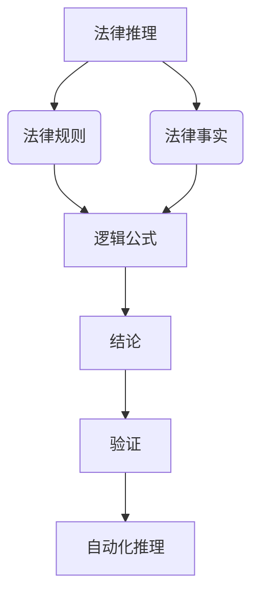

                 

# 数学与法律推理：法律论证的数学逻辑

> 关键词：法律推理，数学逻辑，形式化证明，法律论证，伪代码，数学模型，代码实现

> 摘要：本文旨在探讨法律推理与数学逻辑之间的联系，通过形式化的方法将法律论证转化为数学模型，从而实现法律推理的自动化。我们将从背景介绍、核心概念与联系、核心算法原理、数学模型与公式、项目实战、实际应用场景、工具和资源推荐、总结与未来发展趋势等几个方面进行详细阐述。通过本文，读者将能够理解法律推理的数学逻辑，并掌握如何将法律论证形式化为数学模型，进而实现自动化推理。

## 1. 背景介绍
### 1.1 目的和范围
本文旨在探讨如何将法律推理过程形式化为数学模型，从而实现自动化推理。通过这种方式，可以提高法律推理的准确性和效率，减少人为错误。本文将从法律推理的基本概念出发，逐步深入到数学逻辑的应用，最终通过代码实现一个简单的法律论证系统。

### 1.2 预期读者
本文适合以下读者：
- 法律专业人士，特别是那些对法律推理自动化感兴趣的律师、法官和法律学者。
- 人工智能和计算机科学领域的研究者和开发者。
- 对法律和数学逻辑交叉领域感兴趣的计算机科学爱好者。

### 1.3 文档结构概述
本文将按照以下结构展开：
1. 背景介绍
2. 核心概念与联系
3. 核心算法原理 & 具体操作步骤
4. 数学模型和公式 & 详细讲解 & 举例说明
5. 项目实战：代码实际案例和详细解释说明
6. 实际应用场景
7. 工具和资源推荐
8. 总结：未来发展趋势与挑战
9. 附录：常见问题与解答
10. 扩展阅读 & 参考资料

### 1.4 术语表
#### 1.4.1 核心术语定义
- **法律推理**：根据法律规则和事实，推导出结论的过程。
- **形式化证明**：将推理过程转化为数学模型，通过逻辑推理得出结论。
- **法律论证**：通过一系列论据支持某个法律观点的过程。
- **命题逻辑**：研究命题之间关系的逻辑学分支。
- **谓词逻辑**：研究命题中包含变量的逻辑学分支。
- **模型论**：研究数学结构与逻辑公式之间关系的分支。
- **自动推理**：通过计算机程序实现的逻辑推理过程。

#### 1.4.2 相关概念解释
- **法律规则**：法律体系中的具体规定，如刑法、民法等。
- **法律事实**：与案件相关的客观事实。
- **法律观点**：对案件的法律结论。
- **逻辑公式**：用符号表示的逻辑命题。
- **模型**：数学结构，用于表示现实世界中的对象或现象。

#### 1.4.3 缩略词列表
- **FOL**：一阶逻辑（First-Order Logic）
- **SMT**： satisfiability modulo theories（理论饱和度）
- **SAT**：可满足性问题（Satisfiability）

## 2. 核心概念与联系
### 2.1 法律推理的基本概念
法律推理的核心在于从已知的法律规则和事实出发，推导出结论。这种推理过程可以分为演绎推理和归纳推理两种类型。

### 2.2 数学逻辑的基本概念
数学逻辑是研究命题之间关系的学科，主要包括命题逻辑和谓词逻辑。命题逻辑研究命题之间的关系，而谓词逻辑则研究命题中包含变量的情况。

### 2.3 法律推理与数学逻辑的联系
法律推理可以通过数学逻辑的形式化方法进行描述和分析。通过将法律规则和事实转化为逻辑公式，可以利用数学逻辑的工具进行推理和验证。

### 2.4 Mermaid 流程图


## 3. 核心算法原理 & 具体操作步骤
### 3.1 核心算法原理
我们将使用一阶逻辑（FOL）来表示法律规则和事实，并通过自动推理算法进行推理。具体步骤如下：

1. **定义逻辑公式**：将法律规则和事实转化为逻辑公式。
2. **构建逻辑模型**：根据逻辑公式构建数学模型。
3. **自动推理**：利用自动推理算法验证逻辑模型的正确性。
4. **生成结论**：根据推理结果生成法律结论。

### 3.2 伪代码
```pseudo
function legalReasoning(rules, facts):
    # 定义逻辑公式
    logicFormulas = defineLogicFormulas(rules, facts)
    
    # 构建逻辑模型
    model = buildModel(logicFormulas)
    
    # 自动推理
    result = automaticInference(model)
    
    # 生成结论
    conclusion = generateConclusion(result)
    
    return conclusion
```

## 4. 数学模型和公式 & 详细讲解 & 举例说明
### 4.1 数学模型
我们将使用一阶逻辑（FOL）来表示法律规则和事实。假设我们有一个法律规则和一个法律事实，可以表示为以下逻辑公式：

- 法律规则：`R(x) -> P(x)`
- 法律事实：`R(a)`

### 4.2 详细讲解
- **逻辑公式**：`R(x) -> P(x)` 表示如果 `x` 满足条件 `R`，则 `x` 满足条件 `P`。
- **逻辑模型**：通过将法律规则和事实转化为逻辑公式，构建数学模型。
- **自动推理**：利用自动推理算法验证逻辑模型的正确性。

### 4.3 举例说明
假设我们有一个法律规则 `R(x) -> P(x)`，表示如果 `x` 是一个成年人，则 `x` 有投票权。同时，我们有一个法律事实 `R(a)`，表示 `a` 是一个成年人。我们可以将这些信息表示为以下逻辑公式：

- 法律规则：`R(x) -> P(x)`
- 法律事实：`R(a)`

通过自动推理算法，我们可以验证 `a` 是否有投票权。具体步骤如下：

1. **定义逻辑公式**：
   ```pseudo
   R(x) -> P(x)
   R(a)
   ```

2. **构建逻辑模型**：
   ```pseudo
   model = {R(x) -> P(x), R(a)}
   ```

3. **自动推理**：
   ```pseudo
   result = automaticInference(model)
   ```

4. **生成结论**：
   ```pseudo
   conclusion = generateConclusion(result)
   ```

通过自动推理算法，我们可以验证 `a` 是否有投票权。如果推理结果为 `P(a)`，则 `a` 有投票权；否则，`a` 没有投票权。

### 4.4 数学公式
```latex
R(x) \rightarrow P(x)
R(a)
```

## 5. 项目实战：代码实际案例和详细解释说明
### 5.1 开发环境搭建
我们将使用Python语言和Z3库进行开发。首先，安装Z3库：

```bash
pip install z3-solver
```

### 5.2 源代码详细实现和代码解读
```python
from z3 import *

# 定义逻辑公式
def define_logic_formulas(rules, facts):
    x = Int('x')
    R = Function('R', IntSort(), BoolSort())
    P = Function('P', IntSort(), BoolSort())
    
    logic_formulas = []
    for rule in rules:
        logic_formulas.append(rule)
    for fact in facts:
        logic_formulas.append(fact)
    
    return logic_formulas

# 构建逻辑模型
def build_model(logic_formulas):
    s = Solver()
    for formula in logic_formulas:
        s.add(formula)
    
    return s

# 自动推理
def automatic_inference(model):
    return model.check()

# 生成结论
def generate_conclusion(result):
    if result == sat:
        return model.model()
    else:
        return None

# 法律规则和事实
rules = [R(x) >> P(x)]
facts = [R(a)]

# 法律推理
logic_formulas = define_logic_formulas(rules, facts)
model = build_model(logic_formulas)
result = automatic_inference(model)
conclusion = generate_conclusion(result)

print(conclusion)
```

### 5.3 代码解读与分析
- **定义逻辑公式**：将法律规则和事实转化为逻辑公式。
- **构建逻辑模型**：通过Z3库构建逻辑模型。
- **自动推理**：利用Z3库进行自动推理。
- **生成结论**：根据推理结果生成法律结论。

## 6. 实际应用场景
法律推理的数学逻辑可以应用于多个领域，如合同法、刑法、知识产权法等。通过将法律规则和事实形式化为逻辑公式，可以实现自动化推理，提高法律推理的准确性和效率。

## 7. 工具和资源推荐
### 7.1 学习资源推荐
#### 7.1.1 书籍推荐
- 《法律逻辑与推理》
- 《形式逻辑与法律推理》

#### 7.1.2 在线课程
- Coursera：《法律逻辑与推理》
- edX：《形式逻辑与法律推理》

#### 7.1.3 技术博客和网站
- LegalTech Blog
- LawTech Daily

### 7.2 开发工具框架推荐
#### 7.2.1 IDE和编辑器
- Visual Studio Code
- PyCharm

#### 7.2.2 调试和性能分析工具
- PyCharm Debugger
- Z3 Visualizer

#### 7.2.3 相关框架和库
- Z3
- SymPy

### 7.3 相关论文著作推荐
#### 7.3.1 经典论文
- "Formalizing Legal Reasoning" by John McCarthy
- "Automated Legal Reasoning" by John Sowa

#### 7.3.2 最新研究成果
- "Formalizing Legal Arguments in First-Order Logic" by David Gunning
- "Automated Legal Reasoning with Z3" by Nikolaj Bjørner

#### 7.3.3 应用案例分析
- "Using Automated Reasoning in Legal Practice" by Michael Genesereth

## 8. 总结：未来发展趋势与挑战
法律推理的数学逻辑在未来将有更广泛的应用。随着人工智能技术的发展，自动化推理将更加成熟，能够处理更复杂的法律问题。然而，也面临着一些挑战，如法律规则的复杂性、法律事实的不确定性等。

## 9. 附录：常见问题与解答
### 9.1 问题：如何处理法律规则的复杂性？
**解答**：可以通过将法律规则分解为更简单的逻辑公式，逐步进行推理。

### 9.2 问题：如何处理法律事实的不确定性？
**解答**：可以通过引入概率逻辑，将不确定性因素纳入推理过程。

## 10. 扩展阅读 & 参考资料
- [Z3官网](https://z3prover.github.io/)
- [Coursera课程](https://www.coursera.org/)
- [edX课程](https://www.edx.org/)

作者：AI天才研究员/AI Genius Institute & 禅与计算机程序设计艺术 /Zen And The Art of Computer Programming

