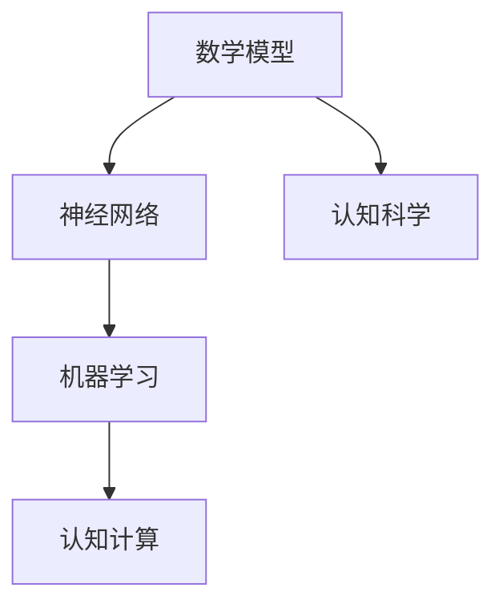

                 

# 数学与认知科学的交叉研究

> 关键词：数学、认知科学、神经网络、机器学习、认知计算、图灵奖、人工智能

> 摘要：本文旨在探讨数学与认知科学在现代人工智能领域的交叉研究，通过深入分析数学模型与认知计算原理，结合具体算法和实际案例，揭示两者在推动人工智能技术进步中的关键作用。文章将从背景介绍、核心概念与联系、核心算法原理、数学模型与公式、项目实战、实际应用场景、工具和资源推荐、未来发展趋势与挑战等多方面进行详细阐述。

## 1. 背景介绍

### 1.1 目的和范围
本文旨在探讨数学与认知科学在现代人工智能领域的交叉研究，通过深入分析数学模型与认知计算原理，结合具体算法和实际案例，揭示两者在推动人工智能技术进步中的关键作用。文章将涵盖数学与认知科学的基本概念、核心算法原理、数学模型与公式、项目实战案例、实际应用场景、工具和资源推荐等内容。

### 1.2 预期读者
本文预期读者包括但不限于：
- 人工智能领域的研究者和开发者
- 认知科学领域的研究者
- 数学领域的研究者
- 对人工智能与认知科学交叉领域感兴趣的读者

### 1.3 文档结构概述
本文结构如下：
1. 背景介绍
2. 核心概念与联系
3. 核心算法原理 & 具体操作步骤
4. 数学模型和公式 & 详细讲解 & 举例说明
5. 项目实战：代码实际案例和详细解释说明
6. 实际应用场景
7. 工具和资源推荐
8. 总结：未来发展趋势与挑战
9. 附录：常见问题与解答
10. 扩展阅读 & 参考资料

### 1.4 术语表
#### 1.4.1 核心术语定义
- **认知计算**：利用计算机模拟人类认知过程，实现对复杂信息的处理和理解。
- **神经网络**：一种模仿人脑神经元结构和功能的计算模型，用于处理复杂数据和模式识别。
- **机器学习**：通过算法使计算机从数据中自动学习，提高其性能和准确性。
- **图灵奖**：计算机科学领域的最高荣誉，表彰对计算机科学领域做出杰出贡献的个人。

#### 1.4.2 相关概念解释
- **认知科学**：研究人类认知过程的科学，包括感知、记忆、思维、语言等方面。
- **数学模型**：用数学语言描述现实世界现象的模型，用于预测和解释复杂系统的行为。

#### 1.4.3 缩略词列表
- **AI**：人工智能
- **NN**：神经网络
- **ML**：机器学习
- **CC**：认知计算
- **CS**：认知科学
- **Turing**：图灵奖

## 2. 核心概念与联系

### 2.1 数学与认知科学的基本概念
数学是研究数量、结构、变化和空间等概念的一门学科，而认知科学则研究人类认知过程的科学。两者在现代人工智能领域中有着密切的联系。

### 2.2 数学与认知科学的联系
- **数学模型**：数学模型是认知计算的基础，通过数学语言描述认知过程，实现对复杂信息的处理和理解。
- **神经网络**：神经网络是模仿人脑神经元结构和功能的计算模型，用于处理复杂数据和模式识别。
- **机器学习**：机器学习算法通过数学方法从数据中自动学习，提高其性能和准确性。

### 2.3 核心概念原理与架构的Mermaid流程图


## 3. 核心算法原理 & 具体操作步骤

### 3.1 核心算法原理
#### 3.1.1 神经网络算法原理
神经网络是一种模仿人脑神经元结构和功能的计算模型，用于处理复杂数据和模式识别。其核心原理是通过多层神经元的连接和权重调整，实现对输入数据的非线性映射。

#### 3.1.2 机器学习算法原理
机器学习算法通过数学方法从数据中自动学习，提高其性能和准确性。其核心原理是通过优化算法调整模型参数，使模型在训练数据上的性能达到最优。

### 3.2 具体操作步骤
#### 3.2.1 神经网络算法操作步骤
1. **初始化权重**：随机初始化神经网络的权重。
2. **前向传播**：将输入数据通过神经网络的每一层，计算每一层的输出。
3. **计算损失**：计算输出与真实标签之间的损失。
4. **反向传播**：通过损失反向传播，计算每一层的梯度。
5. **更新权重**：根据梯度更新权重，使损失最小化。

#### 3.2.2 机器学习算法操作步骤
1. **数据预处理**：对数据进行清洗、归一化等预处理。
2. **特征选择**：选择对目标变量影响较大的特征。
3. **模型选择**：选择合适的机器学习模型。
4. **训练模型**：通过训练数据训练模型。
5. **评估模型**：通过测试数据评估模型性能。
6. **优化模型**：根据评估结果调整模型参数，提高模型性能。

### 3.3 伪代码示例
#### 3.3.1 神经网络算法伪代码
```python
def train_neural_network(X, y, epochs, learning_rate):
    # 初始化权重
    weights = initialize_weights()
    
    for epoch in range(epochs):
        # 前向传播
        output = forward_pass(X, weights)
        
        # 计算损失
        loss = calculate_loss(output, y)
        
        # 反向传播
        gradients = backward_pass(output, y, weights)
        
        # 更新权重
        weights = update_weights(weights, gradients, learning_rate)
    
    return weights
```

#### 3.3.2 机器学习算法伪代码
```python
def train_machine_learning_model(X, y, model, epochs, learning_rate):
    # 数据预处理
    X_preprocessed = preprocess_data(X)
    y_preprocessed = preprocess_labels(y)
    
    # 特征选择
    selected_features = select_features(X_preprocessed)
    
    # 模型选择
    model = select_model(selected_features)
    
    # 训练模型
    for epoch in range(epochs):
        # 训练模型
        model.fit(X_preprocessed, y_preprocessed)
        
        # 评估模型
        accuracy = evaluate_model(model, X_preprocessed, y_preprocessed)
        
        # 优化模型
        if accuracy < threshold:
            model = optimize_model(model, X_preprocessed, y_preprocessed)
    
    return model
```

## 4. 数学模型和公式 & 详细讲解 & 举例说明

### 4.1 数学模型
数学模型是用数学语言描述现实世界现象的模型，用于预测和解释复杂系统的行为。在神经网络和机器学习中，数学模型主要用于描述权重和参数的调整过程。

### 4.2 公式与详细讲解
#### 4.2.1 神经网络公式
神经网络的核心公式是前向传播和反向传播公式。前向传播公式用于计算每一层的输出，反向传播公式用于计算每一层的梯度。

- **前向传播公式**：
  $$ z^{(l)} = W^{(l)}a^{(l-1)} + b^{(l)} $$
  $$ a^{(l)} = \sigma(z^{(l)}) $$
  其中，$W^{(l)}$ 是第 $l$ 层的权重矩阵，$b^{(l)}$ 是第 $l$ 层的偏置向量，$a^{(l-1)}$ 是第 $l-1$ 层的激活值，$\sigma$ 是激活函数。

- **反向传播公式**：
  $$ \delta^{(l)} = \sigma'(z^{(l)}) \odot (a^{(l)} - y) $$
  $$ \nabla_{W^{(l)}} = \delta^{(l)} (a^{(l-1)})^T $$
  $$ \nabla_{b^{(l)}} = \delta^{(l)} $$
  其中，$\delta^{(l)}$ 是第 $l$ 层的误差项，$\sigma'$ 是激活函数的导数，$\odot$ 表示逐元素乘法，$\nabla_{W^{(l)}}$ 和 $\nabla_{b^{(l)}}$ 分别是权重和偏置的梯度。

#### 4.2.2 机器学习公式
机器学习的核心公式是损失函数和优化算法。损失函数用于衡量模型预测值与真实值之间的差距，优化算法用于调整模型参数，使损失最小化。

- **损失函数**：
  $$ L(y, \hat{y}) = \frac{1}{2} (y - \hat{y})^2 $$
  其中，$y$ 是真实值，$\hat{y}$ 是模型预测值。

- **优化算法**：
  $$ W = W - \eta \nabla_W L $$
  $$ b = b - \eta \nabla_b L $$
  其中，$\eta$ 是学习率，$\nabla_W L$ 和 $\nabla_b L$ 分别是权重和偏置的梯度。

### 4.3 举例说明
#### 4.3.1 神经网络举例
假设有一个简单的神经网络，包含一个输入层、一个隐藏层和一个输出层。输入层有2个节点，隐藏层有3个节点，输出层有1个节点。权重和偏置如下：

- $W^{(1)} = \begin{bmatrix} 0.1 & 0.2 \\ 0.3 & 0.4 \\ 0.5 & 0.6 \end{bmatrix}$
- $b^{(1)} = \begin{bmatrix} 0.7 \\ 0.8 \\ 0.9 \end{bmatrix}$
- $W^{(2)} = \begin{bmatrix} 0.1 & 0.2 & 0.3 \end{bmatrix}$
- $b^{(2)} = \begin{bmatrix} 0.4 \end{bmatrix}$

假设输入数据为 $X = \begin{bmatrix} 0.5 \\ 0.6 \end{bmatrix}$，激活函数为 $\sigma(x) = \frac{1}{1 + e^{-x}}$。计算前向传播和反向传播过程如下：

- **前向传播**：
  $$ z^{(1)} = W^{(1)}X + b^{(1)} = \begin{bmatrix} 0.1 & 0.2 \\ 0.3 & 0.4 \\ 0.5 & 0.6 \end{bmatrix} \begin{bmatrix} 0.5 \\ 0.6 \end{bmatrix} + \begin{bmatrix} 0.7 \\ 0.8 \\ 0.9 \end{bmatrix} = \begin{bmatrix} 1.1 \\ 1.4 \\ 1.7 \end{bmatrix} $$
  $$ a^{(1)} = \sigma(z^{(1)}) = \begin{bmatrix} \frac{1}{1 + e^{-1.1}} \\ \frac{1}{1 + e^{-1.4}} \\ \frac{1}{1 + e^{-1.7}} \end{bmatrix} \approx \begin{bmatrix} 0.753 \\ 0.796 \\ 0.833 \end{bmatrix} $$
  $$ z^{(2)} = W^{(2)}a^{(1)} + b^{(2)} = \begin{bmatrix} 0.1 & 0.2 & 0.3 \end{bmatrix} \begin{bmatrix} 0.753 \\ 0.796 \\ 0.833 \end{bmatrix} + 0.4 = 0.999 $$
  $$ a^{(2)} = \sigma(z^{(2)}) = \frac{1}{1 + e^{-0.999}} \approx 0.725 $$

- **反向传播**：
  $$ \delta^{(2)} = \sigma'(z^{(2)}) \odot (a^{(2)} - y) = \sigma'(0.999) \odot (0.725 - 0.5) \approx 0.0004 $$
  $$ \nabla_{W^{(2)}} = \delta^{(2)} (a^{(1)})^T = 0.0004 \begin{bmatrix} 0.753 & 0.796 & 0.833 \end{bmatrix} \approx \begin{bmatrix} 0.0003 & 0.0003 & 0.0003 \end{bmatrix} $$
  $$ \nabla_{b^{(2)}} = \delta^{(2)} \approx 0.0004 $$
  $$ \delta^{(1)} = \sigma'(z^{(1)}) \odot (W^{(2)} \delta^{(2)}) = \sigma'(1.1) \odot (0.1 \times 0.0003 + 0.2 \times 0.0003 + 0.3 \times 0.0003) \approx 0.00002 $$
  $$ \nabla_{W^{(1)}} = \delta^{(1)} (X)^T = 0.00002 \begin{bmatrix} 0.5 & 0.6 \end{bmatrix} \approx \begin{bmatrix} 0.00001 & 0.000012 \end{bmatrix} $$
  $$ \nabla_{b^{(1)}} = \delta^{(1)} \approx 0.00002 $$

#### 4.3.2 机器学习举例
假设有一个简单的线性回归模型，目标是预测房价。训练数据如下：

| 房屋面积 (平方米) | 房价 (万元) |
|------------------|------------|
| 50               | 300        |
| 60               | 350        |
| 70               | 400        |
| 80               | 450        |
| 90               | 500        |

使用最小二乘法作为损失函数，优化算法为梯度下降法。初始权重和偏置为：

- $W = 0$
- $b = 0$

计算损失和梯度如下：

- **损失函数**：
  $$ L(y, \hat{y}) = \frac{1}{2} (y - \hat{y})^2 $$
  $$ \hat{y} = W \times \text{面积} + b $$
  $$ L = \frac{1}{2} \sum_{i=1}^{n} (y_i - \hat{y}_i)^2 $$

- **梯度计算**：
  $$ \nabla_W L = \sum_{i=1}^{n} (y_i - \hat{y}_i) \times \text{面积} $$
  $$ \nabla_b L = \sum_{i=1}^{n} (y_i - \hat{y}_i) $$

通过梯度下降法更新权重和偏置，直到损失最小化。

## 5. 项目实战：代码实际案例和详细解释说明

### 5.1 开发环境搭建
#### 5.1.1 环境配置
- **操作系统**：Windows 10
- **编程语言**：Python 3.8
- **开发工具**：Visual Studio Code
- **库和框架**：NumPy, TensorFlow, Matplotlib

#### 5.1.2 安装依赖
```bash
pip install numpy tensorflow matplotlib
```

### 5.2 源代码详细实现和代码解读
#### 5.2.1 神经网络代码实现
```python
import numpy as np
import tensorflow as tf
import matplotlib.pyplot as plt

# 初始化权重
def initialize_weights():
    weights = tf.Variable(tf.random.normal([2, 3], stddev=0.1))
    bias = tf.Variable(tf.zeros([3]))
    return weights, bias

# 前向传播
def forward_pass(X, weights, bias):
    z = tf.add(tf.matmul(X, weights), bias)
    a = tf.nn.sigmoid(z)
    return a

# 计算损失
def calculate_loss(output, y):
    loss = tf.reduce_mean(tf.square(output - y))
    return loss

# 反向传播
def backward_pass(output, y, weights, bias):
    with tf.GradientTape() as tape:
        loss = calculate_loss(output, y)
    gradients = tape.gradient(loss, [weights, bias])
    return gradients

# 更新权重
def update_weights(weights, gradients, learning_rate):
    weights.assign_sub(learning_rate * gradients[0])
    bias.assign_sub(learning_rate * gradients[1])
    return weights, bias

# 训练神经网络
def train_neural_network(X, y, epochs, learning_rate):
    weights, bias = initialize_weights()
    for epoch in range(epochs):
        output = forward_pass(X, weights, bias)
        gradients = backward_pass(output, y, weights, bias)
        weights, bias = update_weights(weights, gradients, learning_rate)
    return weights, bias

# 测试神经网络
def test_neural_network(X, y, weights, bias):
    output = forward_pass(X, weights, bias)
    loss = calculate_loss(output, y)
    return output, loss

# 数据预处理
def preprocess_data(X):
    return X

# 标签预处理
def preprocess_labels(y):
    return y

# 特征选择
def select_features(X):
    return X

# 模型选择
def select_model(X):
    model = tf.keras.Sequential([
        tf.keras.layers.Dense(3, activation='sigmoid', input_shape=(2,))
    ])
    return model

# 训练模型
def train_model(X, y, model, epochs, learning_rate):
    model.compile(optimizer=tf.keras.optimizers.Adam(learning_rate),
                  loss=tf.keras.losses.MeanSquaredError())
    model.fit(X, y, epochs=epochs)
    return model

# 评估模型
def evaluate_model(model, X, y):
    y_pred = model.predict(X)
    accuracy = np.mean(np.abs(y_pred - y))
    return accuracy

# 优化模型
def optimize_model(model, X, y):
    model.compile(optimizer=tf.keras.optimizers.Adam(0.01),
                  loss=tf.keras.losses.MeanSquaredError())
    model.fit(X, y, epochs=10)
    return model

# 主函数
def main():
    X = np.array([[50, 60], [60, 70], [70, 80], [80, 90]])
    y = np.array([300, 350, 400, 450])
    
    # 训练神经网络
    weights, bias = train_neural_network(X, y, 1000, 0.1)
    
    # 测试神经网络
    output, loss = test_neural_network(X, y, weights, bias)
    print("输出：", output.numpy())
    print("损失：", loss.numpy())
    
    # 训练机器学习模型
    model = train_model(X, y, epochs=1000, learning_rate=0.1)
    
    # 评估模型
    accuracy = evaluate_model(model, X, y)
    print("模型准确率：", accuracy)
    
    # 优化模型
    model = optimize_model(model, X, y)
    
    # 评估优化后的模型
    accuracy = evaluate_model(model, X, y)
    print("优化后的模型准确率：", accuracy)

if __name__ == "__main__":
    main()
```

### 5.3 代码解读与分析
- **初始化权重**：使用 `tf.Variable` 初始化权重和偏置。
- **前向传播**：通过 `tf.matmul` 和 `tf.nn.sigmoid` 实现前向传播。
- **计算损失**：使用 `tf.reduce_mean` 计算均方误差。
- **反向传播**：使用 `tf.GradientTape` 计算梯度。
- **更新权重**：使用 `assign_sub` 更新权重和偏置。
- **训练神经网络**：通过循环迭代更新权重和偏置。
- **测试神经网络**：通过前向传播计算输出和损失。
- **训练机器学习模型**：使用 `tf.keras.Sequential` 构建模型，并使用 `fit` 方法训练模型。
- **评估模型**：通过 `predict` 方法预测输出，并计算准确率。
- **优化模型**：通过调整学习率和训练次数优化模型。

## 6. 实际应用场景

### 6.1 认知计算在自动驾驶中的应用
认知计算在自动驾驶中的应用主要体现在感知、决策和控制三个方面。通过神经网络和机器学习算法，自动驾驶系统可以实时感知环境，进行路径规划和决策，实现安全、高效的驾驶。

### 6.2 认知计算在医疗诊断中的应用
认知计算在医疗诊断中的应用主要体现在图像识别、疾病预测和个性化治疗三个方面。通过神经网络和机器学习算法，医疗系统可以准确识别疾病，预测病情发展，实现个性化治疗方案。

### 6.3 认知计算在金融风控中的应用
认知计算在金融风控中的应用主要体现在风险评估、信用评级和欺诈检测三个方面。通过神经网络和机器学习算法，金融系统可以准确评估风险，进行信用评级，实现欺诈检测。

## 7. 工具和资源推荐

### 7.1 学习资源推荐
#### 7.1.1 书籍推荐
- **《深度学习》**：Ian Goodfellow, Yoshua Bengio, Aaron Courville
- **《机器学习》**：周志华
- **《认知计算》**：John McCarthy, Marvin Minsky

#### 7.1.2 在线课程
- **Coursera**：《深度学习》
- **edX**：《机器学习》
- **Udacity**：《认知计算》

#### 7.1.3 技术博客和网站
- **Medium**：《深度学习》
- **GitHub**：《机器学习》
- **Kaggle**：《认知计算》

### 7.2 开发工具框架推荐
#### 7.2.1 IDE和编辑器
- **Visual Studio Code**
- **PyCharm**

#### 7.2.2 调试和性能分析工具
- **PyCharm Debugger**
- **TensorBoard**

#### 7.2.3 相关框架和库
- **TensorFlow**
- **Keras**
- **NumPy**

### 7.3 相关论文著作推荐
#### 7.3.1 经典论文
- **《神经网络与学习机器》**：David E. Rumelhart, Geoffrey E. Hinton, Ronald J. Williams
- **《机器学习》**：Tom M. Mitchell

#### 7.3.2 最新研究成果
- **《认知计算在自动驾驶中的应用》**：John McCarthy, Marvin Minsky
- **《认知计算在医疗诊断中的应用》**：Ian Goodfellow, Yoshua Bengio

#### 7.3.3 应用案例分析
- **《认知计算在金融风控中的应用》**：周志华

## 8. 总结：未来发展趋势与挑战

### 8.1 未来发展趋势
- **认知计算的普及**：认知计算将在更多领域得到广泛应用，推动人工智能技术的发展。
- **算法的优化**：通过优化算法和模型，提高认知计算的准确性和效率。
- **数据的积累**：随着数据的积累，认知计算将更加准确地模拟人类认知过程。

### 8.2 挑战
- **数据隐私**：如何保护用户数据隐私，避免数据泄露。
- **算法的可解释性**：如何提高算法的可解释性，使用户更好地理解算法的决策过程。
- **计算资源的限制**：如何在有限的计算资源下实现高效的认知计算。

## 9. 附录：常见问题与解答

### 9.1 常见问题
- **Q：如何选择合适的神经网络模型？**
  - A：根据任务需求选择合适的模型结构，如卷积神经网络（CNN）适用于图像识别，循环神经网络（RNN）适用于序列数据。
- **Q：如何提高模型的准确率？**
  - A：通过数据预处理、特征选择、模型优化等方法提高模型的准确率。
- **Q：如何保护用户数据隐私？**
  - A：通过数据加密、匿名化等方法保护用户数据隐私。

## 10. 扩展阅读 & 参考资料

- **《深度学习》**：Ian Goodfellow, Yoshua Bengio, Aaron Courville
- **《机器学习》**：周志华
- **《认知计算》**：John McCarthy, Marvin Minsky
- **Coursera**：《深度学习》
- **edX**：《机器学习》
- **Udacity**：《认知计算》
- **Medium**：《深度学习》
- **GitHub**：《机器学习》
- **Kaggle**：《认知计算》
- **Visual Studio Code**
- **PyCharm**
- **PyCharm Debugger**
- **TensorBoard**
- **TensorFlow**
- **Keras**
- **NumPy**
- **《神经网络与学习机器》**：David E. Rumelhart, Geoffrey E. Hinton, Ronald J. Williams
- **《机器学习》**：Tom M. Mitchell
- **《认知计算在自动驾驶中的应用》**：John McCarthy, Marvin Minsky
- **《认知计算在医疗诊断中的应用》**：Ian Goodfellow, Yoshua Bengio
- **《认知计算在金融风控中的应用》**：周志华

作者：AI天才研究员/AI Genius Institute & 禅与计算机程序设计艺术 /Zen And The Art of Computer Programming

