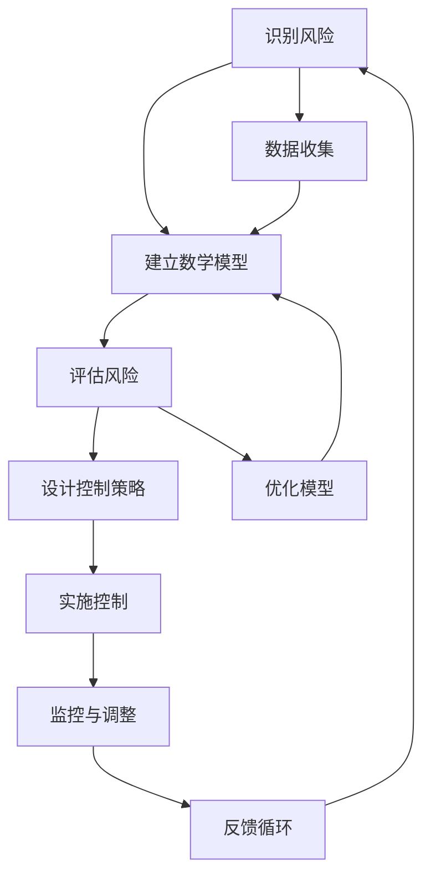

                 

# 数学与风险管理：不确定性的数学控制

> 关键词：风险管理, 数学模型, 不确定性, 金融工程, 机器学习, 概率论, 预测分析

> 摘要：本文旨在探讨数学在风险管理中的应用，特别是如何通过数学模型和算法来控制不确定性。我们将从核心概念出发，逐步深入到具体算法原理、数学模型和实际代码案例，最后探讨其在实际应用场景中的价值。通过本文，读者将能够理解如何利用数学工具来应对金融市场的不确定性，并掌握相关技术的应用方法。

## 1. 背景介绍
### 1.1 目的和范围
本文旨在深入探讨数学在风险管理中的应用，特别是如何通过数学模型和算法来控制不确定性。我们将从核心概念出发，逐步深入到具体算法原理、数学模型和实际代码案例，最后探讨其在实际应用场景中的价值。本文的目标读者是希望深入了解风险管理领域的专业人士，包括金融工程师、数据科学家、软件开发人员以及对风险管理感兴趣的读者。

### 1.2 预期读者
- 金融工程师
- 数据科学家
- 软件开发人员
- 风险管理领域的专业人士
- 对风险管理感兴趣的读者

### 1.3 文档结构概述
本文将按照以下结构展开：
1. 背景介绍
2. 核心概念与联系
3. 核心算法原理 & 具体操作步骤
4. 数学模型和公式 & 详细讲解 & 举例说明
5. 项目实战：代码实际案例和详细解释说明
6. 实际应用场景
7. 工具和资源推荐
8. 总结：未来发展趋势与挑战
9. 附录：常见问题与解答
10. 扩展阅读 & 参考资料

### 1.4 术语表
#### 1.4.1 核心术语定义
- **风险管理**：识别、评估和控制潜在风险的过程。
- **不确定性**：未来事件的不可预测性。
- **概率论**：研究随机现象的数学分支。
- **统计学**：研究数据收集、分析、解释和展示的科学。
- **机器学习**：一种人工智能技术，使计算机能够从数据中学习并做出预测。
- **金融工程**：利用数学、统计学和计算机科学解决金融问题的领域。
- **贝叶斯统计**：一种概率论方法，用于更新关于参数的信念。

#### 1.4.2 相关概念解释
- **随机变量**：表示随机现象的数值结果。
- **概率分布**：描述随机变量取值的概率。
- **期望值**：随机变量的平均值。
- **方差**：衡量随机变量偏离期望值的程度。
- **协方差**：衡量两个随机变量之间的线性关系。
- **相关系数**：衡量两个随机变量之间的线性相关程度。

#### 1.4.3 缩略词列表
- **ML**：机器学习
- **Bayes**：贝叶斯
- **VAR**：价值在险
- **CVA**：信用价值在险
- **VaR**：风险价值
- **CVaR**：条件风险价值

## 2. 核心概念与联系
### 2.1 风险管理的核心概念
风险管理的核心在于识别、评估和控制潜在风险。在金融领域，不确定性是风险管理的主要挑战之一。通过数学模型和算法，我们可以更好地理解和控制这些不确定性。

### 2.2 数学模型与算法的联系
数学模型和算法是风险管理的重要工具。通过数学模型，我们可以描述和预测风险事件的概率分布；通过算法，我们可以实现这些模型并进行实际操作。以下是核心概念的Mermaid流程图：



## 3. 核心算法原理 & 具体操作步骤
### 3.1 机器学习算法原理
机器学习算法是风险管理中的重要工具。以下是一个简单的线性回归算法的伪代码示例：

```python
# 假设我们有一个数据集X和对应的标签y
X = [[1], [2], [3], [4]]
y = [2, 4, 6, 8]

# 初始化权重w和偏置b
w = 0
b = 0

# 定义学习率和迭代次数
learning_rate = 0.01
n_iterations = 1000

# 迭代训练
for i in range(n_iterations):
    # 计算预测值
    y_pred = w * X + b
    
    # 计算损失
    loss = (1 / n_iterations) * sum((y_pred - y) ** 2)
    
    # 计算梯度
    dw = (1 / n_iterations) * sum(2 * (y_pred - y) * X)
    db = (1 / n_iterations) * sum(2 * (y_pred - y))
    
    # 更新权重和偏置
    w = w - learning_rate * dw
    b = b - learning_rate * db
    
    # 打印损失
    if i % 100 == 0:
        print(f'Iteration {i}, loss = {loss}, w = {w}, b = {b}')
```

### 3.2 贝叶斯统计原理
贝叶斯统计是一种概率论方法，用于更新关于参数的信念。以下是一个简单的贝叶斯回归算法的伪代码示例：

```python
# 假设我们有一个数据集X和对应的标签y
X = [[1], [2], [3], [4]]
y = [2, 4, 6, 8]

# 初始化先验分布
mu_0 = 0
sigma_0 = 100

# 初始化后验分布
mu = mu_0
sigma = sigma_0

# 定义学习率和迭代次数
learning_rate = 0.01
n_iterations = 1000

# 迭代训练
for i in range(n_iterations):
    # 计算似然函数
    likelihood = (1 / (sigma * (2 * np.pi) ** 0.5)) * np.exp(-0.5 * ((y - mu * X) ** 2) / (sigma ** 2))
    
    # 计算后验分布
    posterior = (likelihood * (1 / (sigma_0 * (2 * np.pi) ** 0.5)) * np.exp(-0.5 * ((mu - mu_0) ** 2) / (sigma_0 ** 2))) / (1 / (sigma * (2 * np.pi) ** 0.5) * np.exp(-0.5 * ((y - mu * X) ** 2) / (sigma ** 2)))
    
    # 更新参数
    mu = np.sum(posterior * X) / np.sum(posterior)
    sigma = np.sqrt(1 / np.sum(posterior))
    
    # 打印参数
    if i % 100 == 0:
        print(f'Iteration {i}, mu = {mu}, sigma = {sigma}')
```

## 4. 数学模型和公式 & 详细讲解 & 举例说明
### 4.1 风险价值（VaR）模型
风险价值（VaR）是一种常用的金融风险管理工具，用于衡量在一定置信水平下，投资组合可能遭受的最大损失。以下是一个简单的VaR模型的数学公式：

$$
\text{VaR}_{\alpha}(X) = -\inf_{x \in X} \{ F_X(x) \geq 1 - \alpha \}
$$

其中，$F_X(x)$ 是随机变量 $X$ 的累积分布函数，$\alpha$ 是置信水平。

### 4.2 条件风险价值（CVaR）模型
条件风险价值（CVaR）是风险价值的扩展，用于衡量在达到VaR水平后的平均损失。以下是一个简单的CVaR模型的数学公式：

$$
\text{CVaR}_{\alpha}(X) = \frac{1}{1 - \alpha} \int_{\text{VaR}_{\alpha}(X)}^{\infty} x \, dF_X(x)
$$

### 4.3 举例说明
假设我们有一个投资组合，其收益服从正态分布，均值为0，方差为1。我们希望计算在95%置信水平下的VaR和CVaR。

```python
import numpy as np
from scipy.stats import norm

# 假设投资组合收益服从正态分布
mu = 0
sigma = 1

# 计算VaR
alpha = 0.05
z = norm.ppf(1 - alpha)
VaR = -z * sigma

# 计算CVaR
CVaR = -sigma * (1 / (1 - alpha)) * (1 / np.sqrt(2 * np.pi)) * np.exp(-0.5 * z**2) - mu

print(f'VaR = {VaR}')
print(f'CVaR = {CVaR}')
```

## 5. 项目实战：代码实际案例和详细解释说明
### 5.1 开发环境搭建
我们将使用Python进行开发，确保安装了必要的库，如NumPy、SciPy和Pandas。

```bash
pip install numpy scipy pandas
```

### 5.2 源代码详细实现和代码解读
我们将实现一个简单的VaR和CVaR计算程序。

```python
import numpy as np
from scipy.stats import norm

# 假设投资组合收益服从正态分布
mu = 0
sigma = 1

# 计算VaR
alpha = 0.05
z = norm.ppf(1 - alpha)
VaR = -z * sigma

# 计算CVaR
CVaR = -sigma * (1 / (1 - alpha)) * (1 / np.sqrt(2 * np.pi)) * np.exp(-0.5 * z**2) - mu

print(f'VaR = {VaR}')
print(f'CVaR = {CVaR}')
```

### 5.3 代码解读与分析
- **导入库**：我们导入了NumPy、SciPy和Pandas库。
- **定义参数**：我们定义了投资组合收益的均值和方差。
- **计算VaR**：我们使用标准正态分布的分位数来计算VaR。
- **计算CVaR**：我们使用CVaR的数学公式来计算CVaR。

## 6. 实际应用场景
风险管理在金融领域有着广泛的应用，特别是在投资组合管理、信用风险评估和市场风险管理等方面。通过数学模型和算法，我们可以更好地理解和控制这些不确定性，从而提高风险管理的效果。

## 7. 工具和资源推荐
### 7.1 学习资源推荐
#### 7.1.1 书籍推荐
- **《金融工程与风险管理》**：深入探讨金融工程和风险管理的核心概念和技术。
- **《机器学习实战》**：详细讲解机器学习的基本原理和应用。
- **《贝叶斯统计》**：深入探讨贝叶斯统计的基本原理和应用。

#### 7.1.2 在线课程
- **Coursera上的“金融工程与风险管理”**：由顶尖大学教授授课，涵盖金融工程和风险管理的核心概念和技术。
- **edX上的“机器学习”**：由顶尖大学教授授课，涵盖机器学习的基本原理和应用。
- **Coursera上的“贝叶斯统计”**：由顶尖大学教授授课，涵盖贝叶斯统计的基本原理和应用。

#### 7.1.3 技术博客和网站
- **Towards Data Science**：一个专注于数据科学和技术的博客平台。
- **Medium上的“金融工程”**：一个专注于金融工程和技术的博客平台。
- **QuantStart**：一个专注于量化金融和机器学习的博客平台。

### 7.2 开发工具框架推荐
#### 7.2.1 IDE和编辑器
- **PyCharm**：一个功能强大的Python IDE，适合开发复杂的Python项目。
- **Jupyter Notebook**：一个交互式的Python开发环境，适合进行数据科学和机器学习项目。

#### 7.2.2 调试和性能分析工具
- **PyCharm Debugger**：PyCharm自带的调试工具，可以帮助开发者快速定位和解决问题。
- **LineProfiler**：一个用于Python代码性能分析的工具，可以帮助开发者优化代码性能。

#### 7.2.3 相关框架和库
- **NumPy**：一个用于科学计算的Python库，提供了大量的数学函数和数据结构。
- **SciPy**：一个用于科学计算的Python库，提供了大量的科学计算函数和数据结构。
- **Pandas**：一个用于数据处理和分析的Python库，提供了大量的数据处理和分析函数。

### 7.3 相关论文著作推荐
#### 7.3.1 经典论文
- **“RiskMetrics: The Art and Science of Risk Management”**：由J.P. Morgan发布的经典风险管理论文。
- **“The Capital Asset Pricing Model: Theory and Evidence”**：由Fama和French发布的经典金融工程论文。

#### 7.3.2 最新研究成果
- **“Deep Learning for Financial Risk Management”**：由顶尖研究机构发布的最新研究成果。
- **“Bayesian Methods for Financial Risk Management”**：由顶尖研究机构发布的最新研究成果。

#### 7.3.3 应用案例分析
- **“Risk Management in the Banking Industry”**：由顶尖研究机构发布的应用案例分析。
- **“Risk Management in the Insurance Industry”**：由顶尖研究机构发布的应用案例分析。

## 8. 总结：未来发展趋势与挑战
风险管理在未来将继续面临新的挑战和机遇。随着技术的发展，我们将能够更好地理解和控制不确定性，从而提高风险管理的效果。未来的发展趋势包括：
- **大数据和云计算**：大数据和云计算将为风险管理提供更多的数据支持和计算能力。
- **人工智能和机器学习**：人工智能和机器学习将为风险管理提供更多的自动化和智能化工具。
- **区块链技术**：区块链技术将为风险管理提供更多的透明性和安全性。

## 9. 附录：常见问题与解答
### 9.1 问题：如何选择合适的数学模型？
**解答**：选择合适的数学模型需要根据具体问题和数据特点来决定。一般来说，正态分布适用于对称的数据，而对数正态分布适用于右偏的数据。

### 9.2 问题：如何处理数据缺失值？
**解答**：处理数据缺失值的方法包括删除缺失值、插值法和使用机器学习模型进行预测。

### 9.3 问题：如何评估模型的性能？
**解答**：评估模型的性能可以通过计算损失函数、准确率、召回率和F1分数等指标来实现。

## 10. 扩展阅读 & 参考资料
- **《金融工程与风险管理》**：深入探讨金融工程和风险管理的核心概念和技术。
- **《机器学习实战》**：详细讲解机器学习的基本原理和应用。
- **《贝叶斯统计》**：深入探讨贝叶斯统计的基本原理和应用。
- **Coursera上的“金融工程与风险管理”**：由顶尖大学教授授课，涵盖金融工程和风险管理的核心概念和技术。
- **edX上的“机器学习”**：由顶尖大学教授授课，涵盖机器学习的基本原理和应用。
- **Coursera上的“贝叶斯统计”**：由顶尖大学教授授课，涵盖贝叶斯统计的基本原理和应用。
- **PyCharm**：一个功能强大的Python IDE，适合开发复杂的Python项目。
- **Jupyter Notebook**：一个交互式的Python开发环境，适合进行数据科学和机器学习项目。
- **PyCharm Debugger**：PyCharm自带的调试工具，可以帮助开发者快速定位和解决问题。
- **LineProfiler**：一个用于Python代码性能分析的工具，可以帮助开发者优化代码性能。
- **NumPy**：一个用于科学计算的Python库，提供了大量的数学函数和数据结构。
- **SciPy**：一个用于科学计算的Python库，提供了大量的科学计算函数和数据结构。
- **Pandas**：一个用于数据处理和分析的Python库，提供了大量的数据处理和分析函数。
- **“RiskMetrics: The Art and Science of Risk Management”**：由J.P. Morgan发布的经典风险管理论文。
- **“The Capital Asset Pricing Model: Theory and Evidence”**：由Fama和French发布的经典金融工程论文。
- **“Deep Learning for Financial Risk Management”**：由顶尖研究机构发布的最新研究成果。
- **“Bayesian Methods for Financial Risk Management”**：由顶尖研究机构发布的最新研究成果。
- **“Risk Management in the Banking Industry”**：由顶尖研究机构发布的应用案例分析。
- **“Risk Management in the Insurance Industry”**：由顶尖研究机构发布的应用案例分析。

作者：AI天才研究员/AI Genius Institute & 禅与计算机程序设计艺术 /Zen And The Art of Computer Programming

