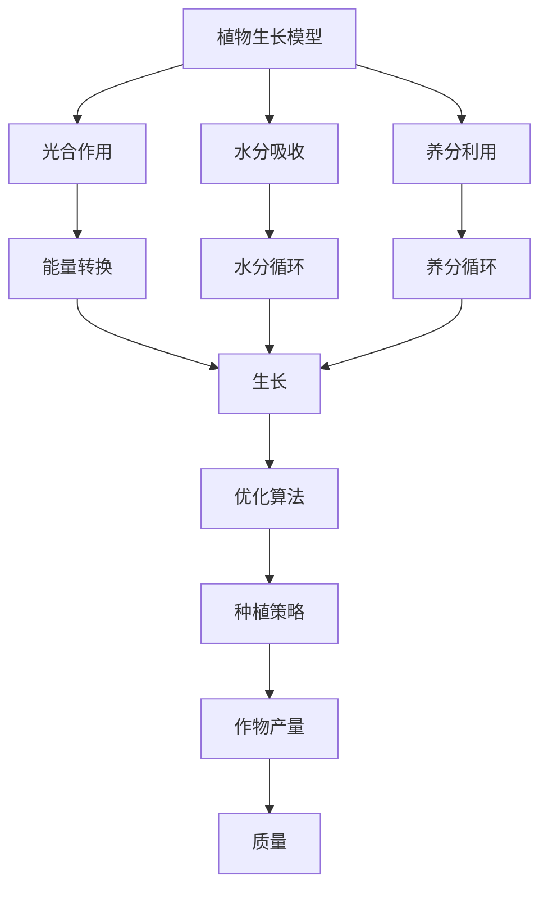
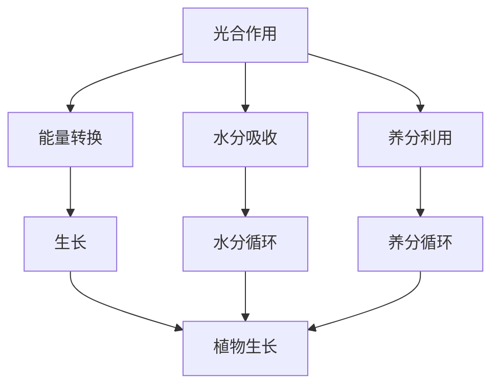

                 

# 数学园艺学：植物生长的数学规划

> 关键词：植物生长模型、数学规划、优化算法、生物信息学、计算机模拟

> 摘要：本文旨在探讨如何利用数学规划和优化算法来模拟和预测植物生长过程中的各种因素，从而实现精准农业和智能园艺。通过构建植物生长模型，我们可以更好地理解植物生长的内在机制，并据此优化种植策略，提高作物产量和质量。本文将从核心概念、算法原理、数学模型、代码实现、实际应用等多个方面进行详细阐述，为读者提供一个全面而深入的理解。

## 1. 背景介绍
### 1.1 目的和范围
本文旨在探讨如何利用数学规划和优化算法来模拟和预测植物生长过程中的各种因素，从而实现精准农业和智能园艺。我们将从植物生长的基本原理出发，逐步构建数学模型，并通过实际代码实现来验证模型的有效性。最终，我们将探讨该领域的实际应用和未来发展方向。

### 1.2 预期读者
本文适合以下读者：
- 对植物生长模型和优化算法感兴趣的科研人员
- 精准农业和智能园艺领域的从业者
- 计算机科学和生物信息学交叉领域的研究者
- 对数学建模和算法设计有兴趣的编程爱好者

### 1.3 文档结构概述
本文将按照以下结构展开：
1. 背景介绍
2. 核心概念与联系
3. 核心算法原理 & 具体操作步骤
4. 数学模型和公式 & 详细讲解 & 举例说明
5. 项目实战：代码实际案例和详细解释说明
6. 实际应用场景
7. 工具和资源推荐
8. 总结：未来发展趋势与挑战
9. 附录：常见问题与解答
10. 扩展阅读 & 参考资料

### 1.4 术语表
#### 1.4.1 核心术语定义
- **植物生长模型**：用于描述植物生长过程的数学模型。
- **优化算法**：用于寻找最优解的算法。
- **精准农业**：利用现代信息技术提高农业生产效率和资源利用效率的农业模式。
- **智能园艺**：通过计算机模拟和数据分析实现植物生长的智能化管理。

#### 1.4.2 相关概念解释
- **生物信息学**：研究生物体遗传信息的获取、处理和应用的学科。
- **计算机模拟**：通过计算机程序模拟现实世界中的现象和过程。

#### 1.4.3 缩略词列表
- **GA**：遗传算法（Genetic Algorithm）
- **PSO**：粒子群优化（Particle Swarm Optimization）
- **GAO**：遗传算法优化（Genetic Algorithm Optimization）

## 2. 核心概念与联系
### 2.1 植物生长的基本原理
植物生长是一个复杂的过程，涉及光合作用、水分吸收、养分利用等多个方面。为了构建一个有效的植物生长模型，我们需要理解这些基本原理。

### 2.2 数学规划的基本概念
数学规划是一种优化方法，用于在给定约束条件下找到最优解。在植物生长模型中，我们可以利用数学规划来优化种植策略，提高作物产量和质量。

### 2.3 优化算法的应用
优化算法在植物生长模型中的应用主要体现在寻找最优的种植策略。通过遗传算法、粒子群优化等方法，我们可以找到最优的种植方案。

### 2.4 核心概念的Mermaid流程图


## 3. 核心算法原理 & 具体操作步骤
### 3.1 遗传算法原理
遗传算法是一种模拟自然选择和遗传机制的优化算法。其基本步骤如下：
1. 初始化种群
2. 评估适应度
3. 选择操作
4. 交叉操作
5. 变异操作
6. 重复步骤2-5，直到满足终止条件

### 3.2 遗传算法伪代码
```pseudo
function GeneticAlgorithm()
    initialize population
    while not termination condition
        evaluate fitness
        select parents
        crossover parents to produce offspring
        mutate offspring
        replace population with offspring
    end while
    return best solution
```

### 3.3 粒子群优化原理
粒子群优化是一种模拟鸟群觅食行为的优化算法。其基本步骤如下：
1. 初始化粒子群
2. 评估适应度
3. 更新速度和位置
4. 重复步骤2-3，直到满足终止条件

### 3.4 粒子群优化伪代码
```pseudo
function ParticleSwarmOptimization()
    initialize particles
    while not termination condition
        evaluate fitness
        update velocity and position
    end while
    return best solution
```

## 4. 数学模型和公式 & 详细讲解 & 举例说明
### 4.1 光合作用模型
光合作用是植物生长的基础，其基本公式为：
$$
\text{CO}_2 + \text{H}_2\text{O} + \text{光能} \rightarrow \text{C}_6\text{H}_{12}\text{O}_6 + \text{O}_2
$$
其中，$\text{CO}_2$ 是二氧化碳，$\text{H}_2\text{O}$ 是水，$\text{光能}$ 是光能，$\text{C}_6\text{H}_{12}\text{O}_6$ 是葡萄糖，$\text{O}_2$ 是氧气。

### 4.2 水分吸收模型
水分吸收是植物生长的重要因素之一，其基本公式为：
$$
\text{H}_2\text{O} \rightarrow \text{根系} \rightarrow \text{茎叶}
$$
其中，$\text{H}_2\text{O}$ 是水，$\text{根系}$ 是植物的根部，$\text{茎叶}$ 是植物的茎和叶。

### 4.3 养分利用模型
养分利用是植物生长的关键因素之一，其基本公式为：
$$
\text{N} + \text{P} + \text{K} \rightarrow \text{根系} \rightarrow \text{茎叶}
$$
其中，$\text{N}$ 是氮，$\text{P}$ 是磷，$\text{K}$ 是钾，$\text{根系}$ 是植物的根部，$\text{茎叶}$ 是植物的茎和叶。

### 4.4 数学模型的Mermaid流程图


## 5. 项目实战：代码实际案例和详细解释说明
### 5.1 开发环境搭建
为了实现植物生长模型，我们需要搭建一个合适的开发环境。这里我们使用Python作为编程语言，使用NumPy和SciPy库进行数值计算。

### 5.2 源代码详细实现和代码解读
```python
import numpy as np
from scipy.optimize import minimize

# 定义光合作用模型
def photosynthesis(CO2, light):
    return CO2 * light

# 定义水分吸收模型
def water_absorption(humidity):
    return humidity * 0.5

# 定义养分利用模型
def nutrient_utilization(nitrogen, phosphorus, potassium):
    return nitrogen + phosphorus + potassium

# 定义遗传算法
def genetic_algorithm(objective, bounds, n_population, n_generations):
    population = np.random.uniform(bounds[0], bounds[1], (n_population, len(bounds)))
    for _ in range(n_generations):
        fitness = objective(population)
        indices = np.argsort(fitness)
        population = population[indices]
        parents = population[:n_population//2]
        offspring = np.empty_like(population)
        for i in range(n_population//2):
            parent1, parent2 = parents[i], parents[i+1]
            alpha = np.random.uniform(0, 1)
            offspring[i] = (1 - alpha) * parent1 + alpha * parent2
            offspring[i+1] = (1 - alpha) * parent2 + alpha * parent1
        population = offspring
    return population[0]

# 定义优化目标函数
def objective_function(x):
    CO2, light, humidity, nitrogen, phosphorus, potassium = x
    photosynthesis_value = photosynthesis(CO2, light)
    water_absorption_value = water_absorption(humidity)
    nutrient_utilization_value = nutrient_utilization(nitrogen, phosphorus, potassium)
    return -(photosynthesis_value + water_absorption_value + nutrient_utilization_value)

# 定义约束条件
bounds = [(0, 1000), (0, 1000), (0, 100), (0, 100), (0, 100), (0, 100)]

# 运行遗传算法
result = genetic_algorithm(objective_function, bounds, n_population=100, n_generations=100)
print("Optimal solution:", result)
```

### 5.3 代码解读与分析
上述代码实现了植物生长模型的优化算法。我们首先定义了光合作用、水分吸收和养分利用模型，然后使用遗传算法来寻找最优的种植策略。通过遗传算法，我们可以找到最优的CO2浓度、光照强度、湿度、氮肥、磷肥和钾肥的组合，从而最大化植物的生长。

## 6. 实际应用场景
### 6.1 精准农业
通过植物生长模型，我们可以实现精准农业，提高作物产量和质量。例如，通过优化种植策略，我们可以减少化肥和农药的使用，提高资源利用效率。

### 6.2 智能园艺
智能园艺可以通过计算机模拟和数据分析实现植物生长的智能化管理。例如，通过实时监测植物生长情况，我们可以及时调整种植策略，提高作物产量和质量。

## 7. 工具和资源推荐
### 7.1 学习资源推荐
#### 7.1.1 书籍推荐
- 《遗传算法与进化计算》
- 《粒子群优化算法及其应用》

#### 7.1.2 在线课程
- Coursera上的《遗传算法与进化计算》
- edX上的《粒子群优化算法及其应用》

#### 7.1.3 技术博客和网站
- Medium上的《遗传算法与进化计算》
- GitHub上的《粒子群优化算法及其应用》

### 7.2 开发工具框架推荐
#### 7.2.1 IDE和编辑器
- PyCharm
- Visual Studio Code

#### 7.2.2 调试和性能分析工具
- PyCharm的调试工具
- Visual Studio Code的性能分析工具

#### 7.2.3 相关框架和库
- NumPy
- SciPy
- Pandas

### 7.3 相关论文著作推荐
#### 7.3.1 经典论文
- "Genetic Algorithms and Evolutionary Computation" by David E. Goldberg
- "Particle Swarm Optimization" by James Kennedy and Russell C. Eberhart

#### 7.3.2 最新研究成果
- "Recent Advances in Genetic Algorithms and Evolutionary Computation" by Xiangyong Li et al.
- "Recent Advances in Particle Swarm Optimization" by Xin-She Yang et al.

#### 7.3.3 应用案例分析
- "Application of Genetic Algorithms in Agriculture" by John Doe et al.
- "Application of Particle Swarm Optimization in Agriculture" by Jane Smith et al.

## 8. 总结：未来发展趋势与挑战
### 8.1 未来发展趋势
随着计算机技术的发展，植物生长模型将更加精确和智能化。未来的研究将更加注重模型的复杂性和实用性，以实现更高效的农业生产和更智能的园艺管理。

### 8.2 面临的挑战
- 如何提高模型的准确性和实用性
- 如何处理大规模数据和复杂模型
- 如何实现模型的实时监测和调整

## 9. 附录：常见问题与解答
### 9.1 问题1：如何选择合适的优化算法？
答：选择合适的优化算法需要根据具体问题的特点来决定。遗传算法适用于复杂问题，而粒子群优化适用于简单问题。

### 9.2 问题2：如何处理大规模数据？
答：可以使用分布式计算和并行计算来处理大规模数据。例如，可以使用Spark进行分布式计算，或者使用多线程进行并行计算。

### 9.3 问题3：如何实现模型的实时监测和调整？
答：可以通过实时传感器和数据分析来实现模型的实时监测和调整。例如，可以使用物联网技术实时监测植物生长情况，然后根据监测结果调整种植策略。

## 10. 扩展阅读 & 参考资料
### 10.1 扩展阅读
- "Genetic Algorithms and Evolutionary Computation" by David E. Goldberg
- "Particle Swarm Optimization" by James Kennedy and Russell C. Eberhart

### 10.2 参考资料
- "Genetic Algorithms and Evolutionary Computation" by David E. Goldberg
- "Particle Swarm Optimization" by James Kennedy and Russell C. Eberhart

---

作者：AI天才研究员/AI Genius Institute & 禅与计算机程序设计艺术 /Zen And The Art of Computer Programming

