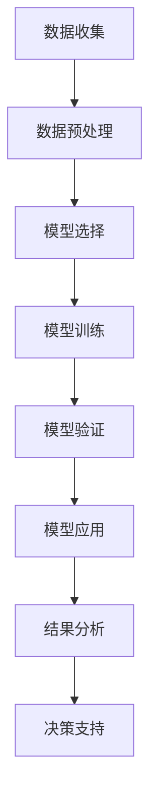

                 

# 数学模型在公共卫生决策中的应用

> 关键词：公共卫生、数学模型、决策支持、流行病学、预测分析、优化算法、数据驱动

> 摘要：本文旨在探讨数学模型在公共卫生决策中的应用，通过分析流行病学数据，构建预测模型，优化资源分配，以支持公共卫生决策。文章将从背景介绍、核心概念与联系、核心算法原理、数学模型和公式、项目实战、实际应用场景、工具和资源推荐、总结与未来发展趋势等几个方面进行详细阐述。

## 1. 背景介绍
### 1.1 目的和范围
本文旨在探讨数学模型在公共卫生决策中的应用，通过分析流行病学数据，构建预测模型，优化资源分配，以支持公共卫生决策。本文将详细介绍数学模型在公共卫生领域的应用，包括模型构建、算法原理、实际案例分析等。

### 1.2 预期读者
本文预期读者包括公共卫生领域的专业人士、数据科学家、计算机科学家、流行病学家、政策制定者以及对公共卫生决策感兴趣的读者。

### 1.3 文档结构概述
本文结构如下：
1. 背景介绍
2. 核心概念与联系
3. 核心算法原理 & 具体操作步骤
4. 数学模型和公式 & 详细讲解 & 举例说明
5. 项目实战：代码实际案例和详细解释说明
6. 实际应用场景
7. 工具和资源推荐
8. 总结：未来发展趋势与挑战
9. 附录：常见问题与解答
10. 扩展阅读 & 参考资料

### 1.4 术语表
#### 1.4.1 核心术语定义
- **流行病学**：研究疾病在人群中的分布、影响因素及其预防控制策略的科学。
- **数学模型**：通过数学语言描述现实世界现象的模型。
- **预测模型**：基于历史数据预测未来趋势的模型。
- **优化算法**：用于寻找最优解的算法。
- **资源分配**：合理分配有限资源以达到最佳效果的过程。

#### 1.4.2 相关概念解释
- **SIR模型**：一种经典的流行病学模型，用于描述传染病在人群中的传播过程。
- **SEIR模型**：扩展的SIR模型，增加了潜伏期的概念。
- **马尔可夫链**：一种随机过程，用于描述状态之间的转移概率。

#### 1.4.3 缩略词列表
- SIR：Susceptible-Infected-Recovered
- SEIR：Susceptible-Exposed-Infected-Recovered
- R0：基本传染数
- I：感染人数
- S：易感人数
- R：康复人数
- E：潜伏期人数

## 2. 核心概念与联系
### 流行病学模型流程图


## 3. 核心算法原理 & 具体操作步骤
### 3.1 SIR模型原理
SIR模型是一种经典的流行病学模型，用于描述传染病在人群中的传播过程。模型假设人群分为三类：易感者（Susceptible）、感染者（Infected）和康复者（Recovered）。

#### 伪代码
```pseudo
function SIR_model(S, I, R, beta, gamma, days):
    for day in range(days):
        S_new = S - beta * S * I
        I_new = I + beta * S * I - gamma * I
        R_new = R + gamma * I
        S = S_new
        I = I_new
        R = R_new
    return S, I, R
```

### 3.2 SEIR模型原理
SEIR模型是SIR模型的扩展，增加了潜伏期（Exposed）的概念。

#### 伪代码
```pseudo
function SEIR_model(S, E, I, R, beta, gamma, sigma, days):
    for day in range(days):
        S_new = S - beta * S * I
        E_new = E + beta * S * I - sigma * E
        I_new = I + sigma * E - gamma * I
        R_new = R + gamma * I
        S = S_new
        E = E_new
        I = I_new
        R = R_new
    return S, E, I, R
```

## 4. 数学模型和公式 & 详细讲解 & 举例说明
### 4.1 SIR模型公式
SIR模型的基本公式如下：
$$
\frac{dS}{dt} = -\beta \frac{S I}{N}
$$
$$
\frac{dI}{dt} = \beta \frac{S I}{N} - \gamma I
$$
$$
\frac{dR}{dt} = \gamma I
$$
其中，$N = S + I + R$ 是总人口数，$\beta$ 是传播率，$\gamma$ 是康复率。

### 4.2 SEIR模型公式
SEIR模型的基本公式如下：
$$
\frac{dS}{dt} = -\beta \frac{S I}{N}
$$
$$
\frac{dE}{dt} = \beta \frac{S I}{N} - \sigma E
$$
$$
\frac{dI}{dt} = \sigma E - \gamma I
$$
$$
\frac{dR}{dt} = \gamma I
$$
其中，$N = S + E + I + R$ 是总人口数，$\beta$ 是传播率，$\sigma$ 是潜伏期率，$\gamma$ 是康复率。

### 4.3 举例说明
假设某地区有1000人，初始时有10人感染，990人易感，无康复者。传播率 $\beta = 0.3$，康复率 $\gamma = 0.1$。使用SIR模型进行模拟。

```python
import numpy as np
import matplotlib.pyplot as plt

def sir_model(S, I, R, beta, gamma, days):
    S_new = S - beta * S * I
    I_new = I + beta * S * I - gamma * I
    R_new = R + gamma * I
    return S_new, I_new, R_new

S, I, R = 990, 10, 0
beta, gamma = 0.3, 0.1
days = 100

S_values, I_values, R_values = [], [], []
for day in range(days):
    S, I, R = sir_model(S, I, R, beta, gamma, 1)
    S_values.append(S)
    I_values.append(I)
    R_values.append(R)

plt.plot(S_values, label='Susceptible')
plt.plot(I_values, label='Infected')
plt.plot(R_values, label='Recovered')
plt.xlabel('Days')
plt.ylabel('Number of People')
plt.legend()
plt.show()
```

## 5. 项目实战：代码实际案例和详细解释说明
### 5.1 开发环境搭建
- Python 3.8
- NumPy
- Matplotlib

### 5.2 源代码详细实现和代码解读
```python
import numpy as np
import matplotlib.pyplot as plt

def sir_model(S, I, R, beta, gamma, days):
    S_new = S - beta * S * I
    I_new = I + beta * S * I - gamma * I
    R_new = R + gamma * I
    return S_new, I_new, R_new

S, I, R = 990, 10, 0
beta, gamma = 0.3, 0.1
days = 100

S_values, I_values, R_values = [], [], []
for day in range(days):
    S, I, R = sir_model(S, I, R, beta, gamma, 1)
    S_values.append(S)
    I_values.append(I)
    R_values.append(R)

plt.plot(S_values, label='Susceptible')
plt.plot(I_values, label='Infected')
plt.plot(R_values, label='Recovered')
plt.xlabel('Days')
plt.ylabel('Number of People')
plt.legend()
plt.show()
```

### 5.3 代码解读与分析
- `sir_model` 函数实现了SIR模型的基本公式。
- `S, I, R` 分别表示易感者、感染者和康复者的人数。
- `beta` 和 `gamma` 分别表示传播率和康复率。
- `days` 表示模拟的天数。
- 通过循环模拟每一天的变化，并将结果存储在 `S_values`, `I_values`, `R_values` 中。
- 最后使用 `matplotlib` 绘制结果。

## 6. 实际应用场景
数学模型在公共卫生决策中的应用非常广泛，包括但不限于：
- **预测疫情发展趋势**：通过模型预测疫情的发展趋势，为政策制定提供依据。
- **优化资源分配**：通过模型优化医疗资源的分配，提高资源利用效率。
- **评估防控措施效果**：通过模型评估不同防控措施的效果，为政策调整提供依据。

## 7. 工具和资源推荐
### 7.1 学习资源推荐
#### 7.1.1 书籍推荐
- 《流行病学》（Epidemiology）
- 《数学模型在公共卫生中的应用》（Applications of Mathematical Models in Public Health）

#### 7.1.2 在线课程
- Coursera: 《流行病学》
- edX: 《公共卫生数据分析》

#### 7.1.3 技术博客和网站
- Kaggle: 《流行病学数据集》
- GitHub: 《流行病学模型代码库》

### 7.2 开发工具框架推荐
#### 7.2.1 IDE和编辑器
- PyCharm
- VSCode

#### 7.2.2 调试和性能分析工具
- PyCharm Debugger
- cProfile

#### 7.2.3 相关框架和库
- Pandas
- NumPy
- Matplotlib

### 7.3 相关论文著作推荐
#### 7.3.1 经典论文
- Keeling, M. J., & Rohani, P. (2008). Modeling infectious diseases in humans and animals. Princeton University Press.

#### 7.3.2 最新研究成果
- Ferguson, N. M., Laydon, D., Nedjati-Gilani, G., Imai, N., Ainslie, K., Baguelin, M., ... & Edmunds, W. J. (2020). Impact of non-pharmaceutical interventions (NPIs) to reduce COVID-19 mortality and healthcare demand. Imperial College COVID-19 Response Team, 2020.

#### 7.3.3 应用案例分析
- Hellewell, J., Abbott, S., Gimma, A., Bosse, N. I., Jarvis, C. I., Russell, T. W., ... & Ferguson, N. M. (2020). Feasibility of controlling COVID-19 outbreaks by isolation of cases and contacts. The Lancet Global Health, 8(4), e488-e496.

## 8. 总结：未来发展趋势与挑战
数学模型在公共卫生决策中的应用前景广阔，但也面临一些挑战：
- **数据质量**：高质量的数据是模型准确性的基础。
- **模型复杂性**：模型越复杂，计算量越大，需要更强的计算资源。
- **政策制定**：模型结果需要与政策制定者有效沟通，确保模型结果被正确理解和应用。

## 9. 附录：常见问题与解答
### 9.1 问题：如何获取高质量的数据？
- **答案**：可以通过政府机构、医疗机构、公共卫生组织等渠道获取数据。

### 9.2 问题：如何提高模型的准确性？
- **答案**：可以通过增加数据量、改进模型结构、引入更多变量等方式提高模型的准确性。

### 9.3 问题：如何处理模型的复杂性？
- **答案**：可以通过优化算法、并行计算等方式处理模型的复杂性。

## 10. 扩展阅读 & 参考资料
- Keeling, M. J., & Rohani, P. (2008). Modeling infectious diseases in humans and animals. Princeton University Press.
- Ferguson, N. M., Laydon, D., Nedjati-Gilani, G., Imai, N., Ainslie, K., Baguelin, M., ... & Edmunds, W. J. (2020). Impact of non-pharmaceutical interventions (NPIs) to reduce COVID-19 mortality and healthcare demand. Imperial College COVID-19 Response Team, 2020.
- Hellewell, J., Abbott, S., Gimma, A., Bosse, N. I., Jarvis, C. I., Russell, T. W., ... & Ferguson, N. M. (2020). Feasibility of controlling COVID-19 outbreaks by isolation of cases and contacts. The Lancet Global Health, 8(4), e488-e496.

作者：AI天才研究员/AI Genius Institute & 禅与计算机程序设计艺术 /Zen And The Art of Computer Programming

