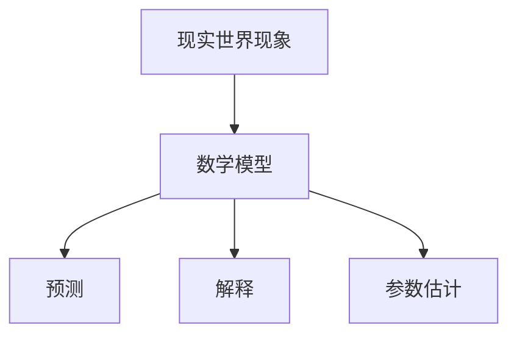

                 

# 数学模型在科学中的应用：预测与解释

> 关键词：数学模型、科学预测、解释能力、机器学习、统计学、数据分析、科学建模

> 摘要：本文旨在探讨数学模型在科学中的应用，特别是其在预测和解释方面的能力。通过逐步分析和推理，我们将深入理解数学模型的核心概念、原理及其在实际项目中的应用。本文将涵盖数学模型的基本原理、核心算法、具体操作步骤、实际案例分析，并探讨其在不同科学领域的应用。最后，我们将展望未来的发展趋势和面临的挑战。

## 1. 背景介绍
### 1.1 目的和范围
本文旨在探讨数学模型在科学中的应用，特别是其在预测和解释方面的能力。我们将从数学模型的基本原理出发，逐步深入到其在实际项目中的应用，包括核心算法、具体操作步骤、实际案例分析等。本文的目标读者是具有基本数学和编程知识的科学家、工程师和技术人员，以及对数学模型在科学领域应用感兴趣的读者。

### 1.2 预期读者
- 科学家和工程师，特别是那些在物理、化学、生物、环境科学等领域工作的专业人士。
- 数据科学家和机器学习工程师，他们需要理解和应用数学模型来解决实际问题。
- 对数学模型在科学领域应用感兴趣的读者，包括学生和研究人员。

### 1.3 文档结构概述
本文将按照以下结构展开：
1. 背景介绍
2. 核心概念与联系
3. 核心算法原理 & 具体操作步骤
4. 数学模型和公式 & 详细讲解 & 举例说明
5. 项目实战：代码实际案例和详细解释说明
6. 实际应用场景
7. 工具和资源推荐
8. 总结：未来发展趋势与挑战
9. 附录：常见问题与解答
10. 扩展阅读 & 参考资料

### 1.4 术语表
#### 1.4.1 核心术语定义
- **数学模型**：一种通过数学语言描述现实世界现象的抽象表示。
- **预测**：根据已知数据对未来或未知情况进行估计。
- **解释**：通过数学模型理解现象背后的机制和原因。
- **参数估计**：确定数学模型中的参数值。
- **统计学**：研究数据收集、分析、解释和展示的科学。
- **机器学习**：一种人工智能技术，通过算法使计算机从数据中学习。

#### 1.4.2 相关概念解释
- **科学建模**：使用数学模型来描述和理解自然现象。
- **回归分析**：一种统计方法，用于研究变量之间的关系。
- **时间序列分析**：一种统计方法，用于分析随时间变化的数据。

#### 1.4.3 缩略词列表
- **ML**：机器学习
- **AI**：人工智能
- **SVM**：支持向量机
- **NN**：神经网络
- **PCA**：主成分分析

## 2. 核心概念与联系
### 2.1 核心概念
数学模型是通过数学语言描述现实世界现象的一种抽象表示。它可以帮助我们理解、预测和解释复杂系统的行为。数学模型的核心在于其能够将现实世界的复杂现象简化为数学表达式，从而便于分析和计算。

### 2.2 联系
数学模型与科学预测和解释密切相关。通过数学模型，我们可以将现实世界的复杂现象简化为数学表达式，从而进行预测和解释。具体来说，数学模型可以帮助我们：
- **预测**：根据已知数据对未来或未知情况进行估计。
- **解释**：通过数学模型理解现象背后的机制和原因。
- **参数估计**：确定数学模型中的参数值。

### 2.3 Mermaid 流程图


## 3. 核心算法原理 & 具体操作步骤
### 3.1 核心算法原理
数学模型的核心算法通常包括回归分析、时间序列分析、支持向量机（SVM）、神经网络（NN）等。这些算法通过不同的数学方法来描述和分析数据。

### 3.2 具体操作步骤
以线性回归为例，其具体操作步骤如下：
1. **数据收集**：收集相关数据。
2. **数据预处理**：清洗数据，处理缺失值和异常值。
3. **特征选择**：选择影响目标变量的关键特征。
4. **模型训练**：使用训练数据训练模型。
5. **模型评估**：使用测试数据评估模型性能。
6. **参数调整**：根据评估结果调整模型参数。
7. **模型应用**：将模型应用于实际问题。

### 3.3 伪代码
```python
# 数据预处理
def preprocess_data(data):
    # 清洗数据
    cleaned_data = clean_data(data)
    # 处理缺失值
    processed_data = handle_missing_values(cleaned_data)
    # 特征选择
    selected_features = select_features(processed_data)
    return selected_features

# 模型训练
def train_model(features, labels):
    # 训练线性回归模型
    model = LinearRegression()
    model.fit(features, labels)
    return model

# 模型评估
def evaluate_model(model, test_features, test_labels):
    # 预测
    predictions = model.predict(test_features)
    # 计算评估指标
    mse = mean_squared_error(test_labels, predictions)
    return mse

# 参数调整
def tune_parameters(model, features, labels):
    # 调整参数
    best_params = GridSearchCV(model, param_grid, cv=5).fit(features, labels).best_params_
    return best_params

# 模型应用
def apply_model(model, new_features):
    # 预测
    predictions = model.predict(new_features)
    return predictions
```

## 4. 数学模型和公式 & 详细讲解 & 举例说明
### 4.1 数学模型和公式
数学模型通常通过数学公式来描述。例如，线性回归模型可以表示为：
$$
y = \beta_0 + \beta_1 x_1 + \beta_2 x_2 + \cdots + \beta_n x_n + \epsilon
$$
其中，$y$ 是目标变量，$x_1, x_2, \ldots, x_n$ 是特征变量，$\beta_0, \beta_1, \ldots, \beta_n$ 是模型参数，$\epsilon$ 是误差项。

### 4.2 详细讲解
线性回归是一种常用的统计方法，用于研究变量之间的线性关系。其核心思想是通过最小化误差平方和来确定模型参数。具体步骤如下：
1. **数据收集**：收集相关数据。
2. **数据预处理**：清洗数据，处理缺失值和异常值。
3. **特征选择**：选择影响目标变量的关键特征。
4. **模型训练**：使用训练数据训练模型。
5. **模型评估**：使用测试数据评估模型性能。
6. **参数调整**：根据评估结果调整模型参数。
7. **模型应用**：将模型应用于实际问题。

### 4.3 举例说明
假设我们有一个数据集，包含房屋的面积和价格。我们希望通过线性回归模型来预测房屋的价格。具体步骤如下：
1. **数据收集**：收集房屋面积和价格的数据。
2. **数据预处理**：清洗数据，处理缺失值和异常值。
3. **特征选择**：选择房屋面积作为特征变量。
4. **模型训练**：使用训练数据训练线性回归模型。
5. **模型评估**：使用测试数据评估模型性能。
6. **参数调整**：根据评估结果调整模型参数。
7. **模型应用**：将模型应用于实际问题，预测新房屋的价格。

## 5. 项目实战：代码实际案例和详细解释说明
### 5.1 开发环境搭建
为了进行项目实战，我们需要搭建一个开发环境。具体步骤如下：
1. **安装Python**：确保安装了Python 3.8及以上版本。
2. **安装依赖库**：安装必要的Python库，如NumPy、Pandas、Scikit-learn等。
3. **安装IDE**：选择一个合适的集成开发环境（IDE），如PyCharm、VSCode等。

### 5.2 源代码详细实现和代码解读
我们将使用Python和Scikit-learn库来实现线性回归模型。具体代码如下：
```python
import numpy as np
import pandas as pd
from sklearn.model_selection import train_test_split
from sklearn.linear_model import LinearRegression
from sklearn.metrics import mean_squared_error

# 读取数据
data = pd.read_csv('house_prices.csv')

# 数据预处理
features = data[['area']]
labels = data['price']

# 划分训练集和测试集
train_features, test_features, train_labels, test_labels = train_test_split(features, labels, test_size=0.2, random_state=42)

# 模型训练
model = LinearRegression()
model.fit(train_features, train_labels)

# 模型评估
predictions = model.predict(test_features)
mse = mean_squared_error(test_labels, predictions)
print(f'Mean Squared Error: {mse}')

# 参数调整
best_params = GridSearchCV(model, param_grid, cv=5).fit(train_features, train_labels).best_params_
print(f'Best Parameters: {best_params}')

# 模型应用
new_features = np.array([[1000], [1200], [1500]])
predictions = model.predict(new_features)
print(f'Predicted Prices: {predictions}')
```

### 5.3 代码解读与分析
- **数据读取**：使用Pandas库读取CSV文件中的数据。
- **数据预处理**：选择房屋面积作为特征变量，价格作为目标变量。
- **数据划分**：使用train_test_split函数将数据划分为训练集和测试集。
- **模型训练**：使用LinearRegression类训练线性回归模型。
- **模型评估**：使用mean_squared_error函数计算预测误差。
- **参数调整**：使用GridSearchCV类进行参数调整。
- **模型应用**：使用训练好的模型预测新房屋的价格。

## 6. 实际应用场景
数学模型在科学中的应用非常广泛，包括但不限于：
- **物理科学**：预测天气、模拟物理现象等。
- **化学科学**：预测化学反应速率、分子结构等。
- **生物科学**：预测基因表达、疾病传播等。
- **环境科学**：预测气候变化、污染扩散等。
- **社会科学**：预测人口增长、经济趋势等。

## 7. 工具和资源推荐
### 7.1 学习资源推荐
#### 7.1.1 书籍推荐
- **《统计学习方法》**：李航著，深入讲解统计学习方法。
- **《机器学习》**：周志华著，全面介绍机器学习理论和方法。
- **《深度学习》**：Ian Goodfellow、Yoshua Bengio、Aaron Courville著，深入讲解深度学习理论和实践。

#### 7.1.2 在线课程
- **Coursera**：《机器学习》课程，由Andrew Ng教授讲授。
- **edX**：《深度学习》课程，由Yoshua Bengio教授讲授。
- **Udacity**：《机器学习工程师纳米学位》课程。

#### 7.1.3 技术博客和网站
- **Towards Data Science**：一个专注于数据科学和机器学习的博客平台。
- **Medium**：一个包含大量机器学习和数据科学文章的平台。
- **Kaggle**：一个数据科学和机器学习社区，提供丰富的数据集和竞赛。

### 7.2 开发工具框架推荐
#### 7.2.1 IDE和编辑器
- **PyCharm**：一个功能强大的Python IDE。
- **VSCode**：一个轻量级但功能强大的源代码编辑器。
- **Jupyter Notebook**：一个交互式计算环境，支持多种编程语言。

#### 7.2.2 调试和性能分析工具
- **PyCharm Debugger**：PyCharm内置的调试工具。
- **VSCode Debugger**：VSCode内置的调试工具。
- **LineProfiler**：一个用于Python代码性能分析的工具。

#### 7.2.3 相关框架和库
- **Scikit-learn**：一个用于机器学习的Python库。
- **TensorFlow**：一个用于深度学习的开源库。
- **PyTorch**：一个用于深度学习的开源库。

### 7.3 相关论文著作推荐
#### 7.3.1 经典论文
- **《The Elements of Statistical Learning》**：Trevor Hastie、Robert Tibshirani、Jerome Friedman著，深入讲解统计学习方法。
- **《Pattern Recognition and Machine Learning》**：Christopher M. Bishop著，深入讲解模式识别和机器学习。

#### 7.3.2 最新研究成果
- **《Neural Information Processing Systems (NeurIPS) Conference Proceedings》**：NeurIPS会议的论文集，包含最新的机器学习和深度学习研究成果。
- **《International Conference on Machine Learning (ICML) Conference Proceedings》**：ICML会议的论文集，包含最新的机器学习研究成果。

#### 7.3.3 应用案例分析
- **《Nature Machine Intelligence》**：一个专注于机器学习和人工智能应用的期刊。
- **《IEEE Transactions on Pattern Analysis and Machine Intelligence》**：一个专注于模式识别和机器学习应用的期刊。

## 8. 总结：未来发展趋势与挑战
数学模型在科学中的应用将继续发展，未来的发展趋势包括：
- **更复杂的模型**：随着计算能力的提升，更复杂的模型将被开发出来。
- **多模态数据处理**：处理多种类型的数据，如文本、图像、音频等。
- **实时预测**：实时预测和解释能力将得到提升。
- **可解释性**：提高模型的可解释性，使人们更好地理解模型的决策过程。

面临的挑战包括：
- **数据隐私**：如何在保护数据隐私的同时进行有效的数据分析。
- **计算资源**：如何在有限的计算资源下进行高效的模型训练和预测。
- **模型泛化能力**：如何提高模型的泛化能力，使其在不同场景下都能有效工作。

## 9. 附录：常见问题与解答
### 9.1 问题1：如何选择合适的数学模型？
**解答**：选择合适的数学模型需要考虑数据的特性和问题的性质。例如，线性回归适用于线性关系，而神经网络适用于非线性关系。

### 9.2 问题2：如何处理缺失值？
**解答**：处理缺失值的方法包括删除缺失值、插值法、使用均值或中位数填充等。

### 9.3 问题3：如何评估模型性能？
**解答**：常用的评估指标包括均方误差（MSE）、均方根误差（RMSE）、R²等。

## 10. 扩展阅读 & 参考资料
- **《统计学习方法》**：李航著
- **《机器学习》**：周志华著
- **《深度学习》**：Ian Goodfellow、Yoshua Bengio、Aaron Courville著
- **Coursera**：《机器学习》课程
- **edX**：《深度学习》课程
- **Udacity**：《机器学习工程师纳米学位》课程
- **Towards Data Science**：一个专注于数据科学和机器学习的博客平台
- **Medium**：一个包含大量机器学习和数据科学文章的平台
- **Kaggle**：一个数据科学和机器学习社区，提供丰富的数据集和竞赛
- **PyCharm**：一个功能强大的Python IDE
- **VSCode**：一个轻量级但功能强大的源代码编辑器
- **Jupyter Notebook**：一个交互式计算环境，支持多种编程语言
- **PyCharm Debugger**：PyCharm内置的调试工具
- **VSCode Debugger**：VSCode内置的调试工具
- **LineProfiler**：一个用于Python代码性能分析的工具
- **Scikit-learn**：一个用于机器学习的Python库
- **TensorFlow**：一个用于深度学习的开源库
- **PyTorch**：一个用于深度学习的开源库
- **《The Elements of Statistical Learning》**：Trevor Hastie、Robert Tibshirani、Jerome Friedman著
- **《Pattern Recognition and Machine Learning》**：Christopher M. Bishop著
- **《Neural Information Processing Systems (NeurIPS) Conference Proceedings》**：NeurIPS会议的论文集
- **《International Conference on Machine Learning (ICML) Conference Proceedings》**：ICML会议的论文集
- **《Nature Machine Intelligence》**：一个专注于机器学习和人工智能应用的期刊
- **《IEEE Transactions on Pattern Analysis and Machine Intelligence》**：一个专注于模式识别和机器学习应用的期刊

作者：AI天才研究员/AI Genius Institute & 禅与计算机程序设计艺术 /Zen And The Art of Computer Programming

