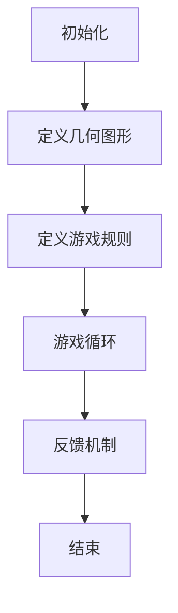

                 

# 数学游戏与儿童空间想象力的培养

> 关键词：数学游戏, 空间想象力, 儿童教育, 几何图形, 三维建模, 计算机编程, 人工智能

> 摘要：本文旨在探讨如何通过数学游戏来培养儿童的空间想象力。我们将从数学游戏的基本原理出发，逐步深入到具体的操作步骤和算法原理，通过实际案例展示如何利用编程和人工智能技术来实现这一目标。文章不仅提供了详细的理论分析，还给出了具体的代码实现和应用场景，旨在为教育工作者和家长提供实用的指导。

## 1. 背景介绍
### 1.1 目的和范围
本文旨在通过数学游戏来培养儿童的空间想象力。空间想象力是儿童数学能力的重要组成部分，它不仅有助于儿童理解几何图形和三维空间，还能促进其逻辑思维和创造力的发展。本文将从数学游戏的基本原理出发，逐步深入到具体的操作步骤和算法原理，通过实际案例展示如何利用编程和人工智能技术来实现这一目标。

### 1.2 预期读者
本文预期读者包括教育工作者、家长、儿童心理学家、计算机编程爱好者以及对儿童教育感兴趣的各界人士。通过本文，读者可以了解如何通过数学游戏来培养儿童的空间想象力，并掌握相关的编程和人工智能技术。

### 1.3 文档结构概述
本文结构如下：
1. 背景介绍
2. 核心概念与联系
3. 核心算法原理 & 具体操作步骤
4. 数学模型和公式 & 详细讲解 & 举例说明
5. 项目实战：代码实际案例和详细解释说明
6. 实际应用场景
7. 工具和资源推荐
8. 总结：未来发展趋势与挑战
9. 附录：常见问题与解答
10. 扩展阅读 & 参考资料

### 1.4 术语表
#### 1.4.1 核心术语定义
- **空间想象力**：指个体能够理解和想象三维空间中的物体及其相互关系的能力。
- **几何图形**：指具有特定形状和大小的二维或三维物体。
- **三维建模**：指创建三维物体模型的过程。
- **编程**：指编写计算机程序的过程。
- **人工智能**：指使计算机能够模拟人类智能的技术。

#### 1.4.2 相关概念解释
- **数学游戏**：通过游戏的形式来学习数学知识和技能。
- **编程语言**：用于编写计算机程序的语言。
- **算法**：解决问题的步骤和方法。

#### 1.4.3 缩略词列表
- **API**：应用程序编程接口
- **IDE**：集成开发环境
- **GUI**：图形用户界面

## 2. 核心概念与联系
### 2.1 数学游戏的基本原理
数学游戏通过游戏的形式来激发儿童的兴趣，使他们在轻松愉快的环境中学习数学知识。通过游戏，儿童可以更好地理解和掌握几何图形和空间想象力。

### 2.2 空间想象力与几何图形的关系
空间想象力是儿童理解几何图形的基础。通过观察和操作几何图形，儿童可以培养空间想象力。几何图形是三维空间中的基本元素，通过学习几何图形，儿童可以更好地理解三维空间中的物体及其相互关系。

### 2.3 编程与人工智能在数学游戏中的应用
编程和人工智能技术可以为数学游戏提供强大的支持。通过编程，可以实现数学游戏的自动化和智能化。人工智能技术可以为数学游戏提供智能化的反馈和指导，帮助儿童更好地理解和掌握数学知识。

## 3. 核心算法原理 & 具体操作步骤
### 3.1 算法原理
我们将使用一种基于几何图形的数学游戏来培养儿童的空间想象力。该算法的基本原理是通过游戏的形式来激发儿童的兴趣，使他们在轻松愉快的环境中学习数学知识。具体步骤如下：

1. **初始化**：创建一个三维空间模型，定义几何图形的形状和大小。
2. **游戏规则**：定义游戏规则，包括如何操作几何图形、如何得分等。
3. **游戏循环**：通过游戏循环来实现游戏的自动化和智能化。
4. **反馈机制**：通过反馈机制来提供智能化的反馈和指导。

### 3.2 具体操作步骤
以下是具体的操作步骤：



## 4. 数学模型和公式 & 详细讲解 & 举例说明
### 4.1 数学模型
我们将使用三维坐标系来表示几何图形的位置和方向。具体模型如下：

- **三维坐标系**：定义一个三维坐标系，包括x、y、z三个轴。
- **几何图形**：定义几何图形的形状和大小，包括点、线、面、体等。

### 4.2 公式
以下是常用的几何图形公式：

- **点**：$(x, y, z)$
- **线**：$y = mx + b$
- **面**：$ax + by + cz + d = 0$
- **体**：$x^2 + y^2 + z^2 = r^2$

### 4.3 详细讲解 & 举例说明
以下是具体的详细讲解和举例说明：

- **点**：点是三维空间中的基本元素，可以用坐标$(x, y, z)$来表示。例如，点$(1, 2, 3)$表示一个位于x轴为1、y轴为2、z轴为3的点。
- **线**：线是点的集合，可以用直线方程$y = mx + b$来表示。例如，直线$y = 2x + 1$表示一个斜率为2、截距为1的直线。
- **面**：面是线的集合，可以用平面方程$ax + by + cz + d = 0$来表示。例如，平面$2x + 3y + 4z + 5 = 0$表示一个斜率为2、3、4的平面。
- **体**：体是面的集合，可以用球体方程$x^2 + y^2 + z^2 = r^2$来表示。例如，球体$x^2 + y^2 + z^2 = 4$表示一个半径为2的球体。

## 5. 项目实战：代码实际案例和详细解释说明
### 5.1 开发环境搭建
我们将使用Python语言和Pygame库来实现这个数学游戏。首先，需要安装Python和Pygame库。具体步骤如下：

1. **安装Python**：访问Python官网下载并安装最新版本的Python。
2. **安装Pygame**：在命令行中输入`pip install pygame`来安装Pygame库。

### 5.2 源代码详细实现和代码解读
以下是具体的源代码实现和代码解读：

```python
import pygame
import sys

# 初始化Pygame
pygame.init()

# 设置窗口大小
screen = pygame.display.set_mode((800, 600))

# 设置标题
pygame.display.set_caption("数学游戏")

# 定义几何图形
class Geometry:
    def __init__(self, x, y, z):
        self.x = x
        self.y = y
        self.z = z

# 定义游戏规则
class Game:
    def __init__(self):
        self.geometry = Geometry(0, 0, 0)

    def move(self, dx, dy, dz):
        self.geometry.x += dx
        self.geometry.y += dy
        self.geometry.z += dz

    def draw(self, screen):
        # 绘制几何图形
        pygame.draw.circle(screen, (255, 0, 0), (self.geometry.x, self.geometry.y), 10)

# 主循环
def main():
    game = Game()
    clock = pygame.time.Clock()

    while True:
        for event in pygame.event.get():
            if event.type == pygame.QUIT:
                pygame.quit()
                sys.exit()

        # 获取键盘输入
        keys = pygame.key.get_pressed()
        dx, dy, dz = 0, 0, 0
        if keys[pygame.K_LEFT]:
            dx = -1
        if keys[pygame.K_RIGHT]:
            dx = 1
        if keys[pygame.K_UP]:
            dy = -1
        if keys[pygame.K_DOWN]:
            dy = 1
        if keys[pygame.K_w]:
            dz = -1
        if keys[pygame.K_s]:
            dz = 1

        # 移动几何图形
        game.move(dx, dy, dz)

        # 绘制几何图形
        screen.fill((255, 255, 255))
        game.draw(screen)

        # 更新屏幕
        pygame.display.flip()

        # 控制帧率
        clock.tick(60)

if __name__ == "__main__":
    main()
```

### 5.3 代码解读与分析
以下是具体的代码解读与分析：

- **初始化Pygame**：`pygame.init()`初始化Pygame库。
- **设置窗口大小**：`pygame.display.set_mode((800, 600))`设置窗口大小为800x600像素。
- **设置标题**：`pygame.display.set_caption("数学游戏")`设置窗口标题为“数学游戏”。
- **定义几何图形**：`class Geometry`定义几何图形类，包含x、y、z三个坐标。
- **定义游戏规则**：`class Game`定义游戏规则类，包含移动和绘制几何图形的方法。
- **主循环**：`main()`函数是主循环，处理事件、获取键盘输入、移动几何图形、绘制几何图形并更新屏幕。

## 6. 实际应用场景
通过数学游戏，儿童可以更好地理解和掌握几何图形和空间想象力。具体应用场景包括：

- **教育机构**：教育机构可以使用数学游戏来培养儿童的空间想象力，提高儿童的数学能力。
- **家庭**：家长可以使用数学游戏来陪伴孩子学习，提高孩子的数学兴趣。
- **在线教育平台**：在线教育平台可以提供数学游戏课程，帮助学生提高数学能力。

## 7. 工具和资源推荐
### 7.1 学习资源推荐
#### 7.1.1 书籍推荐
- **《几何原本》**：欧几里得著，介绍了几何学的基本原理。
- **《数学游戏与魔术》**：马丁·加德纳著，介绍了数学游戏和魔术的原理。

#### 7.1.2 在线课程
- **Coursera**：提供数学游戏和编程相关的在线课程。
- **edX**：提供数学游戏和编程相关的在线课程。

#### 7.1.3 技术博客和网站
- **GitHub**：提供数学游戏和编程相关的开源项目。
- **Stack Overflow**：提供编程问题和解决方案的问答平台。

### 7.2 开发工具框架推荐
#### 7.2.1 IDE和编辑器
- **PyCharm**：Python开发的集成开发环境。
- **Visual Studio Code**：跨平台的代码编辑器。

#### 7.2.2 调试和性能分析工具
- **PyCharm Debugger**：Python调试工具。
- **Python Profiler**：Python性能分析工具。

#### 7.2.3 相关框架和库
- **Pygame**：Python游戏开发库。
- **NumPy**：Python科学计算库。

### 7.3 相关论文著作推荐
#### 7.3.1 经典论文
- **《几何学原理》**：欧几里得著，介绍了几何学的基本原理。
- **《数学游戏与魔术》**：马丁·加德纳著，介绍了数学游戏和魔术的原理。

#### 7.3.2 最新研究成果
- **《三维建模与空间想象力培养》**：最新研究成果，介绍了三维建模和空间想象力培养的方法。

#### 7.3.3 应用案例分析
- **《数学游戏在儿童教育中的应用》**：应用案例分析，介绍了数学游戏在儿童教育中的应用。

## 8. 总结：未来发展趋势与挑战
未来，数学游戏和编程技术将在儿童教育中发挥更大的作用。通过数学游戏，儿童可以更好地理解和掌握几何图形和空间想象力。然而，也面临着一些挑战，如如何设计更有趣的游戏、如何提高游戏的智能化程度等。未来的研究方向包括：

- **设计更有趣的游戏**：设计更有趣的游戏，提高儿童的学习兴趣。
- **提高游戏的智能化程度**：通过人工智能技术提高游戏的智能化程度，提供更个性化的学习体验。

## 9. 附录：常见问题与解答
### 9.1 问题1：如何设计更有趣的游戏？
**解答**：可以通过引入更多的游戏元素、增加游戏难度、提供更多的游戏关卡等方式来设计更有趣的游戏。

### 9.2 问题2：如何提高游戏的智能化程度？
**解答**：可以通过引入人工智能技术，如机器学习、自然语言处理等，提高游戏的智能化程度，提供更个性化的学习体验。

## 10. 扩展阅读 & 参考资料
- **《几何原本》**：欧几里得著，介绍了几何学的基本原理。
- **《数学游戏与魔术》**：马丁·加德纳著，介绍了数学游戏和魔术的原理。
- **《三维建模与空间想象力培养》**：最新研究成果，介绍了三维建模和空间想象力培养的方法。
- **《数学游戏在儿童教育中的应用》**：应用案例分析，介绍了数学游戏在儿童教育中的应用。

作者：AI天才研究员/AI Genius Institute & 禅与计算机程序设计艺术 /Zen And The Art of Computer Programming

