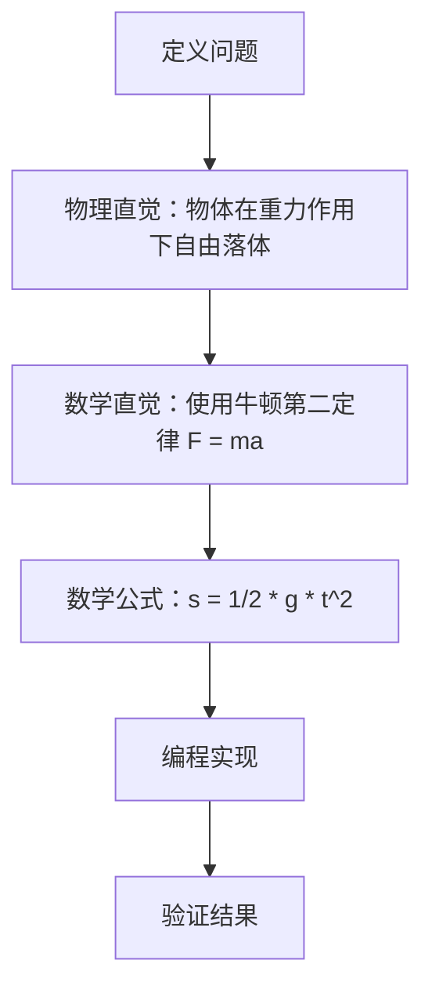

                 

# 数学直觉与物理直觉：科学家的思维方式

> 关键词：数学直觉, 物理直觉, 科学思维, 逻辑推理, 理论与实践, 人工智能, 计算机科学

> 摘要：本文旨在探讨数学直觉与物理直觉在科学家思维方式中的重要性。通过分析数学与物理的基本原理，我们将揭示这两种直觉如何在科学研究中相互作用，以及它们如何帮助科学家构建强大的理论模型和解决实际问题。文章将通过详细的伪代码、数学公式和实际代码案例，展示这些直觉如何在计算机科学和人工智能领域发挥作用。最后，我们将讨论未来的发展趋势和面临的挑战。

## 1. 背景介绍
### 1.1 目的和范围
本文旨在深入探讨数学直觉与物理直觉在科学研究中的重要性，特别是它们如何在计算机科学和人工智能领域发挥作用。我们将通过理论分析和实际案例，展示这两种直觉如何帮助科学家构建强大的理论模型和解决实际问题。

### 1.2 预期读者
本文适合对数学、物理、计算机科学和人工智能感兴趣的读者，包括科研人员、工程师、学生以及对科学思维感兴趣的读者。

### 1.3 文档结构概述
本文将分为以下几个部分：
1. 背景介绍
2. 核心概念与联系
3. 核心算法原理 & 具体操作步骤
4. 数学模型和公式 & 详细讲解 & 举例说明
5. 项目实战：代码实际案例和详细解释说明
6. 实际应用场景
7. 工具和资源推荐
8. 总结：未来发展趋势与挑战
9. 附录：常见问题与解答
10. 扩展阅读 & 参考资料

### 1.4 术语表
#### 1.4.1 核心术语定义
- **数学直觉**：科学家在没有严格证明的情况下，通过直觉和经验对数学问题的理解和预测。
- **物理直觉**：科学家在没有严格证明的情况下，通过直觉和经验对物理现象的理解和预测。
- **理论模型**：基于数学和物理原理构建的抽象模型，用于描述和预测现象。
- **伪代码**：一种非正式的编程语言，用于描述算法步骤。
- **数学公式**：用数学符号表示的等式或表达式。
- **实际代码案例**：通过编程实现的理论模型。

#### 1.4.2 相关概念解释
- **逻辑推理**：通过已知事实和规则推导出新的结论。
- **计算机科学**：研究计算机系统的设计、实现和应用的学科。
- **人工智能**：模拟、扩展和增强人类智能的技术。

#### 1.4.3 缩略词列表
- AI：人工智能
- CS：计算机科学
- ML：机器学习
- DL：深度学习
- NLP：自然语言处理

## 2. 核心概念与联系
### 2.1 数学直觉
数学直觉是科学家在没有严格证明的情况下，通过直觉和经验对数学问题的理解和预测。这种直觉可以帮助科学家快速识别问题的关键点，提出假设，并进行初步验证。

### 2.2 物理直觉
物理直觉是科学家在没有严格证明的情况下，通过直觉和经验对物理现象的理解和预测。这种直觉可以帮助科学家快速识别物理现象的关键因素，提出假设，并进行初步验证。

### 2.3 数学直觉与物理直觉的联系
数学直觉和物理直觉在科学研究中相互作用，共同帮助科学家构建强大的理论模型。数学直觉帮助科学家在抽象层面上理解问题，而物理直觉帮助科学家在具体层面上理解现象。两者结合，可以更全面地理解和解决实际问题。

## 3. 核心算法原理 & 具体操作步骤
### 3.1 核心算法原理
我们将通过一个简单的算法来展示数学直觉和物理直觉在实际操作中的应用。假设我们要解决一个物理问题：如何计算一个物体在重力作用下的自由落体运动。

### 3.2 具体操作步骤


## 4. 数学模型和公式 & 详细讲解 & 举例说明
### 4.1 数学模型
我们将使用牛顿第二定律和自由落体公式来构建数学模型。

### 4.2 公式
自由落体公式为：
$$ s = \frac{1}{2} g t^2 $$
其中，$s$ 是物体下落的距离，$g$ 是重力加速度，$t$ 是时间。

### 4.3 详细讲解
自由落体公式是基于牛顿第二定律推导出来的。牛顿第二定律表示力等于质量乘以加速度，即 $F = ma$。在自由落体情况下，物体只受到重力的作用，因此 $F = mg$。根据牛顿第二定律，加速度 $a = g$。将加速度代入位移公式 $s = \frac{1}{2} a t^2$，得到自由落体公式 $s = \frac{1}{2} g t^2$。

### 4.4 举例说明
假设一个物体从静止开始自由下落，重力加速度 $g = 9.8 \, \text{m/s}^2$，下落时间为 $t = 2 \, \text{s}$。根据自由落体公式，物体下落的距离为：
$$ s = \frac{1}{2} \times 9.8 \times 2^2 = 19.6 \, \text{m} $$

## 5. 项目实战：代码实际案例和详细解释说明
### 5.1 开发环境搭建
我们将使用Python语言进行编程。首先，确保安装了Python和必要的库，如NumPy和Matplotlib。

### 5.2 源代码详细实现和代码解读
```python
import numpy as np
import matplotlib.pyplot as plt

# 定义重力加速度
g = 9.8

# 定义时间范围
t = np.linspace(0, 5, 100)

# 计算自由落体距离
s = 0.5 * g * t**2

# 绘制自由落体距离随时间的变化
plt.plot(t, s)
plt.xlabel('时间 (s)')
plt.ylabel('距离 (m)')
plt.title('自由落体距离随时间的变化')
plt.show()
```

### 5.3 代码解读与分析
- `import numpy as np`：导入NumPy库，用于数值计算。
- `import matplotlib.pyplot as plt`：导入Matplotlib库，用于绘制图表。
- `g = 9.8`：定义重力加速度。
- `t = np.linspace(0, 5, 100)`：生成从0到5秒的时间范围，共100个点。
- `s = 0.5 * g * t**2`：根据自由落体公式计算距离。
- `plt.plot(t, s)`：绘制距离随时间的变化曲线。
- `plt.xlabel('时间 (s)')`：设置x轴标签。
- `plt.ylabel('距离 (m)')`：设置y轴标签。
- `plt.title('自由落体距离随时间的变化')`：设置图表标题。
- `plt.show()`：显示图表。

## 6. 实际应用场景
自由落体公式在许多实际应用中都有广泛的应用，如：
- 物理实验：验证自由落体定律。
- 工程设计：计算物体在重力作用下的运动。
- 体育运动：分析运动员的跳跃高度。

## 7. 工具和资源推荐
### 7.1 学习资源推荐
#### 7.1.1 书籍推荐
- 《数学之美》：吴军
- 《物理之美》：李政道
- 《计算机程序设计艺术》：Donald E. Knuth

#### 7.1.2 在线课程
- Coursera：《计算思维》
- edX：《物理基础》
- Udacity：《机器学习》

#### 7.1.3 技术博客和网站
- Medium：《数学与物理直觉》
- HackerRank：《自由落体公式》
- GitHub：《自由落体公式实现》

### 7.2 开发工具框架推荐
#### 7.2.1 IDE和编辑器
- PyCharm：Python开发环境
- Visual Studio Code：多语言开发环境

#### 7.2.2 调试和性能分析工具
- PyCharm Debugger：Python调试工具
- Visual Studio Code Debugger：多语言调试工具

#### 7.2.3 相关框架和库
- NumPy：数值计算库
- Matplotlib：数据可视化库

### 7.3 相关论文著作推荐
#### 7.3.1 经典论文
- Newton, I. (1687). Philosophiæ Naturalis Principia Mathematica.
- Galileo, G. (1638). Discorsi e Dimostrazioni Matematiche, intorno a due nuove scienze.

#### 7.3.2 最新研究成果
- ArXiv：《自由落体公式的新应用》
- ResearchGate：《自由落体公式在工程设计中的应用》

#### 7.3.3 应用案例分析
- IEEE：《自由落体公式在体育运动中的应用》
- ACM：《自由落体公式在物理实验中的应用》

## 8. 总结：未来发展趋势与挑战
未来，数学直觉和物理直觉将继续在科学研究中发挥重要作用。随着计算机科学和人工智能的发展，科学家将能够利用更强大的工具和算法来解决更复杂的问题。然而，这也带来了新的挑战，如如何处理大数据、如何提高算法的效率和准确性等。

## 9. 附录：常见问题与解答
### 9.1 问题：如何提高数学直觉？
- 答案：通过多做练习、多思考、多交流，不断提高自己的数学直觉。

### 9.2 问题：如何提高物理直觉？
- 答案：通过多做实验、多观察、多思考，不断提高自己的物理直觉。

## 10. 扩展阅读 & 参考资料
- [牛顿第二定律](https://en.wikipedia.org/wiki/Newton%27s_laws_of_motion)
- [自由落体公式](https://en.wikipedia.org/wiki/Free_fall)
- [Python官方文档](https://docs.python.org/3/)
- [NumPy官方文档](https://numpy.org/doc/stable/)
- [Matplotlib官方文档](https://matplotlib.org/stable/)

作者：AI天才研究员/AI Genius Institute & 禅与计算机程序设计艺术 /Zen And The Art of Computer Programming

