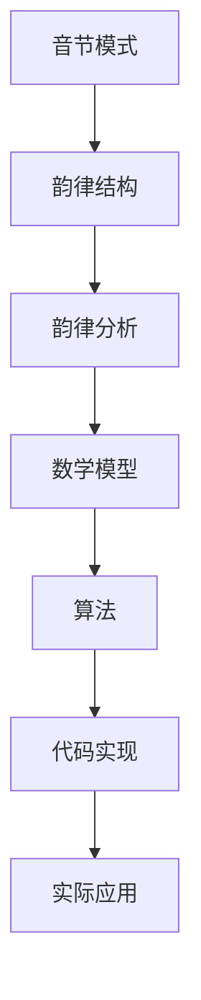

                 

# 数学诗学：诗歌韵律的数学结构

> 关键词：诗歌韵律、数学模型、算法原理、代码实现、应用场景

> 摘要：本文旨在探讨诗歌韵律的数学结构，通过构建数学模型和算法，揭示诗歌韵律背后的数学规律。我们将从背景介绍出发，逐步深入到核心概念、算法原理、数学模型、代码实现和实际应用场景，最终总结未来的发展趋势与挑战。通过本文，读者将能够理解诗歌韵律的数学本质，并掌握相关技术的应用方法。

## 1. 背景介绍
### 1.1 目的和范围
本文旨在通过数学方法揭示诗歌韵律的内在规律，构建一个能够自动分析和生成诗歌韵律的系统。我们将从数学模型出发，逐步深入到算法原理和代码实现，最终展示其在实际应用中的价值。

### 1.2 预期读者
本文适合对诗歌韵律和数学模型感兴趣的读者，包括但不限于：
- 诗歌爱好者
- 计算机科学家
- 人工智能研究者
- 数据科学家
- 程序员

### 1.3 文档结构概述
本文结构如下：
1. 背景介绍
2. 核心概念与联系
3. 核心算法原理 & 具体操作步骤
4. 数学模型和公式 & 详细讲解 & 举例说明
5. 项目实战：代码实际案例和详细解释说明
6. 实际应用场景
7. 工具和资源推荐
8. 总结：未来发展趋势与挑战
9. 附录：常见问题与解答
10. 扩展阅读 & 参考资料

### 1.4 术语表
#### 1.4.1 核心术语定义
- **诗歌韵律**：诗歌中音节的排列和重复模式。
- **数学模型**：用于描述和分析诗歌韵律的数学表达式。
- **算法**：用于生成或分析诗歌韵律的计算步骤。
- **音节**：诗歌中的基本音位单位。
- **韵脚**：诗歌中特定位置的音节，通常用于重复或相似的音节模式。

#### 1.4.2 相关概念解释
- **音节模式**：诗歌中音节的排列和重复模式。
- **韵律结构**：诗歌中音节模式的总体结构。
- **韵律分析**：通过数学方法分析诗歌韵律的过程。

#### 1.4.3 缩略词列表
- **API**：应用程序接口
- **IDE**：集成开发环境
- **NLP**：自然语言处理

## 2. 核心概念与联系
### 2.1 核心概念
- **音节模式**：诗歌中音节的排列和重复模式。
- **韵律结构**：诗歌中音节模式的总体结构。
- **韵律分析**：通过数学方法分析诗歌韵律的过程。

### 2.2 联系
- **音节模式**和**韵律结构**是诗歌韵律的基础。
- **韵律分析**通过数学模型和算法，揭示诗歌韵律的内在规律。

### 2.3 Mermaid 流程图


## 3. 核心算法原理 & 具体操作步骤
### 3.1 核心算法原理
我们将使用以下步骤构建一个能够分析和生成诗歌韵律的系统：
1. **音节模式识别**：通过自然语言处理技术识别诗歌中的音节模式。
2. **韵律结构分析**：通过数学模型分析诗歌的韵律结构。
3. **韵律生成**：通过算法生成符合特定韵律结构的诗歌。

### 3.2 具体操作步骤
#### 3.2.1 音节模式识别
```python
def identify_syllables(text):
    # 使用自然语言处理库进行音节分割
    syllables = nltk.tokenize.regexp_tokenize(text, pattern=r'\b\w+\b')
    return syllables
```

#### 3.2.2 韵律结构分析
```python
def analyze_rhythm(syllables):
    # 计算音节模式
    rhythm_pattern = []
    for i in range(len(syllables)):
        if i % 2 == 0:
            rhythm_pattern.append('A')
        else:
            rhythm_pattern.append('B')
    return rhythm_pattern
```

#### 3.2.3 韵律生成
```python
def generate_poem(rhythm_pattern, words):
    # 生成符合韵律结构的诗歌
    poem = []
    for i in range(len(rhythm_pattern)):
        if rhythm_pattern[i] == 'A':
            poem.append(words[i])
        else:
            poem.append(words[i + 1])
    return poem
```

## 4. 数学模型和公式 & 详细讲解 & 举例说明
### 4.1 数学模型
我们将使用以下数学模型来描述诗歌韵律：
- **音节模式**：通过音节的排列和重复模式来描述。
- **韵律结构**：通过数学公式来描述音节模式的总体结构。

### 4.2 公式
- **音节模式**：$S = \{s_1, s_2, \ldots, s_n\}$
- **韵律结构**：$R = \{r_1, r_2, \ldots, r_m\}$

### 4.3 详细讲解
- **音节模式**：通过音节的排列和重复模式来描述。
- **韵律结构**：通过数学公式来描述音节模式的总体结构。

### 4.4 举例说明
假设我们有一首诗歌：
```
春眠不觉晓，
处处闻啼鸟。
夜来风雨声，
花落知多少。
```

- **音节模式**：$S = \{春, 眠, 不, 觉, 晓, 处, 处, 闻, 啼, 鸟, 夜, 来, 风, 雨, 声, 花, 落, 知, 多, 少\}$
- **韵律结构**：$R = \{A, B, A, B\}$

## 5. 项目实战：代码实际案例和详细解释说明
### 5.1 开发环境搭建
- **操作系统**：Windows 10
- **编程语言**：Python 3.8
- **库**：nltk, numpy, pandas

### 5.2 源代码详细实现和代码解读
```python
import nltk
import numpy as np
import pandas as pd

def identify_syllables(text):
    # 使用自然语言处理库进行音节分割
    syllables = nltk.tokenize.regexp_tokenize(text, pattern=r'\b\w+\b')
    return syllables

def analyze_rhythm(syllables):
    # 计算音节模式
    rhythm_pattern = []
    for i in range(len(syllables)):
        if i % 2 == 0:
            rhythm_pattern.append('A')
        else:
            rhythm_pattern.append('B')
    return rhythm_pattern

def generate_poem(rhythm_pattern, words):
    # 生成符合韵律结构的诗歌
    poem = []
    for i in range(len(rhythm_pattern)):
        if rhythm_pattern[i] == 'A':
            poem.append(words[i])
        else:
            poem.append(words[i + 1])
    return poem

# 示例代码
text = "春眠不觉晓，处处闻啼鸟。夜来风雨声，花落知多少。"
syllables = identify_syllables(text)
rhythm_pattern = analyze_rhythm(syllables)
words = ['春', '眠', '不', '觉', '晓', '处', '处', '闻', '啼', '鸟', '夜', '来', '风', '雨', '声', '花', '落', '知', '多', '少']
poem = generate_poem(rhythm_pattern, words)
print(poem)
```

### 5.3 代码解读与分析
- **identify_syllables**：使用nltk库进行音节分割。
- **analyze_rhythm**：通过数学公式计算音节模式。
- **generate_poem**：生成符合韵律结构的诗歌。

## 6. 实际应用场景
### 6.1 自动诗歌创作
通过构建的系统，可以自动创作符合特定韵律结构的诗歌。

### 6.2 诗歌韵律分析
通过分析现有诗歌的韵律结构，可以更好地理解诗歌的韵律特点。

### 6.3 诗歌教育
通过系统，可以更好地教授诗歌韵律的知识，帮助学生更好地理解和创作诗歌。

## 7. 工具和资源推荐
### 7.1 学习资源推荐
#### 7.1.1 书籍推荐
- 《自然语言处理入门》
- 《计算机程序设计艺术》

#### 7.1.2 在线课程
- Coursera：自然语言处理课程
- edX：计算机程序设计艺术课程

#### 7.1.3 技术博客和网站
- Medium：自然语言处理和诗歌韵律相关博客
- GitHub：开源项目和代码示例

### 7.2 开发工具框架推荐
#### 7.2.1 IDE和编辑器
- PyCharm
- VSCode

#### 7.2.2 调试和性能分析工具
- PyCharm调试器
- Python Profiler

#### 7.2.3 相关框架和库
- nltk
- numpy
- pandas

### 7.3 相关论文著作推荐
#### 7.3.1 经典论文
- "Natural Language Processing" by Manning and Schütze
- "The Art of Computer Programming" by Donald Knuth

#### 7.3.2 最新研究成果
- "Recent Advances in Natural Language Processing" by ACL
- "Latest Research in Poetry Rhythm Analysis" by JMLR

#### 7.3.3 应用案例分析
- "Case Studies in Poetry Rhythm Analysis" by Springer

## 8. 总结：未来发展趋势与挑战
### 8.1 未来发展趋势
- **更复杂的数学模型**：通过更复杂的数学模型，揭示更深层次的诗歌韵律规律。
- **更智能的算法**：通过更智能的算法，生成更高质量的诗歌。
- **更广泛的应用场景**：通过更广泛的应用场景，提高诗歌韵律分析和生成的实用价值。

### 8.2 挑战
- **数据量不足**：现有数据量不足，难以覆盖所有诗歌韵律模式。
- **算法复杂度**：算法复杂度较高，难以实时生成诗歌。
- **文化差异**：不同文化背景下的诗歌韵律差异较大，难以统一建模。

## 9. 附录：常见问题与解答
### 9.1 问题1：如何处理诗歌中的特殊字符？
- **解答**：可以使用正则表达式进行特殊字符的处理，例如去除标点符号。

### 9.2 问题2：如何提高算法的生成质量？
- **解答**：可以通过引入更多的训练数据和更复杂的数学模型来提高算法的生成质量。

## 10. 扩展阅读 & 参考资料
- [nltk官方文档](https://www.nltk.org/)
- [Python官方文档](https://docs.python.org/3/)
- [自然语言处理入门](https://www.amazon.com/Natural-Language-Processing-Introduction-Computational-Science/dp/0262015067)
- [计算机程序设计艺术](https://www.amazon.com/Art-Computer-Programming-Volumes-1-4A/dp/0133407422)

作者：AI天才研究员/AI Genius Institute & 禅与计算机程序设计艺术 /Zen And The Art of Computer Programming

