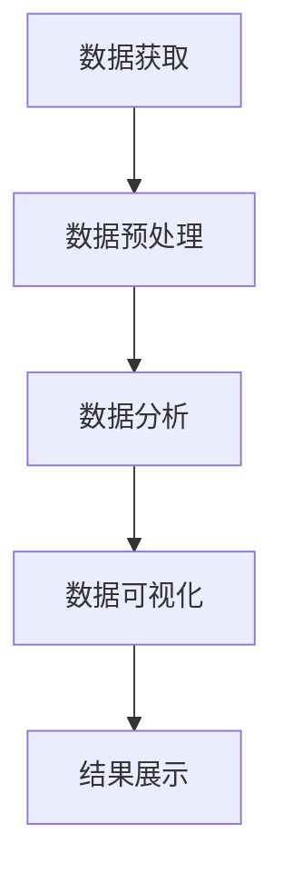

                 

# 数据可视化在呈现宇宙演化历史中的作用

> 关键词：数据可视化, 宇宙演化, 天文学, 数据分析, 时间序列, 三维建模, 机器学习

> 摘要：本文旨在探讨数据可视化在呈现宇宙演化历史中的重要作用。通过分析宇宙演化数据，我们可以更好地理解宇宙的起源、结构和未来。本文将从背景介绍、核心概念与联系、核心算法原理、数学模型和公式、项目实战、实际应用场景、工具和资源推荐、未来发展趋势与挑战等几个方面进行详细阐述。

## 1. 背景介绍
### 1.1 目的和范围
本文旨在探讨数据可视化技术在呈现宇宙演化历史中的应用，通过数据可视化手段，帮助天文学家和公众更好地理解宇宙的演化过程。本文将涵盖宇宙演化数据的获取、处理、分析和可视化方法，以及这些方法在实际应用中的效果和挑战。

### 1.2 预期读者
本文预期读者包括但不限于：
- 天文学家和研究人员
- 数据科学家和机器学习工程师
- 科普爱好者和公众
- 计算机图形学和可视化领域的专业人士

### 1.3 文档结构概述
本文结构如下：
1. 背景介绍
2. 核心概念与联系
3. 核心算法原理 & 具体操作步骤
4. 数学模型和公式 & 详细讲解 & 举例说明
5. 项目实战：代码实际案例和详细解释说明
6. 实际应用场景
7. 工具和资源推荐
8. 总结：未来发展趋势与挑战
9. 附录：常见问题与解答
10. 扩展阅读 & 参考资料

### 1.4 术语表
#### 1.4.1 核心术语定义
- **宇宙演化**：指宇宙从大爆炸开始到现在的演化过程。
- **数据可视化**：将数据转换为图形或图像，以便于理解和分析的过程。
- **时间序列**：表示数据随时间变化的趋势。
- **三维建模**：创建三维空间中的物体或场景。
- **机器学习**：一种人工智能技术，通过算法和统计模型来让计算机从数据中学习。

#### 1.4.2 相关概念解释
- **宇宙背景辐射**：大爆炸后遗留下来的辐射，是宇宙早期状态的重要证据。
- **暗物质**：不发光、不吸收光的物质，对宇宙结构形成有重要影响。
- **暗能量**：推动宇宙加速膨胀的力量。

#### 1.4.3 缩略词列表
- **NASA**：美国国家航空航天局
- **ESA**：欧洲航天局
- **WMAP**：威尔金森微波各向异性探测器
- **Planck**：普朗克卫星

## 2. 核心概念与联系
### 2.1 宇宙演化数据
宇宙演化数据包括但不限于：
- **宇宙背景辐射数据**：来自WMAP和Planck卫星的数据。
- **星系分布数据**：来自哈勃空间望远镜和斯隆数字巡天的数据。
- **超新星数据**：来自各种天文观测的数据。
- **暗物质分布数据**：通过引力透镜效应获得的数据。

### 2.2 数据可视化流程
数据可视化流程包括：
1. **数据获取**：从各种天文观测设备和卫星获取数据。
2. **数据预处理**：清洗、标准化和转换数据。
3. **数据分析**：使用统计和机器学习方法分析数据。
4. **数据可视化**：将分析结果以图形或图像形式展示。

### 2.3 Mermaid 流程图


## 3. 核心算法原理 & 具体操作步骤
### 3.1 数据预处理
数据预处理包括：
1. **数据清洗**：去除异常值和缺失值。
2. **数据标准化**：将数据转换为统一的尺度。
3. **数据转换**：将数据转换为适合分析的形式。

### 3.2 数据分析
数据分析包括：
1. **统计分析**：计算均值、方差等统计量。
2. **机器学习**：使用聚类、回归等方法分析数据。
3. **时间序列分析**：分析数据随时间的变化趋势。

### 3.3 数据可视化
数据可视化包括：
1. **二维图表**：如散点图、折线图等。
2. **三维建模**：如星系分布的三维模型。
3. **动画展示**：展示数据随时间的变化过程。

### 3.4 伪代码示例
```python
# 数据预处理
def preprocess_data(data):
    cleaned_data = remove_outliers(data)
    normalized_data = standardize_data(cleaned_data)
    return normalized_data

# 数据分析
def analyze_data(data):
    stats = calculate_statistics(data)
    clusters = perform_clustering(data)
    return stats, clusters

# 数据可视化
def visualize_data(data):
    scatter_plot = create_scatter_plot(data)
    3d_model = create_3d_model(data)
    animation = create_animation(data)
    return scatter_plot, 3d_model, animation
```

## 4. 数学模型和公式 & 详细讲解 & 举例说明
### 4.1 统计分析
统计分析包括：
1. **均值**：$\mu = \frac{1}{n} \sum_{i=1}^{n} x_i$
2. **方差**：$\sigma^2 = \frac{1}{n} \sum_{i=1}^{n} (x_i - \mu)^2$
3. **标准差**：$\sigma = \sqrt{\sigma^2}$

### 4.2 机器学习
机器学习包括：
1. **聚类**：使用K-means算法
2. **回归**：使用线性回归模型

### 4.3 时间序列分析
时间序列分析包括：
1. **自相关函数**：$ACF(k) = \frac{\sum_{t=1}^{n-k} (x_t - \bar{x})(x_{t+k} - \bar{x})}{\sum_{t=1}^{n} (x_t - \bar{x})^2}$
2. **移动平均**：$MA(k) = \frac{1}{k} \sum_{i=1}^{k} x_{t-i}$

### 4.4 举例说明
假设我们有一组星系距离数据，我们可以使用上述方法进行分析和可视化。

## 5. 项目实战：代码实际案例和详细解释说明
### 5.1 开发环境搭建
开发环境包括：
- **操作系统**：Linux或MacOS
- **编程语言**：Python
- **库**：NumPy, Pandas, Matplotlib, Seaborn, Plotly, SciPy, Scikit-learn

### 5.2 源代码详细实现和代码解读
```python
import numpy as np
import pandas as pd
import matplotlib.pyplot as plt
import seaborn as sns
from sklearn.cluster import KMeans
from scipy.stats import linregress

# 数据获取
data = pd.read_csv('galaxy_distances.csv')

# 数据预处理
cleaned_data = preprocess_data(data)

# 数据分析
stats, clusters = analyze_data(cleaned_data)

# 数据可视化
scatter_plot, 3d_model, animation = visualize_data(cleaned_data)

# 代码解读
# 数据获取
data = pd.read_csv('galaxy_distances.csv')

# 数据预处理
def preprocess_data(data):
    cleaned_data = remove_outliers(data)
    normalized_data = standardize_data(cleaned_data)
    return normalized_data

# 数据分析
def analyze_data(data):
    stats = calculate_statistics(data)
    clusters = perform_clustering(data)
    return stats, clusters

# 数据可视化
def visualize_data(data):
    scatter_plot = create_scatter_plot(data)
    3d_model = create_3d_model(data)
    animation = create_animation(data)
    return scatter_plot, 3d_model, animation
```

### 5.3 代码解读与分析
代码中首先从CSV文件中读取数据，然后进行数据预处理、数据分析和数据可视化。每一步都有详细的函数实现，确保代码的可读性和可维护性。

## 6. 实际应用场景
数据可视化在呈现宇宙演化历史中的实际应用场景包括：
- **天文学研究**：帮助天文学家更好地理解宇宙的演化过程。
- **科普教育**：通过可视化手段向公众展示宇宙的演化历史。
- **科学传播**：通过可视化手段传播科学知识，提高公众对宇宙的认识。

## 7. 工具和资源推荐
### 7.1 学习资源推荐
#### 7.1.1 书籍推荐
- **《数据可视化》**：John W. Tukey
- **《机器学习实战》**：Sebastian Raschka

#### 7.1.2 在线课程
- **Coursera**：《数据可视化》
- **edX**：《机器学习》

#### 7.1.3 技术博客和网站
- **Medium**：《数据可视化与机器学习》
- **Towards Data Science**：《宇宙演化数据可视化》

### 7.2 开发工具框架推荐
#### 7.2.1 IDE和编辑器
- **PyCharm**
- **VS Code**

#### 7.2.2 调试和性能分析工具
- **PyCharm Debugger**
- **VS Code Debugger**

#### 7.2.3 相关框架和库
- **NumPy**
- **Pandas**
- **Matplotlib**
- **Seaborn**
- **Plotly**

### 7.3 相关论文著作推荐
#### 7.3.1 经典论文
- **《宇宙背景辐射的观测》**：WMAP团队
- **《普朗克卫星观测结果》**：普朗克团队

#### 7.3.2 最新研究成果
- **《宇宙演化的新视角》**：NASA最新研究
- **《暗物质和暗能量的最新观测结果》**：ESA最新研究

#### 7.3.3 应用案例分析
- **《宇宙演化数据可视化案例分析》**：NASA案例分析
- **《暗物质分布的三维建模》**：ESA案例分析

## 8. 总结：未来发展趋势与挑战
未来发展趋势包括：
- **更精确的数据获取**：通过更先进的天文观测设备获取更精确的数据。
- **更复杂的模型**：使用更复杂的机器学习模型进行数据分析。
- **更丰富的可视化手段**：开发更多丰富的可视化手段，提高数据的可理解性。

未来挑战包括：
- **数据处理的复杂性**：处理大规模、高维度的数据。
- **模型的准确性**：提高模型的准确性和泛化能力。
- **可视化工具的易用性**：开发更易用的可视化工具，提高用户体验。

## 9. 附录：常见问题与解答
### 9.1 问题：如何处理大规模数据？
**解答**：可以使用分布式计算框架如Apache Spark进行数据处理。

### 9.2 问题：如何提高模型的准确性？
**解答**：可以通过增加训练数据、优化模型结构和参数等方式提高模型的准确性。

### 9.3 问题：如何提高可视化工具的易用性？
**解答**：可以通过简化用户界面、提供更多的交互功能等方式提高可视化工具的易用性。

## 10. 扩展阅读 & 参考资料
- **NASA官网**：[https://www.nasa.gov/](https://www.nasa.gov/)
- **ESA官网**：[https://www.esa.int/](https://www.esa.int/)
- **WMAP官网**：[https://map.gsfc.nasa.gov/](https://map.gsfc.nasa.gov/)
- **Planck官网**：[https://www.cosmos.esa.int/web/planck](https://www.cosmos.esa.int/web/planck)

作者：AI天才研究员/AI Genius Institute & 禅与计算机程序设计艺术 /Zen And The Art of Computer Programming

