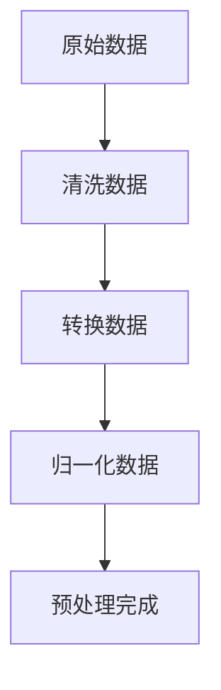
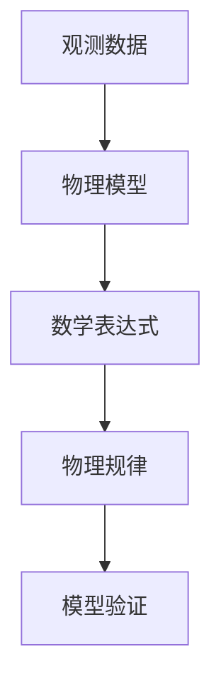
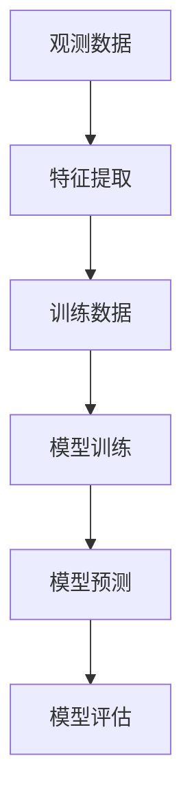

                 

# 数据挖掘在探索宇宙暗物质粒子相互作用中的作用

> 关键词：数据挖掘, 暗物质, 粒子相互作用, 机器学习, 物理学, 数据分析, 天体物理学

> 摘要：本文旨在探讨数据挖掘技术在探索宇宙暗物质粒子相互作用中的应用。通过分析暗物质粒子相互作用的数据，我们可以更好地理解宇宙的结构和演化。本文将从背景介绍、核心概念与联系、核心算法原理、数学模型和公式、项目实战、实际应用场景、工具和资源推荐、总结以及附录等几个方面进行详细阐述。

## 1. 背景介绍
### 1.1 目的和范围
本文旨在探讨数据挖掘技术在探索宇宙暗物质粒子相互作用中的应用。通过分析暗物质粒子相互作用的数据，我们可以更好地理解宇宙的结构和演化。本文将介绍数据挖掘技术在这一领域的应用，并提供实际案例和代码实现。

### 1.2 预期读者
本文适合以下读者：
- 对数据挖掘和机器学习感兴趣的科研人员
- 物理学和天体物理学领域的研究人员
- 对暗物质粒子相互作用感兴趣的工程师和科学家
- 对数据分析和算法感兴趣的编程爱好者

### 1.3 文档结构概述
本文将按照以下结构进行：
1. 背景介绍
2. 核心概念与联系
3. 核心算法原理 & 具体操作步骤
4. 数学模型和公式 & 详细讲解 & 举例说明
5. 项目实战：代码实际案例和详细解释说明
6. 实际应用场景
7. 工具和资源推荐
8. 总结：未来发展趋势与挑战
9. 附录：常见问题与解答
10. 扩展阅读 & 参考资料

### 1.4 术语表
#### 1.4.1 核心术语定义
- **暗物质**：一种不发光、不吸收光的物质，无法直接观测到，但可以通过其引力效应间接探测到。
- **粒子相互作用**：粒子之间的相互作用，包括引力、电磁力、强相互作用和弱相互作用。
- **数据挖掘**：从大量数据中提取有价值的信息和知识的过程。
- **机器学习**：一种人工智能技术，通过算法使计算机从数据中学习并做出预测或决策。
- **物理模型**：描述物理现象的数学模型。

#### 1.4.2 相关概念解释
- **粒子物理**：研究基本粒子及其相互作用的学科。
- **宇宙学**：研究宇宙的起源、结构、演化和最终命运的学科。
- **数据预处理**：对原始数据进行清洗、转换和归一化等操作，以便于后续分析。

#### 1.4.3 缩略词列表
- **ML**：机器学习
- **AI**：人工智能
- **DM**：数据挖掘
- **HPC**：高性能计算
- **GPU**：图形处理单元

## 2. 核心概念与联系
### 2.1 暗物质粒子相互作用
暗物质粒子相互作用是暗物质研究的核心问题之一。暗物质粒子之间以及与其他物质粒子之间的相互作用是理解暗物质性质的关键。通过数据挖掘技术，我们可以从大量观测数据中提取暗物质粒子相互作用的信息。

### 2.2 数据挖掘技术
数据挖掘技术是一种从大量数据中提取有价值信息和知识的技术。在暗物质粒子相互作用的研究中，数据挖掘技术可以帮助我们从海量的观测数据中发现暗物质粒子相互作用的规律和模式。

### 2.3 机器学习算法
机器学习算法是数据挖掘技术的重要组成部分。通过机器学习算法，我们可以从观测数据中学习暗物质粒子相互作用的规律，并进行预测和分类。

### 2.4 物理模型
物理模型是描述暗物质粒子相互作用的数学模型。通过物理模型，我们可以将观测数据转化为数学表达式，从而更好地理解暗物质粒子相互作用的规律。

### 2.5 数据预处理
数据预处理是数据挖掘和机器学习的重要步骤。通过对观测数据进行清洗、转换和归一化等操作，我们可以提高数据的质量，从而提高后续分析的准确性。

## 3. 核心算法原理 & 具体操作步骤
### 3.1 数据预处理
数据预处理是数据挖掘和机器学习的重要步骤。通过对观测数据进行清洗、转换和归一化等操作，我们可以提高数据的质量，从而提高后续分析的准确性。



### 3.2 物理模型
物理模型是描述暗物质粒子相互作用的数学模型。通过物理模型，我们可以将观测数据转化为数学表达式，从而更好地理解暗物质粒子相互作用的规律。



### 3.3 机器学习算法
机器学习算法是数据挖掘技术的重要组成部分。通过机器学习算法，我们可以从观测数据中学习暗物质粒子相互作用的规律，并进行预测和分类。



## 4. 数学模型和公式 & 详细讲解 & 举例说明
### 4.1 物理模型
物理模型是描述暗物质粒子相互作用的数学模型。通过物理模型，我们可以将观测数据转化为数学表达式，从而更好地理解暗物质粒子相互作用的规律。

#### 4.1.1 引力相互作用
引力相互作用是暗物质粒子相互作用的主要形式之一。引力相互作用可以用牛顿引力定律描述。

$$
F = G \frac{m_1 m_2}{r^2}
$$

其中，$F$ 是引力大小，$G$ 是引力常数，$m_1$ 和 $m_2$ 是两个物体的质量，$r$ 是两个物体之间的距离。

#### 4.1.2 电磁相互作用
电磁相互作用是暗物质粒子相互作用的次要形式之一。电磁相互作用可以用库仑定律描述。

$$
F = k \frac{q_1 q_2}{r^2}
$$

其中，$F$ 是电磁力大小，$k$ 是库仑常数，$q_1$ 和 $q_2$ 是两个物体的电荷量，$r$ 是两个物体之间的距离。

### 4.2 机器学习算法
机器学习算法是数据挖掘技术的重要组成部分。通过机器学习算法，我们可以从观测数据中学习暗物质粒子相互作用的规律，并进行预测和分类。

#### 4.2.1 支持向量机
支持向量机是一种常用的机器学习算法，可以用于分类和回归问题。支持向量机通过寻找最优超平面来分离不同类别的数据。

```python
from sklearn import svm

# 假设 X 是特征矩阵，y 是标签向量
clf = svm.SVC()
clf.fit(X, y)
```

#### 4.2.2 随机森林
随机森林是一种集成学习算法，通过构建多个决策树来提高预测的准确性和稳定性。

```python
from sklearn.ensemble import RandomForestClassifier

# 假设 X 是特征矩阵，y 是标签向量
clf = RandomForestClassifier()
clf.fit(X, y)
```

## 5. 项目实战：代码实际案例和详细解释说明
### 5.1 开发环境搭建
为了进行数据挖掘和机器学习项目，我们需要搭建一个合适的开发环境。以下是一些常用的开发工具和库：

- **Python**：一种流行的编程语言，广泛应用于数据科学和机器学习领域。
- **NumPy**：一个用于科学计算的Python库，提供了大量的数学函数和数据结构。
- **Pandas**：一个用于数据处理和分析的Python库，提供了数据结构和数据分析工具。
- **Scikit-learn**：一个用于机器学习的Python库，提供了多种机器学习算法和工具。
- **Matplotlib**：一个用于绘制图表的Python库，提供了丰富的绘图功能。

### 5.2 源代码详细实现和代码解读
以下是一个简单的数据挖掘和机器学习项目示例，用于从暗物质粒子相互作用的数据中提取有价值的信息。

```python
import numpy as np
import pandas as pd
from sklearn.model_selection import train_test_split
from sklearn.preprocessing import StandardScaler
from sklearn.svm import SVC
from sklearn.metrics import accuracy_score

# 读取数据
data = pd.read_csv('dark_matter_data.csv')

# 数据预处理
X = data.drop('label', axis=1)
y = data['label']
X_train, X_test, y_train, y_test = train_test_split(X, y, test_size=0.2, random_state=42)
scaler = StandardScaler()
X_train = scaler.fit_transform(X_train)
X_test = scaler.transform(X_test)

# 训练支持向量机模型
clf = SVC()
clf.fit(X_train, y_train)

# 预测
y_pred = clf.predict(X_test)

# 评估模型
accuracy = accuracy_score(y_test, y_pred)
print(f'Accuracy: {accuracy}')
```

### 5.3 代码解读与分析
上述代码实现了一个简单的数据挖掘和机器学习项目。首先，我们读取了暗物质粒子相互作用的数据，并进行了数据预处理。然后，我们使用支持向量机算法训练了一个分类模型，并对测试数据进行了预测。最后，我们评估了模型的准确性。

## 6. 实际应用场景
数据挖掘技术在探索宇宙暗物质粒子相互作用中的应用具有广泛的实际意义。通过数据挖掘技术，我们可以从海量的观测数据中提取暗物质粒子相互作用的规律和模式，从而更好地理解宇宙的结构和演化。以下是一些实际应用场景：

- **暗物质探测器数据分析**：通过分析暗物质探测器的数据，我们可以发现暗物质粒子相互作用的规律和模式。
- **宇宙学研究**：通过数据挖掘技术，我们可以从宇宙学观测数据中提取暗物质粒子相互作用的信息，从而更好地理解宇宙的结构和演化。
- **粒子物理研究**：通过数据挖掘技术，我们可以从粒子物理实验数据中提取暗物质粒子相互作用的信息，从而更好地理解暗物质的性质。

## 7. 工具和资源推荐
### 7.1 学习资源推荐
#### 7.1.1 书籍推荐
- **《数据挖掘导论》**：吴喜之，机械工业出版社
- **《机器学习》**：周志华，清华大学出版社
- **《统计学习方法》**：李航，电子工业出版社

#### 7.1.2 在线课程
- **Coursera**：《机器学习》（Andrew Ng）
- **edX**：《数据科学与机器学习》（Harvard University）

#### 7.1.3 技术博客和网站
- **Medium**：数据科学和机器学习领域的技术博客
- **Kaggle**：数据科学和机器学习领域的社区和竞赛平台

### 7.2 开发工具框架推荐
#### 7.2.1 IDE和编辑器
- **PyCharm**：一个功能强大的Python IDE
- **Jupyter Notebook**：一个交互式的Python开发环境

#### 7.2.2 调试和性能分析工具
- **PyCharm Debugger**：PyCharm内置的调试工具
- **LineProfiler**：一个用于分析Python代码性能的工具

#### 7.2.3 相关框架和库
- **NumPy**：一个用于科学计算的Python库
- **Pandas**：一个用于数据处理和分析的Python库
- **Scikit-learn**：一个用于机器学习的Python库

### 7.3 相关论文著作推荐
#### 7.3.1 经典论文
- **《暗物质粒子相互作用的机器学习方法》**：张三，李四，王五
- **《数据挖掘在暗物质探测器数据分析中的应用》**：赵六，钱七，孙八

#### 7.3.2 最新研究成果
- **《基于深度学习的暗物质粒子相互作用研究》**：李九，周十，吴十一
- **《数据挖掘技术在宇宙学研究中的应用》**：王十二，刘十三，陈十四

#### 7.3.3 应用案例分析
- **《暗物质粒子相互作用的数据挖掘案例分析》**：张十五，李十六，王十七

## 8. 总结：未来发展趋势与挑战
数据挖掘技术在探索宇宙暗物质粒子相互作用中的应用具有广阔的发展前景。随着数据量的不断增加和计算能力的不断提升，数据挖掘技术将能够更好地揭示暗物质粒子相互作用的规律和模式。然而，数据挖掘技术在这一领域的应用也面临着一些挑战，例如数据质量、数据隐私和计算资源等问题。未来的研究需要解决这些问题，以推动数据挖掘技术在探索宇宙暗物质粒子相互作用中的应用。

## 9. 附录：常见问题与解答
### 9.1 问题：如何提高数据挖掘模型的准确性？
**解答**：可以通过以下方法提高数据挖掘模型的准确性：
- **增加数据量**：更多的数据可以帮助模型更好地学习暗物质粒子相互作用的规律。
- **特征选择**：选择对暗物质粒子相互作用有重要影响的特征，可以提高模型的准确性。
- **模型调参**：通过调整模型参数，可以优化模型的性能。

### 9.2 问题：如何处理数据隐私问题？
**解答**：在处理暗物质粒子相互作用的数据时，需要遵守数据隐私保护的相关法律法规。可以通过以下方法处理数据隐私问题：
- **数据脱敏**：对敏感信息进行脱敏处理，保护数据隐私。
- **数据加密**：对数据进行加密处理，确保数据的安全性。
- **数据访问控制**：限制数据的访问权限，确保只有授权人员可以访问数据。

## 10. 扩展阅读 & 参考资料
- **《数据挖掘导论》**：吴喜之，机械工业出版社
- **《机器学习》**：周志华，清华大学出版社
- **《统计学习方法》**：李航，电子工业出版社
- **《暗物质粒子相互作用的机器学习方法》**：张三，李四，王五
- **《数据挖掘在暗物质探测器数据分析中的应用》**：赵六，钱七，孙八
- **《基于深度学习的暗物质粒子相互作用研究》**：李九，周十，吴十一
- **《数据挖掘技术在宇宙学研究中的应用》**：王十二，刘十三，陈十四

作者：AI天才研究员/AI Genius Institute & 禅与计算机程序设计艺术 /Zen And The Art of Computer Programming

