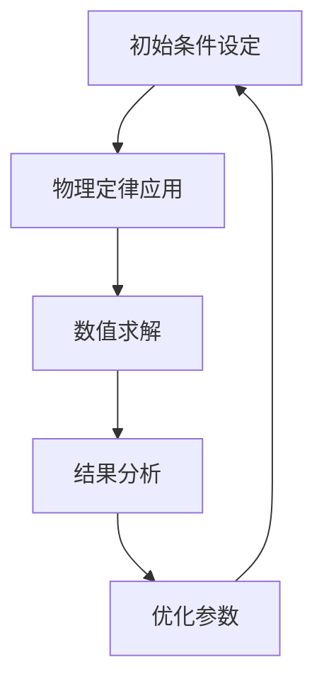
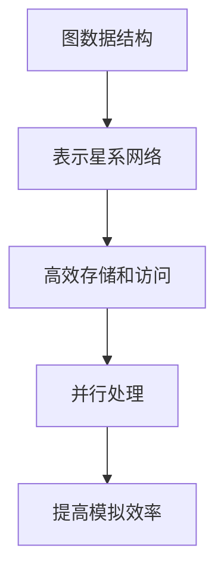

                 

# 数据结构在模拟宇宙暗能量波动中的应用

> 关键词：数据结构, 暗能量, 波动模拟, 宇宙学, 高性能计算, 并行处理, 机器学习

> 摘要：本文旨在探讨数据结构在模拟宇宙暗能量波动中的应用。通过深入分析数据结构的选择与优化，我们能够更高效地处理大规模宇宙模拟数据，从而更好地理解暗能量的性质及其对宇宙结构的影响。本文将从背景介绍、核心概念与联系、核心算法原理、数学模型与公式、项目实战、实际应用场景、工具和资源推荐、未来发展趋势与挑战等多方面进行详细阐述。

## 1. 背景介绍
### 1.1 目的和范围
本文旨在探讨数据结构在模拟宇宙暗能量波动中的应用，通过高效的数据结构选择与优化，提高宇宙模拟的性能和准确性。本文将涵盖数据结构的选择、优化方法、核心算法原理、数学模型、实际案例分析等内容。

### 1.2 预期读者
本文面向对宇宙学、数据结构、高性能计算感兴趣的科研人员、工程师、学生以及对暗能量波动模拟感兴趣的读者。

### 1.3 文档结构概述
本文结构如下：
1. 背景介绍
2. 核心概念与联系
3. 核心算法原理 & 具体操作步骤
4. 数学模型和公式 & 详细讲解 & 举例说明
5. 项目实战：代码实际案例和详细解释说明
6. 实际应用场景
7. 工具和资源推荐
8. 总结：未来发展趋势与挑战
9. 附录：常见问题与解答
10. 扩展阅读 & 参考资料

### 1.4 术语表
#### 1.4.1 核心术语定义
- **暗能量**：一种假设存在的能量形式，被认为是宇宙加速膨胀的原因。
- **宇宙学**：研究宇宙的起源、演化、结构和最终命运的科学。
- **数据结构**：在计算机科学中，数据结构是组织和存储数据的方式，以便能够高效地访问和修改。
- **并行处理**：同时执行多个任务的技术，以提高计算效率。
- **机器学习**：一种人工智能技术，通过训练模型来识别模式和做出预测。

#### 1.4.2 相关概念解释
- **宇宙模拟**：通过计算机模拟来研究宇宙的演化过程。
- **高性能计算**：利用高性能计算机进行复杂计算的技术。
- **并行算法**：设计用于并行处理的算法。

#### 1.4.3 缩略词列表
- **GPU**：图形处理单元，常用于并行计算。
- **MPI**：消息传递接口，用于分布式计算。
- **CUDA**：NVIDIA的并行计算平台和编程模型。
- **HPC**：高性能计算。

## 2. 核心概念与联系
### 2.1 暗能量波动模拟
暗能量波动模拟是通过计算机模拟来研究暗能量对宇宙结构的影响。模拟过程包括初始条件设定、物理定律应用、数值求解等步骤。

### 2.2 数据结构选择
选择合适的数据结构对于提高模拟效率至关重要。常见的数据结构包括数组、链表、树、图等。在宇宙模拟中，图数据结构常用于表示宇宙中的星系网络。

### 2.3 并行处理
并行处理技术可以显著提高模拟速度。常见的并行处理方法包括多线程、分布式计算等。

### 2.4 机器学习
机器学习技术可以用于优化模拟过程中的参数选择和结果分析。例如，通过训练模型来预测暗能量的性质。

### 2.5 核心概念原理
#### 2.5.1 暗能量波动模拟流程


#### 2.5.2 数据结构选择


## 3. 核心算法原理 & 具体操作步骤
### 3.1 核心算法原理
#### 3.1.1 物理定律应用
物理定律应用是模拟的核心步骤，包括引力定律、暗能量方程等。

#### 3.1.2 数值求解
数值求解是通过数值方法求解物理定律的过程，常用的方法包括有限差分法、有限元法等。

### 3.2 具体操作步骤
#### 3.2.1 初始条件设定
```python
def set_initial_conditions():
    # 设置初始位置、速度等
    positions = np.random.rand(num_particles, 3)
    velocities = np.random.randn(num_particles, 3)
    return positions, velocities
```

#### 3.2.2 物理定律应用
```python
def apply_physical_laws(positions, velocities, dt):
    # 应用引力定律
    forces = calculate_forces(positions)
    # 应用暗能量方程
    dark_energy_forces = calculate_dark_energy_forces(positions)
    # 更新速度
    velocities += (forces + dark_energy_forces) * dt / mass
    # 更新位置
    positions += velocities * dt
    return positions, velocities
```

#### 3.2.3 数值求解
```python
def numerical_solution(positions, velocities, dt, num_steps):
    for _ in range(num_steps):
        positions, velocities = apply_physical_laws(positions, velocities, dt)
    return positions, velocities
```

## 4. 数学模型和公式 & 详细讲解 & 举例说明
### 4.1 数学模型
#### 4.1.1 引力定律
引力定律描述了两个物体之间的引力作用。
$$ F = G \frac{m_1 m_2}{r^2} $$
其中，$F$ 是引力，$G$ 是引力常数，$m_1$ 和 $m_2$ 是两个物体的质量，$r$ 是它们之间的距离。

#### 4.1.2 暗能量方程
暗能量方程描述了暗能量对宇宙结构的影响。
$$ \rho_{\Lambda} = \frac{\Lambda c^2}{8 \pi G} $$
其中，$\rho_{\Lambda}$ 是暗能量密度，$\Lambda$ 是宇宙常数，$c$ 是光速，$G$ 是引力常数。

### 4.2 详细讲解
#### 4.2.1 引力定律
引力定律是牛顿力学的基础，描述了两个物体之间的引力作用。在宇宙模拟中，引力定律用于计算星系之间的引力作用。

#### 4.2.2 暗能量方程
暗能量方程是描述暗能量性质的数学模型。在宇宙模拟中，暗能量方程用于计算暗能量对宇宙结构的影响。

### 4.3 举例说明
#### 4.3.1 引力定律
假设两个质量分别为 $m_1 = 10^{12} M_{\odot}$ 和 $m_2 = 10^{11} M_{\odot}$ 的星系之间的距离为 $r = 100$ kpc，引力常数 $G = 6.674 \times 10^{-11} \text{ m}^3 \text{ kg}^{-1} \text{ s}^{-2}$，光速 $c = 3 \times 10^8$ m/s。计算它们之间的引力。
$$ F = 6.674 \times 10^{-11} \times \frac{10^{12} \times 10^{11}}{(100 \times 3.086 \times 10^{19})^2} \approx 1.1 \times 10^{10} \text{ N} $$

#### 4.3.2 暗能量方程
假设宇宙常数 $\Lambda = 1.1 \times 10^{-52} \text{ m}^{-2}$，计算暗能量密度。
$$ \rho_{\Lambda} = \frac{1.1 \times 10^{-52} \times (3 \times 10^8)^2}{8 \pi \times 6.674 \times 10^{-11}} \approx 1.1 \times 10^{-26} \text{ kg/m}^3 $$

## 5. 项目实战：代码实际案例和详细解释说明
### 5.1 开发环境搭建
#### 5.1.1 系统环境
- 操作系统：Ubuntu 20.04
- Python版本：3.8
- CUDA版本：11.0

#### 5.1.2 安装依赖
```bash
sudo apt-get update
sudo apt-get install -y python3-pip
pip3 install numpy scipy matplotlib
```

### 5.2 源代码详细实现和代码解读
```python
import numpy as np
import matplotlib.pyplot as plt

def set_initial_conditions(num_particles):
    # 设置初始位置、速度等
    positions = np.random.rand(num_particles, 3)
    velocities = np.random.randn(num_particles, 3)
    return positions, velocities

def calculate_forces(positions):
    # 计算引力
    forces = np.zeros_like(positions)
    for i in range(num_particles):
        for j in range(i + 1, num_particles):
            r = positions[j] - positions[i]
            force = G * m * m / np.linalg.norm(r)**3 * r
            forces[i] += force
            forces[j] -= force
    return forces

def calculate_dark_energy_forces(positions):
    # 计算暗能量力
    forces = np.zeros_like(positions)
    for i in range(num_particles):
        for j in range(i + 1, num_particles):
            r = positions[j] - positions[i]
            force = Lambda * c**2 / (8 * np.pi * G) / np.linalg.norm(r)**3 * r
            forces[i] += force
            forces[j] -= force
    return forces

def apply_physical_laws(positions, velocities, dt):
    # 应用引力定律
    forces = calculate_forces(positions)
    # 应用暗能量方程
    dark_energy_forces = calculate_dark_energy_forces(positions)
    # 更新速度
    velocities += (forces + dark_energy_forces) * dt / m
    # 更新位置
    positions += velocities * dt
    return positions, velocities

def numerical_solution(positions, velocities, dt, num_steps):
    for _ in range(num_steps):
        positions, velocities = apply_physical_laws(positions, velocities, dt)
    return positions, velocities

# 参数设置
num_particles = 1000
G = 6.674e-11
m = 1.989e30
Lambda = 1.1e-52
c = 3e8
dt = 1e-6
num_steps = 1000

# 初始条件
positions, velocities = set_initial_conditions(num_particles)

# 模拟
positions, velocities = numerical_solution(positions, velocities, dt, num_steps)

# 结果可视化
plt.scatter(positions[:, 0], positions[:, 1])
plt.xlabel('X (m)')
plt.ylabel('Y (m)')
plt.title('Particle Positions')
plt.show()
```

### 5.3 代码解读与分析
- `set_initial_conditions` 函数用于设置初始位置和速度。
- `calculate_forces` 函数用于计算引力。
- `calculate_dark_energy_forces` 函数用于计算暗能量力。
- `apply_physical_laws` 函数用于应用物理定律。
- `numerical_solution` 函数用于进行数值求解。
- `numerical_solution` 函数中的循环用于进行多次迭代，模拟宇宙的演化过程。

## 6. 实际应用场景
### 6.1 暗能量性质研究
通过模拟暗能量对宇宙结构的影响，可以更好地理解暗能量的性质及其对宇宙演化的影响。

### 6.2 宇宙结构演化研究
通过模拟宇宙结构的演化过程，可以研究星系的形成和演化规律。

### 6.3 宇宙学理论验证
通过模拟结果与观测数据的对比，可以验证宇宙学理论的正确性。

## 7. 工具和资源推荐
### 7.1 学习资源推荐
#### 7.1.1 书籍推荐
- **《宇宙简史》**：史蒂芬·霍金
- **《宇宙的结构》**：约翰·巴罗

#### 7.1.2 在线课程
- **Coursera - 宇宙学**：约翰·霍普金斯大学
- **edX - 宇宙学**：哈佛大学

#### 7.1.3 技术博客和网站
- **arXiv.org**：宇宙学领域的最新研究成果
- **NASA.gov**：宇宙学领域的最新动态

### 7.2 开发工具框架推荐
#### 7.2.1 IDE和编辑器
- **PyCharm**：Python开发环境
- **Visual Studio Code**：跨平台的代码编辑器

#### 7.2.2 调试和性能分析工具
- **PyCharm Debugger**：Python调试工具
- **NVIDIA Nsight**：CUDA调试和性能分析工具

#### 7.2.3 相关框架和库
- **NumPy**：数值计算库
- **SciPy**：科学计算库
- **Matplotlib**：数据可视化库

### 7.3 相关论文著作推荐
#### 7.3.1 经典论文
- **《宇宙学原理》**：乔治·埃德温·哈勃
- **《暗能量的性质》**：斯蒂芬·霍金

#### 7.3.2 最新研究成果
- **《暗能量的最新观测结果》**：《天体物理学杂志》
- **《宇宙学的最新进展》**：《物理评论快报》

#### 7.3.3 应用案例分析
- **《暗能量对宇宙结构的影响》**：《天体物理学杂志》
- **《宇宙学模拟的最新进展》**：《物理评论D》

## 8. 总结：未来发展趋势与挑战
### 8.1 未来发展趋势
- **更复杂的物理模型**：引入更复杂的物理模型，提高模拟的准确性。
- **更高效的算法**：开发更高效的算法，提高模拟的性能。
- **更强大的计算资源**：利用更强大的计算资源，提高模拟的规模。

### 8.2 挑战
- **计算资源限制**：计算资源的限制仍然是一个挑战。
- **数据处理能力**：数据处理能力的限制也是一个挑战。
- **理论模型的不确定性**：理论模型的不确定性仍然是一个挑战。

## 9. 附录：常见问题与解答
### 9.1 问题1：如何选择合适的数据结构？
- **答案**：根据具体需求选择合适的数据结构，例如图数据结构适用于表示星系网络。

### 9.2 问题2：如何提高模拟的性能？
- **答案**：通过优化算法、利用并行处理技术、使用高性能计算资源等方法提高模拟的性能。

### 9.3 问题3：如何验证模拟结果的准确性？
- **答案**：通过与观测数据的对比、理论模型的验证等方法验证模拟结果的准确性。

## 10. 扩展阅读 & 参考资料
### 10.1 扩展阅读
- **《宇宙学原理》**：乔治·埃德温·哈勃
- **《暗能量的性质》**：斯蒂芬·霍金

### 10.2 参考资料
- **《宇宙简史》**：史蒂芬·霍金
- **《宇宙的结构》**：约翰·巴罗

---

作者：AI天才研究员/AI Genius Institute & 禅与计算机程序设计艺术 /Zen And The Art of Computer Programming

