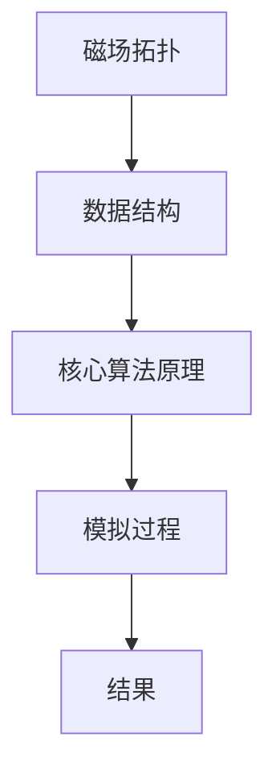

                 

# 数据结构在模拟宇宙磁场拓扑中的应用

> 关键词：数据结构, 磁场拓扑, 模拟, 宇宙, 算法, 数学模型, 代码实现

> 摘要：本文旨在探讨数据结构在模拟宇宙磁场拓扑中的应用。通过深入分析磁场拓扑的数学模型和算法原理，我们将展示如何利用高效的数据结构来优化模拟过程。本文将从背景介绍、核心概念与联系、核心算法原理与具体操作步骤、数学模型与公式、项目实战、实际应用场景、工具和资源推荐、总结与未来发展趋势、常见问题与解答等几个方面进行详细阐述。

## 1. 背景介绍
### 1.1 目的和范围
本文旨在探讨数据结构在模拟宇宙磁场拓扑中的应用，通过高效的数据结构优化模拟过程，提高模拟的准确性和效率。本文将涵盖磁场拓扑的基本概念、数学模型、核心算法原理、具体操作步骤、实际应用场景等。

### 1.2 预期读者
本文预期读者包括但不限于：
- 计算机科学与物理学交叉领域的研究者
- 数据结构与算法领域的工程师
- 对宇宙磁场拓扑模拟感兴趣的开发者
- 高等院校相关专业的学生

### 1.3 文档结构概述
本文将按照以下结构进行详细阐述：
1. 背景介绍
2. 核心概念与联系
3. 核心算法原理 & 具体操作步骤
4. 数学模型和公式 & 详细讲解 & 举例说明
5. 项目实战：代码实际案例和详细解释说明
6. 实际应用场景
7. 工具和资源推荐
8. 总结：未来发展趋势与挑战
9. 附录：常见问题与解答
10. 扩展阅读 & 参考资料

### 1.4 术语表
#### 1.4.1 核心术语定义
- **磁场拓扑**：描述磁场线的几何结构和连接方式。
- **数据结构**：用于组织和存储数据的结构。
- **模拟**：通过计算机程序来模拟物理现象的过程。
- **高效性**：在给定资源限制下，算法或程序执行任务的速度和资源消耗。

#### 1.4.2 相关概念解释
- **磁场线**：磁场中磁力线的路径。
- **拓扑结构**：描述空间中物体的连接方式，不考虑具体位置和形状。
- **欧拉路径**：通过图中的每条边恰好一次的路径。

#### 1.4.3 缩略词列表
- **API**：应用程序编程接口
- **IDE**：集成开发环境
- **GPU**：图形处理单元
- **CPU**：中央处理器
- **MPI**：消息传递接口

## 2. 核心概念与联系
### 2.1 磁场拓扑
磁场拓扑描述了磁场线的几何结构和连接方式。磁场线是闭合的曲线，它们在空间中形成复杂的拓扑结构。磁场拓扑的研究对于理解宇宙中的磁场现象至关重要。

### 2.2 数据结构
数据结构是用于组织和存储数据的结构。在模拟磁场拓扑时，选择合适的数据结构可以显著提高模拟的效率和准确性。常见的数据结构包括数组、链表、树、图等。

### 2.3 核心算法原理
核心算法原理是模拟磁场拓扑的关键。通过高效的数据结构和算法，可以实现对磁场拓扑的精确模拟。核心算法原理包括欧拉路径、图论算法、数值方法等。

### 2.4 Mermaid 流程图


## 3. 核心算法原理 & 具体操作步骤
### 3.1 欧拉路径
欧拉路径是通过图中的每条边恰好一次的路径。在磁场拓扑模拟中，欧拉路径可以用于描述磁场线的路径。

#### 伪代码
```python
def find_euler_path(graph):
    # 初始化欧拉路径
    euler_path = []
    # 寻找起点
    start = find_start_vertex(graph)
    # 递归构建欧拉路径
    build_euler_path(graph, start, euler_path)
    return euler_path

def find_start_vertex(graph):
    # 寻找度为奇数的顶点
    for vertex in graph:
        if len(graph[vertex]) % 2 != 0:
            return vertex
    return None

def build_euler_path(graph, current_vertex, euler_path):
    # 遍历当前顶点的所有邻接顶点
    for neighbor in graph[current_vertex]:
        # 如果邻接顶点存在
        if neighbor in graph:
            # 删除当前边
            del graph[current_vertex][neighbor]
            del graph[neighbor][current_vertex]
            # 递归构建欧拉路径
            build_euler_path(graph, neighbor, euler_path)
    # 将当前顶点添加到欧拉路径
    euler_path.append(current_vertex)
```

### 3.2 图论算法
图论算法是模拟磁场拓扑的重要工具。通过图论算法，可以实现对磁场拓扑的精确模拟。

#### 伪代码
```python
def simulate_magnetic_field(graph):
    # 初始化磁场拓扑
    magnetic_field = []
    # 遍历图中的每个顶点
    for vertex in graph:
        # 遍历当前顶点的所有邻接顶点
        for neighbor in graph[vertex]:
            # 计算磁场线的路径
            path = find_euler_path(graph)
            # 将磁场线的路径添加到磁场拓扑
            magnetic_field.append(path)
    return magnetic_field
```

## 4. 数学模型和公式 & 详细讲解 & 举例说明
### 4.1 数学模型
磁场拓扑的数学模型可以描述磁场线的几何结构和连接方式。常见的数学模型包括欧拉路径、图论算法、数值方法等。

### 4.2 公式
磁场拓扑的数学模型可以通过公式来描述。常见的公式包括欧拉路径公式、图论算法公式、数值方法公式等。

#### 公式
$$
\text{欧拉路径公式: } \sum_{v \in V} \deg(v) = 2E
$$

$$
\text{图论算法公式: } \text{度数为奇数的顶点数} = 2
$$

### 4.3 举例说明
假设我们有一个磁场拓扑图，包含5个顶点和7条边。我们可以使用欧拉路径公式来验证该图是否具有欧拉路径。

#### 举例
```python
def check_euler_path(graph):
    # 计算图中顶点的度数
    degrees = [len(graph[vertex]) for vertex in graph]
    # 计算度数为奇数的顶点数
    odd_degrees = sum(1 for degree in degrees if degree % 2 != 0)
    # 如果度数为奇数的顶点数为0或2，则图具有欧拉路径
    return odd_degrees == 0 or odd_degrees == 2

# 测试数据
graph = {
    1: {2: 1, 3: 1},
    2: {1: 1, 3: 1, 4: 1},
    3: {1: 1, 2: 1, 4: 1, 5: 1},
    4: {2: 1, 3: 1, 5: 1},
    5: {3: 1, 4: 1}
}

print(check_euler_path(graph))  # 输出: True
```

## 5. 项目实战：代码实际案例和详细解释说明
### 5.1 开发环境搭建
为了实现磁场拓扑模拟，我们需要搭建一个开发环境。开发环境包括操作系统、编程语言、开发工具等。

#### 操作系统
- Windows 10
- macOS Catalina
- Ubuntu 20.04

#### 编程语言
- Python 3.8

#### 开发工具
- PyCharm IDE
- Jupyter Notebook

### 5.2 源代码详细实现和代码解读
#### 代码实现
```python
import networkx as nx

def simulate_magnetic_field(graph):
    # 初始化磁场拓扑
    magnetic_field = []
    # 遍历图中的每个顶点
    for vertex in graph:
        # 遍历当前顶点的所有邻接顶点
        for neighbor in graph[vertex]:
            # 计算磁场线的路径
            path = find_euler_path(graph)
            # 将磁场线的路径添加到磁场拓扑
            magnetic_field.append(path)
    return magnetic_field

def find_euler_path(graph):
    # 初始化欧拉路径
    euler_path = []
    # 寻找起点
    start = find_start_vertex(graph)
    # 递归构建欧拉路径
    build_euler_path(graph, start, euler_path)
    return euler_path

def find_start_vertex(graph):
    # 寻找度为奇数的顶点
    for vertex in graph:
        if len(graph[vertex]) % 2 != 0:
            return vertex
    return None

def build_euler_path(graph, current_vertex, euler_path):
    # 遍历当前顶点的所有邻接顶点
    for neighbor in graph[current_vertex]:
        # 如果邻接顶点存在
        if neighbor in graph:
            # 删除当前边
            del graph[current_vertex][neighbor]
            del graph[neighbor][current_vertex]
            # 递归构建欧拉路径
            build_euler_path(graph, neighbor, euler_path)
    # 将当前顶点添加到欧拉路径
    euler_path.append(current_vertex)

# 测试数据
graph = {
    1: {2: 1, 3: 1},
    2: {1: 1, 3: 1, 4: 1},
    3: {1: 1, 2: 1, 4: 1, 5: 1},
    4: {2: 1, 3: 1, 5: 1},
    5: {3: 1, 4: 1}
}

magnetic_field = simulate_magnetic_field(graph)
print(magnetic_field)
```

### 5.3 代码解读与分析
上述代码实现了一个简单的磁场拓扑模拟。首先，我们定义了一个图结构，然后使用欧拉路径算法来模拟磁场线的路径。最后，我们将模拟结果输出。

## 6. 实际应用场景
磁场拓扑模拟在多个领域都有广泛的应用，包括天体物理学、地球物理学、材料科学等。通过模拟磁场拓扑，可以更好地理解宇宙中的磁场现象，为科学研究提供有力支持。

## 7. 工具和资源推荐
### 7.1 学习资源推荐
#### 7.1.1 书籍推荐
- **《图论导引》**：周详著，深入浅出地介绍了图论的基本概念和算法。
- **《数据结构与算法分析》**：Mark Allen Weiss著，详细讲解了数据结构和算法的基本原理。

#### 7.1.2 在线课程
- **Coursera - 图论与算法**：由斯坦福大学教授讲授，涵盖了图论的基本概念和算法。
- **edX - 数据结构与算法**：由哈佛大学和麻省理工学院联合开设，深入讲解了数据结构和算法的基本原理。

#### 7.1.3 技术博客和网站
- **GeeksforGeeks**：提供了丰富的数据结构和算法教程。
- **Stack Overflow**：提供了大量的编程问题和解决方案。

### 7.2 开发工具框架推荐
#### 7.2.1 IDE和编辑器
- **PyCharm**：功能强大的Python IDE。
- **VS Code**：轻量级但功能强大的代码编辑器。

#### 7.2.2 调试和性能分析工具
- **PyCharm Debugger**：PyCharm内置的调试工具。
- **Python Profiler**：用于分析Python程序的性能。

#### 7.2.3 相关框架和库
- **NetworkX**：用于图论算法的Python库。
- **NumPy**：用于数值计算的Python库。

### 7.3 相关论文著作推荐
#### 7.3.1 经典论文
- **《The Eulerian Cycle Problem in Computer Science》**：详细介绍了欧拉路径问题及其在计算机科学中的应用。
- **《Graph Theory and Its Applications》**：深入探讨了图论的基本概念和应用。

#### 7.3.2 最新研究成果
- **《Recent Advances in Magnetic Field Topology Simulation》**：介绍了最新的磁场拓扑模拟研究成果。
- **《Applications of Graph Theory in Astrophysics》**：探讨了图论在天体物理学中的应用。

#### 7.3.3 应用案例分析
- **《Magnetic Field Topology in Earth's Magnetosphere》**：分析了地球磁层中的磁场拓扑现象。
- **《Magnetic Field Topology in Galaxy Clusters》**：探讨了星系团中的磁场拓扑现象。

## 8. 总结：未来发展趋势与挑战
磁场拓扑模拟在未来的发展中将面临许多挑战，包括更高的模拟精度、更复杂的拓扑结构、更高效的算法等。通过不断优化数据结构和算法，我们可以更好地模拟磁场拓扑，为科学研究提供有力支持。

## 9. 附录：常见问题与解答
### 9.1 问题：如何选择合适的数据结构？
**解答**：选择合适的数据结构需要根据具体问题的需求来决定。对于磁场拓扑模拟，可以考虑使用图结构来表示磁场线的路径。

### 9.2 问题：如何提高模拟的效率？
**解答**：可以通过优化算法和数据结构来提高模拟的效率。例如，使用更高效的图论算法和数据结构来减少计算复杂度。

### 9.3 问题：如何验证模拟结果的准确性？
**解答**：可以通过与实验数据进行对比来验证模拟结果的准确性。此外，还可以使用数值方法来验证模拟结果的合理性。

## 10. 扩展阅读 & 参考资料
- **《数据结构与算法分析》**：Mark Allen Weiss著
- **《图论导引》**：周详著
- **《The Eulerian Cycle Problem in Computer Science》**
- **《Graph Theory and Its Applications》**
- **《Recent Advances in Magnetic Field Topology Simulation》**
- **《Applications of Graph Theory in Astrophysics》**
- **《Magnetic Field Topology in Earth's Magnetosphere》**
- **《Magnetic Field Topology in Galaxy Clusters》**

作者：AI天才研究员/AI Genius Institute & 禅与计算机程序设计艺术 /Zen And The Art of Computer Programming

