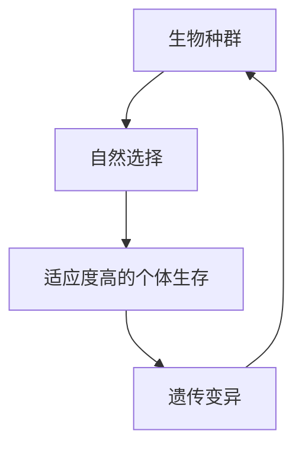
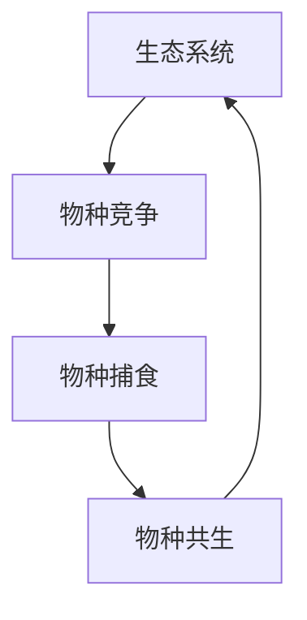
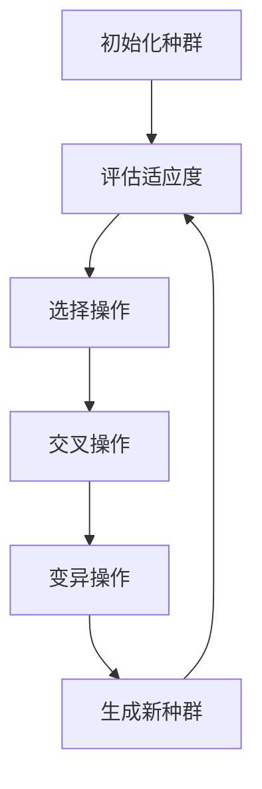
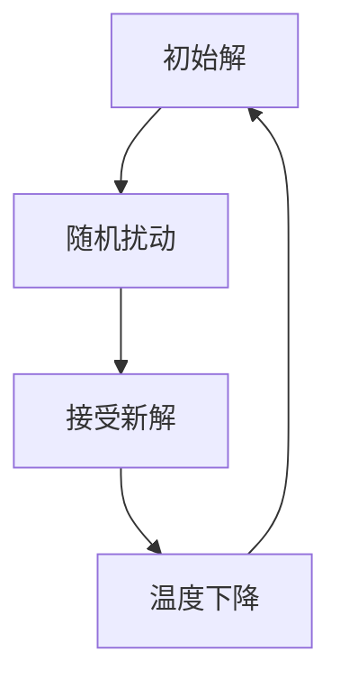

                 

# 最优化理论：自然界的效率数学

> 关键词：最优化理论, 自然界, 效率, 数学, 人工智能, 机器学习, 演化算法, 遗传算法, 模拟退火

> 摘要：本文旨在探讨自然界中的最优化原理及其在计算机科学中的应用。通过分析自然界中的生物进化、生态平衡等现象，我们能够发现自然界中存在着一系列高效的优化机制。本文将从理论基础出发，逐步深入探讨这些机制背后的数学原理，并通过具体的代码案例展示如何将这些原理应用于实际问题解决中。最终，我们将展望未来的发展趋势和面临的挑战。

## 1. 背景介绍
### 1.1 目的和范围
本文旨在深入探讨自然界中的最优化原理及其在计算机科学中的应用。通过分析自然界中的生物进化、生态平衡等现象，我们能够发现自然界中存在着一系列高效的优化机制。本文将从理论基础出发，逐步深入探讨这些机制背后的数学原理，并通过具体的代码案例展示如何将这些原理应用于实际问题解决中。最终，我们将展望未来的发展趋势和面临的挑战。

### 1.2 预期读者
本文适合对最优化理论、自然启发算法、机器学习等领域感兴趣的读者。无论是计算机科学专业的学生、研究人员，还是对自然界中的优化机制感兴趣的爱好者，都能从中获得有价值的信息和启发。

### 1.3 文档结构概述
本文将按照以下结构展开：
1. 背景介绍
2. 核心概念与联系
3. 核心算法原理 & 具体操作步骤
4. 数学模型和公式 & 详细讲解 & 举例说明
5. 项目实战：代码实际案例和详细解释说明
6. 实际应用场景
7. 工具和资源推荐
8. 总结：未来发展趋势与挑战
9. 附录：常见问题与解答
10. 扩展阅读 & 参考资料

### 1.4 术语表
#### 1.4.1 核心术语定义
- **最优化**：在给定约束条件下，寻找使目标函数达到最优值的过程。
- **自然启发算法**：借鉴自然界中的优化机制，设计出的算法。
- **进化算法**：模拟生物进化过程的算法，包括遗传算法、演化策略等。
- **遗传算法**：一种基于自然选择和遗传机制的优化算法。
- **模拟退火**：一种基于物理退火过程的优化算法。
- **生态平衡**：生态系统中各物种之间的相互作用达到稳定状态的过程。

#### 1.4.2 相关概念解释
- **目标函数**：优化问题中需要最小化或最大化的函数。
- **约束条件**：优化过程中需要满足的限制条件。
- **种群**：进化算法中的一组候选解。
- **适应度函数**：衡量个体适应环境的能力的函数。
- **交叉**：遗传算法中，两个个体之间的基因交换操作。
- **变异**：遗传算法中，个体基因的随机改变操作。

#### 1.4.3 缩略词列表
- GA：Genetic Algorithm（遗传算法）
- SA：Simulated Annealing（模拟退火）

## 2. 核心概念与联系
### 2.1 生物进化
生物进化是自然界中最基本的优化机制之一。生物通过自然选择和遗传变异，不断适应环境的变化，从而实现种群的优化。这一过程可以简化为以下流程图：



### 2.2 生态平衡
生态平衡是指生态系统中各物种之间的相互作用达到稳定状态的过程。生态系统中的物种通过竞争、捕食等关系相互影响，最终形成一个稳定的结构。这一过程可以简化为以下流程图：



### 2.3 自然启发算法
自然启发算法是借鉴自然界中的优化机制，设计出的算法。这些算法通常具有以下特点：
- **自适应性**：能够根据环境变化自动调整策略。
- **鲁棒性**：能够在复杂环境中稳定运行。
- **并行性**：能够利用多处理器进行并行计算。

## 3. 核心算法原理 & 具体操作步骤
### 3.1 遗传算法
遗传算法是一种基于自然选择和遗传机制的优化算法。其基本操作步骤如下：



### 3.2 模拟退火
模拟退火是一种基于物理退火过程的优化算法。其基本操作步骤如下：



## 4. 数学模型和公式 & 详细讲解 & 举例说明
### 4.1 遗传算法
遗传算法的基本数学模型可以表示为：

$$
\text{适应度函数} = f(x)
$$

其中，$x$ 是个体的基因型，$f(x)$ 是个体的适应度值。遗传算法的基本操作步骤如下：

1. **初始化种群**：随机生成初始种群。
2. **评估适应度**：计算每个个体的适应度值。
3. **选择操作**：根据适应度值选择个体进行繁殖。
4. **交叉操作**：通过基因交换生成新的个体。
5. **变异操作**：对个体进行随机变异。
6. **生成新种群**：将新生成的个体组成新的种群。

### 4.2 模拟退火
模拟退火的基本数学模型可以表示为：

$$
\text{目标函数} = E(x)
$$

其中，$x$ 是解向量，$E(x)$ 是目标函数值。模拟退火的基本操作步骤如下：

1. **初始解**：随机生成初始解。
2. **随机扰动**：对当前解进行随机扰动。
3. **接受新解**：根据目标函数值和温度决定是否接受新解。
4. **温度下降**：逐步降低温度。

## 5. 项目实战：代码实际案例和详细解释说明
### 5.1 开发环境搭建
为了实现遗传算法和模拟退火算法，我们需要搭建一个开发环境。这里以Python为例，安装必要的库：

```bash
pip install numpy matplotlib
```

### 5.2 源代码详细实现和代码解读
#### 5.2.1 遗传算法实现
```python
import numpy as np
import random

def fitness_function(x):
    return -x**2 + 4*x

def initialize_population(size, lower_bound, upper_bound):
    return np.random.uniform(lower_bound, upper_bound, size)

def selection(population, fitness_values, num_parents):
    parents = []
    for _ in range(num_parents):
        max_index = np.argmax(fitness_values)
        parents.append(population[max_index])
        fitness_values[max_index] = -np.inf
    return parents

def crossover(parents, offspring_size):
    offspring = []
    for _ in range(offspring_size):
        parent1 = random.choice(parents)
        parent2 = random.choice(parents)
        crossover_point = random.randint(1, len(parent1) - 1)
        child = np.concatenate((parent1[:crossover_point], parent2[crossover_point:]))
        offspring.append(child)
    return offspring

def mutation(offspring, mutation_rate, lower_bound, upper_bound):
    for i in range(len(offspring)):
        if random.random() < mutation_rate:
            offspring[i] = np.clip(offspring[i] + random.uniform(-1, 1), lower_bound, upper_bound)
    return offspring

def genetic_algorithm(population_size, generations, lower_bound, upper_bound, mutation_rate):
    population = initialize_population(population_size, lower_bound, upper_bound)
    for generation in range(generations):
        fitness_values = [fitness_function(x) for x in population]
        parents = selection(population, fitness_values, population_size // 2)
        offspring = crossover(parents, population_size - len(parents))
        offspring = mutation(offspring, mutation_rate, lower_bound, upper_bound)
        population = np.concatenate((parents, offspring))
    best_solution = population[np.argmax(fitness_values)]
    return best_solution

# 参数设置
population_size = 100
generations = 100
lower_bound = -5
upper_bound = 5
mutation_rate = 0.1

# 运行遗传算法
best_solution = genetic_algorithm(population_size, generations, lower_bound, upper_bound, mutation_rate)
print("Best solution found:", best_solution)
```

#### 5.2.2 模拟退火实现
```python
import numpy as np

def objective_function(x):
    return -x**2 + 4*x

def random_neighbor(x, delta):
    return x + random.uniform(-delta, delta)

def simulated_annealing(initial_solution, initial_temperature, cooling_rate, delta):
    current_solution = initial_solution
    current_energy = objective_function(current_solution)
    best_solution = current_solution
    best_energy = current_energy
    temperature = initial_temperature

    while temperature > 1:
        for _ in range(100):
            neighbor = random_neighbor(current_solution, delta)
            neighbor_energy = objective_function(neighbor)
            if neighbor_energy > current_energy or random.random() < np.exp((current_energy - neighbor_energy) / temperature):
                current_solution = neighbor
                current_energy = neighbor_energy
                if current_energy > best_energy:
                    best_solution = current_solution
                    best_energy = current_energy
        temperature *= cooling_rate

    return best_solution

# 参数设置
initial_solution = 0
initial_temperature = 1000
cooling_rate = 0.99
delta = 0.1

# 运行模拟退火
best_solution = simulated_annealing(initial_solution, initial_temperature, cooling_rate, delta)
print("Best solution found:", best_solution)
```

### 5.3 代码解读与分析
上述代码实现了遗传算法和模拟退火算法。遗传算法通过模拟生物进化过程，不断优化种群中的个体；模拟退火算法通过模拟物理退火过程，逐步降低温度以找到全局最优解。通过调整参数，可以实现对不同问题的优化。

## 6. 实际应用场景
### 6.1 旅行商问题
旅行商问题是一个经典的优化问题，目标是在给定的城市集合中找到一条最短路径，使得旅行商能够访问每个城市一次并返回起点。遗传算法和模拟退火算法都可以应用于解决这一问题。

### 6.2 资源分配问题
资源分配问题是指在给定的资源和需求之间找到最优分配方案。遗传算法和模拟退火算法可以用于解决这一问题，通过优化资源分配方案，提高整体效率。

## 7. 工具和资源推荐
### 7.1 学习资源推荐
#### 7.1.1 书籍推荐
- **《遗传算法与进化计算》**：深入探讨遗传算法及其应用。
- **《模拟退火算法及其应用》**：详细介绍模拟退火算法及其在实际问题中的应用。

#### 7.1.2 在线课程
- **Coursera - 优化方法**：涵盖多种优化方法及其应用。
- **edX - 机器学习**：包含遗传算法和模拟退火算法的相关内容。

#### 7.1.3 技术博客和网站
- **Towards Data Science**：提供大量关于优化算法的文章和案例分析。
- **GitHub - Optimization Algorithms**：提供多种优化算法的实现代码。

### 7.2 开发工具框架推荐
#### 7.2.1 IDE和编辑器
- **PyCharm**：功能强大的Python开发环境。
- **Visual Studio Code**：轻量级但功能强大的代码编辑器。

#### 7.2.2 调试和性能分析工具
- **PyCharm Debugger**：PyCharm内置的调试工具。
- **VS Code Debugger**：VS Code内置的调试工具。

#### 7.2.3 相关框架和库
- **NumPy**：用于科学计算的基础库。
- **SciPy**：用于科学计算的高级库。

### 7.3 相关论文著作推荐
#### 7.3.1 经典论文
- **Holland, J. H. (1975). Adaptation in Natural and Artificial Systems**：遗传算法的经典论文。
- **Kirkpatrick, S., Gelatt, C. D., & Vecchi, M. P. (1983). Optimization by Simulated Annealing**：模拟退火算法的经典论文。

#### 7.3.2 最新研究成果
- **Zhang, J., & Sanderson, A. C. (2009). JADE: Adaptive Differential Evolution With Optional External Archive**：最新进化算法的研究成果。
- **Kirkpatrick, S., & Selman, B. (1994). Critical Behavior in the Satisfiability of Random Boolean Formulas**：最新模拟退火算法的研究成果。

#### 7.3.3 应用案例分析
- **Genetic Algorithms in Search, Optimization, and Machine Learning**：遗传算法在搜索、优化和机器学习中的应用案例。
- **Simulated Annealing and Boltzmann Machines**：模拟退火算法和玻尔兹曼机在优化中的应用案例。

## 8. 总结：未来发展趋势与挑战
### 8.1 未来发展趋势
- **多目标优化**：未来的研究将更多地关注多目标优化问题，即同时优化多个目标。
- **并行计算**：随着计算能力的提升，多处理器和分布式计算将成为优化算法的重要发展方向。
- **自适应算法**：自适应算法能够根据环境变化自动调整参数，具有更好的鲁棒性和适应性。

### 8.2 面临的挑战
- **复杂性问题**：优化问题的复杂性越来越高，需要更高效的算法来解决。
- **计算资源限制**：计算资源的限制仍然是优化算法应用的一个重要挑战。
- **理论与实践结合**：理论研究与实际应用之间的结合仍然是一个挑战，需要更多的实践验证。

## 9. 附录：常见问题与解答
### 9.1 问题：遗传算法和模拟退火算法有什么区别？
**解答**：遗传算法是一种基于自然选择和遗传机制的优化算法，通过模拟生物进化过程来寻找最优解；模拟退火算法是一种基于物理退火过程的优化算法，通过逐步降低温度来找到全局最优解。

### 9.2 问题：如何选择合适的参数？
**解答**：参数的选择需要根据具体问题进行调整。可以通过实验和经验来确定合适的参数值。

## 10. 扩展阅读 & 参考资料
- **《遗传算法与进化计算》**：深入探讨遗传算法及其应用。
- **《模拟退火算法及其应用》**：详细介绍模拟退火算法及其在实际问题中的应用。
- **Coursera - 优化方法**：涵盖多种优化方法及其应用。
- **edX - 机器学习**：包含遗传算法和模拟退火算法的相关内容。
- **Towards Data Science**：提供大量关于优化算法的文章和案例分析。
- **GitHub - Optimization Algorithms**：提供多种优化算法的实现代码。
- **Holland, J. H. (1975). Adaptation in Natural and Artificial Systems**：遗传算法的经典论文。
- **Kirkpatrick, S., Gelatt, C. D., & Vecchi, M. P. (1983). Optimization by Simulated Annealing**：模拟退火算法的经典论文。
- **Zhang, J., & Sanderson, A. C. (2009). JADE: Adaptive Differential Evolution With Optional External Archive**：最新进化算法的研究成果。
- **Kirkpatrick, S., & Selman, B. (1994). Critical Behavior in the Satisfiability of Random Boolean Formulas**：最新模拟退火算法的研究成果。

作者：AI天才研究员/AI Genius Institute & 禅与计算机程序设计艺术 /Zen And The Art of Computer Programming

