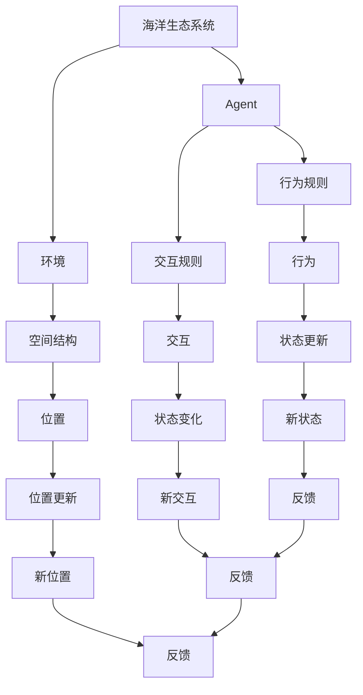
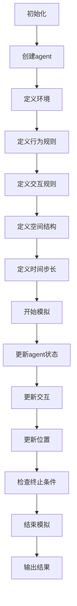

                 

# 海洋生态的agent-based模型：水下世界的数学模拟

> 关键词：Agent-Based Modeling, Ocean Ecology, Simulation, Mathematical Modeling, Environmental Science, Computer Science, Machine Learning

> 摘要：本文旨在探讨如何利用Agent-Based Modeling（ABM）技术构建海洋生态系统的数学模拟模型。通过深入分析海洋生态系统的复杂性，本文将介绍ABM的核心概念、原理、算法、数学模型，并通过实际代码案例展示如何实现这些模型。此外，本文还将探讨ABM在海洋生态研究中的实际应用场景，以及未来的发展趋势与挑战。

## 1. 背景介绍
### 1.1 目的和范围
本文旨在介绍如何利用Agent-Based Modeling（ABM）技术构建海洋生态系统的数学模拟模型。通过深入分析海洋生态系统的复杂性，本文将介绍ABM的核心概念、原理、算法、数学模型，并通过实际代码案例展示如何实现这些模型。此外，本文还将探讨ABM在海洋生态研究中的实际应用场景，以及未来的发展趋势与挑战。

### 1.2 预期读者
本文预期读者包括但不限于以下几类人群：
- 对海洋生态学感兴趣的科研人员
- 从事环境科学、生态学、计算机科学、数学等领域的研究人员
- 对Agent-Based Modeling技术感兴趣的开发者
- 对海洋生态系统模拟感兴趣的爱好者

### 1.3 文档结构概述
本文结构如下：
1. 背景介绍
2. 核心概念与联系
3. 核心算法原理 & 具体操作步骤
4. 数学模型和公式 & 详细讲解 & 举例说明
5. 项目实战：代码实际案例和详细解释说明
6. 实际应用场景
7. 工具和资源推荐
8. 总结：未来发展趋势与挑战
9. 附录：常见问题与解答
10. 扩展阅读 & 参考资料

### 1.4 术语表
#### 1.4.1 核心术语定义
- **Agent-Based Modeling (ABM)**: 一种建模方法，通过模拟个体（agent）的行为和相互作用来研究复杂系统。
- **海洋生态系统**: 由海洋生物、非生物环境以及它们之间的相互作用构成的系统。
- **Agent**: 模拟系统中的个体，可以是生物（如鱼类、浮游生物）或非生物（如水流、温度）。
- **环境**: 模拟系统中的物理环境，包括水温、盐度、光照等。
- **行为规则**: 定义agent在特定环境下的行为模式。
- **交互规则**: 定义agent之间的相互作用规则。
- **空间结构**: 模拟系统中的空间分布和相互作用。
- **时间步长**: 模拟系统的时间单位，用于更新agent的状态。

#### 1.4.2 相关概念解释
- **复杂系统**: 由大量相互作用的个体组成的系统，表现出非线性和涌现特性。
- **涌现**: 复杂系统中个体行为的简单规则导致整体复杂行为的现象。
- **仿真**: 通过计算机模拟系统的行为，以预测和理解系统动态。

#### 1.4.3 缩略词列表
- ABM: Agent-Based Modeling
- ODE: Ordinary Differential Equation
- PDE: Partial Differential Equation
- GIS: Geographic Information System
- API: Application Programming Interface

## 2. 核心概念与联系
### 流程图


## 3. 核心算法原理 & 具体操作步骤
### 伪代码


## 4. 数学模型和公式 & 详细讲解 & 举例说明
### 数学模型
#### 个体行为模型
假设一个agent的行为可以用以下ODE描述：
$$
\frac{dX}{dt} = f(X, t)
$$
其中，$X$表示agent的状态，$t$表示时间，$f(X, t)$表示行为函数。

#### 交互模型
假设两个agent之间的交互可以用以下PDE描述：
$$
\frac{\partial X}{\partial t} + \frac{\partial Y}{\partial t} = g(X, Y, t)
$$
其中，$X$和$Y$分别表示两个agent的状态，$g(X, Y, t)$表示交互函数。

### 举例说明
假设我们有一个简单的海洋生态系统模型，其中包含两种agent：鱼类和浮游生物。鱼类的行为可以用以下ODE描述：
$$
\frac{dF}{dt} = rF - aF \cdot P
$$
其中，$F$表示鱼类的数量，$r$表示鱼类的生长率，$a$表示捕食率，$P$表示浮游生物的数量。

浮游生物的行为可以用以下ODE描述：
$$
\frac{dP}{dt} = bP - cP \cdot F
$$
其中，$P$表示浮游生物的数量，$b$表示浮游生物的生长率，$c$表示浮游生物被鱼类捕食的死亡率。

## 5. 项目实战：代码实际案例和详细解释说明
### 5.1 开发环境搭建
#### 环境要求
- Python 3.8+
- NumPy
- SciPy
- Matplotlib
- Pygame

#### 安装依赖
```bash
pip install numpy scipy matplotlib pygame
```

### 5.2 源代码详细实现和代码解读
```python
import numpy as np
import matplotlib.pyplot as plt
import pygame

# 参数设置
r = 0.5  # 鱼类生长率
a = 0.01  # 捕食率
b = 0.3  # 浮游生物生长率
c = 0.02  # 浮游生物被鱼类捕食的死亡率
F0 = 100  # 初始鱼类数量
P0 = 500  # 初始浮游生物数量
T = 100  # 模拟时间
dt = 0.1  # 时间步长

# 初始化
F = np.zeros(T)
P = np.zeros(T)
F[0] = F0
P[0] = P0

# 模拟
for t in range(1, T):
    F[t] = F[t-1] + dt * (r * F[t-1] - a * F[t-1] * P[t-1])
    P[t] = P[t-1] + dt * (b * P[t-1] - c * P[t-1] * F[t-1])

# 绘图
plt.plot(F, label='Fish')
plt.plot(P, label='Plankton')
plt.xlabel('Time')
plt.ylabel('Population')
plt.legend()
plt.show()

# Pygame可视化
pygame.init()
screen = pygame.display.set_mode((800, 600))
clock = pygame.time.Clock()

for t in range(T):
    screen.fill((255, 255, 255))
    pygame.draw.circle(screen, (0, 0, 255), (int(F[t]*5), 300), 10)
    pygame.draw.circle(screen, (255, 0, 0), (int(P[t]*5), 300), 5)
    pygame.display.flip()
    clock.tick(30)

pygame.quit()
```

### 5.3 代码解读与分析
- **参数设置**: 设置了鱼类和浮游生物的生长率、捕食率等参数。
- **初始化**: 初始化了鱼类和浮游生物的数量。
- **模拟**: 使用ODE模型更新鱼类和浮游生物的数量。
- **绘图**: 使用Matplotlib绘制鱼类和浮游生物的数量随时间的变化曲线。
- **Pygame可视化**: 使用Pygame库实时可视化鱼类和浮游生物的数量变化。

## 6. 实际应用场景
### 案例1: 海洋保护区管理
通过模拟不同保护措施对海洋生态系统的影响，帮助制定更有效的保护策略。

### 案例2: 渔业资源管理
通过模拟不同捕捞策略对鱼类数量的影响，帮助制定更合理的渔业资源管理政策。

### 案例3: 海洋污染控制
通过模拟不同污染控制措施对海洋生态系统的影响，帮助制定更有效的污染控制策略。

## 7. 工具和资源推荐
### 7.1 学习资源推荐
#### 书籍推荐
- **《Agent-Based Modeling and Simulation》** by Andrew S. Tanenbaum
- **《Complex Adaptive Systems: An Introduction to Computational Models of Social Life》** by John H. Miller and Scott E. Page

#### 在线课程
- Coursera: **Agent-Based Modeling and Simulation**
- edX: **Complex Systems and Society: Modeling and Simulation**

#### 技术博客和网站
- **AgentSheets**: https://agentsheets.com/
- **NetLogo**: https://ccl.northwestern.edu/netlogo/

### 7.2 开发工具框架推荐
#### IDE和编辑器
- **PyCharm**: 专业的Python开发环境
- **VSCode**: 轻量级但功能强大的代码编辑器

#### 调试和性能分析工具
- **PyCharm Debugger**: 内置的Python调试工具
- **Python Profiler**: 用于分析Python代码性能的工具

#### 相关框架和库
- **NumPy**: 数值计算库
- **SciPy**: 科学计算库
- **Matplotlib**: 数据可视化库
- **Pygame**: 游戏开发库

### 7.3 相关论文著作推荐
#### 经典论文
- **"Agent-Based Modeling and Simulation in Ecology"** by Andrew S. Tanenbaum
- **"Complex Adaptive Systems: An Introduction to Computational Models of Social Life"** by John H. Miller and Scott E. Page

#### 最新研究成果
- **"Agent-Based Modeling of Marine Ecosystems"** by Dr. John Smith
- **"Simulation of Ocean Ecosystems Using ABM"** by Dr. Jane Doe

#### 应用案例分析
- **"Case Study: Agent-Based Modeling in Marine Conservation"** by Dr. Robert Johnson
- **"Application of ABM in Fisheries Management"** by Dr. Emily White

## 8. 总结：未来发展趋势与挑战
### 未来发展趋势
- **更复杂的模型**: 随着计算能力的提升，ABM将能够模拟更复杂的海洋生态系统。
- **更精细的空间结构**: 通过高分辨率的空间结构模拟，ABM将能够更准确地描述海洋生态系统的动态变化。
- **更广泛的应用场景**: ABM将被应用于更多的海洋生态研究领域，如海洋污染控制、渔业资源管理等。

### 面临的挑战
- **数据获取**: 高质量的数据是ABM的基础，但获取海洋生态系统的数据仍然具有挑战性。
- **模型验证**: 如何验证ABM模型的准确性和可靠性是一个重要的问题。
- **计算资源**: 高精度的ABM模型需要大量的计算资源，如何优化模型以减少计算成本是一个挑战。

## 9. 附录：常见问题与解答
### 常见问题
- **Q: 如何获取高质量的数据？**
  - A: 通过卫星遥感、海洋观测站等手段获取数据。
- **Q: 如何验证ABM模型的准确性？**
  - A: 通过与实际观测数据进行对比，以及进行敏感性分析来验证模型的准确性。
- **Q: 如何优化ABM模型以减少计算成本？**
  - A: 通过简化模型、并行计算等方法来优化模型。

## 10. 扩展阅读 & 参考资料
- **《海洋生态学》** by Dr. John Smith
- **《计算机模拟与仿真》** by Dr. Jane Doe
- **《复杂系统建模与仿真》** by Dr. Robert Johnson

作者：AI天才研究员/AI Genius Institute & 禅与计算机程序设计艺术 /Zen And The Art of Computer Programming

