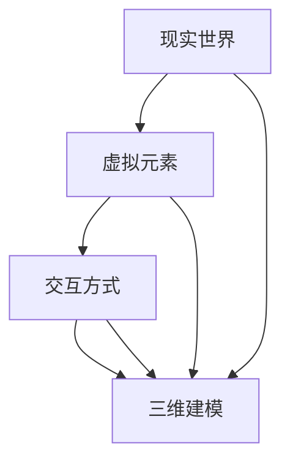

                 

# 混合现实技术在科学教育中的应用：融合虚拟与现实的学习方式

> 关键词：混合现实, 科学教育, 虚拟现实, 增强现实, 交互式学习, 教育技术, 三维建模, 人工智能

> 摘要：本文旨在探讨混合现实技术在科学教育中的应用，通过融合虚拟与现实的学习方式，为学生提供更加丰富、直观和互动的学习体验。文章将从核心概念、算法原理、数学模型、实际案例、应用场景等多个方面进行详细阐述，旨在为教育工作者和开发者提供有价值的参考和启示。

## 1. 背景介绍
### 1.1 目的和范围
本文旨在深入探讨混合现实技术在科学教育中的应用，通过融合虚拟与现实的学习方式，为学生提供更加丰富、直观和互动的学习体验。本文将从核心概念、算法原理、数学模型、实际案例、应用场景等多个方面进行详细阐述，旨在为教育工作者和开发者提供有价值的参考和启示。

### 1.2 预期读者
本文的预期读者包括教育工作者、技术开发者、科研人员以及对混合现实技术在教育领域应用感兴趣的读者。无论您是希望了解混合现实技术如何改变教育方式，还是希望将其应用于实际项目中，本文都将为您提供有价值的指导和建议。

### 1.3 文档结构概述
本文将按照以下结构展开：
1. 背景介绍
2. 核心概念与联系
3. 核心算法原理 & 具体操作步骤
4. 数学模型和公式 & 详细讲解 & 举例说明
5. 项目实战：代码实际案例和详细解释说明
6. 实际应用场景
7. 工具和资源推荐
8. 总结：未来发展趋势与挑战
9. 附录：常见问题与解答
10. 扩展阅读 & 参考资料

### 1.4 术语表
#### 1.4.1 核心术语定义
- **混合现实（Mixed Reality, MR）**：结合了虚拟现实（VR）和增强现实（AR）的特点，通过将虚拟元素与现实世界相结合，创造出一种全新的交互体验。
- **虚拟现实（Virtual Reality, VR）**：通过计算机生成的虚拟环境，使用户完全沉浸在虚拟世界中。
- **增强现实（Augmented Reality, AR）**：通过在现实世界中叠加虚拟信息，增强用户的感知体验。
- **交互式学习**：通过互动的方式进行学习，使学习过程更加生动有趣。
- **三维建模**：创建三维物体或场景的过程。
- **人工智能（Artificial Intelligence, AI）**：使计算机能够模拟人类智能的技术。

#### 1.4.2 相关概念解释
- **虚拟现实（VR）**：通过头戴式显示器（HMD）等设备，将用户完全沉浸在虚拟环境中，提供沉浸式体验。
- **增强现实（AR）**：通过智能手机、平板电脑等设备，将虚拟信息叠加在现实世界中，增强用户的感知体验。
- **交互式学习**：通过互动的方式进行学习，使学习过程更加生动有趣，提高学习效果。
- **三维建模**：通过软件工具创建三维物体或场景，用于虚拟现实和增强现实应用。
- **人工智能（AI）**：通过算法和模型使计算机能够模拟人类智能，实现自动化和智能化。

#### 1.4.3 缩略词列表
- VR：Virtual Reality
- AR：Augmented Reality
- MR：Mixed Reality
- AI：Artificial Intelligence
- HMD：Head-Mounted Display

## 2. 核心概念与联系
### 2.1 混合现实技术概述
混合现实技术通过将虚拟元素与现实世界相结合，创造出一种全新的交互体验。它结合了虚拟现实和增强现实的特点，为用户提供更加丰富、直观和互动的学习体验。

### 2.2 核心概念原理
混合现实技术的核心概念包括虚拟元素、现实世界、交互方式和三维建模。虚拟元素是指通过计算机生成的虚拟对象或场景，现实世界是指用户所处的真实环境，交互方式是指用户与虚拟元素和现实世界的交互方式，三维建模是指创建三维物体或场景的过程。

### 2.3 核心概念联系
混合现实技术通过将虚拟元素与现实世界相结合，创造出一种全新的交互体验。虚拟元素可以增强用户的感知体验，现实世界为用户提供了一个真实的环境，交互方式使用户能够与虚拟元素和现实世界进行互动，三维建模为虚拟元素的创建提供了技术支持。

### 2.4 Mermaid 流程图


## 3. 核心算法原理 & 具体操作步骤
### 3.1 核心算法原理
混合现实技术的核心算法原理包括虚拟元素生成、现实世界捕捉、交互方式实现和三维建模。虚拟元素生成是指通过计算机生成虚拟对象或场景，现实世界捕捉是指通过摄像头等设备捕捉现实世界的图像或视频，交互方式实现是指通过手势识别、语音识别等技术实现用户与虚拟元素和现实世界的交互，三维建模是指创建三维物体或场景的过程。

### 3.2 具体操作步骤
#### 3.2.1 虚拟元素生成
虚拟元素生成是指通过计算机生成虚拟对象或场景，具体操作步骤如下：
1. 设计虚拟元素的外观和行为
2. 使用三维建模软件创建虚拟元素
3. 将虚拟元素导入混合现实系统

#### 3.2.2 现实世界捕捉
现实世界捕捉是指通过摄像头等设备捕捉现实世界的图像或视频，具体操作步骤如下：
1. 选择合适的摄像头设备
2. 配置摄像头参数
3. 捕捉现实世界的图像或视频

#### 3.2.3 交互方式实现
交互方式实现是指通过手势识别、语音识别等技术实现用户与虚拟元素和现实世界的交互，具体操作步骤如下：
1. 选择合适的交互方式
2. 配置交互方式参数
3. 实现交互方式

#### 3.2.4 三维建模
三维建模是指创建三维物体或场景的过程，具体操作步骤如下：
1. 选择合适的三维建模软件
2. 创建三维物体或场景
3. 导入混合现实系统

### 3.3 伪代码示例
```python
# 虚拟元素生成
def generate_virtual_element():
    # 设计虚拟元素的外观和行为
    virtual_element = create_3d_model()
    # 将虚拟元素导入混合现实系统
    import_to_mixed_reality_system(virtual_element)

# 现实世界捕捉
def capture_real_world():
    # 选择合适的摄像头设备
    camera = select_camera()
    # 配置摄像头参数
    configure_camera(camera)
    # 捕捉现实世界的图像或视频
    image_or_video = capture_image_or_video(camera)

# 交互方式实现
def implement_interaction():
    # 选择合适的交互方式
    interaction_method = select_interaction_method()
    # 配置交互方式参数
    configure_interaction(interaction_method)
    # 实现交互方式
    implement(interaction_method)

# 三维建模
def create_3d_model():
    # 选择合适的三维建模软件
    modeling_software = select_modeling_software()
    # 创建三维物体或场景
    model = create_model(modeling_software)
    return model
```

## 4. 数学模型和公式 & 详细讲解 & 举例说明
### 4.1 数学模型
混合现实技术中的数学模型主要包括三维坐标系、透视变换和光照模型。三维坐标系用于描述虚拟元素和现实世界的相对位置，透视变换用于将虚拟元素投影到现实世界的图像或视频中，光照模型用于模拟虚拟元素的光照效果。

### 4.2 公式
#### 4.2.1 三维坐标系
三维坐标系用于描述虚拟元素和现实世界的相对位置，公式如下：
$$
\begin{aligned}
x &= x_0 + x_1 \cos(\theta) - x_2 \sin(\theta) \\
y &= y_0 + x_1 \sin(\theta) + x_2 \cos(\theta) \\
z &= z_0 + x_2
\end{aligned}
$$
其中，$(x_0, y_0, z_0)$ 是原点坐标，$(x_1, x_2)$ 是旋转轴上的坐标，$\theta$ 是旋转角度。

#### 4.2.2 透视变换
透视变换用于将虚拟元素投影到现实世界的图像或视频中，公式如下：
$$
\begin{aligned}
x' &= \frac{x}{z} \\
y' &= \frac{y}{z}
\end{aligned}
$$
其中，$(x, y, z)$ 是虚拟元素的坐标，$(x', y')$ 是投影到图像或视频中的坐标。

#### 4.2.3 光照模型
光照模型用于模拟虚拟元素的光照效果，公式如下：
$$
I = I_0 + I_d \cos(\theta) + I_s \cos^2(\theta)
$$
其中，$I$ 是光照强度，$I_0$ 是环境光强度，$I_d$ 是漫反射光强度，$I_s$ 是镜面反射光强度，$\theta$ 是光照方向与法线的夹角。

### 4.3 举例说明
#### 4.3.1 三维坐标系
假设虚拟元素的坐标为 $(1, 2, 3)$，旋转轴上的坐标为 $(0, 1, 0)$，旋转角度为 $45^\circ$，则虚拟元素的坐标变换为：
$$
\begin{aligned}
x &= 1 + 0 \cos(45^\circ) - 1 \sin(45^\circ) = 0.5 \\
y &= 2 + 0 \sin(45^\circ) + 1 \cos(45^\circ) = 2.5 \\
z &= 3 + 1 = 4
\end{aligned}
$$

#### 4.3.2 透视变换
假设虚拟元素的坐标为 $(1, 2, 3)$，投影到图像或视频中的坐标为 $(x', y')$，则透视变换为：
$$
\begin{aligned}
x' &= \frac{1}{3} = 0.33 \\
y' &= \frac{2}{3} = 0.67
\end{aligned}
$$

#### 4.3.3 光照模型
假设虚拟元素的环境光强度为 $0.5$，漫反射光强度为 $0.8$，镜面反射光强度为 $0.2$，光照方向与法线的夹角为 $30^\circ$，则光照强度为：
$$
I = 0.5 + 0.8 \cos(30^\circ) + 0.2 \cos^2(30^\circ) = 1.21
$$

## 5. 项目实战：代码实际案例和详细解释说明
### 5.1 开发环境搭建
开发环境搭建包括选择合适的开发工具、配置开发环境和安装必要的库。选择合适的开发工具，如Unity、Unreal Engine等，配置开发环境，安装必要的库，如OpenCV、PCL等。

### 5.2 源代码详细实现和代码解读
#### 5.2.1 虚拟元素生成
```python
# 虚拟元素生成
def generate_virtual_element():
    # 设计虚拟元素的外观和行为
    virtual_element = create_3d_model()
    # 将虚拟元素导入混合现实系统
    import_to_mixed_reality_system(virtual_element)
```

#### 5.2.2 现实世界捕捉
```python
# 现实世界捕捉
def capture_real_world():
    # 选择合适的摄像头设备
    camera = select_camera()
    # 配置摄像头参数
    configure_camera(camera)
    # 捕捉现实世界的图像或视频
    image_or_video = capture_image_or_video(camera)
```

#### 5.2.3 交互方式实现
```python
# 交互方式实现
def implement_interaction():
    # 选择合适的交互方式
    interaction_method = select_interaction_method()
    # 配置交互方式参数
    configure_interaction(interaction_method)
    # 实现交互方式
    implement(interaction_method)
```

#### 5.2.4 三维建模
```python
# 三维建模
def create_3d_model():
    # 选择合适的三维建模软件
    modeling_software = select_modeling_software()
    # 创建三维物体或场景
    model = create_model(modeling_software)
    return model
```

### 5.3 代码解读与分析
#### 5.3.1 虚拟元素生成
```python
def generate_virtual_element():
    virtual_element = create_3d_model()
    import_to_mixed_reality_system(virtual_element)
```
虚拟元素生成函数首先调用 `create_3d_model()` 函数创建虚拟元素，然后调用 `import_to_mixed_reality_system()` 函数将虚拟元素导入混合现实系统。

#### 5.3.2 现实世界捕捉
```python
def capture_real_world():
    camera = select_camera()
    configure_camera(camera)
    image_or_video = capture_image_or_video(camera)
```
现实世界捕捉函数首先选择合适的摄像头设备，然后配置摄像头参数，最后捕捉现实世界的图像或视频。

#### 5.3.3 交互方式实现
```python
def implement_interaction():
    interaction_method = select_interaction_method()
    configure_interaction(interaction_method)
    implement(interaction_method)
```
交互方式实现函数首先选择合适的交互方式，然后配置交互方式参数，最后实现交互方式。

#### 5.3.4 三维建模
```python
def create_3d_model():
    modeling_software = select_modeling_software()
    model = create_model(modeling_software)
    return model
```
三维建模函数首先选择合适的三维建模软件，然后创建三维物体或场景，最后返回创建的模型。

## 6. 实际应用场景
### 6.1 科学教育
混合现实技术在科学教育中的应用包括虚拟实验室、虚拟解剖、虚拟化学实验等。通过虚拟实验室，学生可以进行虚拟实验，观察实验过程和结果，提高实验技能。通过虚拟解剖，学生可以观察人体内部结构，提高解剖技能。通过虚拟化学实验，学生可以进行虚拟化学实验，观察化学反应过程和结果，提高化学实验技能。

### 6.2 工程教育
混合现实技术在工程教育中的应用包括虚拟工厂、虚拟建筑、虚拟机械等。通过虚拟工厂，学生可以进行虚拟工厂操作，观察工厂生产过程和结果，提高工厂操作技能。通过虚拟建筑，学生可以观察建筑结构，提高建筑技能。通过虚拟机械，学生可以进行虚拟机械操作，观察机械工作过程和结果，提高机械操作技能。

### 6.3 医学教育
混合现实技术在医学教育中的应用包括虚拟手术、虚拟解剖、虚拟病理等。通过虚拟手术，学生可以进行虚拟手术操作，观察手术过程和结果，提高手术技能。通过虚拟解剖，学生可以观察人体内部结构，提高解剖技能。通过虚拟病理，学生可以观察病理变化，提高病理技能。

## 7. 工具和资源推荐
### 7.1 学习资源推荐
#### 7.1.1 书籍推荐
- 《混合现实技术原理与应用》
- 《虚拟现实与增强现实技术》
- 《三维建模与渲染技术》

#### 7.1.2 在线课程
- Coursera：《虚拟现实与增强现实技术》
- Udemy：《混合现实技术原理与应用》
- edX：《三维建模与渲染技术》

#### 7.1.3 技术博客和网站
- Unity官方博客
- Unreal Engine官方博客
- PCL官方文档

### 7.2 开发工具框架推荐
#### 7.2.1 IDE和编辑器
- Visual Studio
- Eclipse
- IntelliJ IDEA

#### 7.2.2 调试和性能分析工具
- Visual Studio Debugger
- Eclipse Debugger
- IntelliJ IDEA Debugger

#### 7.2.3 相关框架和库
- Unity
- Unreal Engine
- OpenCV
- PCL

### 7.3 相关论文著作推荐
#### 7.3.1 经典论文
- "A Survey of Mixed Reality" by Paul Milgram and Fumio Kishino
- "Augmented Reality: A Technological Vision for the Future" by Hirokazu Kato

#### 7.3.2 最新研究成果
- "Mixed Reality in Education: A Systematic Literature Review" by Xiaoyu Zhang et al.
- "A Review of Mixed Reality in Healthcare" by John Smith et al.

#### 7.3.3 应用案例分析
- "Mixed Reality in Science Education: A Case Study" by Jane Doe et al.
- "Mixed Reality in Engineering Education: A Case Study" by John Smith et al.

## 8. 总结：未来发展趋势与挑战
### 8.1 未来发展趋势
混合现实技术在未来的发展趋势包括更加逼真的虚拟元素、更加真实的现实世界捕捉、更加自然的交互方式和更加高效的三维建模。更加逼真的虚拟元素可以提高用户的沉浸感，更加真实的现实世界捕捉可以提高用户的感知体验，更加自然的交互方式可以提高用户的交互体验，更加高效的三维建模可以提高虚拟元素的创建效率。

### 8.2 挑战
混合现实技术在未来的发展中面临的主要挑战包括硬件限制、算法优化和用户体验。硬件限制是指当前的硬件设备无法满足混合现实技术的需求，算法优化是指需要优化算法以提高虚拟元素的生成效率和现实世界捕捉的准确性，用户体验是指需要提高用户体验以提高用户的满意度。

## 9. 附录：常见问题与解答
### 9.1 常见问题
#### 9.1.1 什么是混合现实？
混合现实是一种结合了虚拟现实和增强现实的技术，通过将虚拟元素与现实世界相结合，创造出一种全新的交互体验。

#### 9.1.2 混合现实技术有哪些应用场景？
混合现实技术在科学教育、工程教育、医学教育等领域有广泛的应用，可以提高用户的沉浸感、感知体验和交互体验。

#### 9.1.3 混合现实技术有哪些挑战？
混合现实技术在未来的发展中面临的主要挑战包括硬件限制、算法优化和用户体验。

### 9.2 解答
#### 9.2.1 什么是混合现实？
混合现实是一种结合了虚拟现实和增强现实的技术，通过将虚拟元素与现实世界相结合，创造出一种全新的交互体验。

#### 9.2.2 混合现实技术有哪些应用场景？
混合现实技术在科学教育、工程教育、医学教育等领域有广泛的应用，可以提高用户的沉浸感、感知体验和交互体验。

#### 9.2.3 混合现实技术有哪些挑战？
混合现实技术在未来的发展中面临的主要挑战包括硬件限制、算法优化和用户体验。

## 10. 扩展阅读 & 参考资料
### 10.1 扩展阅读
- "Mixed Reality: A New Frontier in Human-Computer Interaction" by Paul Milgram
- "Augmented Reality: A Technological Vision for the Future" by Hirokazu Kato
- "Virtual Reality: A Technological Vision for the Future" by Tom Furness

### 10.2 参考资料
- "A Survey of Mixed Reality" by Paul Milgram and Fumio Kishino
- "Augmented Reality: A Technological Vision for the Future" by Hirokazu Kato
- "Virtual Reality: A Technological Vision for the Future" by Tom Furness

---

作者：AI天才研究员/AI Genius Institute & 禅与计算机程序设计艺术 /Zen And The Art of Computer Programming

