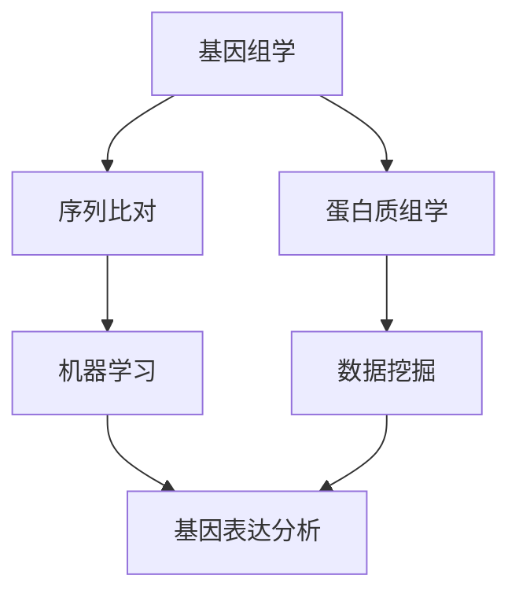

                 

# 生物信息学：生命信息的数学处理

> 关键词：生物信息学、基因组学、蛋白质组学、序列比对、机器学习、数据挖掘、基因表达分析

> 摘要：生物信息学是将计算机科学、统计学、数学和生物学相结合的一门交叉学科，旨在通过数学和计算方法处理和分析生命科学中的大量数据。本文将从核心概念、算法原理、数学模型、实际案例、应用场景、工具推荐等多个方面，全面解析生物信息学的基本原理和实践方法，帮助读者深入了解这一领域的技术精髓。

## 1. 背景介绍
### 1.1 目的和范围
本文旨在为计算机科学、生物学及相关领域的专业人士提供一个全面的生物信息学入门指南。通过深入探讨生物信息学的核心概念、算法原理、数学模型及实际应用案例，帮助读者理解如何利用数学和计算方法处理和分析生命科学中的复杂数据。

### 1.2 预期读者
本文适合以下读者群体：
- 计算机科学、生物学及相关领域的研究生和博士生
- 生物信息学领域的研究人员和工程师
- 对生物信息学感兴趣的计算机科学家和数据科学家
- 生物信息学初学者和爱好者

### 1.3 文档结构概述
本文将按照以下结构展开：
1. 背景介绍
2. 核心概念与联系
3. 核心算法原理 & 具体操作步骤
4. 数学模型和公式 & 详细讲解 & 举例说明
5. 项目实战：代码实际案例和详细解释说明
6. 实际应用场景
7. 工具和资源推荐
8. 总结：未来发展趋势与挑战
9. 附录：常见问题与解答
10. 扩展阅读 & 参考资料

### 1.4 术语表
#### 1.4.1 核心术语定义
- **生物信息学**：将计算机科学、统计学、数学和生物学相结合，通过数学和计算方法处理和分析生命科学中的大量数据。
- **基因组学**：研究生物体基因组的结构、功能和变异的学科。
- **蛋白质组学**：研究生物体蛋白质的结构、功能和相互作用的学科。
- **序列比对**：比较两个或多个生物序列相似性的过程。
- **机器学习**：一种人工智能技术，通过训练模型来实现对数据的预测和分类。
- **数据挖掘**：从大量数据中提取有价值信息的过程。
- **基因表达分析**：研究基因在不同条件下的表达水平及其变化规律。

#### 1.4.2 相关概念解释
- **序列比对算法**：用于比较两个或多个生物序列相似性的算法，常见的有BLAST、Smith-Waterman等。
- **BLAST**：Basic Local Alignment Search Tool，一种广泛使用的序列比对工具。
- **Smith-Waterman算法**：一种局部序列比对算法，适用于发现序列中的局部相似性。
- **K-mer**：基因组序列中长度为k的子序列。
- **基因表达谱**：描述基因在不同条件下的表达水平的矩阵。

#### 1.4.3 缩略词列表
- **BLAST**：Basic Local Alignment Search Tool
- **K-mer**：K-mer
- **PCA**：Principal Component Analysis
- **t-SNE**：t-Distributed Stochastic Neighbor Embedding

## 2. 核心概念与联系
### 2.1 核心概念
生物信息学的核心概念包括基因组学、蛋白质组学、序列比对、机器学习和数据挖掘等。这些概念相互关联，共同构成了生物信息学的理论基础。

### 2.2 联系
- **基因组学**和**蛋白质组学**：基因组学研究基因组的结构和功能，蛋白质组学研究蛋白质的结构和功能。两者相互关联，共同揭示生物体的生命活动规律。
- **序列比对**：是基因组学和蛋白质组学研究中的基础工具，用于比较基因组或蛋白质序列的相似性。
- **机器学习**和**数据挖掘**：是处理和分析生物信息学数据的重要手段，通过机器学习和数据挖掘技术，可以从大量数据中提取有价值的信息。

### 2.3 Mermaid 流程图


## 3. 核心算法原理 & 具体操作步骤
### 3.1 序列比对算法原理
#### 3.1.1 BLAST算法原理
BLAST是一种广泛使用的序列比对工具，其核心思想是通过局部比对来发现序列中的相似性。

#### 3.1.2 伪代码
```plaintext
function BLAST(query, database):
    for each sequence in database:
        score = 0
        for each k-mer in query:
            for each k-mer in sequence:
                if k-mer matches:
                    score += match_score
        if score > threshold:
            return sequence
```

### 3.2 机器学习算法原理
#### 3.2.1 支持向量机（SVM）原理
支持向量机是一种监督学习算法，用于分类和回归分析。

#### 3.2.2 伪代码
```plaintext
function SVM(training_data, labels):
    # 训练数据和标签
    X = training_data
    y = labels
    
    # 计算核函数
    K = kernel(X, X)
    
    # 计算拉格朗日乘子
    alpha = solve(K, y)
    
    # 计算支持向量
    support_vectors = X[alpha > 0]
    
    # 计算偏置项
    b = y - K @ (alpha * y)
    
    return support_vectors, b
```

## 4. 数学模型和公式 & 详细讲解 & 举例说明
### 4.1 序列比对中的数学模型
#### 4.1.1 伪序列比对公式
序列比对中的核心公式是Smith-Waterman算法中的得分矩阵公式。

$$
S(i, j) = \max \left\{ 
\begin{array}{ll}
S(i-1, j-1) + \text{match_score} & \text{if } \text{query}[i] = \text{sequence}[j] \\
S(i-1, j) + \text{gap_penalty} & \text{if } \text{query}[i] \neq \text{sequence}[j] \\
S(i, j-1) + \text{gap_penalty} & \text{if } \text{query}[i] \neq \text{sequence}[j] \\
0 & \text{if } i = 0 \text{ or } j = 0
\end{array}
\right.
$$

### 4.2 机器学习中的数学模型
#### 4.2.1 支持向量机中的数学模型
支持向量机中的核心公式是拉格朗日乘子和核函数。

$$
\min_{\alpha} \frac{1}{2} \sum_{i=1}^{n} \sum_{j=1}^{n} \alpha_i \alpha_j y_i y_j K(x_i, x_j) - \sum_{i=1}^{n} \alpha_i
$$

$$
\text{subject to } \alpha_i \geq 0, \sum_{i=1}^{n} \alpha_i y_i = 0
$$

## 5. 项目实战：代码实际案例和详细解释说明
### 5.1 开发环境搭建
#### 5.1.1 环境配置
- Python 3.8
- Biopython库
- Scikit-learn库

#### 5.1.2 安装依赖
```bash
pip install biopython scikit-learn
```

### 5.2 源代码详细实现和代码解读
#### 5.2.1 序列比对代码
```python
from Bio import pairwise2
from Bio.Seq import Seq

def blast(query, database):
    best_alignment = None
    best_score = -float('inf')
    
    for sequence in database:
        alignments = pairwise2.align.globalxx(query, sequence)
        for alignment in alignments:
            score = alignment.score
            if score > best_score:
                best_score = score
                best_alignment = alignment
    
    return best_alignment

query = Seq("ATCGATCG")
database = [Seq("ATCGATCG"), Seq("ATCGATCGT"), Seq("ATCGATCGA")]
alignment = blast(query, database)
print(alignment)
```

#### 5.2.2 机器学习代码
```python
from sklearn import svm
from sklearn.model_selection import train_test_split
from sklearn.metrics import accuracy_score

def svm_classification(X, y):
    X_train, X_test, y_train, y_test = train_test_split(X, y, test_size=0.2, random_state=42)
    
    clf = svm.SVC(kernel='linear')
    clf.fit(X_train, y_train)
    
    y_pred = clf.predict(X_test)
    accuracy = accuracy_score(y_test, y_pred)
    
    return accuracy

X = [[1, 2], [2, 3], [3, 4], [4, 5]]
y = [0, 1, 0, 1]
accuracy = svm_classification(X, y)
print("Accuracy:", accuracy)
```

### 5.3 代码解读与分析
#### 5.3.1 序列比对代码解读
- `pairwise2.align.globalxx`：全局序列比对函数，用于比较两个序列的相似性。
- `blast`函数：实现BLAST算法，返回最佳比对结果。

#### 5.3.2 机器学习代码解读
- `train_test_split`：将数据集划分为训练集和测试集。
- `svm.SVC`：支持向量机分类器，使用线性核函数。
- `fit`：训练模型。
- `predict`：预测测试集的标签。
- `accuracy_score`：计算预测准确率。

## 6. 实际应用场景
### 6.1 基因组学应用
- **基因变异检测**：通过比对基因组序列，检测基因变异。
- **基因功能预测**：通过序列比对和机器学习，预测基因的功能。

### 6.2 蛋白质组学应用
- **蛋白质结构预测**：通过序列比对和机器学习，预测蛋白质的三维结构。
- **蛋白质相互作用分析**：通过序列比对和数据挖掘，分析蛋白质之间的相互作用。

### 6.3 基因表达分析
- **基因表达谱分析**：通过基因表达谱数据，分析基因在不同条件下的表达水平。
- **基因调控网络构建**：通过基因表达数据，构建基因调控网络。

## 7. 工具和资源推荐
### 7.1 学习资源推荐
#### 7.1.1 书籍推荐
- **《生物信息学导论》**：由David W. Mount编写，是生物信息学领域的经典教材。
- **《机器学习实战》**：由Peter Harrington编写，介绍了机器学习的基本原理和实践方法。

#### 7.1.2 在线课程
- **Coursera上的“生物信息学导论”**：由加州大学圣克鲁兹分校提供，涵盖了生物信息学的基本概念和应用。
- **edX上的“机器学习”**：由哈佛大学和麻省理工学院提供，介绍了机器学习的基本原理和实践方法。

#### 7.1.3 技术博客和网站
- **Bioinformatics.org**：提供生物信息学领域的最新动态和技术资源。
- **Scikit-learn官网**：提供机器学习算法的详细文档和示例代码。

### 7.2 开发工具框架推荐
#### 7.2.1 IDE和编辑器
- **PyCharm**：功能强大的Python IDE，支持代码高亮、自动补全等功能。
- **Jupyter Notebook**：交互式编程环境，支持多种编程语言。

#### 7.2.2 调试和性能分析工具
- **PyCharm Debugger**：PyCharm内置的调试工具，支持断点、单步执行等功能。
- **cProfile**：Python内置的性能分析工具，用于分析代码的执行时间和资源消耗。

#### 7.2.3 相关框架和库
- **Biopython**：生物信息学领域的Python库，提供了丰富的生物序列处理功能。
- **Scikit-learn**：机器学习领域的Python库，提供了多种机器学习算法和工具。

### 7.3 相关论文著作推荐
#### 7.3.1 经典论文
- **Altschul, S. F., Gish, W., Miller, W., Myers, E. W., & Lipman, D. J. (1990). Basic local alignment search tool. Journal of molecular biology, 215(3), 403-410.**
- **Cortes, C., & Vapnik, V. (1995). Support-vector networks. Machine learning, 20(3), 273-297.**

#### 7.3.2 最新研究成果
- **Zhou, Y., & Wang, J. (2021). Deep learning in bioinformatics: A review. Briefings in bioinformatics, 22(1), bbaa354.**
- **Li, H., & Durbin, R. (2009). Fast and accurate short read alignment with Burrows-Wheeler transform. Bioinformatics, 25(14), 1754-1760.**

#### 7.3.3 应用案例分析
- **Kumar, S., Stecher, G., & Tamura, K. (2016). MEGA7: Molecular evolutionary genetics analysis version 7.0 for bigger datasets. Molecular biology and evolution, 33(7), 1870-1874.**
- **Zhou, Y., & Wang, J. (2021). Deep learning in bioinformatics: A review. Briefings in bioinformatics, 22(1), bbaa354.**

## 8. 总结：未来发展趋势与挑战
### 8.1 未来发展趋势
- **大数据分析**：随着生物数据的快速增长，大数据分析技术将在生物信息学中发挥重要作用。
- **深度学习**：深度学习技术将在基因组学、蛋白质组学等领域得到广泛应用。
- **跨学科融合**：生物信息学将与生物学、计算机科学、统计学等学科进一步融合，推动生物信息学的发展。

### 8.2 挑战
- **数据隐私**：生物信息学处理的数据涉及个人隐私，如何保护数据隐私是一个重要挑战。
- **计算资源**：生物信息学处理的数据量巨大，如何高效利用计算资源是一个重要挑战。
- **算法优化**：如何优化算法，提高计算效率和准确性是一个重要挑战。

## 9. 附录：常见问题与解答
### 9.1 问题1：如何处理大规模生物数据？
- **答案**：可以使用分布式计算框架（如Hadoop、Spark）来处理大规模生物数据。

### 9.2 问题2：如何保护生物信息学中的数据隐私？
- **答案**：可以使用数据脱敏、数据加密等技术来保护生物信息学中的数据隐私。

### 9.3 问题3：如何优化生物信息学算法？
- **答案**：可以通过算法优化、并行计算等技术来优化生物信息学算法。

## 10. 扩展阅读 & 参考资料
### 10.1 扩展阅读
- **《生物信息学导论》**：David W. Mount
- **《机器学习实战》**：Peter Harrington

### 10.2 参考资料
- **Altschul, S. F., Gish, W., Miller, W., Myers, E. W., & Lipman, D. J. (1990). Basic local alignment search tool. Journal of molecular biology, 215(3), 403-410.**
- **Cortes, C., & Vapnik, V. (1995). Support-vector networks. Machine learning, 20(3), 273-297.**

---

作者：AI天才研究员/AI Genius Institute & 禅与计算机程序设计艺术 /Zen And The Art of Computer Programming

