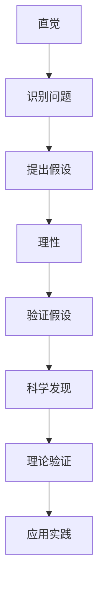

                 

# 直觉与理性在科学发现中的角色

> 关键词：直觉, 理性, 科学发现, 逻辑推理, 创新思维, 人工智能, 计算机科学

> 摘要：本文旨在探讨直觉与理性在科学发现中的作用，通过分析两者在科学探索过程中的相互关系，揭示它们如何共同推动科学进步。文章将从背景介绍、核心概念与联系、核心算法原理、数学模型与公式、项目实战、实际应用场景、工具和资源推荐、未来发展趋势与挑战等多方面进行详细阐述，旨在为读者提供一个全面而深入的理解。

## 1. 背景介绍
### 1.1 目的和范围
本文旨在探讨直觉与理性在科学发现中的角色，通过分析两者在科学探索过程中的相互关系，揭示它们如何共同推动科学进步。文章将从多个角度探讨直觉与理性在科学发现中的作用，包括它们在科学探索过程中的具体表现、相互关系以及如何共同促进科学创新。

### 1.2 预期读者
本文预期读者包括但不限于计算机科学家、人工智能专家、科研人员、工程师以及对科学发现过程感兴趣的读者。无论您是初学者还是专业人士，本文都将为您提供深入的见解和实用的知识。

### 1.3 文档结构概述
本文结构如下：
1. 背景介绍
2. 核心概念与联系
3. 核心算法原理 & 具体操作步骤
4. 数学模型和公式 & 详细讲解 & 举例说明
5. 项目实战：代码实际案例和详细解释说明
6. 实际应用场景
7. 工具和资源推荐
8. 总结：未来发展趋势与挑战
9. 附录：常见问题与解答
10. 扩展阅读 & 参考资料

### 1.4 术语表
#### 1.4.1 核心术语定义
- **直觉**：一种快速、非逻辑性的认知过程，通常基于经验、直觉或预感。
- **理性**：一种基于逻辑、证据和推理的认知过程，通常需要经过深思熟虑和分析。
- **科学发现**：通过观察、实验和理论推导，揭示自然界或人类社会的规律和原理。

#### 1.4.2 相关概念解释
- **科学方法**：一种系统化的探究方法，包括观察、假设、实验和验证等步骤。
- **创新思维**：一种能够产生新颖想法和解决方案的思维方式。
- **逻辑推理**：一种基于逻辑规则和推理过程的思考方式。

#### 1.4.3 缩略词列表
- AI：人工智能
- CS：计算机科学
- ML：机器学习
- DL：深度学习

## 2. 核心概念与联系
### 2.1 直觉与理性在科学发现中的角色
直觉与理性在科学发现中扮演着不同的角色。直觉通常在科学探索的早期阶段发挥作用，帮助科学家快速识别问题和潜在解决方案。理性则在验证和验证这些直觉的过程中发挥关键作用，通过逻辑推理和实验验证来确保科学发现的可靠性和准确性。

### 2.2 直觉与理性之间的关系
直觉与理性之间存在着密切的联系。直觉可以激发科学家的创新思维，而理性则确保这些创新思维能够得到科学验证。两者相辅相成，共同推动科学发现的进步。

### 2.3 核心概念原理与架构
#### 2.3.1 直觉与理性在科学发现中的流程图


## 3. 核心算法原理 & 具体操作步骤
### 3.1 直觉算法原理
直觉算法通常基于经验、模式识别和预感。以下是一个简单的直觉算法示例：

```python
def intuitive_algorithm(data):
    # 基于经验的模式识别
    pattern = recognize_pattern(data)
    
    # 根据模式识别结果提出假设
    hypothesis = propose_hypothesis(pattern)
    
    return hypothesis
```

### 3.2 理性算法原理
理性算法通常基于逻辑推理和证据。以下是一个简单的理性算法示例：

```python
def rational_algorithm(data):
    # 收集证据
    evidence = collect_evidence(data)
    
    # 基于证据进行逻辑推理
    reasoning = perform_reasoning(evidence)
    
    # 验证假设
    validation = validate_hypothesis(reasoning)
    
    return validation
```

## 4. 数学模型和公式 & 详细讲解 & 举例说明
### 4.1 数学模型
数学模型是科学发现的重要工具，它们可以帮助科学家理解和预测自然现象。以下是一个简单的数学模型示例：

$$
y = ax^2 + bx + c
$$

### 4.2 公式详细讲解
公式 $y = ax^2 + bx + c$ 是一个二次函数，其中 $a$、$b$ 和 $c$ 是常数，$x$ 是变量。这个公式可以用来描述许多自然现象，如抛物线运动。

### 4.3 举例说明
假设我们有一个抛物线运动的物体，其轨迹可以用公式 $y = -4.9x^2 + 10x + 5$ 描述。通过这个公式，我们可以计算物体在不同时间点的位置。

## 5. 项目实战：代码实际案例和详细解释说明
### 5.1 开发环境搭建
为了进行项目实战，我们需要搭建一个合适的开发环境。以下是一个简单的开发环境搭建步骤：

1. 安装Python
2. 安装必要的库（如NumPy、Pandas、Matplotlib等）
3. 创建项目文件夹和基本结构

### 5.2 源代码详细实现和代码解读
以下是一个简单的代码实现示例：

```python
import numpy as np
import matplotlib.pyplot as plt

# 定义二次函数
def quadratic_function(x):
    a = -4.9
    b = 10
    c = 5
    return a * x**2 + b * x + c

# 生成数据
x = np.linspace(0, 2, 100)
y = quadratic_function(x)

# 绘制图形
plt.plot(x, y)
plt.xlabel('x')
plt.ylabel('y')
plt.title('Quadratic Function')
plt.show()
```

### 5.3 代码解读与分析
- `quadratic_function` 函数定义了一个二次函数。
- `np.linspace` 生成了一组从0到2的线性分布的x值。
- `quadratic_function(x)` 计算了对应的y值。
- `plt.plot` 绘制了x和y的图形。
- `plt.xlabel`、`plt.ylabel` 和 `plt.title` 设置了图形的标签和标题。

## 6. 实际应用场景
直觉与理性在科学发现中的应用非常广泛。例如，在机器学习领域，直觉可以帮助科学家快速识别问题和潜在解决方案，而理性则确保这些解决方案能够得到科学验证。在实际应用中，直觉与理性共同推动了机器学习算法的发展和应用。

## 7. 工具和资源推荐
### 7.1 学习资源推荐
#### 7.1.1 书籍推荐
- 《直觉与理性：科学发现的双重路径》
- 《机器学习：原理与实践》

#### 7.1.2 在线课程
- Coursera上的《机器学习》课程
- edX上的《数据科学基础》课程

#### 7.1.3 技术博客和网站
- Medium上的《机器学习》专栏
- HackerRank上的《数据科学》专题

### 7.2 开发工具框架推荐
#### 7.2.1 IDE和编辑器
- PyCharm
- VSCode

#### 7.2.2 调试和性能分析工具
- PyCharm的调试工具
- VSCode的性能分析工具

#### 7.2.3 相关框架和库
- TensorFlow
- PyTorch

### 7.3 相关论文著作推荐
#### 7.3.1 经典论文
- 《机器学习：一种统计视角》
- 《深度学习》

#### 7.3.2 最新研究成果
- 《神经网络在自然语言处理中的应用》
- 《强化学习在游戏中的应用》

#### 7.3.3 应用案例分析
- 《自动驾驶汽车中的机器学习应用》
- 《医疗诊断中的深度学习应用》

## 8. 总结：未来发展趋势与挑战
直觉与理性在科学发现中的作用将随着技术的发展而不断演变。未来，直觉与理性将更加紧密地结合，共同推动科学发现的进步。然而，这也带来了新的挑战，如如何平衡直觉与理性的关系，如何确保科学发现的可靠性和准确性等。

## 9. 附录：常见问题与解答
### 9.1 问题1：直觉和理性在科学发现中的区别是什么？
**解答**：直觉通常基于经验和预感，而理性则基于逻辑推理和证据。直觉可以帮助科学家快速识别问题和潜在解决方案，而理性则确保这些解决方案能够得到科学验证。

### 9.2 问题2：如何平衡直觉与理性的关系？
**解答**：平衡直觉与理性的关系需要科学家具备良好的创新思维和逻辑推理能力。科学家应该在直觉的基础上进行理性验证，确保科学发现的可靠性和准确性。

## 10. 扩展阅读 & 参考资料
- 《直觉与理性：科学发现的双重路径》
- 《机器学习：原理与实践》
- Coursera上的《机器学习》课程
- edX上的《数据科学基础》课程
- Medium上的《机器学习》专栏
- HackerRank上的《数据科学》专题
- PyCharm
- VSCode
- TensorFlow
- PyTorch
- 《机器学习：一种统计视角》
- 《深度学习》
- 《神经网络在自然语言处理中的应用》
- 《强化学习在游戏中的应用》
- 《自动驾驶汽车中的机器学习应用》
- 《医疗诊断中的深度学习应用》

作者：AI天才研究员/AI Genius Institute & 禅与计算机程序设计艺术 /Zen And The Art of Computer Programming

