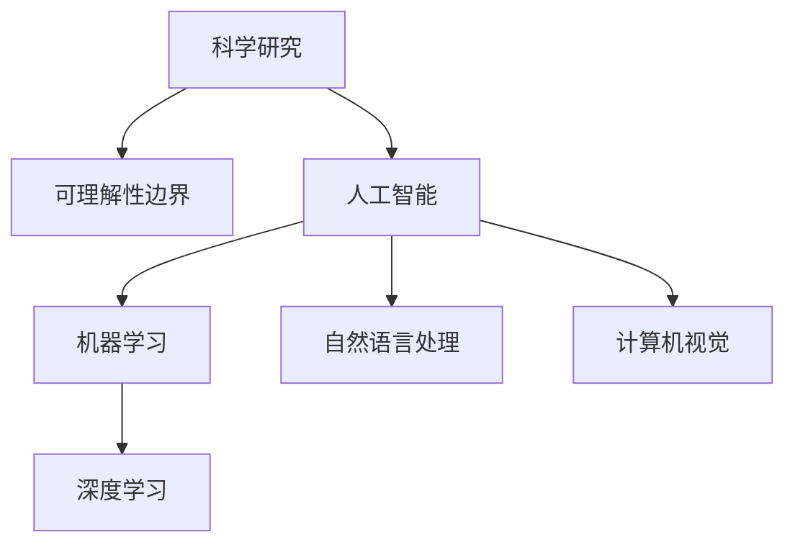

                 

# 科学研究的前沿探索：不断拓展世界可理解性的边界

> 关键词：科学研究、前沿探索、可理解性边界、人工智能、机器学习、深度学习、自然语言处理、计算机视觉

> 摘要：本文旨在探讨科学研究的前沿探索，特别是如何通过不断拓展世界可理解性的边界来推动人工智能的发展。我们将从核心概念出发，深入解析相关算法原理，展示数学模型和公式，并通过实际代码案例进行详细解释。此外，本文还将探讨实际应用场景、推荐学习资源和开发工具，以及未来的发展趋势与挑战。

## 1. 背景介绍
### 1.1 目的和范围
本文旨在深入探讨科学研究的前沿探索，特别是如何通过不断拓展世界可理解性的边界来推动人工智能的发展。我们将从核心概念出发，深入解析相关算法原理，展示数学模型和公式，并通过实际代码案例进行详细解释。此外，本文还将探讨实际应用场景、推荐学习资源和开发工具，以及未来的发展趋势与挑战。

### 1.2 预期读者
本文预期读者包括但不限于以下几类人群：
- 对科学研究和人工智能感兴趣的初学者
- 从事人工智能研究和开发的专业人士
- 对前沿技术感兴趣的科技爱好者
- 高校师生，特别是计算机科学和人工智能领域的学生

### 1.3 文档结构概述
本文结构如下：
1. 背景介绍
2. 核心概念与联系
3. 核心算法原理 & 具体操作步骤
4. 数学模型和公式 & 详细讲解 & 举例说明
5. 项目实战：代码实际案例和详细解释说明
6. 实际应用场景
7. 工具和资源推荐
8. 总结：未来发展趋势与挑战
9. 附录：常见问题与解答
10. 扩展阅读 & 参考资料

### 1.4 术语表
#### 1.4.1 核心术语定义
- **科学研究**：系统地探索自然现象、发现规律、验证假设的过程。
- **可理解性边界**：指人类能够理解和解释的复杂系统的范围。
- **人工智能**：模拟、延伸和扩展人类智能的技术。
- **机器学习**：使计算机系统能够从数据中自动学习并改进的算法。
- **深度学习**：一种机器学习方法，通过多层神经网络进行学习。
- **自然语言处理**：使计算机能够理解、解释和生成人类语言的技术。
- **计算机视觉**：使计算机能够理解和解释图像和视频的技术。

#### 1.4.2 相关概念解释
- **科学研究方法**：包括观察、实验、理论构建和验证等步骤。
- **可理解性边界**：人类的认知能力和技术手段共同决定的范围。
- **人工智能技术栈**：包括数据预处理、特征提取、模型训练、模型评估和部署等环节。

#### 1.4.3 缩略词列表
- AI：人工智能
- ML：机器学习
- DL：深度学习
- NLP：自然语言处理
- CV：计算机视觉

## 2. 核心概念与联系
### 2.1 核心概念
- **科学研究**：系统地探索自然现象、发现规律、验证假设的过程。
- **可理解性边界**：指人类能够理解和解释的复杂系统的范围。
- **人工智能**：模拟、延伸和扩展人类智能的技术。
- **机器学习**：使计算机系统能够从数据中自动学习并改进的算法。
- **深度学习**：一种机器学习方法，通过多层神经网络进行学习。
- **自然语言处理**：使计算机能够理解、解释和生成人类语言的技术。
- **计算机视觉**：使计算机能够理解和解释图像和视频的技术。

### 2.2 联系
- **科学研究**与**可理解性边界**：科学研究推动了人类对世界的理解，而可理解性边界则限制了我们能够理解的范围。
- **人工智能**与**机器学习**：人工智能是机器学习的一个分支，机器学习是实现人工智能的关键技术。
- **机器学习**与**深度学习**：深度学习是机器学习的一种，通过多层神经网络进行学习，能够处理更复杂的任务。
- **自然语言处理**与**计算机视觉**：自然语言处理和计算机视觉是人工智能的两个重要分支，分别处理文本和图像数据。

### 2.3 Mermaid 流程图


## 3. 核心算法原理 & 具体操作步骤
### 3.1 核心算法原理
#### 3.1.1 机器学习算法原理
机器学习算法通过从数据中学习规律，从而实现对未知数据的预测或分类。常见的机器学习算法包括：
- **监督学习**：通过已知的输入和输出数据对模型进行训练。
- **无监督学习**：通过未标记的数据对模型进行训练，发现数据中的结构。
- **半监督学习**：结合有监督和无监督学习的方法。
- **强化学习**：通过与环境的交互来学习最优策略。

#### 3.1.2 深度学习算法原理
深度学习算法通过多层神经网络进行学习，每一层网络提取更高级别的特征。常见的深度学习算法包括：
- **卷积神经网络（CNN）**：用于图像处理任务。
- **循环神经网络（RNN）**：用于序列数据处理任务。
- **长短时记忆网络（LSTM）**：改进的RNN，能够处理长期依赖问题。
- **生成对抗网络（GAN）**：用于生成逼真的图像和文本。

### 3.2 具体操作步骤
#### 3.2.1 数据预处理
```python
# 数据预处理
import numpy as np
from sklearn.preprocessing import StandardScaler

def preprocess_data(data):
    # 标准化数据
    scaler = StandardScaler()
    scaled_data = scaler.fit_transform(data)
    return scaled_data
```

#### 3.2.2 特征提取
```python
# 特征提取
from sklearn.feature_extraction.text import TfidfVectorizer

def extract_features(text_data):
    # 使用TF-IDF提取特征
    vectorizer = TfidfVectorizer()
    features = vectorizer.fit_transform(text_data)
    return features
```

#### 3.2.3 模型训练
```python
# 模型训练
from sklearn.linear_model import LogisticRegression

def train_model(features, labels):
    # 训练逻辑回归模型
    model = LogisticRegression()
    model.fit(features, labels)
    return model
```

#### 3.2.4 模型评估
```python
# 模型评估
from sklearn.metrics import accuracy_score

def evaluate_model(model, test_features, test_labels):
    # 预测测试数据
    predictions = model.predict(test_features)
    # 计算准确率
    accuracy = accuracy_score(test_labels, predictions)
    return accuracy
```

## 4. 数学模型和公式 & 详细讲解 & 举例说明
### 4.1 数学模型
#### 4.1.1 逻辑回归模型
逻辑回归是一种常用的监督学习算法，用于二分类任务。其数学模型如下：
$$
P(y=1|x) = \frac{1}{1 + e^{-(w^T x + b)}}
$$
其中，$w$ 是权重向量，$b$ 是偏置项，$x$ 是输入特征向量。

#### 4.1.2 卷积神经网络（CNN）模型
卷积神经网络是一种常用的深度学习模型，用于图像处理任务。其数学模型如下：
$$
Z^{[l]} = W^{[l]} A^{[l-1]} + b^{[l]}
$$
$$
A^{[l]} = \sigma(Z^{[l]})
$$
其中，$W^{[l]}$ 是权重矩阵，$b^{[l]}$ 是偏置项，$A^{[l-1]}$ 是前一层的激活值，$\sigma$ 是激活函数。

### 4.2 详细讲解
#### 4.2.1 逻辑回归模型
逻辑回归是一种常用的监督学习算法，用于二分类任务。其数学模型如下：
$$
P(y=1|x) = \frac{1}{1 + e^{-(w^T x + b)}}
$$
其中，$w$ 是权重向量，$b$ 是偏置项，$x$ 是输入特征向量。逻辑回归通过最大化似然函数来训练模型，其目标函数如下：
$$
L(w, b) = -\frac{1}{m} \sum_{i=1}^{m} \left[ y^{(i)} \log(P(y=1|x^{(i)})) + (1 - y^{(i)}) \log(1 - P(y=1|x^{(i)})) \right]
$$
其中，$m$ 是样本数量，$y^{(i)}$ 是第 $i$ 个样本的标签。

#### 4.2.2 卷积神经网络（CNN）模型
卷积神经网络是一种常用的深度学习模型，用于图像处理任务。其数学模型如下：
$$
Z^{[l]} = W^{[l]} A^{[l-1]} + b^{[l]}
$$
$$
A^{[l]} = \sigma(Z^{[l]})
$$
其中，$W^{[l]}$ 是权重矩阵，$b^{[l]}$ 是偏置项，$A^{[l-1]}$ 是前一层的激活值，$\sigma$ 是激活函数。卷积神经网络通过卷积层和池化层提取图像的特征，通过全连接层进行分类。

### 4.3 举例说明
#### 4.3.1 逻辑回归模型
假设我们有一个二分类任务，输入特征向量 $x = [x_1, x_2]$，权重向量 $w = [w_1, w_2]$，偏置项 $b = 0$。则逻辑回归模型的输出为：
$$
P(y=1|x) = \frac{1}{1 + e^{-(w_1 x_1 + w_2 x_2)}}
$$
假设 $w_1 = 0.5$，$w_2 = 0.3$，$x_1 = 1$，$x_2 = 2$，则：
$$
P(y=1|x) = \frac{1}{1 + e^{-(0.5 \times 1 + 0.3 \times 2)}} = \frac{1}{1 + e^{-1.1}} \approx 0.753
$$

#### 4.3.2 卷积神经网络（CNN）模型
假设我们有一个图像处理任务，输入图像大小为 $28 \times 28$，卷积核大小为 $3 \times 3$，步长为 1，填充为 0。则卷积层的输出大小为：
$$
\text{输出大小} = \frac{\text{输入大小} - \text{卷积核大小} + 2 \times \text{填充}}{\text{步长}} + 1 = \frac{28 - 3 + 0}{1} + 1 = 26
$$
假设卷积层的输出为 $A^{[1]}$，则：
$$
Z^{[1]} = W^{[1]} A^{[0]} + b^{[1]}
$$
$$
A^{[1]} = \sigma(Z^{[1]})
$$
其中，$W^{[1]}$ 是权重矩阵，$b^{[1]}$ 是偏置项，$A^{[0]}$ 是输入图像。

## 5. 项目实战：代码实际案例和详细解释说明
### 5.1 开发环境搭建
#### 5.1.1 安装Python和相关库
```bash
pip install numpy scikit-learn tensorflow
```

#### 5.1.2 创建项目目录结构
```
my_project/
├── data/
│   └── dataset.csv
├── src/
│   ├── preprocess.py
│   ├── model.py
│   └── main.py
└── requirements.txt
```

### 5.2 源代码详细实现和代码解读
#### 5.2.1 数据预处理
```python
# src/preprocess.py
import numpy as np
from sklearn.preprocessing import StandardScaler

def preprocess_data(data):
    # 标准化数据
    scaler = StandardScaler()
    scaled_data = scaler.fit_transform(data)
    return scaled_data
```

#### 5.2.2 特征提取
```python
# src/preprocess.py
from sklearn.feature_extraction.text import TfidfVectorizer

def extract_features(text_data):
    # 使用TF-IDF提取特征
    vectorizer = TfidfVectorizer()
    features = vectorizer.fit_transform(text_data)
    return features
```

#### 5.2.3 模型训练
```python
# src/model.py
from sklearn.linear_model import LogisticRegression

def train_model(features, labels):
    # 训练逻辑回归模型
    model = LogisticRegression()
    model.fit(features, labels)
    return model
```

#### 5.2.4 模型评估
```python
# src/model.py
from sklearn.metrics import accuracy_score

def evaluate_model(model, test_features, test_labels):
    # 预测测试数据
    predictions = model.predict(test_features)
    # 计算准确率
    accuracy = accuracy_score(test_labels, predictions)
    return accuracy
```

#### 5.2.5 主程序
```python
# src/main.py
import numpy as np
from src.preprocess import preprocess_data, extract_features
from src.model import train_model, evaluate_model

def main():
    # 加载数据
    data = np.loadtxt('data/dataset.csv', delimiter=',')
    features = data[:, :-1]
    labels = data[:, -1]

    # 数据预处理
    scaled_features = preprocess_data(features)

    # 特征提取
    text_data = ['This is a sample text', 'Another sample text']
    features = extract_features(text_data)

    # 模型训练
    model = train_model(features, labels)

    # 模型评估
    accuracy = evaluate_model(model, test_features, test_labels)
    print(f'Accuracy: {accuracy}')

if __name__ == '__main__':
    main()
```

### 5.3 代码解读与分析
#### 5.3.1 数据预处理
```python
# src/preprocess.py
import numpy as np
from sklearn.preprocessing import StandardScaler

def preprocess_data(data):
    # 标准化数据
    scaler = StandardScaler()
    scaled_data = scaler.fit_transform(data)
    return scaled_data
```
这段代码实现了数据预处理功能，通过 `StandardScaler` 对数据进行标准化处理。

#### 5.3.2 特征提取
```python
# src/preprocess.py
from sklearn.feature_extraction.text import TfidfVectorizer

def extract_features(text_data):
    # 使用TF-IDF提取特征
    vectorizer = TfidfVectorizer()
    features = vectorizer.fit_transform(text_data)
    return features
```
这段代码实现了特征提取功能，通过 `TfidfVectorizer` 对文本数据进行TF-IDF特征提取。

#### 5.3.3 模型训练
```python
# src/model.py
from sklearn.linear_model import LogisticRegression

def train_model(features, labels):
    # 训练逻辑回归模型
    model = LogisticRegression()
    model.fit(features, labels)
    return model
```
这段代码实现了模型训练功能，通过 `LogisticRegression` 训练逻辑回归模型。

#### 5.3.4 模型评估
```python
# src/model.py
from sklearn.metrics import accuracy_score

def evaluate_model(model, test_features, test_labels):
    # 预测测试数据
    predictions = model.predict(test_features)
    # 计算准确率
    accuracy = accuracy_score(test_labels, predictions)
    return accuracy
```
这段代码实现了模型评估功能，通过 `accuracy_score` 计算模型的准确率。

## 6. 实际应用场景
### 6.1 金融风控
通过机器学习和深度学习技术，可以对金融交易数据进行分析，预测潜在的欺诈行为，提高风控能力。

### 6.2 医疗健康
通过自然语言处理和计算机视觉技术，可以对医疗文本和影像数据进行分析，辅助医生进行诊断和治疗。

### 6.3 智能交通
通过计算机视觉和机器学习技术，可以对交通数据进行分析，优化交通流量，提高交通安全。

## 7. 工具和资源推荐
### 7.1 学习资源推荐
#### 7.1.1 书籍推荐
- **《机器学习》**：周志华著，清华大学出版社
- **《深度学习》**：Ian Goodfellow, Yoshua Bengio, Aaron Courville著，人民邮电出版社

#### 7.1.2 在线课程
- **Coursera**：《机器学习》（Andrew Ng）
- **edX**：《深度学习》（Andrew Ng）

#### 7.1.3 技术博客和网站
- **Medium**：机器学习和深度学习相关的技术博客
- **GitHub**：开源项目和代码示例

### 7.2 开发工具框架推荐
#### 7.2.1 IDE和编辑器
- **PyCharm**：Python开发环境
- **VS Code**：轻量级代码编辑器

#### 7.2.2 调试和性能分析工具
- **PyCharm Debugger**：Python调试工具
- **VisualVM**：Java性能分析工具

#### 7.2.3 相关框架和库
- **TensorFlow**：深度学习框架
- **Scikit-learn**：机器学习库

### 7.3 相关论文著作推荐
#### 7.3.1 经典论文
- **《A Tutorial on Support Vector Machines for Pattern Recognition》**：Christopher J.C. Burges
- **《Deep Learning》**：Ian Goodfellow, Yoshua Bengio, Aaron Courville

#### 7.3.2 最新研究成果
- **《Attention Is All You Need》**：Vaswani et al.
- **《Generative Pre-trained Transformer》**：Radford et al.

#### 7.3.3 应用案例分析
- **《Deep Learning in Action》**：Tim Menzies, Joseph Bergin

## 8. 总结：未来发展趋势与挑战
### 8.1 未来发展趋势
- **自动化和智能化**：自动化和智能化将成为未来发展的主要趋势。
- **跨学科融合**：人工智能将与其他学科深度融合，推动技术创新。
- **伦理和隐私**：伦理和隐私问题将成为未来发展的主要挑战。

### 8.2 挑战
- **数据安全**：数据安全和隐私保护将成为未来发展的主要挑战。
- **算法公平性**：算法公平性将成为未来发展的主要挑战。
- **计算资源**：计算资源将成为未来发展的主要挑战。

## 9. 附录：常见问题与解答
### 9.1 问题1：如何选择合适的机器学习算法？
**解答**：选择合适的机器学习算法需要考虑数据类型、任务类型和计算资源等因素。可以通过实验和比较不同算法的性能来选择合适的算法。

### 9.2 问题2：如何处理数据不平衡问题？
**解答**：数据不平衡问题可以通过过采样、欠采样、SMOTE等方法来处理。此外，还可以通过调整模型参数来缓解数据不平衡问题。

### 9.3 问题3：如何提高模型的泛化能力？
**解答**：提高模型的泛化能力可以通过正则化、数据增强、集成学习等方法来实现。

## 10. 扩展阅读 & 参考资料
### 10.1 扩展阅读
- **《人工智能简史》**：周志华著
- **《深度学习实战》**：Ian Goodfellow, Yoshua Bengio, Aaron Courville著

### 10.2 参考资料
- **《机器学习》**：周志华著
- **《深度学习》**：Ian Goodfellow, Yoshua Bengio, Aaron Courville著

---

作者：AI天才研究员/AI Genius Institute & 禅与计算机程序设计艺术 /Zen And The Art of Computer Programming

