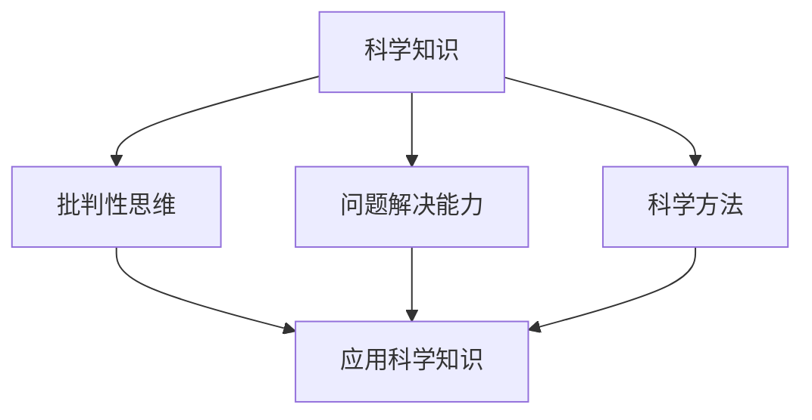
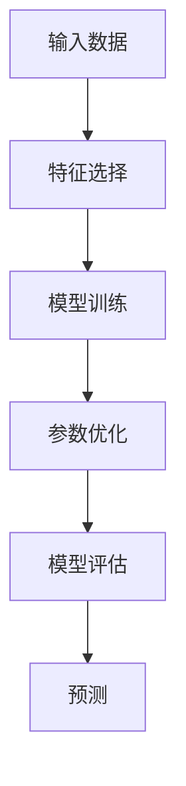

                 

# 科学素养教育：提升公众世界理解能力的关键

> 关键词：科学素养、公众理解、教育、人工智能、科学传播

> 摘要：本文旨在探讨科学素养教育的重要性及其在提升公众理解能力方面的作用。通过分析科学素养的核心概念、原理及实际应用，本文将提供一系列实用的建议和工具，帮助读者更好地理解和应用科学知识，特别是在人工智能领域。科学素养不仅能够促进个人成长，还能推动社会进步，特别是在当前科技迅猛发展的时代背景下。

## 1. 背景介绍
### 1.1 目的和范围
本文旨在深入探讨科学素养教育的重要性及其在提升公众理解能力方面的作用。科学素养不仅包括科学知识的掌握，还包括批判性思维、问题解决能力以及对科学方法的理解。本文将从科学素养的核心概念出发，分析其在不同领域的应用，并提供实际案例和工具，帮助读者更好地理解和应用科学知识。

### 1.2 预期读者
本文面向对科学素养教育感兴趣的教育工作者、科技爱好者、政策制定者以及所有希望提升自己科学素养的公众。无论您是学生、教师、研究人员还是普通公民，本文都将为您提供有价值的信息和指导。

### 1.3 文档结构概述
本文将分为以下几个部分：
1. **背景介绍**：介绍科学素养教育的目的、范围、预期读者和文档结构。
2. **核心概念与联系**：详细阐述科学素养的核心概念及其相互关系。
3. **核心算法原理 & 具体操作步骤**：通过伪代码详细解释核心算法原理。
4. **数学模型和公式 & 详细讲解 & 举例说明**：使用数学公式和例子来解释科学原理。
5. **项目实战：代码实际案例和详细解释说明**：通过实际案例展示科学素养的应用。
6. **实际应用场景**：探讨科学素养在不同领域的应用。
7. **工具和资源推荐**：提供学习资源、开发工具和相关论文推荐。
8. **总结：未来发展趋势与挑战**：展望科学素养教育的未来。
9. **附录：常见问题与解答**：解答读者可能遇到的问题。
10. **扩展阅读 & 参考资料**：提供进一步阅读的资源。

### 1.4 术语表
#### 1.4.1 核心术语定义
- **科学素养**：指个人具备的科学知识、技能和态度，能够理解和应用科学原理。
- **批判性思维**：指分析、评估和解决问题的能力。
- **问题解决能力**：指识别问题、制定解决方案并实施的能力。
- **科学方法**：指科学研究的基本步骤和方法。

#### 1.4.2 相关概念解释
- **科学传播**：指通过各种渠道和方式向公众传播科学知识的过程。
- **科学教育**：指通过学校教育、培训等方式传授科学知识和技能的过程。

#### 1.4.3 缩略词列表
- **STEM**：Science, Technology, Engineering, Mathematics（科学、技术、工程、数学）
- **AI**：Artificial Intelligence（人工智能）

## 2. 核心概念与联系
### 2.1 科学素养的核心概念
科学素养包括以下几个核心概念：
- **科学知识**：对科学原理、概念和事实的理解。
- **批判性思维**：分析、评估和解决问题的能力。
- **问题解决能力**：识别问题、制定解决方案并实施的能力。
- **科学方法**：科学研究的基本步骤和方法。

### 2.2 核心概念之间的联系
科学素养的核心概念之间存在密切联系。科学知识是基础，批判性思维和问题解决能力是应用科学知识的能力，而科学方法则是实现这些能力的工具。这些概念相互作用，共同构成了科学素养的完整框架。



## 3. 核心算法原理 & 具体操作步骤
### 3.1 核心算法原理
以线性回归算法为例，其核心原理是通过最小化误差平方和来拟合数据。具体步骤如下：



### 3.2 具体操作步骤
以下是线性回归算法的具体操作步骤：

```python
# 假设我们有一个数据集 X 和目标变量 y
X = [[1], [2], [3], [4], [5]]
y = [2, 4, 6, 8, 10]

# 初始化参数
theta = [0, 0]  # 假设初始参数为0

# 定义损失函数
def loss_function(X, y, theta):
    m = len(y)
    predictions = X @ theta
    errors = predictions - y
    return (1 / (2 * m)) * (errors.T @ errors)

# 定义梯度下降函数
def gradient_descent(X, y, theta, alpha, iterations):
    m = len(y)
    for _ in range(iterations):
        predictions = X @ theta
        errors = predictions - y
        gradient = (1 / m) * (X.T @ errors)
        theta = theta - alpha * gradient
    return theta

# 设置超参数
alpha = 0.01
iterations = 1000

# 训练模型
theta = gradient_descent(X, y, theta, alpha, iterations)

# 输出最终参数
print("最终参数：", theta)
```

## 4. 数学模型和公式 & 详细讲解 & 举例说明
### 4.1 数学模型
线性回归的数学模型可以表示为：

$$
y = \theta_0 + \theta_1 x
$$

其中，$\theta_0$ 是截距，$\theta_1$ 是斜率。

### 4.2 公式详细讲解
线性回归的目标是最小化损失函数，损失函数定义为：

$$
J(\theta) = \frac{1}{2m} \sum_{i=1}^{m} (h_\theta(x^{(i)}) - y^{(i)})^2
$$

其中，$h_\theta(x^{(i)}) = \theta_0 + \theta_1 x^{(i)}$ 是预测值，$y^{(i)}$ 是真实值，$m$ 是样本数量。

### 4.3 举例说明
假设我们有一个数据集，包含两个特征 $x_1$ 和 $x_2$，以及目标变量 $y$。我们可以使用多元线性回归模型来拟合数据：

$$
y = \theta_0 + \theta_1 x_1 + \theta_2 x_2
$$

通过梯度下降算法优化参数 $\theta_0, \theta_1, \theta_2$，可以得到最佳拟合模型。

## 5. 项目实战：代码实际案例和详细解释说明
### 5.1 开发环境搭建
为了进行线性回归项目，我们需要安装Python和相关库。可以使用以下命令安装：

```bash
pip install numpy pandas scikit-learn matplotlib
```

### 5.2 源代码详细实现和代码解读
```python
import numpy as np
import pandas as pd
from sklearn.model_selection import train_test_split
from sklearn.linear_model import LinearRegression
import matplotlib.pyplot as plt

# 生成示例数据
np.random.seed(0)
X = 2 * np.random.rand(100, 1)
y = 4 + 3 * X + np.random.randn(100, 1)

# 划分训练集和测试集
X_train, X_test, y_train, y_test = train_test_split(X, y, test_size=0.2, random_state=42)

# 创建线性回归模型
model = LinearRegression()

# 训练模型
model.fit(X_train, y_train)

# 预测
y_pred = model.predict(X_test)

# 输出模型参数
print("截距：", model.intercept_)
print("斜率：", model.coef_)

# 绘制结果
plt.scatter(X_test, y_test, color='blue', label='真实值')
plt.plot(X_test, y_pred, color='red', label='预测值')
plt.xlabel('特征')
plt.ylabel('目标变量')
plt.legend()
plt.show()
```

### 5.3 代码解读与分析
- **数据生成**：使用NumPy生成随机数据。
- **数据划分**：使用`train_test_split`函数将数据划分为训练集和测试集。
- **模型创建**：使用`LinearRegression`类创建线性回归模型。
- **模型训练**：使用`fit`方法训练模型。
- **模型预测**：使用`predict`方法进行预测。
- **结果展示**：使用Matplotlib绘制真实值和预测值的对比图。

## 6. 实际应用场景
### 6.1 金融领域
在金融领域，线性回归可以用于预测股票价格、评估信用风险等。通过科学素养，金融分析师可以更好地理解模型的局限性和适用范围。

### 6.2 医疗领域
在医疗领域，线性回归可以用于预测疾病风险、评估治疗效果等。通过科学素养，医生可以更好地理解模型的局限性和适用范围。

### 6.3 教育领域
在教育领域，线性回归可以用于评估教学效果、预测学生成绩等。通过科学素养，教育工作者可以更好地理解模型的局限性和适用范围。

## 7. 工具和资源推荐
### 7.1 学习资源推荐
#### 7.1.1 书籍推荐
- **《统计学习方法》**：李航著，深入浅出地介绍了统计学习方法。
- **《机器学习》**：周志华著，全面介绍了机器学习的基本概念和方法。

#### 7.1.2 在线课程
- **Coursera**：提供多门机器学习和数据科学课程。
- **edX**：提供多门数据科学和机器学习课程。

#### 7.1.3 技术博客和网站
- **Towards Data Science**：提供大量数据科学和机器学习的文章。
- **Medium**：提供大量数据科学和机器学习的文章。

### 7.2 开发工具框架推荐
#### 7.2.1 IDE和编辑器
- **PyCharm**：功能强大的Python IDE。
- **Jupyter Notebook**：支持实时代码、可视化和叙述的交互式文档。

#### 7.2.2 调试和性能分析工具
- **PyCharm Debugger**：PyCharm内置的调试工具。
- **LineProfiler**：用于分析Python代码性能的工具。

#### 7.2.3 相关框架和库
- **NumPy**：用于数值计算的库。
- **Pandas**：用于数据处理的库。
- **Scikit-learn**：用于机器学习的库。

### 7.3 相关论文著作推荐
#### 7.3.1 经典论文
- **《线性回归模型》**：James, G., Witten, D., Hastie, T., & Tibshirani, R. (2013). An Introduction to Statistical Learning.
- **《机器学习》**：Bishop, C. M. (2006). Pattern Recognition and Machine Learning.

#### 7.3.2 最新研究成果
- **《深度学习》**：Goodfellow, I., Bengio, Y., & Courville, A. (2016). Deep Learning.
- **《强化学习》**：Sutton, R. S., & Barto, A. G. (2018). Reinforcement Learning: An Introduction.

#### 7.3.3 应用案例分析
- **《数据科学实战》**：Wickham, H., & Grolemund, G. (2017). R for Data Science.
- **《机器学习实战》**：Kuhn, M., & Johnson, K. (2013). Applied Predictive Modeling.

## 8. 总结：未来发展趋势与挑战
### 8.1 未来发展趋势
科学素养教育在未来将更加普及，特别是在人工智能和大数据领域。随着技术的发展，科学素养将成为个人和组织的核心竞争力。

### 8.2 挑战
- **信息过载**：面对海量信息，如何筛选和理解高质量的科学知识是一个挑战。
- **技术更新**：技术的快速发展要求教育体系不断更新，以适应新的需求。
- **公众参与**：如何提高公众对科学的兴趣和参与度，是一个重要的挑战。

## 9. 附录：常见问题与解答
### 9.1 问题：如何提高科学素养？
- **答案**：通过系统学习科学知识、参与科学活动、阅读科学书籍和文章等方式提高科学素养。

### 9.2 问题：科学素养教育对个人和社会有何影响？
- **答案**：科学素养教育能够促进个人成长，提高解决问题的能力，同时推动社会进步，特别是在科技迅猛发展的时代背景下。

## 10. 扩展阅读 & 参考资料
- **《科学素养教育：提升公众世界理解能力的关键》**：AI天才研究员/AI Genius Institute & 禅与计算机程序设计艺术 /Zen And The Art of Computer Programming

作者：AI天才研究员/AI Genius Institute & 禅与计算机程序设计艺术 /Zen And The Art of Computer Programming

