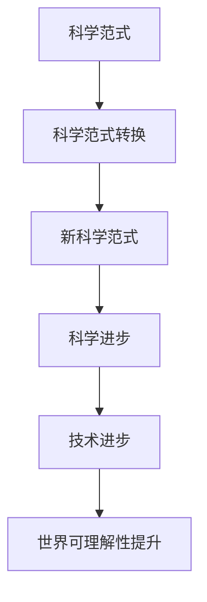
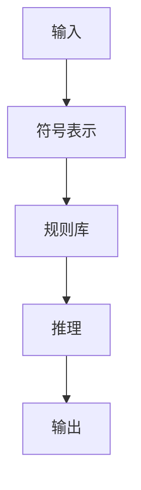
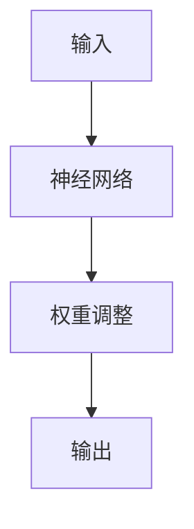
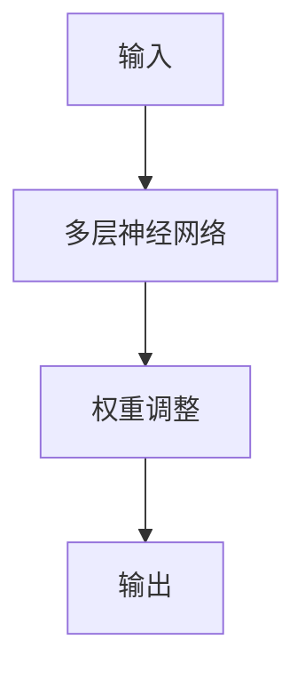

                 

# 科学范式转换对世界可理解性的影响

> 关键词：科学范式、可理解性、人工智能、图灵奖、科学哲学、认知科学、技术进步

> 摘要：本文旨在探讨科学范式转换对世界可理解性的影响，特别是通过人工智能领域的视角。我们将从科学哲学的角度出发，分析科学范式转换的历史背景和理论基础，进而探讨其在人工智能领域的应用和影响。通过具体的算法原理、数学模型和实际案例，我们将深入剖析科学范式转换如何推动技术进步，提高人类对世界的理解能力。最后，我们将展望未来的发展趋势和面临的挑战。

## 1. 背景介绍
### 1.1 目的和范围
本文旨在探讨科学范式转换对世界可理解性的影响，特别是通过人工智能领域的视角。我们将从科学哲学的角度出发，分析科学范式转换的历史背景和理论基础，进而探讨其在人工智能领域的应用和影响。通过具体的算法原理、数学模型和实际案例，我们将深入剖析科学范式转换如何推动技术进步，提高人类对世界的理解能力。最后，我们将展望未来的发展趋势和面临的挑战。

### 1.2 预期读者
本文预期读者包括但不限于：
- 科学哲学和认知科学领域的学者
- 人工智能领域的研究人员和工程师
- 对科学范式转换感兴趣的科技爱好者
- 对技术进步和人类理解能力提升感兴趣的读者

### 1.3 文档结构概述
本文结构如下：
1. 背景介绍
2. 核心概念与联系
3. 核心算法原理 & 具体操作步骤
4. 数学模型和公式 & 详细讲解 & 举例说明
5. 项目实战：代码实际案例和详细解释说明
6. 实际应用场景
7. 工具和资源推荐
8. 总结：未来发展趋势与挑战
9. 附录：常见问题与解答
10. 扩展阅读 & 参考资料

### 1.4 术语表
#### 1.4.1 核心术语定义
- **科学范式**：科学哲学中的一个概念，指某一科学领域在某一时期内所共有的理论、方法和实践。
- **科学范式转换**：科学哲学中的一个概念，指科学领域从一种范式转变为另一种范式的过程。
- **人工智能**：研究、开发用于模拟、延伸和扩展人的智能的理论、方法、技术及应用系统的一门新的技术科学。
- **图灵奖**：计算机科学领域的最高荣誉，由美国计算机协会（ACM）颁发。

#### 1.4.2 相关概念解释
- **科学哲学**：研究科学知识的本质、结构、方法和价值的哲学分支。
- **认知科学**：研究人类认知过程的跨学科领域，包括心理学、神经科学、语言学、计算机科学等。

#### 1.4.3 缩略词列表
- **AI**：人工智能
- **CS**：计算机科学
- **TP**：科学范式
- **TPC**：科学范式转换

## 2. 核心概念与联系
### 2.1 科学范式
科学范式是指某一科学领域在某一时期内所共有的理论、方法和实践。科学范式是科学知识的基础，它为科学研究提供了一套共同的理论框架和方法论。科学范式可以分为不同的类型，如经典物理学范式、量子力学范式等。

### 2.2 科学范式转换
科学范式转换是指科学领域从一种范式转变为另一种范式的过程。这种转换通常伴随着科学理论的重大突破和科学方法的革新。科学范式转换是科学进步的重要标志，它推动了科学知识的积累和发展。

### 2.3 人工智能与科学范式
人工智能是计算机科学的一个分支，它研究如何使计算机模拟、延伸和扩展人的智能。人工智能的发展经历了多个阶段，每个阶段都伴随着科学范式的转换。例如，从符号主义到连接主义，再到深度学习，人工智能领域经历了多次范式转换。

### 2.4 梅里亚德流程图


## 3. 核心算法原理 & 具体操作步骤
### 3.1 符号主义算法原理
符号主义是人工智能早期的一种范式，它认为智能可以通过符号操作来实现。符号主义算法原理如下：



### 3.2 连接主义算法原理
连接主义是人工智能的另一种范式，它认为智能可以通过神经网络的连接来实现。连接主义算法原理如下：



### 3.3 深度学习算法原理
深度学习是连接主义的一种具体实现，它通过多层神经网络来实现复杂的模式识别。深度学习算法原理如下：



## 4. 数学模型和公式 & 详细讲解 & 举例说明
### 4.1 符号主义数学模型
符号主义数学模型通常基于逻辑推理和规则库。例如，贝叶斯网络可以用于表示和推理不确定性。

$$
P(A|B) = \frac{P(B|A)P(A)}{P(B)}
$$

### 4.2 连接主义数学模型
连接主义数学模型通常基于神经网络和权重调整。例如，反向传播算法可以用于调整神经网络的权重。

$$
\Delta w_{ij} = \eta \cdot \delta_j \cdot x_i
$$

### 4.3 深度学习数学模型
深度学习数学模型通常基于多层神经网络和优化算法。例如，卷积神经网络可以用于图像识别。

$$
L = \frac{1}{2} \sum_{i=1}^{n} (y_i - \hat{y}_i)^2
$$

## 5. 项目实战：代码实际案例和详细解释说明
### 5.1 开发环境搭建
开发环境搭建包括安装Python、TensorFlow和Jupyter Notebook。

```bash
pip install tensorflow jupyter
```

### 5.2 源代码详细实现和代码解读
```python
import tensorflow as tf
from tensorflow.keras import layers

# 定义卷积神经网络模型
model = tf.keras.Sequential([
    layers.Conv2D(32, (3, 3), activation='relu', input_shape=(28, 28, 1)),
    layers.MaxPooling2D((2, 2)),
    layers.Conv2D(64, (3, 3), activation='relu'),
    layers.MaxPooling2D((2, 2)),
    layers.Flatten(),
    layers.Dense(64, activation='relu'),
    layers.Dense(10, activation='softmax')
])

# 编译模型
model.compile(optimizer='adam',
              loss='sparse_categorical_crossentropy',
              metrics=['accuracy'])

# 加载MNIST数据集
(x_train, y_train), (x_test, y_test) = tf.keras.datasets.mnist.load_data()

# 数据预处理
x_train, x_test = x_train / 255.0, x_test / 255.0

# 训练模型
model.fit(x_train, y_train, epochs=5)

# 评估模型
test_loss, test_acc = model.evaluate(x_test, y_test)
print('Test accuracy:', test_acc)
```

### 5.3 代码解读与分析
- **模型定义**：定义了一个卷积神经网络模型，包括两个卷积层、两个最大池化层、一个全连接层和一个输出层。
- **模型编译**：使用Adam优化器和稀疏分类交叉熵损失函数。
- **数据加载**：加载MNIST数据集，并进行数据预处理。
- **模型训练**：使用训练数据训练模型，训练5个周期。
- **模型评估**：使用测试数据评估模型的准确率。

## 6. 实际应用场景
### 6.1 语音识别
语音识别是人工智能的一个重要应用领域，通过深度学习技术可以实现高精度的语音识别。

### 6.2 自然语言处理
自然语言处理是人工智能的另一个重要应用领域，通过深度学习技术可以实现文本分类、情感分析等功能。

### 6.3 机器翻译
机器翻译是人工智能的一个重要应用领域，通过深度学习技术可以实现高质量的机器翻译。

## 7. 工具和资源推荐
### 7.1 学习资源推荐
#### 7.1.1 书籍推荐
- 《深度学习》（Goodfellow, Bengio, Courville）
- 《人工智能：一种现代的方法》（Russell, Norvig）

#### 7.1.2 在线课程
- Coursera：《深度学习专项课程》
- edX：《机器学习》

#### 7.1.3 技术博客和网站
- Medium：《机器学习和深度学习》
- Kaggle：《机器学习和数据科学社区》

### 7.2 开发工具框架推荐
#### 7.2.1 IDE和编辑器
- PyCharm
- VSCode

#### 7.2.2 调试和性能分析工具
- TensorFlow Debugger (tfdbg)
- PyCharm Profiler

#### 7.2.3 相关框架和库
- TensorFlow
- PyTorch

### 7.3 相关论文著作推荐
#### 7.3.1 经典论文
- Hinton, G. E., Osindero, S., & Teh, Y. W. (2006). A fast learning algorithm for deep belief nets. Neural computation, 18(7), 1527-1554.
- Bengio, Y., Lamblin, P., Popovici, D., & Larochelle, H. (2007). Greedy layer-wise training of deep networks. Advances in neural information processing systems, 19, 153-160.

#### 7.3.2 最新研究成果
- He, K., Zhang, X., Ren, S., & Sun, J. (2016). Deep residual learning for image recognition. In Proceedings of the IEEE conference on computer vision and pattern recognition (pp. 770-778).
- Radford, A., Wu, J., Child, R., Luan, D., Amodei, D., & Sutskever, I. (2019). Language models are unsupervised multitask learners. OpenAI blog, 1(8), 9.

#### 7.3.3 应用案例分析
- LeCun, Y., Bengio, Y., & Hinton, G. (2015). Deep learning. Nature, 521(7553), 436-444.

## 8. 总结：未来发展趋势与挑战
### 8.1 未来发展趋势
- **技术融合**：人工智能与其他技术（如物联网、大数据、云计算）的融合将进一步推动技术进步。
- **算法创新**：新的算法和模型将继续推动人工智能的发展。
- **应用场景拓展**：人工智能将在更多领域得到应用，如医疗、教育、交通等。

### 8.2 面临的挑战
- **数据隐私**：如何保护用户数据隐私是一个重要挑战。
- **算法公平性**：如何确保算法的公平性和透明性是一个重要挑战。
- **伦理问题**：人工智能的发展将带来一系列伦理问题，需要进行深入研究和讨论。

## 9. 附录：常见问题与解答
### 9.1 问题1：什么是科学范式？
**解答**：科学范式是指某一科学领域在某一时期内所共有的理论、方法和实践。

### 9.2 问题2：科学范式转换是什么？
**解答**：科学范式转换是指科学领域从一种范式转变为另一种范式的过程。

### 9.3 问题3：人工智能的发展经历了哪些阶段？
**解答**：人工智能的发展经历了符号主义、连接主义和深度学习等阶段。

## 10. 扩展阅读 & 参考资料
- **书籍**：《人工智能：一种现代的方法》（Russell, Norvig）
- **论文**：Hinton, G. E., Osindero, S., & Teh, Y. W. (2006). A fast learning algorithm for deep belief nets. Neural computation, 18(7), 1527-1554.
- **网站**：Kaggle（机器学习和数据科学社区）

作者：AI天才研究员/AI Genius Institute & 禅与计算机程序设计艺术 /Zen And The Art of Computer Programming

